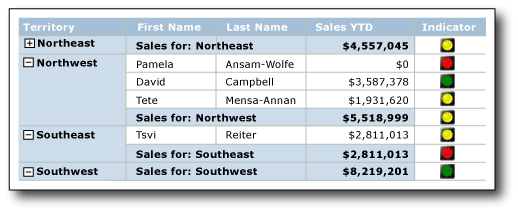
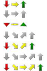
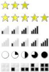
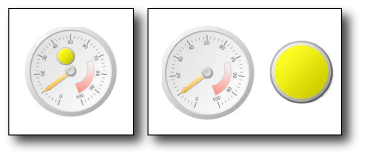

# Indicators (Report Builder and SSRS)
  In [!INCLUDE[ssRSnoversion_md](../../includes/ssrsnoversion-md.md)] paginated reports,indicators are small gauges that convey the state of a single data value at a glance. The icons that represent indicators and their states are simple and visually effective even when used in small sizes.  
  
 You can use state indicators in your reports to show the following:  
  
-   **Trends** by using trending-up, flat (no change), or trending-down arrows.  
  
-   **State** by using commonly recognized symbols such as checkmarks and exclamation marks.  
  
-   **Conditions** by using commonly recognized shapes such traffic lights and signs.  
  
-   **Ratings** by using common recognized shapes and symbols that show progress such number of quadrants in a square and stars.  
  
 You can use indicators by themselves in dashboards or free-form reports, but they are most commonly used in tables or matrices to visualize data in rows or columns. The following diagram shows a table with a traffic light indicator that conveys year to date sales by sales person and territory.  
   
   
  
 [!INCLUDE[ssRSnoversion](../../includes/ssrsnoversion-md.md)] provides built-in indicator sets and indicator icons to use as is, and you can also customize individual indicator icons and indicators sets to suit your needs.  
  
 For more information about using indicators as KPIs, see [Tutorial: Adding a KPI to Your Report &#40;Report Builder&#41;](../../reporting-services/tutorial-adding-a-kpi-to-your-report-report-builder.md).  
  
> [!NOTE]  
>  You can publish indicators separately from a report as report parts. Read more about [Report Parts](../../reporting-services/report-design/report-parts-report-builder-and-ssrs.md).  
  
##   Comparing Indicators to Gauges  
 Although they look very different, indicators are just simple gauges. Both indicators and gauges display a single data value. The key differences are that gauges have elements such as frames and  pointers. Indicators have only states, icons, and (optionally) labels. Indicator states are similar to gauge ranges.  
  
 Like gauges, indicators are positioned inside a gauge panel. When you want to configure an indicator by using the **Indicators Properties** dialog box or the Properties pane, you need to select the indicator instead of the panel. Otherwise, the available options apply to the gauge panel options and you cannot configure the indicator. The following picture shows a selected indicator in its gauge panel.  
  
   
  
 Depending on how you want to depict the data value, gauges might be more effective than indicators. For more information, see [Gauges &#40;Report Builder and SSRS&#41;](../../reporting-services/report-design/gauges-report-builder-and-ssrs.md).  
  
##   Choosing the Indicator Type to Use  
 Using the right indicator set is key to instantly communicating the meaning of the data, whether the data is in a detail row or row or column group in a table or matrix, or by itself in the report body or dashboard. The built-in indicator sets have three or more icons. The icons can vary by shape, color, or both. Each icon communicates a different data state.  
  
 The following table lists the built-in indicator sets and describes some common uses of them.  
  
|Indicator set|Indicator type|  
|-------------------|--------------------|  
||Directional: indicates trends using up, down, flat (no change), up-trending, or down-trending arrows.|  
||Symbols: indicates states using commonly recognized symbols such as checkmarks and exclamation marks.|  
||Shape: indicates conditions using commonly shapes such as traffic signs and diamond shapes.|  
||Ratings: indicates ratings by using common recognized shapes and symbols that show progressive values such as number of quadrants in a square.|  
  
 After you choose a indicator set, you can customize the appearance of each indicator icon in the set by setting its properties in the dialog boxes for indicators or the Properties pane. You can use the built-in colors, icons, and sizes or expressions to configure indicators.  
  
##   Customizing Indicators  
 Indicators can be customized to suit your needs. You can modify the indicators sets as well as individual indicator icon within a set in the following ways:  
  
-   Change the colors of indicator icons. For example, you might want the color scheme of an indicator set to be monochromatic or use colors other than the default ones.  
  
-   Change the icon in the indicator set. For example, you might want to use the star, circle, and square icons in one indicator set.  
  
-   Specify the start and end values for and indicator. For example, you might want to skew data display by using one icon for 75 percent of the indicator values.  
  
-   Add icons to the indicator set. For example, you might want to add additional icons to indicator sets to differentiate the indicator values in a more detailed way.  
  
-   Delete icons from the indicator set to make the data display simpler by using only a few icons.  
  
 For more information, see [Change Indicator Icons and Indicator Sets &#40;Report Builder and SSRS&#41;](../../reporting-services/report-design/change-indicator-icons-and-indicator-sets-report-builder-and-ssrs.md).  
  
##   Using Indicators in Tables and Matrices  
 The simple shapes of indicators make them ideal to use in tables and matrices. Indicators are effective even in small sizes. This makes them useful in detail or group rows of reports.  
  
 The following diagram shows a report with a table that uses the directional indicator set, **Four Arrows (Colored)**, to indicate sales. The indicator icons in the report are configured to use shades of blue instead of the default colors: red, yellow, and green.  
  
   
  
 For more information about adding, changing, and deleting indicators, see [Add or Delete an Indicator &#40;Report Builder and SSRS&#41;](../../reporting-services/report-design/add-or-delete-an-indicator-report-builder-and-ssrs.md).  
  
 When you first add an indicator to a report, it is configured to use default values. You can then change the values so the indicator depicts data the way you want. You can change the appearance of the indicator icons, the way the indicator chooses which icon to use, and change the icons used by an indicator set. For more information, see [Change Indicator Icons and Indicator Sets &#40;Report Builder and SSRS&#41;](../../reporting-services/report-design/change-indicator-icons-and-indicator-sets-report-builder-and-ssrs.md).  
  
 By default, indicators are configured to use percentages as the measurement unit and automatically detect the minimum and maximum values in the data. Each icon in the indicator set has a percentage range. The number of percentage ranges depends on the number of icons in the icon set, but the ranges are the same size and sequential. For example, if the icon set has five icons, there are five percentage ranges, each 20 percent in size. The first one starts at 0 and ends at 20, the second starts at 20 and ends at 40, and so forth. The indicator on the report uses the icon from the indicator set that has a percentage range within which the indicator data value falls. You can change the percentage range for each icon in the set. The minimum and maximum values can be set explicitly by providing a value or an expression. You can change the measurement unit to be a numeric value instead. In this situation, you do not specify minimum or maximum for the data. Instead, you provide only the start and end values for each icon that the indicator uses. For more information, see [Set and Configure Measurement Units &#40;Report Builder and SSRS&#41;](../../reporting-services/report-design/set-and-configure-measurement-units-report-builder-and-ssrs.md).  
  
 Indicators convey data values by synchronizing across indicator data values within a specified scope. By default, the scope is the parent container of the indicator such as the table or matrix that contains the indicator. You can change the synchronization of the indicator by choosing a different scope, depending on the layout of your report. The indicator can omit synchronization. For more information, see [Set Synchronization Scope &#40;Report Builder and SSRS&#41;](../../reporting-services/report-design/set-synchronization-scope-report-builder-and-ssrs.md).  
  
 For general information about understanding and setting scope within reports, see [Expression Scope for Totals, Aggregates, and Built-in Collections &#40;Report Builder and SSRS&#41;](../../reporting-services/report-design/expression-scope-for-totals-aggregates-and-built-in-collections.md).  
  
 Indicators use only a single value. If you have to show multiple data values, use a sparkline or data bar instead of an indicator. They can represent multiple data values but are also simple, easy to understand at small sizes, and work well in tables and matrices. For more information, see [Sparklines and Data Bars &#40;Report Builder and SSRS&#41;](../../reporting-services/report-design/sparklines-and-data-bars-report-builder-and-ssrs.md).  
  
##   Sizing Indicators to Maximize Visual Impact  
 In addition to color, direction, and shape you can use size to maximize the visual impact of indicators. Imagine a report that uses indicators to show customer satisfaction with different types of bicycles. The icon that the indicator uses can be configured to be different sizes depending on customer satisfaction. The greater the satisfaction, the larger the icon that appears in the report. The following picture shows a report of bicycle sales, and the sizes of the icon reflect the sales amount.  
  
 You use expressions to dynamically set the size of the stars based on values of field used by the indicator. For more information, see [Specify the Size of an Indicator Using an Expression &#40;Report Builder and SSRS&#41;](../../reporting-services/report-design/specify-the-size-of-an-indicator-using-an-expression-report-builder-and-ssrs.md).  
  
 To learn more about writing and using expressions, see [Expressions &#40;Report Builder and SSRS&#41;](../../reporting-services/report-design/expressions-report-builder-and-ssrs.md).  
  
##   Including Indicators and Gauges in Gauge Panels  
 Indicators are always positioned inside a gauge panel. The gauge panel is a top-level container that can include one or more gauges and state indicators. The gauge panel can contain child or adjacent gauges or indicators. If you use an indicator as a child to a gauge, you can further visualize the data by showing the state of the data value displayed in the gauge. For example, an indicator within a gauge can display a green circle to tell you that the value in the gauge points to the upper 33 percentage of the value range. Using a gauge and indicator side by side, you can represent the data in different ways. In either case, the indicator and gauge can use the same or different data fields.  
  
 The following diagram shows an indicator side by side and within a gauge.  
  
   
  
 For more information, see [Include Indicators and Gauges in a Gauge Panel &#40;Report Builder and SSRS&#41;](../../reporting-services/report-design/include-indicators-and-gauges-in-a-gauge-panel-report-builder-and-ssrs.md).  
  
 For more information about using gauges, see [Gauges &#40;Report Builder and SSRS&#41;](../../reporting-services/report-design/gauges-report-builder-and-ssrs.md).  
  
##   Sequence of Indicator States  
 The sequence of the indicator states in the **Value and States** tab of the **Indicator Properties** dialog box affect which indicator icon displays for a data value when the start and end values of indicator states overlap.  
  
 This might happen whether you use the percentage or numeric state measurement unit. It is more likely to occur when you use the numeric measurement unit because you provide specific values for this measurement. It is also more likely to occur when you round report data values because this tends to make values less discrete.  
  
 The following scenarios describe how the data visualization of data is affected when you change the sequence of the three states in the **3 Arrows (Colored)** directional indicator. By default the sequence is:  
  
1.  Red down arrow  
  
2.  Yellow horizontal arrow  
  
3.  Green up arrow  
  
 The following scenarios show for four different state sequences and their value ranges and how the sequences affect data visualization.  
  
 In these scenarios, the **3 Arrows (Colored)** indicator uses numeric state measurements.  
  
|State Sequence|Start Value|End Value|  
|--------------------|-----------------|---------------|  
|Red|0|3500|  
|Yellow|3500|5000|  
|Green|5000|10000|  
  
 The red down arrow depicts the value 3500 and the yellow horizontal arrow 5000.  
  
|State Sequence|Start Value|End Value|  
|--------------------|-----------------|---------------|  
|Green|5000|10000|  
|Yellow|3500|5000|  
|Red|0|3500|  
  
 The yellow horizontal arrow depicts the value 3500 and the green up arrow 5000.  
  
|State Sequence|Start Value|End Value|  
|--------------------|-----------------|---------------|  
|Green|5000|10000|  
|Red|0|3500|  
|Yellow|3500|5000|  
  
 The red down arrow depicts the value 3500 and the green up arrow 5000.  
  
|State Sequence|Start Value|End Value|  
|--------------------|-----------------|---------------|  
|Yellow|3500|5000|  
|Red|0|3500|  
|Green|5000|10000|  
  
 The yellow down arrow now depicts both the value 3500 and 5000.  
  
 In summary, evaluation starts and the top of the indicator state list and the report displays the indicator icon associated with the first one indicator state that has a value range that the data fits into. By changing the sequence of the indicator states you can therefore affect the visualization of data values.  
  
##   How-to Topics  
 This section lists procedures that show you how to add, change, and delete indicators; how to configure and customize indicators; and how to use indicators in gauges.  
  
-   [Add or Delete an Indicator &#40;Report Builder and SSRS&#41;](../../reporting-services/report-design/add-or-delete-an-indicator-report-builder-and-ssrs.md)  
  
-   [Change Indicator Icons and Indicator Sets &#40;Report Builder and SSRS&#41;](../../reporting-services/report-design/change-indicator-icons-and-indicator-sets-report-builder-and-ssrs.md)  
  
-   [Set and Configure Measurement Units &#40;Report Builder and SSRS&#41;](../../reporting-services/report-design/set-and-configure-measurement-units-report-builder-and-ssrs.md)  
  
-   [Set Synchronization Scope &#40;Report Builder and SSRS&#41;](../../reporting-services/report-design/set-synchronization-scope-report-builder-and-ssrs.md)  
  
-   [Specify the Size of an Indicator Using an Expression &#40;Report Builder and SSRS&#41;](../../reporting-services/report-design/specify-the-size-of-an-indicator-using-an-expression-report-builder-and-ssrs.md)  
  
-   [Include Indicators and Gauges in a Gauge Panel &#40;Report Builder and SSRS&#41;](../../reporting-services/report-design/include-indicators-and-gauges-in-a-gauge-panel-report-builder-and-ssrs.md)  
  
## See Also  
 [Gauges &#40;Report Builder and SSRS&#41;](../../reporting-services/report-design/gauges-report-builder-and-ssrs.md)   
 [Sparklines and Data Bars &#40;Report Builder and SSRS&#41;](../../reporting-services/report-design/sparklines-and-data-bars-report-builder-and-ssrs.md)   
 [Charts &#40;Report Builder and SSRS&#41;](../../reporting-services/report-design/charts-report-builder-and-ssrs.md)  
  
  
