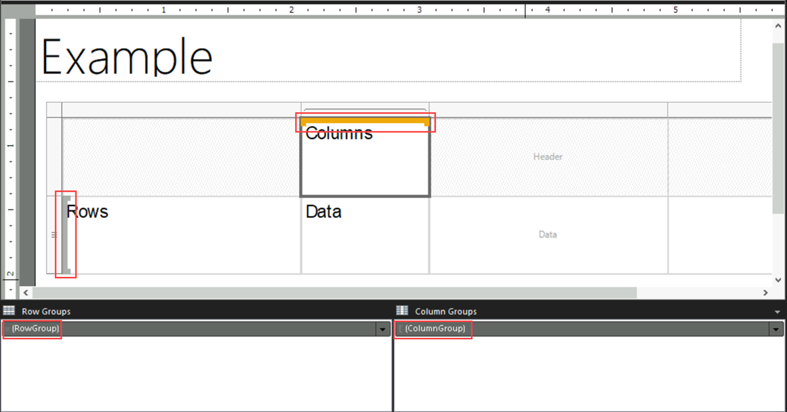
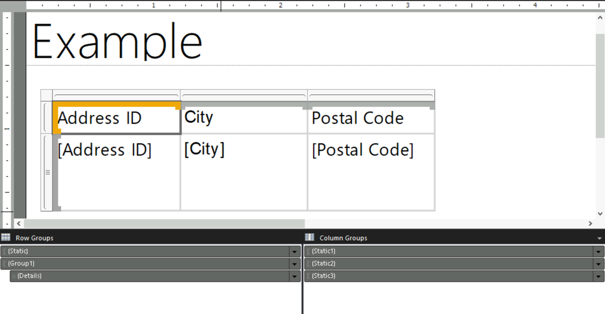
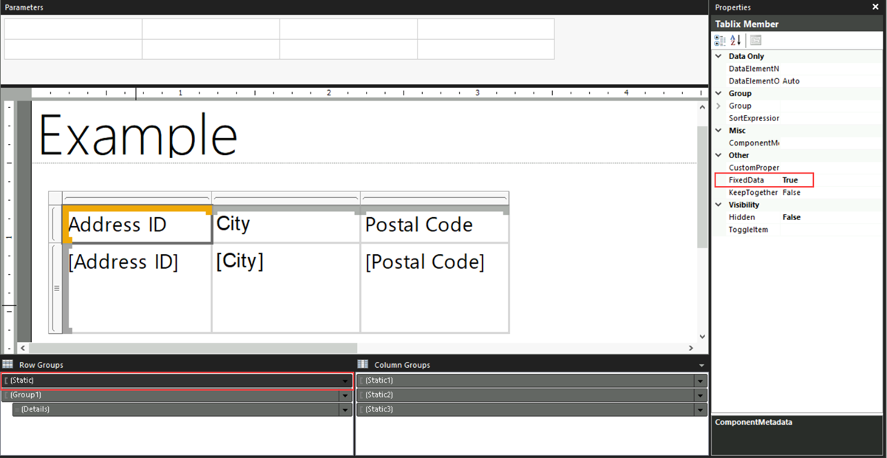

# Keep Headers Visible When Scrolling Through a Report (Report Builder and SSRS)
  To prevent row and column labels from scrolling out of view after rendering a report, you can freeze the row or column headings.  
  
 How you control the rows and columns depends on whether you have a table or a matrix. If you have a table, you configure static members (row and column headings) to remain visible. If you have a matrix, you configure row and column group headers to remain visible.  
  
 If you export the report to Excel, the header will not be frozen automatically. You can freeze the pane in Excel. For more information see the **Page Headers and Footers** section of [Exporting to Microsoft Excel &#40;Report Builder and SSRS&#41;](../../reporting-services/report-builder/exporting-to-microsoft-excel-report-builder-and-ssrs.md).  
  
> [!NOTE]  
>  Even if a table has row and column groups, you cannot keep those group headers visible while scrolling  
  
 The following image shows a table.  
  
   
  
 The following image shows a matrix.  
  
   
  
> [!NOTE]  
>  [!INCLUDE[ssRBRDDup](../../includes/ssrbrddup-md.md)]  
  
### To keep matrix group headers visible while scrolling  
  
1.  Right-click the row, column, or corner handle of a tablix data region, and then click **Tablix Properties**.  
  
2.  On the **General** tab, under **Row Headers** or **Column Headers**, select **Header should remain visible while scrolling**.  
  
3.  [!INCLUDE[clickOK](../../includes/clickok-md.md)]  
  
### To keep a static tablix member (row or column) visible while scrolling  
  
1.  On the design surface, click anywhere in the table to display static members, as well as groups, in the grouping pane.  
  
       
  
     The Row Groups pane displays the hierarchical static and dynamic members for the row groups hierarchy, and the Column groups pane shows a similar display for the column groups hierarchy.  
  
2.  On the right side of the grouping pane, click the down arrow, and then click **Advanced Mode**.  
  
3.  Click the static member (row or column) that you want to remain visible while scrolling. The Properties pane displays the **Tablix Member** properties.  
  
       
  
4.  In the Properties pane, set **FixedData** to **True**.  
  
5.  Repeat this for as many adjacent members as you want to keep visible while scrolling.  
  
6.  Preview the report.  
  
 As you page down or across the report, the static tablix members remain in view.  
  
## See Also  
 [Tablix Data Region &#40;Report Builder and SSRS&#41;](../../reporting-services/report-design/tablix-data-region-report-builder-and-ssrs.md)   
 [Finding, Viewing, and Managing Reports &#40;Report Builder and SSRS &#41;](../../reporting-services/report-builder/finding-viewing-and-managing-reports-report-builder-and-ssrs.md)   
 [Export Reports &#40;Report Builder and SSRS&#41;](../../reporting-services/report-builder/export-reports-report-builder-and-ssrs.md)   
 [Display Headers and Footers with a Group &#40;Report Builder and SSRS&#41;](../../reporting-services/report-design/display-headers-and-footers-with-a-group-report-builder-and-ssrs.md)   
 [Display Row and Column Headers on Multiple Pages &#40;Report Builder and SSRS&#41;](../../reporting-services/report-design/display-row-and-column-headers-on-multiple-pages-report-builder-and-ssrs.md)   
 [Grouping Pane &#40;Report Builder&#41;](../../reporting-services/report-design/grouping-pane-report-builder.md)  
  
  
