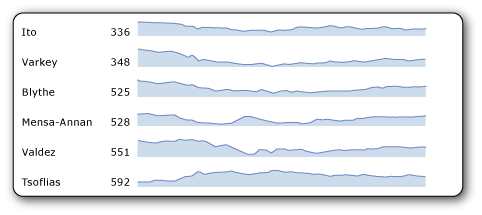
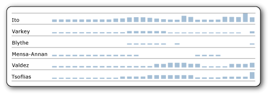

# Sparklines and data bars in a paginated report (Report Builder)

[!INCLUDE[ssrs-appliesto](../../includes/ssrs-appliesto.md)] [!INCLUDE [ssrs-appliesto-ssrs-rb](../../includes/ssrs-appliesto-ssrs-rb.md)] [!INCLUDE [ssrs-appliesto-pbi-rb](../../includes/ssrs-appliesto-pbi-rb.md)] [!INCLUDE [ssrb-applies-to-ssdt-yes](../../includes/ssrb-applies-to-ssdt-yes.md)]

  Sparklines and data bars are small, simple charts in a paginated report that convey a lot of information in a little space, often inline with text.   
    
  In reports, sparklines and data bars are often used in tables and matrices. Their impact comes from viewing many of them together and being able to quickly compare them one above the other, rather than viewing them singly. They make it easy to see the outliers, the rows that are not performing like the others. Although they are small, each sparkline often represents multiple data points, often over time. Data bars can represent multiple data points, but typically illustrate only one. Each sparkline typically presents a single series. You cannot add a sparkline to a detail group in a table. Because sparklines display aggregated data, they must go in a cell associated with a group. Sparklines and data bars have the same basic chart elements of categories, series, and values, but they have no legend, axis lines, labels, or tick marks.  
  
   
  
 To quickly get started with sparklines, see [Tutorial: Add a Sparkline to Your Report &#40;Report Builder&#41;](../../reporting-services/tutorial-add-a-sparkline-to-your-report-report-builder.md) and the videos [How to: Create a Sparkline in a Table](/SharePoint/sharepoint-server) and [Sparklines, Bar Charts, and Indicators in Report Builder](/previous-versions/dn912438(v=msdn.10)) .  
  
> [!NOTE]  
>  You can publish sparklines and data bars with their parent table, matrix, or list, separately from a report as a report part. Read more about [Report Parts](../../reporting-services/report-design/report-parts-report-builder-and-ssrs.md). However, report parts are deprecated for all releases of SQL Server Reporting Services after SQL Server Reporting Services 2019, and discontinued starting in SQL Server Reporting Services 2022 and Power BI Report Server.
  
##   Types of Sparklines  
 You can create almost as many types of sparklines as there are regular charts. In general, you cannot make 3D sparklines. You can make sparkline versions of these full charts:  
  
-   [Column Charts &#40;Report Builder and SSRS&#41;](../../reporting-services/report-design/column-charts-report-builder-and-ssrs.md): The basic, stacked, and 100% stacked column charts.  
  
-   [Line Charts &#40;Report Builder and SSRS&#41;](../../reporting-services/report-design/line-charts-report-builder-and-ssrs.md): All except the 3D line chart.  
  
-   [Area Charts &#40;Report Builder and SSRS&#41;](../../reporting-services/report-design/area-charts-report-builder-and-ssrs.md): All except the 3D area charts  
  
-   [Pie Charts &#40;Report Builder and SSRS&#41;](../../reporting-services/report-design/pie-charts-report-builder-and-ssrs.md): And doughnut charts, both flat and 3D, but not the other shapes such as funnel and pyramid charts.  
  
-   [Range Charts &#40;Report Builder and SSRS&#41;](../../reporting-services/report-design/range-charts-report-builder-and-ssrs.md): The stock, candlestick, error bar, and box plot charts.  
  
##   Data Bars  
 Data bars typically represent a single data point, though they can represent multiple data points, just like regular bar charts. They often contain several series with no category, or have series grouping.  
  
   
  
 In this example using stacked data bars, each data bar, although only one bar, illustrates more than one data point. For example, the three different colors of the bar could represent tasks of three levels of priority with the length of the bar representing the total number of tasks assigned to each person. If you made these 100% stacked data bars instead, each bar would fill the cell, and the different colors would represent the percentage of the whole for each priority level.  
  
 You can make data bar versions of these full charts:  
  
-   [Bar Charts &#40;Report Builder and SSRS&#41;](../../reporting-services/report-design/bar-charts-report-builder-and-ssrs.md): Basic, stacked, and 100% stacked bar charts.  
  
-   [Column Charts &#40;Report Builder and SSRS&#41;](../../reporting-services/report-design/column-charts-report-builder-and-ssrs.md): Basic, stacked, and 100% stacked column charts. Column charts can be either sparklines or data bars.  
  
##   Aligning Sparkline Data in a Table or Matrix  
 When you insert a sparkline in a table or matrix, it is usually important for the data points in each sparkline to align with the data points of the other sparklines in that column. Otherwise it is hard to compare the data in the different rows. For example, when you compare sales data by month for different salespeople in your company, you would want the months to align. If an employee was out for the month of April, there would be no data for that employee for that month. You would want to see a gap for that month, and see the data for subsequent months align with the data for the other employees. You can do this by aligning the horizontal axis. For more information, see the section about sparklines in [Expression Scope for Totals, Aggregates, and Built-in Collections &#40;Report Builder and SSRS&#41;](../../reporting-services/report-design/expression-scope-for-totals-aggregates-and-built-in-collections.md), and see [Align the Data in a Chart in a Table or Matrix &#40;Report Builder and SSRS&#41;](../../reporting-services/report-design/align-the-data-in-a-chart-in-a-table-or-matrix-report-builder-and-ssrs.md).  
  
 Likewise, to be comparable across rows, data must also align vertically, meaning that the height of the bars or lines in one sparkline or data bar must be relative to the height of the bars and lines in all the other sparklines or data bars. Otherwise, you can't compare the rows to each other.  
  
   
  
 In this image, the column chart shows daily sales for each employee. Note that for days that an employee has no sales, the chart leaves a blank and aligns subsequent days. This is an example of horizontal alignment. Also note that for some employees, every bar is short, and no bar reaches the top of the cell. This is an example of vertical alignment; without it, in the rows with no tall bars, the short bars would expand to fill the height of the cell.  
  
##   Understanding the Data Supplied to a Sparkline or Data Bar  
 When you add a sparkline or data bar to a table or matrix, this is referred to as *nesting* one data region inside another. Nesting means that the data supplied to the sparkline or data bar is controlled by the dataset that the table or matrix is based on, and by where you put it in the table or matrix. For more information, see [Nested Data Regions &#40;Report Builder and SSRS&#41;](../../reporting-services/report-design/nested-data-regions-report-builder-and-ssrs.md).  
  
##   Converting a Sparkline or Data Bar to a Full Chart  
 Because sparklines and data bars are just a kind of chart, if you decide you would rather have the full chart functionality, you can convert one to a full chart by right-clicking the chart and clicking **Convert to Full Chart**. When you do, the axis lines, labels, tick marks, and legend are added automatically.  
  
> [!NOTE]  
>  You cannot convert a full chart to a sparkline or data bar with one click. However, you can make a sparkline or data bar from a full chart just by deleting all the chart elements that are not in sparklines and data bars.  
  
##   How-to Topics  
 [Add Sparklines and Data Bars &#40;Report Builder and SSRS&#41;](../../reporting-services/report-design/add-sparklines-and-data-bars-report-builder-and-ssrs.md)  
  
 [Align the Data in a Chart in a Table or Matrix &#40;Report Builder and SSRS&#41;](../../reporting-services/report-design/align-the-data-in-a-chart-in-a-table-or-matrix-report-builder-and-ssrs.md)  
  
### Other how-to topics for charts  
 Because sparklines and data bars are a type of chart, you might also find the following how-to topics for charts helpful and relevant:  
  
 [Add a Chart to a Report &#40;Report Builder and SSRS&#41;](../../reporting-services/report-design/add-a-chart-to-a-report-report-builder-and-ssrs.md)  
  
 [Add Empty Points to a Chart &#40;Report Builder and SSRS&#41;](../../reporting-services/report-design/add-empty-points-to-a-chart-report-builder-and-ssrs.md)  
  
 [Add or Remove Margins from a Chart &#40;Report Builder and SSRS&#41;](../../reporting-services/report-design/add-or-remove-margins-from-a-chart-report-builder-and-ssrs.md)  
  
 [Change a Chart Type &#40;Report Builder and SSRS&#41;](../../reporting-services/report-design/change-a-chart-type-report-builder-and-ssrs.md)  
  
 [Define Colors on a Chart Using a Palette &#40;Report Builder and SSRS&#41;](../../reporting-services/report-design/define-colors-on-a-chart-using-a-palette-report-builder-and-ssrs.md)  
  
 [Show ToolTips on a Series &#40;Report Builder and SSRS&#41;](../../reporting-services/report-design/show-tooltips-on-a-series-report-builder-and-ssrs.md)  
  
 [Specify a Logarithmic Scale &#40;Report Builder and SSRS&#41;](../../reporting-services/report-design/specify-a-logarithmic-scale-report-builder-and-ssrs.md)  
  
 [Specify an Axis Interval &#40;Report Builder and SSRS&#41;](../../reporting-services/report-design/specify-an-axis-interval-report-builder-and-ssrs.md)  
  
 [Specify Consistent Colors across Multiple Shape Charts &#40;Report Builder and SSRS&#41;](../../reporting-services/report-design/specify-consistent-colors-across-multiple-shape-charts-report-builder-and-ssrs.md)  
  
## See Also  
 [Charts &#40;Report Builder and SSRS&#41;](../../reporting-services/report-design/charts-report-builder-and-ssrs.md)   
 [Tutorial: Add a Sparkline to Your Report &#40;Report Builder&#41;](../../reporting-services/tutorial-add-a-sparkline-to-your-report-report-builder.md)   
  
