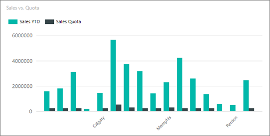
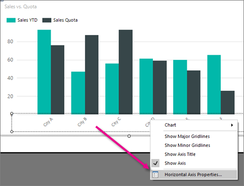
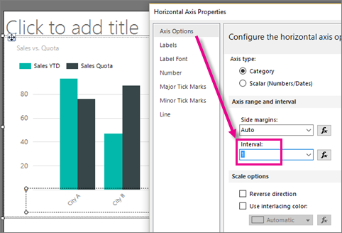
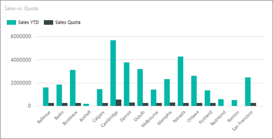

# Specify an Axis Interval (Report Builder and SSRS)
Learn to change the number of labels and tick marks on the category (x) axis in a chart by setting the axis interval in a [!INCLUDE[ssRSnoversion_md](../../includes/ssrsnoversion-md.md)] paginated report.
 
On the value axis (usually the y axis), axis intervals provide a consistent measure of the data points on the chart. 

But on the category axis (usually the x axis), sometimes an automatic axis interval results in categories without axis labels. You can specify the number of intervals you want in the axis Interval property. [!INCLUDE[ssRSnoversion](../../includes/ssrsnoversion-md.md)] calculates the number of intervals at run time, based on the data in the result set. For more information about how axis intervals are calculated, see [Formatting Axis Labels on a Chart](../../reporting-services/report-design/formatting-axis-labels-on-a-chart-report-builder-and-ssrs.md).  

To try setting the axis interval with sample data, see [Tutorial: Add a Column Chart to Your Report (Report Builder)](Tutorial:%20Add%20a%20Column%20Chart%20to%20Your%20Report%20\(Report%20Builder\).md).
  
> [!NOTE]  
>  The category axis is usually the horizontal or x-axis. However, for bar charts, the category axis is the vertical or y-axis.  
>
> This topic doesn't apply to:
>-   Date or time values on the category axis. Be default, **DateTime** values appear as days. You can specify a different date or time interval, such as a month or time interval. For more information, see [Format Axis Labels as Dates or Currencies](../../reporting-services/report-design/format-axis-labels-as-dates-or-currencies-report-builder-and-ssrs.md).  
>-  Pie, doughnut, funnel or pyramid charts, which do not have axes. 
  
## To show all the category labels on the x-axis  

In this column chart, the horizontal label interval is set to Auto.

  
1.  Right-click the category axis and click **Horizontal Axis Properties**.   

    
  
2.  In the **Horizontal Axis Properties** dialog box > **Axis Options** tab, set **Interval** to **1** to show every category group label. To show every other category group label on the x-axis, type **2**. 

     
  
3.  [!INCLUDE[clickOK](../../includes/clickok-md.md)]  

    Now the column chart displays all its horizontal axis labels.

    
  
    > [!NOTE]  
    >  When you set an axis interval, all automatic labeling is disabled. If you specify a value for the axis interval, you may see unpredictable labeling behavior, depending on how many categories are on the category axis.  

## Change the label interval in Properties pane

You can also set the label interval in the Properties pane.

1.  In report design view, click the chart, then select the horizontal axis labels.

3. In the Properties pane, set LabelInterval to **1**.

    

    The chart looks the same in design view. 
    
5.  Click **Run** to preview the report.

    
    
    Now the chart displays all its labels.
  
## To enable a variable interval calculation on an axis  

By default, [!INCLUDE[ssRSnoversion](../../includes/ssrsnoversion-md.md)] sets the axis interval to Auto. This procedure explains how to set it back to the default. 
  
1.  Right-click the chart axis that you want to change, and then click **Axis Properties**. 
  
2.  In the **Horizontal Axis Properties** dialog box > **Axis Options** tab, set **Interval** to **Auto**. The chart will display the optimal number of category labels that can fit along the axis.  
  
3.  [!INCLUDE[clickOK](../../includes/clickok-md.md)]  
  
## See Also  
 [Formatting a Chart &#40;Report Builder and SSRS&#41;](../../reporting-services/report-design/formatting-a-chart-report-builder-and-ssrs.md)   
 [Formatting Data Points on a Chart (Report Builder and SSRS)](../../reporting-services/report-design/formatting-data-points-on-a-chart-report-builder-and-ssrs.md)   
 [Sort Data in a Data Region (Report Builder and SSRS)](../../reporting-services/report-design/sort-data-in-a-data-region-report-builder-and-ssrs.md)   
 [Axis Properties Dialog Box, Axis Options &#40;Report Builder and SSRS&#41;](https://msdn.microsoft.com/library/b276e210-7a12-48ae-971b-7dabae51df11)   
 [Specify a Logarithmic Scale &#40;Report Builder and SSRS&#41;](../../reporting-services/report-design/specify-a-logarithmic-scale-report-builder-and-ssrs.md)   
 [Plot Data on a Secondary Axis &#40;Report Builder and SSRS&#41;](../../reporting-services/report-design/plot-data-on-a-secondary-axis-report-builder-and-ssrs.md)  
  
  
