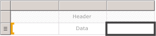

# Tables, Matrices, and Lists (Report Builder and SSRS)
 In [!INCLUDE[ssRSnoversion_md](../../includes/ssrsnoversion-md.md)], tables, matrices, and lists are *data regions* that display paginated report data in cells that are organized into rows and columns. The cells typically contain text data such as text, dates, and numbers but they can also contain gauges, charts, or report items such as images. Collectively, tables, matrices, and lists are frequently referred to as *tablix* data regions.  
  
 The table, matrix, and list templates are built on the tablix data region, which is a flexible grid that can display data in cells. In the table and matrix templates, cells are organized into rows and columns. Because templates are variations of the underlying generic tablix data region, you can display data in combination of template formats and change the table, matrix, or list on to include the features of another data region as you develop your report. For example, if you add a table and find it does not serve your needs, you can add column groups to make the table a matrix.  
  
 The table and matrix data regions can display complex data relationships by including nested tables, matrices, lists, charts and gauges. Tables and matrices have a tabular layout and their data comes from a single dataset, built on a single data source. The key difference between tables and matrices is that tables can include only row groups, where as matrices have row groups and column groups.  
  
 Lists are a little different. They support a free-layout that and can include multiple peer tables or matrices, each using data from a different dataset. Lists can also be used for forms, such as invoices.  
  
 The following pictures show simple reports with a table, matrix, or list.  
  
   
  
 To quickly get started with tables, matrices, and lists, see [Tutorial: Creating a Basic Table Report &#40;Report Builder&#41;](../../reporting-services/tutorial-creating-a-basic-table-report-report-builder.md), [Tutorial: Creating a Matrix Report &#40;Report Builder&#41;](../../reporting-services/tutorial-creating-a-matrix-report-report-builder.md), and [Tutorial: Creating a Free Form Report &#40;Report Builder&#41;](../../reporting-services/tutorial-creating-a-free-form-report-report-builder.md).  
  
> [!NOTE]  
>  You can publish tables, matrices, and lists separately from a report as report parts. Read more about [Report Parts](../../reporting-services/report-design/report-parts-report-builder-and-ssrs.md).  
  
##   Table  
 Use a table to display detail data, organize the data in row groups, or both. The Table template contains three columns with a table header row and a details row for data. The following figure shows the initial table template, selected on the design surface:  
  
   
  
 You can group data by a single field, by multiple fields, or by writing your own expression. You can create nested groups or independent, adjacent groups and display aggregated values for grouped data, or add totals to groups. For example, if your table has a row group called [Category], you can add a subtotal for each group as well as a grand total for the report. To improve the appearance of the table and highlight data you want to emphasize, you can merge cells and apply formatting to data and table headings.  
  
 You can initially hide detail or grouped data, and include drilldown toggles to enable a user to interactively choose how much data to show.  
  
 For more information, see [Tables &#40;Report Builder  and SSRS&#41;](../../reporting-services/report-design/tables-report-builder-and-ssrs.md).  
  
##   Matrix  
 Use a matrix to display aggregated data summaries, grouped in rows and columns, similar to a PivotTable or crosstab. The number of rows and columns for groups is determined by the number of unique values for each row and column groups. The following figure shows the initial matrix template, selected on the design surface:  
  
   
  
 You can group data by multiple fields or expressions in row and column groups. At run time, when the report data and data regions are combined, a matrix grows horizontally and vertically on the page as columns for column groups and rows for row groups are added. The matrix cells display aggregate values that are scoped to the intersection of the row and column groups to which the cell belongs. For example, if your matrix has a row group (Category) and two column groups (Territory and Year) that display the sum of sales, the report displays two cells with sums of sales for each value in the Category group. The scope of the cells are the two intersections are: Category and Territory and Category and Year. The matrix can include nested and adjacent groups. Nested groups have a parent-child relationship and adjacent groups a peer relationship. You can add subtotals for any and all levels of nested row and column groups within the matrix.  
  
 To make the matrix data more readable and highlight the data you want to emphasize, you can merge cells or split horizontally and vertically and apply formatting to data and group headings.  
  
 You can also include drilldown toggles that initially hide detail data; the user can then click the toggles to display more or less detail as needed.  
  
 For more information, see [Create a Matrix](../../reporting-services/report-design/create-a-matrix-report-builder-and-ssrs.md).  
  
##   List  
 Use a list to create a free-form layout. You are not limited to a grid layout, but can place fields freely inside the list. You can use a list to design a form for displaying many dataset fields or as a container to display multiple data regions side by side for grouped data. For example, you can define a group for a list; add a table, chart, and image; and display values in table and graphic form for each group value, as you might for an employee or patient record.  
  
   
  
 For more information, see [Create Invoices and Forms with Lists].  
  
##   Preparing Data  
 A table, matrix, and list data regions display data from a dataset. You can prepare the data in the query that retrieves the data for the dataset or by setting properties in the table, matrix, or list.  
  
 The query languages such as [!INCLUDE[tsql](../../includes/tsql-md.md)], that you use to retrieve the data for the report datasets can prepare the data by applying filters to include only a subset of the data, replacing null values or blanks with constants that make the report more readable, and sorting and grouping data.  
  
 If you choose to prepare the data in the table, matrix, or list data region of a report, you set properties on the data region or cells within the data region. If you want to filter or sort the data, set the properties on the data region. For example, to sort the data you specify the columns to sort on and the sort direction. If you want to provide an alternative value for a field, you set the values of the cell text that displays the field. For example, to display Blank when a field is empty or null, you use an expression to set the value.  
  
 For more information, see [Preparing Data for Display in a Tablix Data Region &#40;Report Builder and SSRS&#41;](../../reporting-services/report-design/preparing-data-for-display-in-a-tablix-data-region-report-builder-and-ssrs.md).  
  
##   Building and Configuring a Table, Matrix, or List  
 When you add tables or matrices to your report, you can use the Table and Matrix Wizard or build them manually from the templates that Report Builder and Report Designer provide. Lists are built manually from the list template.  
  
 The wizard guides you through the steps to quickly build and configure a table or matrix. After you complete the wizard or if you build the tablix data regions from scratch, you can further configure and refine them. The dialog boxes, available from the right-click menus on the data regions, make it easy to set the most commonly used properties for page breaks, repeatability and visibility of headers and footers, display options, filters, and sorting. But the tablix data region provides a wealth of additional properties, which you can set only in the Properties pane of Report Builder. For example, if you want to display a message when the dataset for a table, matrix, or list is empty, you specify the message text in the NoRowsMessage tablix property in the Properties pane.  
  
##   Changing Between Tablix Templates  
 You are not limited by your initial tablix template choice. As you add groups, totals, and labels, you might want to modify your tablix design. For example, you might start with a table and then delete the details row and add column groups. For more information, see [Exploring the Flexibility of a Tablix Data Region &#40;Report Builder and SSRS&#41;](../../reporting-services/report-design/exploring-the-flexibility-of-a-tablix-data-region-report-builder-and-ssrs.md).  
  
 You can continue to develop a table, matrix, or list by adding any tablix feature. Tablix features include displaying detail data or aggregates for grouped data on rows and columns. You can create nested groups, independent adjacent groups, or recursive groups. You can filter and sort grouped data, and easily combine groups by including multiple group expressions in a group definition  
  
 You can also add totals for a group or grand totals for the data region. You can hide rows or columns to simplify a report and enable the user to toggle the display of the hidden data, as in a drilldown report. For more information, see [Controlling the Tablix Data Region Display on a Report Page &#40;Report Builder and SSRS&#41;](../../reporting-services/report-design/controlling-the-tablix-data-region-display-on-a-report-page.md).  
  
##   How-To Topics  
 This section lists procedures that show you, step by step, how to work with work with tables, matrices and lists in your reports; how to display data in rows and columns, add and delete columns, merge cells, and include subtotals for row and column groups.  
  
-   [Add a Details Group &#40;Report Builder and SSRS&#41;](../../reporting-services/report-design/add-a-details-group-report-builder-and-ssrs.md)  
  
-   [Add a Total to a Group or Tablix Data Region &#40;Report Builder and SSRS&#41;](../../reporting-services/report-design/add-a-total-to-a-group-or-tablix-data-region-report-builder-and-ssrs.md)  
  
-   [Change an Item Within a Cell &#40;Report Builder and SSRS&#41;](../../reporting-services/report-design/change-an-item-within-a-cell-report-builder-and-ssrs.md)  
  
-   [Change Row Height or Column Width &#40;Report Builder and SSRS&#41;](../../reporting-services/report-design/change-row-height-or-column-width-report-builder-and-ssrs.md)  
  
-   [Insert or Delete a Column &#40;Report Builder and SSRS&#41;](../../reporting-services/report-design/insert-or-delete-a-column-report-builder-and-ssrs.md)  
  
-   [Insert or Delete a Row &#40;Report Builder and SSRS&#41;](../../reporting-services/report-design/insert-or-delete-a-row-report-builder-and-ssrs.md)  
  
-   [Merge Cells in a Data Region &#40;Report Builder and SSRS&#41;](../../reporting-services/report-design/merge-cells-in-a-data-region-report-builder-and-ssrs.md)  
  
-   [Create a Recursive Hierarchy Group &#40;Report Builder and SSRS&#41;](../../reporting-services/report-design/create-a-recursive-hierarchy-group-report-builder-and-ssrs.md)  
  
-   [Add or Delete a Group in a Data Region &#40;Report Builder and SSRS&#41;](../../reporting-services/report-design/add-or-delete-a-group-in-a-data-region-report-builder-and-ssrs.md)  
  
-   [Display Headers and Footers with a Group &#40;Report Builder and SSRS&#41;](../../reporting-services/report-design/display-headers-and-footers-with-a-group-report-builder-and-ssrs.md)  
  
-   [Create a Stepped Report &#40;Report Builder and SSRS&#41;](../../reporting-services/report-design/create-a-stepped-report-report-builder-and-ssrs.md)  
  
-   [Add, Move, or Delete a Table, Matrix, or List &#40;Report Builder and SSRS&#41;](../../reporting-services/report-design/add-move-or-delete-a-table-matrix-or-list-report-builder-and-ssrs.md)  
  
##   In This Section  
 The following topics provide additional information about working with the tablix data region.  
  
 [Tablix Data Region &#40;Report Builder and SSRS&#41;](../../reporting-services/report-design/tablix-data-region-report-builder-and-ssrs.md)  
 Explains key concepts related to the tablix data region such as areas of the tablix, detail and grouped data, column and row groups, and static and dynamic rows and columns.  
  
 [Adding Data to a Tablix Data Region &#40;Report Builder and SSRS&#41;](../../reporting-services/report-design/adding-data-to-a-tablix-data-region-report-builder-and-ssrs.md)  
 Provides detailed information about adding detail and grouped data, subtotals and totals, and labels to a tablix data region.  
  
 [Controlling the Tablix Data Region Display on a Report Page &#40;Report Builder and SSRS&#41;](../../reporting-services/report-design/controlling-the-tablix-data-region-display-on-a-report-page.md)  
 Describes properties for a tablix data region that you can modify to change the way a tablix data region appears when you view it in a report.  
  
 [Controlling Row and Column Headings &#40;Report Builder and SSRS&#41;](../../reporting-services/report-design/controlling-row-and-column-headings-report-builder-and-ssrs.md)  
 Describes how to control row and column headings when a table, matrix, or list data region cans span multiple pages horizontally or vertically.  
  
 [Creating Recursive Hierarchy Groups &#40;Report Builder and SSRS&#41;](../../reporting-services/report-design/creating-recursive-hierarchy-groups-report-builder-and-ssrs.md)  
 Describes how to display recursive data where the relationship between parent and child is represented by fields in the dataset.  
  
 [Understanding Groups &#40;Report Builder and SSRS&#41;](../../reporting-services/report-design/understanding-groups-report-builder-and-ssrs.md)  
 Explains what groups are and when you use them and describes the groups available for the different tablix data regions.  
  
## See Also  
 [Add Dataset Filters, Data Region Filters, and Group Filters &#40;Report Builder and SSRS&#41;](../../reporting-services/report-design/add-dataset-filters-data-region-filters-and-group-filters.md)   
 [Nested Data Regions &#40;Report Builder and SSRS&#41;](../../reporting-services/report-design/nested-data-regions-report-builder-and-ssrs.md)   
 [Linking Multiple Data Regions to the Same Dataset &#40;Report Builder and SSRS&#41;](../../reporting-services/report-design/linking-multiple-data-regions-to-the-same-dataset-report-builder-and-ssrs.md)   
 [Expressions &#40;Report Builder and SSRS&#41;](../../reporting-services/report-design/expressions-report-builder-and-ssrs.md)   
 [Filter, Group, and Sort Data &#40;Report Builder and SSRS&#41;](../../reporting-services/report-design/filter-group-and-sort-data-report-builder-and-ssrs.md)   
 [Report Parameters &#40;Report Builder and Report Designer&#41;](../../reporting-services/report-design/report-parameters-report-builder-and-report-designer.md)   
 [Charts &#40;Report Builder and SSRS&#41;](../../reporting-services/report-design/charts-report-builder-and-ssrs.md)   
 [Gauges &#40;Report Builder and SSRS&#41;](../../reporting-services/report-design/gauges-report-builder-and-ssrs.md)  
  
  
