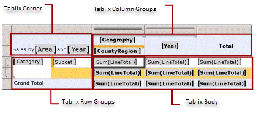

# Tablix Data Region Areas (Report Builder and SSRS)
 In a [!INCLUDE[ssRSnoversion_md](../../includes/ssrsnoversion-md.md)] paginated report, a tablix data region has four areas that contain tablix cells:   
* The corner  
* The row group area  
* The column group area  
* The body   
  
Cells in each area have a distinct function. You add cells to the tablix body area to display detail and grouped data. Report Builder and Report Designer add cells to the row group or column group area when you create a group in order to display group instance values. Report Builder and Report Designer create tablix corner cells when both row groups and column groups exist.  
  
On the design surface, dotted lines denote the four areas of a selected tablix data region. The following figure shows the areas for a tablix region with nested row groups based on category and subcategory, nested column groups based on geography and country/region, and an adjacent column group based on year.  
  
   
  
 The following list describes each area:  
  
-   **Tablix corner area**. (Optional) A tablix corner is located in the upper-left corner, or upper-right corner for right-to-left (RTL) layouts. This area is automatically created when you add both row groups and column groups to a tablix data region. In this area, you can merge cells and add a label or embed another report item. In the figure, merged cells in the corner display the label Sales by Area and Year.  
  
-   **Tablix column groups area**. (Optional) Tablix column groups are located in the upper-right corner (upper-left corner for RTL layout). This area is automatically created when you add a column group. Cells in this area represent members of the column groups hierarchy, and display the column group instance values. In the figure, the cells that display [Geography] and [CountryRegion] are nested column groups, and the cell that displays [Year] is an adjacent column group. The column [Total] displays the aggregated totals across each row.  
  
-   **Tablix row groups area**. (Optional) Tablix row groups are located on the lower-left corner (lower right for RTL layout). This area is automatically created when you add a row group. Cells in this area represent members of the row groups hierarchy, and display row group instance values. In the figure, the cells that display [Category] and [Subcat] are nested row groups. The Total row below Subcat repeats with each category group to show the aggregated subtotals for each column. The grand total row shows the totals for all categories.  
  
-   **Tablix body area**. The tablix body is located in the lower right corner (lower left for RTL layout). The tablix body displays detail and grouped data. In this example, only aggregated data is used. The scope for the expression is determined by the innermost groups to which the text box belongs. Cells in the tablix body display detail data when they are members of a detail row and they represent aggregate data when they are members of a row or column associated with a group. By default, cells in a group row or column that contain simple expressions that do not include an aggregate function, evaluate to the first value in the group. In the figure, the cells display the aggregate totals for line totals for all sales order.  
  
 When the report runs, column groups expand right (or left, if the Direction property of the tablix data region is set to RTL) for as many columns as there are unique values for a group expression. Row groups expand down the page. For more information, see [Tablix Data Region Cells, Rows, and Columns &#40;Report Builder&#41; and SSRS](../../reporting-services/report-design/tablix-data-region-cells-rows-and-columns-report-builder-and-ssrs.md).  
  
 The following figure shows the tablix data region in Preview.  
  
   
  
 The row group area displays two category group instances for Clothing and Components. The column group are displays a geography group instance for North America, with two nested country/region group instances for Canada (CA) and the United States (US). In addition, the adjacent column displays two year group instances for 2003 and 2004. The Total column row displays the row totals; the totals row that repeats with the category group shows subcategory totals, and the grand total row displays the category totals once for the data region.  
  
## See Also  
 [Tables, Matrices, and Lists &#40;Report Builder and SSRS&#41;](../../reporting-services/report-design/tables-matrices-and-lists-report-builder-and-ssrs.md)   
 [Report Builder Tutorials](../../reporting-services/report-builder-tutorials.md)   
 [Tables &#40;Report Builder  and SSRS&#41;](../../reporting-services/report-design/tables-report-builder-and-ssrs.md)   
 [Create a Matrix](../../reporting-services/report-design/create-a-matrix-report-builder-and-ssrs.md)   
 [Create Invoices and Forms with Lists](../../reporting-services/report-design/create-invoices-and-forms-with-lists-report-builder-and-ssrs.md)   
 [Tablix Data Region &#40;Report Builder and SSRS&#41;](../../reporting-services/report-design/tablix-data-region-report-builder-and-ssrs.md)  
  
  
