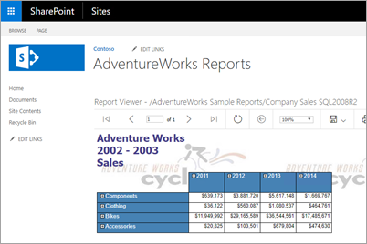
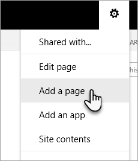
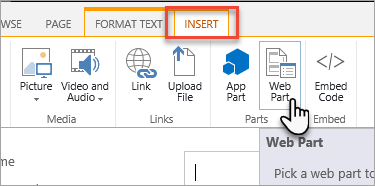
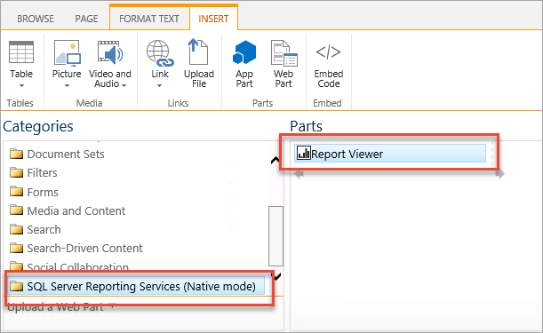

# Add SQL Server Reporting Services Report Viewer web part to a SharePoint page

[!INCLUDE[ssrs-appliesto](../../includes/ssrs-appliesto.md)] [!INCLUDE[ssrs-appliesto-2016-and-later](../../includes/ssrs-appliesto-2016-and-later.md)] [!INCLUDE[ssrs-appliesto-pbirsi](../../includes/ssrs-appliesto-pbirs.md)] [!INCLUDE[ssrs-appliesto-sharepoint-2016-2019](../../includes/ssrs-appliesto-sharepoint-2016-2019.md)] [!INCLUDE[ssrs-appliesto-not-sharepoint-online](../../includes/ssrs-appliesto-not-sharepoint-online.md)]

Display a report, from SQL Server Reporting Services or Power BI Report Server, by adding a Report Viewer web part to a SharePoint page.

## Prerequisites

* For reports to load successfully, the Claims to Windows Token Service (C2WTS) needs to be configured for Kerberos constrained delegation. For more information on how to configure C2WTS, see [Claims to Windows Token Service (C2WTS) and Reporting Services](../install-windows/claims-to-windows-token-service-c2wts-and-reporting-services.md).

* The Report Viewer web part must be deployed to your SharePoint farm. For information on how to deploy the Report Viewer web part solution project, see [Deploy the Report Viewer web part on a SharePoint site](deploy-report-viewer-web-part.md).

* To add a web part to a web page, you must have the Add and Customize Pages permission at the site level. If you are using default security settings, this permission is granted to members of the **Owners** group who have the Full Control level of permission.

## Add web part

1. In your SharePoint site, select the **gear** icon in the upper left and select **Add a page**.

    

2. Give your page a name and select **Create**.

3. Within the page designer, select the **Insert** tab in the ribbon. Then select **web part** within the **Parts** section.

    

4. Under **Categories**, select **SQL Server Reporting Services (Native mode). Under **Parts**, select **Report Viewer**. Then select **Add**.

    

    You may initially see an error. The error is because the default report server URL is set to *https://localhost* and may not be available at that location.

## Configure the Report Viewer web part

To configure the web part to point to your specific report, do the following steps.

1. When editing the SharePoint page, select the down arrow in the upper right of the web part and select **Edit web part**.

    

2. Enter the **Report Server URL** for the report server hosting your report. The URL should look similar to *https://myrsserver/reportserver*.

3. Enter the path and name of the report you want to display within the web part. It will look similar to */AdventureWorks Sample Reports/Company Sales*. In this example, the report *Company Sales* is in a folder called *AdventureWorks Sample Reports*.

4. If your report requires parameters, after you have supplied the report server URL and the name of the report, select **Load Parameters** within the **Parameters** section.

5. Select **Ok** to save your changes to the web part configuration.

6. Select **Save**, within the Office ribbon, to save the changes to the SharePoint page.

## Considerations and limitations

* The Report Viewer web part cannot be used on modern pages within SharePoint.
* Power BI reports can't be used with the Report Viewer web part.
* If you don't see the Report Viewer web part, to add to your page, make sure you have [deployed the Report Viewer web part](deploy-report-viewer-web-part.md).

More questions? [Try asking the Reporting Services forum](https://go.microsoft.com/fwlink/?LinkId=620231)
