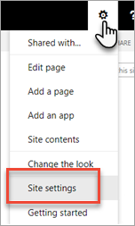
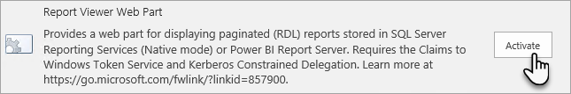
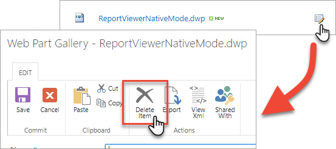

# Deploy the SQL Server Reporting Services Report Viewer web part on a SharePoint site

[!INCLUDE [ssrs-appliesto](../../includes/ssrs-appliesto.md)] [!INCLUDE[ssrs-appliesto-2016-and-later](../../includes/ssrs-appliesto-2016-and-later.md)] [!INCLUDE[ssrs-appliesto-pbirsi](../../includes/ssrs-appliesto-pbirs.md)] [!INCLUDE[ssrs-appliesto-sharepoint-2016-2019](../../includes/ssrs-appliesto-sharepoint-2016-2019.md)] [!INCLUDE[ssrs-appliesto-not-sharepoint-online](../../includes/ssrs-appliesto-not-sharepoint-online.md)]

The Report Viewer web part is a custom web part that can be used to view SQL Server Reporting Services (native mode) reports within your SharePoint site. You can use the web part to view, navigate, print, and export reports on a report server. The Report Viewer web part is associated with report definition (.rdl) files that are processed by a SQL Server Reporting Services report server or a Power BI Report Server. This Report Viewer web part cannot be used with Power BI reports hosted in Power BI Report Server.

Use the following instructions to manually deploy the solution package that add the Report Viewer web part to a SharePoint Server 2013 or SharePoint Server 2016 environment. Deploying the solution is a required step for configuring the web part.

**The Report Viewer web part is a standalone solution package and is not associated with SharePoint integrated mode for SQL Server Reporting Services.**

## Requirements

> [!IMPORTANT]
> Starting with version "15.X.X.X" you can install the ReportViewerWebPart side by side with your existing Reporting Services SharePoint integrated mode shared service applications.
> With this update of the .wsp solution we introduced new files and the previous solution must be retracted and the new .wsp redeployed by using the Uninstall-SPSolution and Install-SPSolution cmdlets, respectively.
>

**Support SharePoint Server versions:**
* SharePoint Server 2016
* SharePoint Server 2013

**Support Reporting Services versions:**  
* SQL Server 2008 Reporting Services (Native mode) and later.
* Power BI Report Server

## Download the Report Viewer web part solution package

The Report Viewer web part is available on the Microsoft Download Center.

[Download Report Viewer web part solution package](https://www.microsoft.com/download/details.aspx?id=55949)

## Deploy the farm solution

This section shows you how to deploy the solution package to your SharePoint farm. This task only needs to be performed once.

1. On a SharePoint server, open a SharePoint Management Shell using the **Run as Administrator** option.

2. Run [Add-SPSolution](https://technet.microsoft.com/library/ff607552(v=office.16).aspx) to add the farm solution.

    ```
    Add-SPSolution -LiteralPath "{path to file}\ReportViewerWebPart.wsp"
    ```

    The cmdlet returns the name of the solution, its solution ID, and Deployed=False. In the next step, you will deploy the solution.

3. Run the [Install-SPSolution](https://technet.microsoft.com/library/ff607534(v=office.16).aspx) cmdlet to deploy the farm solution.

    **SharePoint 2013**

    ```
    Install-SPSolution -Identity ReportViewerWebPart.wsp -CompatibilityLevel "14,15" -GACDeployment -WebApplication {URL to web application}
    ```

    **SharePoint 2016**

    ```
    Install-SPSolution -Identity ReportViewerWebPart.wsp -GACDeployment -WebApplication {URL to web application}
    ```

## Activate feature

1. In your SharePoint site, select the **gear** icon in the upper left and select **Site Settings**.

    

    By default, SharePoint web applications are accessed through port 80. This means that you can often access a SharePoint site by entering *https://<computer name>* to open the root site collection.

3. In **Site Collection Administration**, select **Site collection features**.

4. Scroll down the page until you find the **Report Viewer web part** Feature.

5. Select **Activate**.

    

6. Repeat for additional site collections by opening each site and clicking Site Actions.

Optionally, you can also use PowerShell to enable this feature on all sites using the [Enable-SPFeature](https://technet.microsoft.com/library/ff607803.aspx) cmdlet.

```
Get-SPWebApplication "<web application url>" | Get-SPSite -Limit ALL | 
        ForEach-Object {
            Write-Host "Enabling feature for $($_.URL)"
            Enable-SPFeature -identity "ReportViewerWebPart" -URL $_.URL -ErrorAction Continue
        }
```

## Remove the solution

Although SharePoint Central Administration provides solution retraction, you do not need to retract the **ReportViewerWebPart.wsp** file unless you are systematically troubleshooting an installation or patch deployment problem.

1. In SharePoint Central Administration, in **System Settings**, select **Manage farm solutions**.

2. Select **ReportViewerWebPart.wsp**.

3. Select Retract Solution.

### Remove the web part from Site settings

Retracting the solution does not remove the Report Viewer web part from the list of web parts within your SharePoint site. To remove the Report Viewer web part, do the following.

1. In your SharePoint site, select the **gear** icon in the upper left and select **Site Settings**.

    

    By default, SharePoint web applications are accessed through port 80. This means that you can often access a SharePoint site by entering *https://<computer name>* to open the root site collection.

2. Under **Web Designer Galleries**, select **web parts**.

3. Select the **edit icon** next to **ReportViewerNativeMode.dwp**. It may not be listed on the first page of results.

4. Select **Delete Item**.

    

Deletion of the web part can be attempted by using PowerShell, but there is not a direct command for it. For a script example, see [How to delete web parts from the web part Gallery](https://gallery.technet.microsoft.com/office/How-to-delete-Web-Parts-1132701f).

## Supported languages

The following languages are supported with the web part:

* English (en)
* German (de)
* Spanish (sp)
* French (fr)
* Italian (it)
* Japanese (ja)
* Korean (ko)
* Portuguese (pt)
* Russian (ru)
* Chinese (Simplified - zh-HANS and zh-CHS)
* Chinese (Traditional - zh-HANT and zh-CHT)

## Troubleshoot

* Error when uninstalling SSRS if you have SharePoint integrated mode configured:

    Install-SPRSService : [A] Microsoft.ReportingServices.SharePoint.SharedService.Service.ReportingWebService cannot be cast to [B]Microsoft.ReportingServices.SharePoint.SharedService.Service.ReportingWebService. Type A originates from 'Microsoft.ReportingServices.SharePoint.SharedService,Version=14.0.0.0, Culture=neutral, PublicKeyToken=89845dcd8080cc91' in the context 'Default' at location 'C:\Windows\assembly\GAC_MSIL\Microsoft.Reporting Services.SharePoint.SharedService.dll'. Type B originates from 'Microsoft.ReportingServices.SharePoint.SharedService,Version=12.0.0.0, Culture=neutral, PublicKeyToken=89845dcd8080cc91' in the context 'Default' at location 'C:\Windows\assembly\GAC_MSIL\Microsoft.Reporting Services.SharePoint.SharedService.dll'.
    
    Solution:
    1. Remove the Report Viewer web part
    2. Uninstall SSRS
    3. Reinstall the Report Viewer web part

* Error when trying to upgrade SharePoint if you have SharePoint integrated mode configured:

    Could not load file or assembly 'Microsoft.ReportingServices.Alerting.ServiceContract, Version=14.0.0.0, Culture=neutral, PublicKeyToken=89845dcd8080cc91' or one of its dependencies. The system cannot find the file specified. 00000000-0000-0000-0000-000000000000
    
    Solution:
    1. Remove the Report Viewer web part
    2. Uninstall SSRS
    3. Reinstall the Report Viewer web part

## Next steps

After the Report Viewer web part has been deployed and activiated, you can add the web part to a SharePoint page. For more information, see [Add Report Viewer web part to a SharePoint page](add-report-viewer-web-part-to-page.md).

More questions? [Try asking the Reporting Services forum](https://go.microsoft.com/fwlink/?LinkId=620231)
