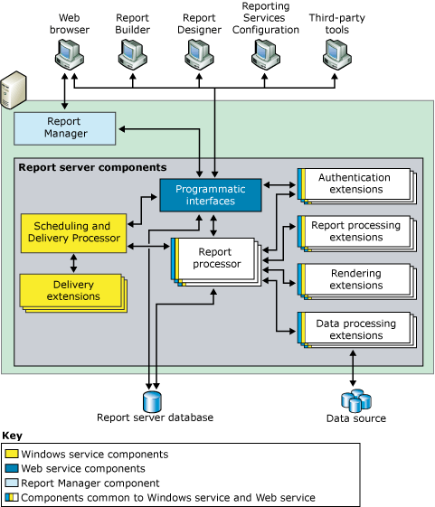

# Comparing native and SharePoint Reporting Services report servers

[!INCLUDE[ssrs-appliesto](../../includes/ssrs-appliesto.md)] [!INCLUDE[ssrs-appliesto-2016-and-later](../../includes/ssrs-appliesto-2016-and-later.md)] [!INCLUDE[ssrs-appliesto-sharepoint-2013-2016i](../../includes/ssrs-appliesto-sharepoint-2013-2016.md)] [!INCLUDE[ssrs-appliesto-pbirsi](../../includes/ssrs-appliesto-pbirs.md)]

[!INCLUDE [ssrs-previous-versions](../../includes/ssrs-previous-versions.md)]

Learn about the central piece of a [!INCLUDE[ssNoVersion](../../includes/ssnoversion-md.md)] Reporting Services installation. It consists of a processing engine along with extensions to add functionality.

> [!NOTE]
> Reporting Services integration with SharePoint is no longer available after SQL Server 2016. Power View support is no longer available after SQL Server 2017.

A Reporting Services report server runs in one of two deployment modes; Native mode or SharePoint mode. See the [Feature Comparison of SharePoint and Native Mode](#feature-comparison-of-sharepoint-and-native-mode) section for a comparison of features.  
  
 **Installation:** For information on Reporting Services installation, see [Install Reporting Services](../install-windows/install-reporting-services.md).

## Overview of report server modes

 Processing engines (processors) are the core of the report server. The processors support the integrity of the reporting system and can't be modified or extended. Extensions are also processors, but they perform very specific functions. Reporting Services includes one or more default extensions for every type of supported extension. You can add custom extensions to a report server. Doing so allows you to extend a report server to support features that are not supported out of the box; examples of custom functionality might include support for single sign-on technologies, report output in application formats that are not already handled by the default rendering extensions, and report delivery to a printer or application.  
  
 A single report server instance is defined by the complete collection of processors and extensions that provide end-to-end processing, from the handling of the initial request to the presentation of a finished report. Through its subcomponents, the report server processes report requests and makes reports available for on-demand access or scheduled distribution.  
  
 Functionally, a report server enables report authoring experiences, report rendering, and report delivery experiences for a variety of data sources as well as extensible authentication and authorization schemes. Additionally a report server contains report server databases that store published reports, shared data sources, shared datasets, shared schedules and subscriptions, report definition source files, model definitions, compiled reports, snapshots, parameters, and other resources. A report server also enables administration experiences for configuring the report server to process report requests, maintain snapshot histories, and manage permissions for reports, data sources, datasets, and subscriptions.  
  
 A Reporting Services report server supports two modes of deployment for report server instances:  
  
-   **Native mode**: including native mode with SharePoint web parts, where a report server runs as an application server that provides all processing and management capability exclusively through Reporting Services components. You configure a native mode report server with Report Server Configuration Manager and SQL Server Management Studio.  
  
-   **SharePoint mode**: where a report server is installed as part of a SharePoint server farm.  Deploy and configure SharePoint mode by using PowerShell commands or SharePoint content management pages.  
  
 In SQL Server Reporting Services you can't switch a report server from one mode to the other. If you want to change the type of report server that your environment uses, you must install the desired mode of report server and then copy or move the report items or report server database from the older versioned report server to the new report server. This process is typically referred to as a 'migration'. The steps needed to migrate depend on the mode you're migrating to and the version you're migrating from. For more information, see [Upgrade and Migrate Reporting Services](../../reporting-services/install-windows/upgrade-and-migrate-reporting-services.md)  
  
## Feature comparison of SharePoint and native mode
  
|Feature or component|Native mode|SharePoint mode|  
|--------------------------|-----------------|---------------------|  
|**URL addressing**|Yes|URL addressing is different in SharePoint integrated mode. SharePoint URLs are used to reference reports, report models, shared data sources, and resources. The report server folder hierarchy is not used. If you have custom applications that rely on URL access as supported on a native mode report server, that functionality will no longer work when the report server is configured for SharePoint integration.   For more information on URL access, see [URL Access Parameter Reference](../../reporting-services/url-access-parameter-reference.md)|  
|**Custom security extensions**|Yes|Reporting Services custom security extensions can't be deployed or used on the report server. The report server includes a special-purpose security extension that is used whenever you configure a report server to run in SharePoint integrated mode. This security extension is an internal component, and it is required for integrated operations.|  
|**Configuration Manager**|Yes|**\*\* Important \*\*** Configuration Manager can't be used to manage a SharePoint mode report server. Instead, use SharePoint central administration.|  
|**Web portal**|Yes|You can't manage SharePoint mode in the web portal. Use the SharePoint application pages. For more information, see [Reporting Services SharePoint Service and Service Applications](../../reporting-services/report-server-sharepoint/reporting-services-sharepoint-service-and-service-applications.md).|  
|**Linked Reports**|Yes|No.|  
|**My Reports**|Yes|No|  
|**My Subscriptions** and batching methods.|Yes|No|  
|**Data Alerts**|No|Yes|  
|**Power View**|No|Yes   Requires Silverlight in the client browser. For more information on browser requirements, see [Browser Support for Reporting Services](../../reporting-services/browser-support-for-reporting-services-and-power-view.md)|  
|**.RDL reports**|Yes|Yes   .RDL reports can run on Reporting Services report servers in native mode or in SharePoint mode.|  
|**.RDLX reports**|No|Yes   Power View .RDLX reports can only run on Reporting Services report servers in SharePoint mode. |  
|**SharePoint user token credentials for the SharePoint list extension**|No|Yes|  
|**AAM zones for internet facing deployments**|No|Yes|  
|**SharePoint backup and recovery**|No|Yes|  
|**ULS log support**|No|Yes|  
  
## Native mode

 In native mode, a report server is a stand-alone application server that provides all viewing, management, processing, and delivery of reports and report models. This is the default mode for report server instances. You can install a native mode report server that is configured during setup or you can configure it for native mode operations once setup is complete.  
  
 The following diagram shows the three-tier architecture of a Reporting Services Native mode deployment. It shows the report server database and data sources in the data tier, the report server components in the middle tier, and the client applications and built-in or custom tools in the presentation tier. It shows the flow of requests and data among the server components and which components send and retrieve content from a data store.  
  
   
  
 The report server is implemented as a [!INCLUDE[msCoName](../../includes/msconame-md.md)] Windows service, called the "Report Server service", that hosts a Web service, background processing, and other operations. In the Services console application, the service is listed as SQL Server Reporting Services (MSSQLSERVER).  
  
 Third-party developers can create additional extensions to replace or extend the processing capability of the report server. To learn more about the programmatic interfaces available to application developers, see the [Technical Reference](../../reporting-services/technical-reference-ssrs.md).  
  
### Native mode with SharePoint web parts

 Reporting Services provides two web parts that you can install and register on an instance of [!INCLUDE[winSPServ](../../includes/winspserv-md.md)] 2.0 or later, or SharePoint Portal Server 2003 or later. From a SharePoint site, you can use the web parts to find and view reports that are stored and processed on a report server that runs in native mode. These web parts were introduced in earlier releases of Reporting Services.  
  
## SharePoint mode

 In SharePoint mode, a report server must run within a SharePoint server farm. The report server processing, rendering, and management features are represented by a SharePoint application server running the Reporting Services SharePoint shared service and one or more Reporting Services service applications. A SharePoint site provides the front-end access to report server content and operations.  
  
 SharePoint mode requires:  
  
-   [!INCLUDE[SPF2010](../../includes/spf2010-md.md)] or [!INCLUDE[SPS2010](../../includes/sps2010-md.md)].  
  
-   An appropriate version of the Reporting Services Add-in for SharePoint 2010 Products.  
  
-   A SharePoint application server with the Reporting Services shared service installed and at least one Reporting Services service application.  
  
 The following illustration shows a SharePoint mode Reporting Services environment:  
  
   
  
||Description|  
|-|-----------------|  
|**(1)**|Web servers or web front-ends (WFE). The Reporting Services add-in must be installed on each web server from which you want to utilize the web application features such as viewing reports or Reporting Services management pages for tasks such as managing data sources or subscriptions.|  
|**(2)**|The add-in installs URL and SOAP endpoints for clients to communicate with the Application servers, through the Reporting Services service proxy.|  
|**(3)**|Application servers running Reporting Services shared service. Scale-out of report processing is managed as part of the SharePoint farm and by adding the Reporting Services service to additional application servers.|  
|**(4)**|You can create more than one Reporting Services service application, with different configurations including permissions, e-mail, proxy, and subscriptions.|  
|**(5)**|Reports, data sources, and other items are stored in the SharePoint content databases.|  
|**(6)**|Reporting Services service applications create three databases for report server, temp, and data alerting features. Configuration settings that apply to all SSRS service applications are stored in the **RSReportserver.config** file.|  
  
## Report process and schedule and delivery process

 The report server includes two processing engines that perform preliminary and intermediate report processing, and scheduled and delivery operations. The Report Processor retrieves the report definition or model, combines layout information with data from the data processing extension, and renders it in the requested format. The Scheduling and Delivery Process processes reports triggered from a schedule, and delivers reports to target destinations.  
  
## Report server database

 The report server is a stateless server that stores all properties, objects, and metadata in a [!INCLUDE[ssNoVersion](../../includes/ssnoversion-md.md)] database. Stored data includes published reports, compiled reports, report models, and the folder hierarchy that provides the addressing for all items managed by the report server. A report server database can provide internal storage for a single Reporting Services installation or for multiple report servers that are part of a scale-out deployment. If you configure a report server to run within a larger deployment of a SharePoint product or technology, the report server uses the SharePoint databases in addition to the report server database. For more information about data stores used in Reporting Services installation, see [Report Server Database &#40;SSRS Native Mode&#41;](../../reporting-services/report-server/report-server-database-ssrs-native-mode.md).  
  
## Authentication, rendering, data, and delivery extensions

 The report server supports the following types of extensions: authentication extensions, data processing extensions, report processing extensions, rendering extensions, and delivery extensions. A report server requires at least one authentication extension, data processing extension, and rendering extension. Delivery and custom report processing extensions are optional, but necessary if you want to support report distribution or custom controls.  
  
 Reporting Services provides default extensions so that you can use all of the server features without having to develop custom components. The following table describes the default extensions that contribute to a complete report server instance that provides ready-to-use functionality:  
  
|Type|Default|  
|----------|-------------|  
|Authentication|A default report server instance supports Windows Authentication, including impersonation and delegation features if they are enabled in your domain.|  
|Data processing|A default report server instance includes data processing extensions for [!INCLUDE[ssNoVersion](../../includes/ssnoversion-md.md)], [!INCLUDE[ssASnoversion](../../includes/ssasnoversion-md.md)], Oracle, Hyperion Essbase, SAPBW, OLE DB, Parallel Data Warehouse, and ODBC data sources.|  
|Rendering|A default report server instance includes rendering extensions for HTML, Excel, CSV, XML, Image, Word, SharePoint list, and PDF.|  
|Delivery|A default report server instance includes an e-mail delivery extension and a file share delivery extension. If the report server is configured for SharePoint integration, you can use a delivery extension that saves reports to a SharePoint library.|  
  
> [!NOTE]  
>  Reporting Services includes a complete set of tools and applications that you can use to administer the server, create content, and make that content available to users in your organization.  
  
## Related tasks

 The following articles provide additional information on installing, using, and maintaining a report server:  
  
|Task|Link|  
|----------|----------|  
|Review Hardware and software requirements.|[Hardware and Software Requirements for Reporting Services in SharePoint Mode](/previous-versions/sql/sql-server-2016/jj714188(v=sql.130)).|  
|Install Reporting Services in SharePoint mode.|[Install Reporting Services SharePoint Mode for SharePoint 2010](../install-windows/install-the-first-report-server-in-sharepoint-mode.md)|  
|Explains how to tune the memory settings for the Report Server Web service and Windows service.|[Configure Available Memory for Report Server Applications](../../reporting-services/report-server/configure-available-memory-for-report-server-applications.md)|  
|Explains recommended steps to configure are report server for remote administration.|[Configure a Report Server for Remote Administration](../../reporting-services/report-server/configure-a-report-server-for-remote-administration.md)|  
|Provides instructions for configuring the availability of **My Reports** on a Native report server instance.|[Enable and Disable My Reports](../../reporting-services/report-server/enable-and-disable-my-reports.md)|  
|Provides instructions for setting up the RSClientPrint control that provides print functionality from within supported browsers. For more information on browser requirements, see [Browser Support for Reporting Services](../../reporting-services/browser-support-for-reporting-services-and-power-view.md).|[Enable and Disable Client-Side Printing for Reporting Services](../../reporting-services/report-server/enable-and-disable-client-side-printing-for-reporting-services.md)|  

## Next steps

[Reporting Services Extensions](../../reporting-services/extensions/reporting-services-extensions.md)   
[Reporting Services Tools](../../reporting-services/tools/reporting-services-tools.md)   
[Subscriptions and Delivery &#40;Reporting Services&#41;](../../reporting-services/subscriptions/subscriptions-and-delivery-reporting-services.md)   
[Report Server Database &#40;SSRS Native Mode&#41;](../../reporting-services/report-server/report-server-database-ssrs-native-mode.md)   
[Implementing a Security Extension](../../reporting-services/extensions/security-extension/implementing-a-security-extension.md)   
[Implementing a Data Processing Extension](../../reporting-services/extensions/data-processing/implementing-a-data-processing-extension.md)   
[Data Sources Supported by Reporting Services &#40;SSRS&#41;](../../reporting-services/report-data/data-sources-supported-by-reporting-services-ssrs.md)   

More questions? [Try asking the Reporting Services forum](/answers/search.html?c=&f=&includeChildren=&q=ssrs+OR+reporting+services&redirect=search%2fsearch&sort=relevance&type=question+OR+idea+OR+kbentry+OR+answer+OR+topic+OR+user)