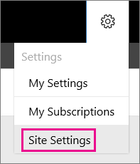

# Configure a Native Mode Report Server for Local Administration (SSRS)
  Deploying a [!INCLUDE[ssRSnoversion](../../includes/ssrsnoversion-md.md)] report server on one of the following operating systems requires more configuration steps if you want to administer the report server instance locally. This topic explains how to configure the report server for local administration. If you have not yet installed or configured the report server, see [Install SQL Server from the Installation Wizard &#40;Setup&#41;](../../database-engine/install-windows/install-sql-server-from-the-installation-wizard-setup.md) and [Manage a Reporting Services Native Mode Report Server](../../reporting-services/report-server/manage-a-reporting-services-native-mode-report-server.md).  
  
||  
|-|  
|**[!INCLUDE[applies](../../includes/applies-md.md)]**  [!INCLUDE[ssRSnoversion](../../includes/ssrsnoversion-md.md)] Native mode|  
  
-   [!INCLUDE[winserver2012r2](../../includes/winserver2012r2-md.md)]  
  
-   [!INCLUDE[win81](../../includes/win81-md.md)]  
  
-   [!INCLUDE[win8](../../includes/win8-md.md)]  
  
-   [!INCLUDE[winserver2012](../../includes/winserver2012-md.md)]  
  
-   [!INCLUDE[winserver2008r2](../../includes/winserver2008r2-md.md)]  
  
-   [!INCLUDE[win7](../../includes/win7-md.md)]  
  
-   [!INCLUDE[winserver2008](../../includes/winserver2008-md.md)]  
  
 Because the noted operating systems limit permissions, members of the local Administrators group run most applications as if they are using the Standard User account.  
  
 While this practice improves the overall security of your system, it prevents you from using the predefined, built-in role assignments that Reporting Services creates for local administrators.  
  
-   [Overview of Configuration Changes](#bkmk_configuraiton_overview)  
  
-   [To Configure Local Report Server and the web portal Administration](#bkmk_configure_local_server)  
  
-   [To Configure SQL Server Management Studio (SSMS) for local report server administration](#bkmk_configure_ssms)  
  
-   [To Configure SQL Server Data Tools (SSDT) to Publish to a Local Report Server](#bkmk_configure_ssdt)  
  
-   [Additional Information](#bkmk_addiitonal_informaiton)  
  
##   Overview of configuration changes  
 The following configuration changes configure the server so that you can use standard user permissions to manage report server content and operations:  
  
-   Add [!INCLUDE[ssRSnoversion](../../includes/ssrsnoversion-md.md)] URLs to trusted sites. By default, Internet Explorer running on the listed operating systems runs in **Protected Mode**, a feature that blocks browser requests from reaching high-level processes that run on the same computer. You can disable protected mode for the report server applications by adding them as Trusted Sites.  
  
-   Create role assignments that grant you, the report server administrator, permission to manage content and operations without having to use the **Run as administrator** feature on Internet Explorer. By creating role assignments for your Windows user account, you gain access to a report server with Content Manager and System Administrator permissions through explicit role assignments that replace the predefined, built-in role assignments that Reporting Services creates.  
  
##   To configure local Report Server and web portal administration  
 Complete the configuration steps in this section if you are browsing to a local report server and you see errors similar to the following:  
  
-   User `'Domain\[user name]`' does not have required permissions. Verify that sufficient permissions have been granted and Windows User Account Control (UAC) restrictions have been addressed.  
  
###   Trusted Site settings in the browser  
  
1.  Open a browser window with Run as administrator permissions. From the **Start** menu, right-click **Internet Explorer**, and select **Run as administrator**.  
  
2.  Select **Yes** when prompted to continue.  
  
3.  In the URL address, enter the web portal URL. For instructions, see [The web portal of a report server &#40;SSRS Native Mode&#41;](../../reporting-services/web-portal-ssrs-native-mode.md).  
  
4.  Click **Tools**.  
  
5.  Click **Internet Options**.  
  
6.  Click **Security**.  
  
7.  Click **Trusted Sites**.  
  
8.  Click **Sites**.  
  
9. Add `https://<your-server-name>`.  
  
10. Clear the check box **Require server certification (https:) for all sites in this zone** if you are not using HTTPS for the default site.  
  
11. Click **Add**.  
  
12. Select **OK**.  
  
###   Web portal folder settings  
  
1.  In the web portal, on the Home page, click **Manage folder**.  
  
2.  In the **Manage** folder page, click **Security** and then select **Add group or user**.  
  
3.  In the **New Role Assignment** page, in the **Group or user** field, type your Windows user account in this format: `<domain>\<user>`.  
  
5.  Select **Content Manager**.  
  
6.  Select **OK**.  
  
###   Web portal site settings  
  
1.  Open your browser with administrative privileges and browse to web portal, `https://<server name>/reports`.  
  
2.  Select the gear icon on the top row the Home page and then **Site Settings** from the dropdown menu. 
  
    .

    > [!TIP]  
    > If you do not see the **Site Settings** option, close and reopen your browser and browse to web portal with administrative privileges.  
  
3.  On the Site settings page, select **Security** and then select **Add group or user**.  
  
4.  In the **Group or user name** field, type your Windows user account in this format: `<domain>\<user>`.  

5.  Select **System Administrator**.  
  
6.  Select **OK**.  
  
7.  Close web portal.  
  
8. Re-open the web portal in Internet Explorer, without using **Run as administrator**.  
  
##   To configure SQL Server Management Studio (SSMS) for local report server administration  
 By default, you cannot access all of the report server properties available in [!INCLUDE[ssManStudioFull](../../includes/ssmanstudiofull-md.md)] unless you start [!INCLUDE[ssManStudio](../../includes/ssmanstudio-md.md)] with administrative privileges.  
  
 **To configure [!INCLUDE[ssRSnoversion](../../includes/ssrsnoversion-md.md)]** role properties and role assignments so you do not need to start [!INCLUDE[ssManStudio](../../includes/ssmanstudio-md.md)] with elevated permissions each time:  
  
-   From the **Start** menu, right-click **Microsoft SQL Server [!INCLUDE[ssManStudio](../../includes/ssmanstudio-md.md)]**, and then click **Run as administrator**.  
  
-   Connect to your local [!INCLUDE[ssRSnoversion](../../includes/ssrsnoversion-md.md)] server.  
  
-   In the **Security** node, click **System Roles**.  
  
-   Right-click **System Administrator** and then click **Properties**.  
  
-   In the **System Role Properties** page, select **View report server properties**. Select any other properties you want associated with members of the system administrators role.  
  
-   Click **OK**.  
  
-   Close [!INCLUDE[ssManStudio](../../includes/ssmanstudio-md.md)]  
  
-   To add a user to the system role "system administrator", see the [Web portal Site Settings](#bkmk_configure_site_settings) section earlier in this article.  
  
 Now when you open [!INCLUDE[ssManStudio](../../includes/ssmanstudio-md.md)] and do not explicitly select **Run as administrator** you have access to the report server properties.  
  
##   To configure SQL Server Data Tools (SSDT) to publish to a local report server  
 If you installed [!INCLUDE[ssBIDevStudio](../../includes/ssbidevstudio-md.md)] on one of the operating systems listed in the first section of this topic, and you want SSDT to interact with a local Native mode report server, you will experiences permission errors unless you open [!INCLUDE[ssBIDevStudioFull](../../includes/ssbidevstudiofull-md.md)] with elevated permissions or configure reporting services roles. For example, if you do not have sufficient permissions, you experience issues similar to the following:  
  
-   When you attempt to deploy report items to the local report server, you see an error message similar to the following in the **Error List** window:  
  
    -   The permissions granted to user 'Domain\\<user name\>' are insufficient for performing this operation.  
  
 **To run with elevated permissions each time you open SSDT:**  
  
1.  From the start menu, select **Microsoft SQL Server** and then right-click **SQL Server Data Tools**. Click **Run as administrator**  
  
2.  Select **Yes** when prompted to continue.  
  
You should now be able to deploy reports and other items to a local report server.  
  
 **To configure [!INCLUDE[ssRSnoversion](../../includes/ssrsnoversion-md.md)] role assignments so you do not need to start SSDT with elevated permissions each time:**  
  
-   See the [Web portal folder settings](#bkmk_configure_folder_settings) and [Web portal Site Settings](#bkmk_configure_site_settings) sections earlier in this topic.  
  
##   Additional information  
 An additional and common configuration step related to [!INCLUDE[ssRSnoversion](../../includes/ssrsnoversion-md.md)] administration is to open port 80 in Windows Firewall to allow access to the report server computer. For instructions, see [Configure a Firewall for Report Server Access](../../reporting-services/report-server/configure-a-firewall-for-report-server-access.md).  
  
## See also  
 [Manage a Reporting Services Native Mode Report Server](../../reporting-services/report-server/manage-a-reporting-services-native-mode-report-server.md)  
  
  
