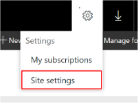

# Configure Report Builder Access

[!INCLUDE[ssrs-appliesto](../../includes/ssrs-appliesto.md)] [!INCLUDE[ssrs-appliesto-2016-and-later](../../includes/ssrs-appliesto-2016-and-later.md)] [!INCLUDE[ssrs-appliesto-pbirsi](../../includes/ssrs-appliesto-pbirs.md)]

Microsoft Report Builder is an ad hoc reporting tool that can be used with a [!INCLUDE[ssNoVersion](../../includes/ssnoversion-md.md)] [!INCLUDE[ssRSnoversion](../../includes/ssrsnoversion-md.md)] report server configured for either native mode or SharePoint integration mode.  

Access to Report Builder depends on the following factors:  

- Role assignments or permissions that make Report Builder available to individual users or groups.  

- Authentication settings that determine whether user credentials can be passed through to the report server.

## Prerequisites

The client computer must have [!INCLUDE[msCoName](../../includes/msconame-md.md)] [!INCLUDE[dnprdnshort](../../includes/dnprdnshort-md.md)] 4.6.1 or higher installed.

## Enabling and Disabling Report Builder  

Downloading Report Builder via the portal is enabled by default. Report server administrators have the option of disabling the Report Builder download by setting the report server system property **ShowDownloadMenu** to **false**. Setting this property will disable Report Builder, Mobile Report Publisher, Power BI Desktop, and Power BI Mobile downloads for that report server.  

 To set report server system properties, you can use Management Studio or script:  	

 - To use Management Studio, connect to the report server and use the Advanced Server Properties page to set **ShowDownloadMenu**to **false**. For more information about how to open this page, see [Set Report Server Properties &#40;Management Studio&#41;](../../reporting-services/tools/set-report-server-properties-management-studio.md).  	

 - To view a sample script that sets a report server property, see [Script Deployment and Administrative Tasks](../../reporting-services/tools/script-deployment-and-administrative-tasks.md).  

## Role Assignments granting Report Builder access on a native mode Report Server  

On a native mode report server, create user role assignments that include tasks for using Report Builder. You must be a Content Manager and System Administrator to create or modify role definitions and role assignments on items and at the site level.  

The following instructions assume that you're using predefined roles. If you modified the role definitions, check the roles to verify they contain the necessary tasks. For more information about creating role assignments, see [Grant user access to a report server](../../reporting-services/security/grant-user-access-to-a-report-server.md).

After you create the role assignments, users will have permission to do the following:  

- Users assigned to the System User and Browser roles can view published Report Builder reports on a report server, without having to launch Report Builder.  

- Users assigned to the System User and Report Builder roles can generate models, start Report Builder and create reports, and save reports to the report server.  

- Users assigned to the System User and Publisher roles can publish models from Model Designer to the report server. Models are used as data sources in Report Builder.  

- Users assigned to the System Administrator and Content Manager roles have full permissions to create, view, and manage Report Builder reports.  

### To verify required tasks are in the role definitions  

1. Start Management Studio and connect to the report server.  

2. Open the **Security** folder.  

3. Open the **System Roles** folder.  

4. Right-click **System Administrator**, and select **Properties**.  

5. Select **Execute report definitions** and click **OK**.  

6. Right-click **System User**, and select **Properties**.  

7. Select **Execute report definitions** and click **OK**.  

8. Open the **Roles** folder.  

9. Right-click **Browser**, and select **Properties**.  

10. Select **View models** and click **OK**.  

11. Right-click **Content Manager**, and select **Properties**.  

12. Select **View models**, **Manage models**, **Consume reports**, and click **OK**.  

13. Right-click **Publisher**, and select **Properties**.  

14. Select **Manage models** and click **OK**.  

15. Create the Report Builder role if it does not exist:  

    1. Open the **Security** folder.  

    2. Right-click **Roles**, and select **New Role**.  

    3. In Name, type **Report Builder**.  

    4. In Description, enter a description for the role so that users in the web portal know what the role is for.  

    5. Add the following tasks: **Consume reports**, **View reports**, **View models**, **View resources**, **View folders**, and **Manage individual subscription**s.  

    6. Click **OK** to save the role.  

#### To create role assignments that grant access to Report Builder  

1. Start the web portal.  

2. Click the gear icon on the top right of the web portal home page and select **Site Settings** from the drop-down menu.  

3. Click **Security**.  

4. If a role assignment already exists for the user or group for which you want to configure Report Builder access, click **Edit**.  
Otherwise, click **New Role Assignment**. In Group or user, enter a Windows domain user or group account in this format: \<domain>\\<account\>. If you're using forms authentication or custom security, specify the user or group account in the format that is correct for your deployment.  

5. Select **System User**, and then click **OK**.  

6. Click **Home**.  

7. Click the **Folder Settings** tab.  

8. Click the **Security** tab.  

9. If a role assignment already exists for the user or group for which you want to configure Report Builder access, click **Edit**.  

    Otherwise, click **New Role Assignment**. In Group or user, enter a Windows domain user or group account in this format: \<domain>\\<account\>. If you're using forms authentication or custom security, specify the user or group account in the format that is correct for your deployment.  

10. Select **Report Builder**, and then click **Apply**.  

11. Repeat to create or modify role assignments for additional users or groups.  

## Permissions granting Report Builder access on a SharePoint integrated mode Report Server  

On a SharePoint integrated mode report server, Report Builder access is granted to SharePoint users who have either Contribute or Full Control permission levels.  

If you use custom permission levels, you must include Add Items and Edit Items in the permission level. For more information about Report Builder access through built-in permission levels, see [Use Built-in Security in Windows SharePoint Services for Report Server Items](../../reporting-services/security/use-built-in-security-in-windows-sharepoint-services-for-report-server-items.md). For more information about permission requirements for custom permission levels, see [Set Permissions for Report Server Operations in a SharePoint Web Application](../../reporting-services/security/set-permissions-for-report-server-operations-in-a-sharepoint-web-application.md).  

## Authentication considerations and credential reuse  

- Report Builder opens its own connection to a report server. If you're not using Windows integrated security with single sign-on, users must re-type their credentials for the Report Builder connection to the report server.  

## See also  

- [Authentication with the Report Server](../../reporting-services/security/authentication-with-the-report-server.md)
- [Browser Support for Reporting Services](../../reporting-services/browser-support-for-reporting-services-and-power-view.md)
- [Start Report Builder](../../reporting-services/report-builder/start-report-builder.md)
- [The web portal of a report server (SSRS Native Mode)](../web-portal-ssrs-native-mode.md)
- [Connect to a Report Server in Management Studio](../../reporting-services/tools/connect-to-a-report-server-in-management-studio.md)
- [Report Server System Properties](../../reporting-services/report-server-web-service/net-framework/reporting-services-properties-report-server-system-properties.md)
