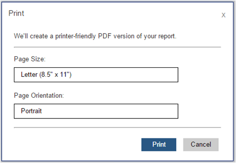
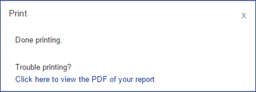
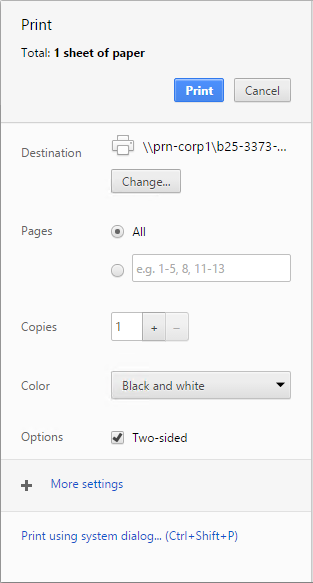
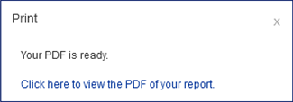
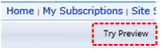
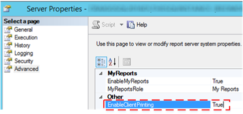

# Enable and Disable Client-Side Printing for Reporting Services

  The print button on the report viewer toolbar uses the Portable Document Format (PDF) format for client-side printing of [!INCLUDE[ssRSnoversion](../../includes/ssrsnoversion-md.md)] reports viewed in a browser. The new remote printing experience uses the PDF rendering extension that is included with [!INCLUDE[ssRSnoversion](../../includes/ssrsnoversion-md.md)], to render the report in PDF format. You can download a .PDF form of the report or if you have an application installed for viewing .PDF files, the print button displays a print dialog box for page common configuration items such as page size an orientation and a preview of the .PDF file. Although client-side printing is enabled by default, you can disable the feature to prevent it from being used.  
  
 Previous versions of [!INCLUDE[ssRSnoversion](../../includes/ssrsnoversion-md.md)] used an ActiveX control that required downloading to the client computer from the report server. If you upgrade your report server to SQL Server 2016 or later, the print control is not removed from the report server or client computers.  

##  <a name="bkmk_clientside_printexpereince"></a> The Print Experience  
 When you click the print  button on the report viewer toolbar, the experience varies depending on what  .PDF viewing applications are installed on the client computer and what browser you are using.   You can download the PDF file or configure print options from a dialog, or both, depending on the client computer.  
  
   
  
|Interaction|User interface|  
|-|-|  
|The first dialog is the same for all browsers and allows you change basic layout properties such as orientation. When you click **Print**, the experience will be slightly different depending on the browser you are using.||  
|In Chrome, a detailed browser print dialog opens.   You can change the print configuration,  print, and open the operating systems print dialog.| |  
|If you have a PDF reader application installed, the print button will open a preview window of the PDF file and you can save or print.| |  
|If you do not have a PDF reader application installed, there are two user experiences:<br /><br /> The report will automatically render and use your browsers  download process to download the PDF file.   **Note:** The more complicated the report is, the longer the delay between the time you click **Print** and when you see your browsers download notification. You can also force the download again by clicking **Click here to view the PDF of your report.**.<br /><br /> Force the PDF download by clicking **Click here to view the PDF of your report.**.||  
  
##  <a name="bkmk_troubleshoot_clientsideprinting"></a> Troubleshoot Client-Side Printing  
 If the print button the report viewer toolbar is disabled, verify the following:  
  
-   Client-side printing is disabled for the report server in [!INCLUDE[ssManStudio](../../includes/ssmanstudio-md.md)]. See the section  [Enable and Disable Client-Side Printing](#bkmk_enable) in this topic.  
  
-   The [!INCLUDE[ssRSCurrent](../../includes/ssrscurrent-md.md)] PDF rendering extension is disabled. Review the `<Extension Name="PDF"` section of the **rsreportserver.config** file.  
  
-   You are viewing the reporting in comparability mode, which uses the old [!INCLUDE[ssRSCurrent](../../includes/ssrscurrent-md.md)] HTML4 rendering engine. The PDF printing experience requires the HTML 5 rendering engine.  Click the **Try Preview** button on the toolbar.  
  
       
  
##  <a name="bkmk_enable"></a> Enable and Disable Client-Side Printing  
 Report server administrators have the option of disabling the remote print feature by setting the report server system property **EnableClientPrinting** to **false**. This will disable client-side printing for all reports managed by that server. By default, **EnableClientPrinting** is set to **true**. You can disable client-side printing in the following ways:  
  
-   For a **Native mode report server**:  
  
    1.  Start [!INCLUDE[ssManStudio](../../includes/ssmanstudio-md.md)] with administrative privileges.  
  
    2.  Connect to a report server instance in [!INCLUDE[ssManStudio](../../includes/ssmanstudio-md.md)].  
  
    3.  Right-click the report server node, and then click **Properties**. If the **Properties** option is disabled, verify you started [!INCLUDE[ssManStudio](../../includes/ssmanstudio-md.md)] with administrative privileges.  
  
    4.  Click **Advanced**.  
  
    5.  Select **EnableClientPrinting**.  
  
    6.  Set to True or False and then Click **OK**.  
  
           
  
-   For a **SharePoint mode report server**:  
  
    1.  In SharePoint Central Administration, click **Application Management**.  
  
    2.  Click **Manage service applications**.  
  
    3.  Click the name of your [!INCLUDE[ssRSnoversion](../../includes/ssrsnoversion-md.md)] service application, and then click **Manage** in the SharePoint ribbon.  
  
    4.  Click **System Settings**.  
  
    5.  Select **Enable Client Printing**. The **Enable Client Printing** option is near the bottom of the page.  
  
    6.  Click **OK**.  
  
-   Write script or code to set the report server system property **EnableClientPrinting** to **false.**  
  
 The following sample script illustrates one approach for disabling client-side printing. Compile and then run the following [!INCLUDE[msCoName](../../includes/msconame-md.md)] [!INCLUDE[vbprvb](../../includes/vbprvb-md.md)] code to set the **EnableClientPrinting** property to **False**. After you run the code, restart IIS.  
  
### Sample Script  
  
```  
Imports System  
Imports System.Web.Services.Protocols  
Class Sample  
   Public Shared Sub Main()  
Dim rs As New ReportingService()  
      rs.Credentials = System.Net.CredentialCache.DefaultCredentials  
        Dim props(0) As [Property]  
        Dim setProp As New [Property]  
        setProp.Name = "EnableClientPrinting"  
        setProp.Value = "False"   
        props(0) = setProp  
        Try  
            rs.SetSystemProperties(props)  
        Catch ex As System.Web.Services.Protocols.SoapException  
            Console.Write(ex.Detail.InnerXml)  
        Catch e as Exception  
            Console.Write(e.Message)  
        End Try  
    End Sub 'Main  
End Class 'Sample  
```

More questions? [Try asking the Reporting Services forum](https://go.microsoft.com/fwlink/?LinkId=620231)
