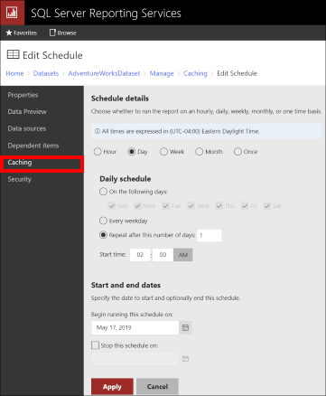
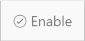

# Preload the cache  
  You can preload the cache for a shared dataset by creating a cache refresh plan for the shared dataset.  
  
 You can preload the cache for a report in two ways:  
  
1.  Create a cache refresh plan for the report. This is the preferred method.  
  
2.  Use a data-driven subscription to preload the cache with instances of parameterized reports. This was the only way to preload the cache in versions of [!INCLUDE[ssRSnoversion](../../includes/ssrsnoversion-md.md)] earlier than [!INCLUDE[ssKilimanjaro](../../includes/sskilimanjaro-md.md)]. For more information, see [Caching Reports &#40;SSRS&#41;](../../reporting-services/report-server/caching-reports-ssrs.md).  
  
 The following conditions must be met before you can cache a report or a shared dataset:  
  
-   The shared dataset or the report must have caching enabled.  
  
-   The shared data sources for the shared dataset or the report must be configured to use stored credentials or no credentials.  
  
-   The [!INCLUDE[ssNoVersion](../../includes/ssnoversion-md.md)] Agent service must be running.  
  
## To preload the cache by creating a cache refresh plan  
  
1. Start the [web portal of a report server](../../reporting-services/web-portal-ssrs-native-mode.md "The web portal of a report server").  
  
2. Select **Browse** from the Home screen and navigate the folder hierarchy to locate the item that you want to cache.  
  
3. Select the ellipsis in the top-right corner of the item, then select **Manage** from the drop-down menu.  
  
4. Select the **Caching** tab in the vertical menu on the left.  
  
5. To activate caching for a dataset, select the **Cache copies of this dataset and use them when available** radio button. The  **Cache expiration** section then appears beneath it. Select one of the following radio buttons:

    - **Cache expires after x minutes** (enter the desired number of minutes for x).
    - **Cache expires on a schedule**.  Reporting Services provides shared schedules and report-specific schedules to help you control processing, consistent content, and the performance of report distribution. For more information, see [Create, Modify, and Delete Schedules](../../reporting-services/subscriptions/create-modify-and-delete-schedules.md "Create, Modify, and Delete Schedules"). You have several options on how to create a schedule, in this case for cache expiration:
    Select one of the two scheduling choices below:  
      - **Shared schedule** radio button, and then select a schedule from the **Select a shared schedule** dropdown textbox. For more information, see [Schedules](../../reporting-services/subscriptions/schedules.md "Schedules").  
      - **Report-specific schedule** radio button, then select the **Edit schedule** link if necessary to display the *Schedule details* page.  

         

          On this page you can select:
         - The type of schedule:
           - **Hour** - run the schedule every: specify hours and minutes and the start time.
           - **Day** - select one of the three choices below:  
              - **On the following days**: (Sun, Mon, Tue, Wed, Thu, Fri, Sat).
              - **Every weekday**
              - **Repeat after this number of days** - specify a number.  
           - **Week** - specify both of the following two items:
              - **Repeat after this number of weeks** - specify a number.  
              - **On days** - pick the days of the week to run it.  
           - **Month** - which month(s), with a choice of:
              - **On week of the month**,  
                 - Select (1st, 2nd, 3rd, 4th or Last) from the dropdown box.  
                 - **On day of the week** to run it. Select one or more of the check boxes (Sun, Mon, Tue, Wed, Thu, Fri, Sat).  
                 - **On calendar day(s)** -  Enter the actual day number of the month separated  by commas, or a range of days separated by a dash, or any combination of both  (e.g. 1,3-5).  
           - **Once** - a single occurrence.  
         - **Start time** - the time of the day for the schedule to start.  
         - **Start and end dates** - Specify the start date and optionally the end date of the schedule.
         - Select **Apply** to save the schedule.  
           > [!NOTE]
           > If the item does not have caching enabled, you will be prompted to enable caching. To enable caching, select **OK**.  

         - Select **Create cache refresh plan** to create / save the cache plan.  
         The **Cache Refresh Plans** page opens on the screen. From here you can:
           - Add a new cache refresh plan.
           - Create a new cache refresh plan from an existing plan.
           - Refresh the cache refresh plans page.
           - Delete a plan.
           - Search for a plan by name.

         If no cache refresh plans have been saved yet, the list will be empty, and the "Add" choice will be the only available option. Select **+ New cache refresh plan** to add a new one, and the **New Cache Refresh Plan** page is displayed.  
           - Type a **Description** in the first text box to name the refresh plan.  
           - Select one of the following radio buttons in the **Refresh the cache on the following schedule**  
             - **Shared schedule** - select a shared schedule from the adjacent dropdown box. 
             - **Report-specific schedule** - Edit the schedule as in step 2.2 above by selecting the **Edit schedule** link if desired to display the *Schedule details* page. 
             - Select **Create cache refresh plan** to save the plan if adding, or **Apply** if editing the plan.  
      You are returned to the updated **Cache Refresh Plans** page.
  
## To preload the cache with a user-specific report by using a data-driven subscription

1. Start the [web portal of a report server](../../reporting-services/web-portal-ssrs-native-mode.md "The web portal of a report server").  
2. Select **Browse** from the Home screen and navigate the folder hierarchy to locate the report you want to subscribe to.  
3. Right-click the report, select **Subscribe** from the dropdown menu. The **New Subscriptions** page is displayed.  
4. Enter a description for the subscription in the **Description** text box.  
5. The **Type of subscription** radio button displays two options:  
   - **Standard subscription** - to generate and deliver one report
   - **Data-driven subscription** - to generate and deliver one report for each row in a dataset. This is the option you want to select to preload the cache.
6. In the **Schedule** section, select one of the following radio buttons:
   - **Shared schedule** - select a shared schedule from the dropdown box.  
   - **Report-specific schedule** - Edit the schedule as in step 2.2 above by selecting the **Edit schedule** link if desired to display the *Schedule details* page.  
7. The **Destination** section displays the following choices in a dropdown box:
    - **Windows File Share**
    - **E-Mail**
    - **Null Delivery Provider** - for this task, select Null delivery provider.  
8. In the **Dataset** section, edit or create a dataset for this report subscription by selecting the **Edit dataset** button.  
9. On the **Edit Dataset** page in the **data source** section, you choose the data source that contains the report parameter values and delivery options. Your choices are:  
   - **A shared data source** - select the ellipsis and select a shared data source from the *Shared Data Source* folder.
   - **A custom data source** - most likely. this is the option you will have to choose, unless you or someone else has already completed the steps below to create it as a shared data source.  
     - Specify the connection type, connection string, and credentials for accessing the data source that contains subscriber data. The following example illustrates a connection string used to connect to a SQL Server database named Subscribers.  
  
   ```T-SQL
   data source=<servername>;initial catalog=Subscribers  
   ```
  
10. In the **Query** section - specify the query that retrieves the desired subscriber data.  For example:  
  
    ```T-SQL  
    Select * from RptSubscribers  
    ```
  
    Optionally increase the time-out period for queries that take a long time to process.  
  
11. Select **Validate**. The query must be validated before you continue. When the **Validation successful** message appears, a list of Dataset fields will be  displayed below the **Validate** button. Select **Apply** to create the custom data source.  
  
12. You are returned to the **New Subscription** page.  In the **Report Parameters** section,  specify report parameter values for the report parameters displayed if any.  

13. Select **Create subscription**.  
  
14. The **Subscriptions** page is displayed showing your new Data-driven subscription. From this page, you can enable the subscription when you are ready by selecting the checkbox to the left of it, and selecting the **Enable** button. 

15. Specify when the subscription is processed. Don't choose **When the report data is updated on the report server**. That setting is for snapshots only. If you want to use a pre-existing schedule, select **On a shared schedule**.  
  
     Or, to create a custom schedule, select **On a schedule created for this subscription** and then select **Next**. Configure the schedule and then select **Finish**.  
  
    > [!NOTE]  
    > In order for the subscribers to receive the newest report, the schedule that you configure should be consistent with the report delivery schedule that you have defined for the subscribers. For more information, see the [web portal of a report server (SSRS Native Mode)](../web-portal-ssrs-native-mode.md).
  
16. Configure the Execution options for the report as follows. On the report page, select the **Properties** tab.  
  
17. In the left frame, select the **Execution** tab.  
  
18. On the page, select **Render this report with the most recent data**.  
  
19. Choose one of the following two cache options and configure the expiration as follows:  
  
    - To make the cached copy expire after a particular time period, select **Cache a temporary copy of the report. Expire copy of report after a number of minutes.** Type the number of minutes for report expiration.  
  
    - To make the cached copy expire on a schedule, select **Cache a temporary copy of the report. Expire copy of report on the following schedule.** Select **Configure**, or select a shared schedule to set a schedule for report expiration.  
  
20. Select **Apply**.
  
## See also  

 [Data-Driven Subscriptions](../../reporting-services/subscriptions/data-driven-subscriptions.md)  
 [Create a Data-Driven Subscription &#40;SSRS Tutorial&#41;](../../reporting-services/create-a-data-driven-subscription-ssrs-tutorial.md)  
 [Performance, Snapshots, Caching &#40;Reporting Services&#41;](../../reporting-services/report-server/performance-snapshots-caching-reporting-services.md)  
 [Set Report Processing Properties](../../reporting-services/report-server/set-report-processing-properties.md)  
 [Caching Reports &#40;SSRS&#41;](../../reporting-services/report-server/caching-reports-ssrs.md)  
 [Working with shared datasets](../../reporting-services/work-with-shared-datasets-web-portal.md)  
  
