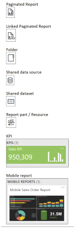

# Report Server Content Management (SSRS Native Mode)
In [!INCLUDE[ssRSnoversion](../../includes/ssrsnoversion-md.md)], content management refers to the management of report server items. All items can be managed independently of each other through properties and security settings. Any item can be moved to a different location in the report server folder namespace. To manage items effectively, you need to know which tasks a content manager performs. Starting in SQL Server 2016 Reporting Services or later (SSRS) CTP 3.2, the [!INCLUDE[ssRSnoversion](../../includes/ssrsnoversion-md.md)] web portal is available. This article will look at the web portal and the new web portal experience.  
  
> [!NOTE]  
> Content management is different from report server administration. For more information about how to manage the environment in which a report server runs, see [Reporting Services Report Server &#40;Native Mode&#41;](../../reporting-services/report-server/reporting-services-report-server-native-mode.md).  
  
 Content management includes the following tasks:  
  
-   Secure report server site and items by applying the role-based security provided with [!INCLUDE[ssRSnoversion](../../includes/ssrsnoversion-md.md)].  
  
-   Create a report server folder hierarchy by adding, modifying, and deleting folders.  
  
-   Set default values and properties that apply to items managed by the report server. For example, you can set baseline maximum values that determine report history storage policies.  
  
-   Create shared data source items that can be used in place of report-specific data source connections. A publisher or content manager can select a data source that is different from the one originally defined for a report; for example, to replace a reference to a test database with a reference to a production database.  
  
-   Create shared schedules that can be used in place of report-specific and subscription-specific schedules, making it easier to maintain schedule information over time.  
  
-   Create data-driven subscriptions that generate recipient lists by retrieving data from a data store.  
  
-   Balance report-processing demands that are placed on the server by scheduling report processing and specifying which ones can be run on demand and which ones are loaded from cache.  
  
-   Provide permission to perform management tasks by using predefined roles: **System Administrator** and **Content Manager**. Effective management of report server content requires that you are assigned to both roles.  
  
Tools for managing report server content include [!INCLUDE[ssManStudio](../../includes/ssmanstudio-md.md)], and the web portal. [!INCLUDE[ssManStudio](../../includes/ssmanstudio-md.md)] allows you to set defaults and enable features. The web portal is used to grant user access to report server items and operations, view and use reports and other content types, and view and use all shared items and report distribution features. The web portal is a updated site that allows for much of the functionality of the deprecated Report Manager. For more information, see [Reporting Services Tools](../../reporting-services/tools/reporting-services-tools.md).  
  
##  <a name="bkmk_ReportServerItems"></a> Report Server items  
 Report server items include reports, shared data sources, shared datasets, resources (items that are stored on but not processed by a report server), and folders. Items can depend on other items, for example, a report can depend on the shared data sources it references. If you move a dependent item, the report server updates the reference information automatically.  
  
 You can move report server items to different folder locations in the report server folder hierarchy. When you move an item, all properties (including security settings) move with the item to the new location. When you move a folder, all the items in the folder move with it.  
  
> [!NOTE]  
>  For CTP 3.2, if you want to move the location of an item, you need to perform that action in the web portal.  
  
 In the web portal, the items that you can move are indicated in the folder hierarchy. The following image shows the icon for each movable item.  
  
  

 Not all items that you work with can be moved. You cannot move items that are associated with a report, such as subscriptions or report history. Those items move with their associated reports. Similarly, you cannot move items, such as shared schedules, that exist outside of the folder hierarchy. You cannot move items if you lack permission to do so. Permission to move an item is conveyed when the following tasks are selected in your role assignment for the item in question: "Manage reports," "Manage folders," and "Manage data sources."  
  
##  <a name="bkmk_Folders"></a> Folders  
 A folder hierarchy is used for addressing items that are stored and managed by a report server.  By default, the folder structure consists of a root node named Home, and reserved folders that support the optional My Reports feature. Additional folders are user-defined. Report server folders are useful if you want to grant the same level of access to multiple items. Permissions that you set on the folder can be inherited by items in the folder and to additional folders that branch from that folder. For example, you can create a set of folders under the Home folder, assign team permissions to each folder, and then let team members customize folders under the team folder as needed.  
  
 If you are using a browser to connect directly to a report server, the root node of the folder structure is the name of the report server virtual directory. From the root node, you can create, modify, and delete folders as necessary to organize report server content. You can add content to a folder, move items between folders, modify folder names or locations, and delete folders that are no longer required.  
  
 Folders are virtual containers for published items that you access through the web portal or a browser connection to the report server. Neither the folders nor their contents actually exist in a file system. Instead, they are stored in the report server database and accessed through the Report Server Web service endpoint. The report server folder namespace is a hierarchy that includes a root node, predefined folders, and user-defined folders. The namespace uniquely identifies items that are stored on a report server. It provides an addressing scheme for specifying items in a URL. When you select or locate a report, the folder path becomes part of the URL for that report.  
  
 How you work with folders depends on tasks that are part of your role assignment. If you are using default security, Content Managers and Publishers can create and manage folders. If you use custom role assignments, the role assignment must include tasks that support folder management. For more information about role assignments and tasks, see [Granting Permissions on a Native Mode Report Server](../../reporting-services/security/granting-permissions-on-a-native-mode-report-server.md) and [Tasks and Permissions](../../reporting-services/security/tasks-and-permissions.md).  
  
 Report server folders can contain the following items:  
  
-   Reports  
  
-   Shared data sources  
  
-   Shared datasets  
  
-   Report Parts

    [!INCLUDE [ssrs-report-parts-deprecated](../../includes/ssrs-report-parts-deprecated.md)]
  
-   KPIs  
  
-   Mobile Reports  
  
-   Resources (items that are stored on but not processed by a report server)  
  
-   Other folders  
  
### Reserved folders  
 Predefined folders are reserved by Reporting Services; they cannot be moved, renamed, or deleted. User-defined folders include any folders created by a user or report server administrator with permission to add items to a folder.  
  
 The following table describes predefined folders that anchor the folder hierarchy and provide a framework for several features.  
  
|Folder|Purpose|  
|------------|-------------|  
|Home|The root node of the folder hierarchy.|  
|Users|This folder appears when you enable the My Reports feature. It contains subfolders for all users who use the My Reports feature, and it is accessible only to report server administrators. Each subfolder name matches the user's name.|  
|My Reports|Provides a personal workspace for each user.|  
  
### Creating folders  
 You can create a folder in any available folder in the hierarchy.  
  
 If you are creating folders for the purpose of restricting access to specific reports and models, you should specify role assignments that allow users to browse, but not view the contents of, parent folders that are in the folder path.  
  
### Modifying folder properties  
 After a folder is created, you can modify properties to rename the folder, add or modify the description, or move the folder to another location. These properties are available on the General properties page for the folder. For more information about setting properties that grant access to a folder, see [Secure Folders](../../reporting-services/security/secure-folders.md).  
  
### Deleting folders and folder contents  
 When you delete a folder, you delete all the items that it contains. Before you delete a folder, you should inspect its contents to determine whether it contains items that may be referenced or used by other items in another part of the folder hierarchy. Referenced items include report definitions that support linked reports, shared data sources, and resources.  
  
 If you delete a report that has one or more linked reports that reference it, the linked reports will become invalid after you delete the report. You cannot determine in advance which linked reports are affected, because a report does not retain information about linked reports that are based on it. You can, however, review the properties of a linked report to find out which report it is based on. In contrast, shared data source items list all reports that currently use the item so that you can easily determine whether the connection information is in use. For more information, see [Create, Modify, and Delete Shared Data Sources &#40;SSRS&#41;](../../reporting-services/report-data/create-modify-and-delete-shared-data-sources-ssrs.md). Finally, resources that are used by reports do not identify those reports.  
  
 Before you delete a folder, consider whether you need to retain the report history of any report you are about to delete or a report-specific construct (such as a data-driven subscription) that is part of a report. If you may need any of this information, move the item out of the folder before you delete the folder.  
  
 The visibility of an item in a folder depends on both role assignments (that is, permission to view an item) and viewing options in effect for a folder. In the web portal, you can set the Contents page to list view or details view. In some cases, a report or item may be hidden in list view. Be sure to view a folder in details view before deleting its contents.  
  
##  <a name="bkmk_Resources"></a> Resources  
 A resource is a managed item that is stored on a report server, but is not processed by a report server. Typically, a resource provides external content to report users. Examples include an image in a .jpg file, an ESRI shapefile that contains spatial data, or an HTML file that describes the business rules used in a report. The JPG, SHP, or HTML file is stored on the report server, but the report server passes the file directly to the browser rather than processing it first. For more information, see [Images &#40;Report Builder and SSRS&#41;](../../reporting-services/report-design/images-report-builder-and-ssrs.md) and the section "Adding Data to a Map" in [Maps &#40;Report Builder and SSRS&#41;](../../reporting-services/report-design/maps-report-builder-and-ssrs.md).  
  
### Adding and viewing a resource  
 To add a resource to a report server, you upload or publish a file:  
  
|Operation|File type|  
|---------------|---------------|  
|Upload|To upload a resource, you must use the web portal if the report server runs in native mode or an application page on a SharePoint site if the server runs in SharePoint integrated mode. For more information, see [Upload a File or Report in the Report Server](../../reporting-services/reports/upload-a-file-or-report-report-manager.md) or [Upload Documents to a SharePoint Library &#40;Reporting Services in SharePoint Mode&#41;](../../reporting-services/report-server-sharepoint/upload-documents-to-a-sharepoint-library-reporting-services-in-sharepoint-mode.md).|  
|Publish|All files in a project that are not reports, report parts, data sources, or datasets, are uploaded as resources. To publish a resource, add an existing item to a project in Report Designer and then publish the project to a report server.|  
  
 All resources originate as files on a file system, which are subsequently uploaded to a report server. Except for the 4 megabyte default file size limitations imposed by ASP.NET, there are no restrictions on the kinds of files you can upload. However, when published to a report server as a resource, file types that have equivalent MIME types are more optimal than others. For example, resources that are based on HTML and JPG files will open in a browser window when the user clicks the resource, rendering the HTML as a Web page and the JPG as an image that the user can see. In contrast, resources that do not have equivalent MIME types, such as desktop application files, for example, may not be rendered in the browser window.  
  
 Whether a resource can be viewed by report users depends on the viewing capabilities of the browser. Because resources are not processed by the report server, the browser must provide the viewing capability to render a specific MIME type. If the browser cannot render the content, users who view the resource see only the general properties of the resource.  
  
### Securing and managing a resource  
 Resources exist alongside reports, shared data sources, shared schedules, and folders as named items in the report server folder hierarchy. You can search for, view, secure, and set properties on resources just as you would any item stored on a report server. To view or manage a resource, you must have the View resources or Manage resources tasks in your role assignment.  
  
### Referencing an image resource from a report  
 Resources can contain an image that you reference in a report. If report requirements include the use of external images, consider the following advantages to storing the image as a resource:  
  
-   Centralized storage in the report server database. If you move the report server database and its contents to another computer, the external image stays with the report. You do not have to keep track of image files that are stored on disk on different computers.  
  
-   Secured through role assignments rather than file system security. The same permissions used to view a report can be applied to the resource. In contrast, if you store the image on disk, you must ensure that either the Anonymous user account or the unattended execution account have permission to access the file.  
  
 To use an image resource in a report, add the image file to the project and publish it along with the report. Once the image is published, you can update the image reference in the report so that it points to the resource on the report server, and then republish just the report to save your changes. You can now subsequently update the image independently of the report by republishing the resource. The report uses the most current version of the image available on the report server.  
  
 For more information, see [Update a Resource (web portal)](../../reporting-services/report-server/update-a-resource-report-manager.md).  
  
##  <a name="bkmk_MyReports"></a> My Reports  
 The My Reports folder is a personal workspace for each user who logs in to a report server with a valid domain account. This special-purpose folder provides storage for work-in-progress reports, reports that are not intended for wide distribution, or reports that have been modified to fit a need. You cannot restrict the number or size of items that are stored in a My Reports folder, or configure a My Reports folder to be shared among users.  
  
 Technically, My Reports maps the name of a virtual folder that each user sees (My Reports) to a master Users Folders folder and unique subfolder based on user name. When a user accesses his or her My Reports folder, the user is actually redirected to his or her subfolder under Users Folders. Each subfolder provides storage for the reports and items a user adds to his or her My Reports folder. In the web portal, you will not see My Reports at the root level. You will need to drill into the Users folder.  
  
 The Users Folders folder is created when the report server is installed. Subsequent user-based subfolders are created when a user opens My Reports for the first time (for example, by clicking My Reports in the web portal). Each folder name is in the following format:  
  
```  
/Users Folders/<username>/My Reports  
```  
  
 Only users with valid system accounts are allocated folders. If a user name contains special characters, it is created with escape character equivalents. Escape character equivalents are listed in the following table.  
  
|Character|Escape value|Example|  
|---------------|------------------|-------------|  
|(space)|[ ]|*Firstname Lastname* becomes *Firstname[ ]Lastname*|  
|\ (backslash)|Replaced with a single space character|*DomainName\Username* becomes *DomainName Username*|  
|@ (at symbol)|[at]|*username*@hotmail.com becomes *username*[at]hotmail.com|  
|& (ampersand)|[amp]|*username*@*company*&*company.com* becomes *username*[at]*company*[amp]*company.com*|  
|$ (dollar sign)|[dollar]|*User* $*Name* becomes *User*[ ][dollar]*Name*|  
  
 The My Reports feature is optional. When you install a report server, My Reports is disabled by default. For more information about enabling this feature, see [Enable and Disable My Reports](../../reporting-services/report-server/enable-and-disable-my-reports.md). For more information, see [Secure My Reports](../../reporting-services/security/secure-my-reports.md).  
  
## Tasks  
 [Upload Files to a Folder](../../reporting-services/report-server/upload-files-to-a-folder.md)  
 [Create, Delete, or Modify a Folder (web portal)](../../reporting-services/report-server/create-delete-or-modify-a-folder-web-portal.md)  
 [Update a Resource (web portal)](../../reporting-services/report-server/update-a-resource-report-manager.md)  
 [Upload Files to a Folder](../../reporting-services/report-server/upload-files-to-a-folder.md)  
  
## See also  
 [Reporting Services Tools](../../reporting-services/tools/reporting-services-tools.md)   
 [Roles and Permissions &#40;Reporting Services&#41;](../../reporting-services/security/roles-and-permissions-reporting-services.md)   
 [Reporting Services Reports &#40;SSRS&#41;](../../reporting-services/reports/reporting-services-reports-ssrs.md)  
  