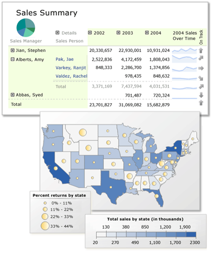

# Reporting Services Reports (SSRS)
  [!INCLUDE[ssNoVersion](../../includes/ssnoversion-md.md)] [!INCLUDE[ssRSnoversion](../../includes/ssrsnoversion-md.md)] paginated reports are XML-based report definitions that include report data and report layout elements. On a client file system, report definitions have the file extension .rdl. After you publish a paginated report, it is a report item stored on the report server or SharePoint site. Paginated reports are one part of the server-based reporting platform provided by [!INCLUDE[ssRSnoversion](../../includes/ssrsnoversion-md.md)]. You can also [Create mobile reports with SQL Server Mobile Report Publisher](../../reporting-services/mobile-reports/create-mobile-reports-with-sql-server-mobile-report-publisher.md).  
  
 If you are new to [!INCLUDE[ssRSnoversion](../../includes/ssrsnoversion-md.md)], be sure to review the information in [Reporting Services Concepts &#40;SSRS&#41;](../../reporting-services/reporting-services-concepts-ssrs.md).  
  
## Benefits of Reporting Services Paginated Reports  
 You can use [!INCLUDE[ssRSnoversion](../../includes/ssrsnoversion-md.md)] report solutions to:  
  
-   Use one set of data sources that provide a single version of the facts. Base reports on those data sources to provide a unified view of data to help make business decisions.  
  
-   Visualize your data in multiple, interconnected ways by using data regions. Display data organized in tables, matrices or cross-tabs, expand/collapse groups, charts, gauges, indicators or KPIs, and maps, with the ability to nest charts in tables.  
  
-   View reports for your own use or publish reports to a report server or SharePoint site to share with your team or organization.  
  
-   Define a report once and display it in a variety of ways. You can export the report to multiple file formats, or deliver the report to subscribers as e-mail or to a shared file. You can create multiple linked reports that apply separate parameter sets to the same report definition.  
  
-   Use report parts, shared data sources, shared queries, and subreports to define data visualizations for re-use.  
  
-   Manage report data sources separately from the report definition. For example, you can change from a test data source to a production data source without changing the report.  
  
-   Design reports in a free-form layout. Report layout is not restricted to bands of information. You can organize data display on the page in a way that promotes understanding, insight, and action.  
  
-   Enable drillthrough actions, expand/collapse toggles, sort buttons, Tooltips, and report parameters to enable report reader interactions with the report. Use report parameters combined with expressions that you write to enable report readers to control how data is filtered, grouped, and sorted.  
  
-   Define expressions that provide you with the ability to customize how report data is filtered, grouped, and sorted.  
  
   
  
##   Stages of Report Processing  
 When you create a report, you define a report definition file (.rdl) in XML format. This file contains all the information that is needed to combine report data and report layout by the report processor. When you view a report, the report progresses through the following stages:  
  
-   **Compile.** Evaluate expressions in the report definition and store the compiled intermediate format internally on the report server.  
  
-   **Process.** Run dataset queries, and combine intermediate format with data and layout.  
  
-   **Render.** Send processed report to a rendering extension to determine how much information fits on each page and create the paged report.  
  
-   **Export (optional).** Export the report to a different file format.  
  
 For more information, see [Stages of reports](../../reporting-services/reporting-services-concepts-ssrs.md#bkmk_StagesofReports) in [Reporting Services Concepts &#40;SSRS&#41;](../../reporting-services/reporting-services-concepts-ssrs.md).  
  
## Create Paginated Reports  
 To create a paginated report:  
  
-   **Determine the purpose of report.** Identify the purpose of the report for the audience that uses it. A well-designed report provides information to report readers that leads to insight and action. Design decisions made during this step influence your choice of report parameters, report layout design, and report viewing experience. For more information, see [Planning a Report &#40;Report Builder&#41;](../../reporting-services/report-design/planning-a-report-report-builder.md) and [Report Design Tips &#40;Report Builder and SSRS&#41;](../../reporting-services/report-design/report-design-tips-report-builder-and-ssrs.md).  
  
-   **Choose the type of query.** Determine whether to use a generalized, shared dataset query or a dataset query specific to your set of reports. A shared dataset with a generalized query is easy to maintain for use by multiple reports, but each report designer must filter the data as needed for their specific set of reports. For more information, see [Report Data &#40;SSRS&#41;](../../reporting-services/report-data/report-data-ssrs.md).  
  
-   **Plan for views of related data.** Plan the viewing experience for your report readers. Summary reports with the ability to drill down into detail data is a useful approach to handling large amounts of data. For more information, see [Drillthrough, Drilldown, Subreports, and Nested Data Regions &#40;Report Builder and SSRS&#41;](../../reporting-services/report-design/drillthrough-drilldown-subreports-and-nested-data-regions.md).  
  
-   **Configure permissions.** Plan the strategy for granting the right level of permissions. A common strategy is to create a folder structure on the report server and grant access to reports and report related items based roles and folder security. For more information, see [Secure Reports](#bkmk_SecureReportsSummary).  
  
-   **Choose an authoring environment.** Authoring tools vary support for features. For more information, see [Reporting Services Tools](../../reporting-services/tools/reporting-services-tools.md).  
  
-   For each report:  
  
    -   **Identify sources of data.** Define report data sources, one for each source of data. For more information, see [Data Connections, Data Sources, and Connection Strings &#40;Report Builder and SSRS&#41;](../../reporting-services/report-data/data-connections-data-sources-and-connection-strings-report-builder-and-ssrs.md).  
  
    -   **Choose which data to use from each source.** For each data source, define report datasets. Each dataset includes a query to specify which data to use. If you have report parameters, define a dataset to populate the available values list for each parameter. For more information, see [Report Datasets &#40;SSRS&#41;](../../reporting-services/report-data/report-datasets-ssrs.md) and [Report Parameters &#40;Report Builder and Report Designer&#41;](../../reporting-services/report-design/report-parameters-report-builder-and-report-designer.md).  
  
    -   **Choose a data visualization.** For each dataset, choose which data region to use for displaying the data. Choose from list of tables, charts, gauges, and maps. For more information, see the following topics:  
  
        -   [Tables, Matrices, and Lists &#40;Report Builder and SSRS&#41;](../../reporting-services/report-design/tables-matrices-and-lists-report-builder-and-ssrs.md)  
  
        -   [Charts &#40;Report Builder and SSRS&#41;](../../reporting-services/report-design/charts-report-builder-and-ssrs.md)  
  
        -   [Sparklines and Data Bars &#40;Report Builder and SSRS&#41;](../../reporting-services/report-design/sparklines-and-data-bars-report-builder-and-ssrs.md)  
  
        -   [Indicators &#40;Report Builder and SSRS&#41;](../../reporting-services/report-design/indicators-report-builder-and-ssrs.md)  
  
        -   [Maps &#40;Report Builder and SSRS&#41;](../../reporting-services/report-design/maps-report-builder-and-ssrs.md)  
  
        -   [Gauges &#40;Report Builder and SSRS&#41;](../../reporting-services/report-design/gauges-report-builder-and-ssrs.md)  
  
    -   **Customize the data and layout.** Design the report layout. A report definition has a report body, data sources, datasets, data regions, text boxes, lines, and images. Rectangles are used as containers for layout as well as visual elements. Customize each data region by writing expressions to control filter, group, sort, format, and display the data. Add report names, locations, and other identifying information that helps to manage dozens or hundreds of reports. Add visual elements and containers to organize the layout elements on the page. For more information, see the following topics:  
  
        -   [Filter, Group, and Sort Data &#40;Report Builder and SSRS&#41;](../../reporting-services/report-design/filter-group-and-sort-data-report-builder-and-ssrs.md)  
  
        -   [Report Parameters &#40;Report Builder and Report Designer&#41;](../../reporting-services/report-design/report-parameters-report-builder-and-report-designer.md)  
  
        -   [Expressions &#40;Report Builder and SSRS&#41;](../../reporting-services/report-design/expressions-report-builder-and-ssrs.md)  
  
        -   [Formatting Report Items &#40;Report Builder and SSRS&#41;](../../reporting-services/report-design/formatting-report-items-report-builder-and-ssrs.md)  
  
        -   [Images, Text Boxes, Rectangles, and Lines &#40;Report Builder and SSRS&#41;](../../reporting-services/report-design/images-text-boxes-rectangles-and-lines-report-builder-and-ssrs.md)  
  
        -   [Page Layout and Rendering &#40;Report Builder and SSRS&#41;](../../reporting-services/report-design/page-layout-and-rendering-report-builder-and-ssrs.md)  
  
    -   **Configure interactivity features.** Add interactivity features for your report readers. For example, add sort buttons or toggle items for viewing the queries. For more information, see [Interactive Sort, Document Maps, and Links &#40;Report Builder and SSRS&#41;](../../reporting-services/report-design/interactive-sort-document-maps-and-links-report-builder-and-ssrs.md).  
  
    -   **Review and iterate on design.** Preview the report. Publish a preliminary version to get feedback from your report readers. Iterate on the design.  
  
-   **Review reporting solution.** Verify that the set of reports interact correctly.  
  
-   **Consider which components can be re-used.**  Determine if any of the data sources or dataset queries can be shared for re-use. If so, on the report server or SharePoint site, create shared data sources and shared datasets. Determine if the data regions are suitable for re-use as report parts. For more information, see [Report Parts in Report Designer &#40;SSRS&#41;](../../reporting-services/report-design/report-parts-in-report-designer-ssrs.md).  
  
## Preview Reports  
 Each report authoring tool supports previewing a report. For more information, see the [Preview](../../reporting-services/tools/design-reporting-services-paginated-reports-with-report-designer-ssrs.md#bkmk_Preview) section of [Design Reports with Report Designer &#40;SSRS&#41;](../../reporting-services/tools/design-reporting-services-paginated-reports-with-report-designer-ssrs.md), and [Previewing Reports in Report Builder](../../reporting-services/report-builder/previewing-reports-in-report-builder.md).  
  
## Save or Publish Reports  
 Each authoring tool supports saving a report locally or publishing the report to a report server or SharePoint site. For more information, see the [Save and Deploy](../../reporting-services/tools/design-reporting-services-paginated-reports-with-report-designer-ssrs.md#bkmk_SaveandDeploy) section of [Design Reports with Report Designer &#40;SSRS&#41;](../../reporting-services/tools/design-reporting-services-paginated-reports-with-report-designer-ssrs.md), and [Saving Reports &#40;Report Builder&#41;](../../reporting-services/report-builder/saving-reports-report-builder.md).  
  
## View Reports  
 In addition to previewing a report saved locally or published to a report server, you can provide a variety of viewing experiences for your report readers. To view a report:  
  
-   **Browser.**  Use the Report Server Web Service or SharePoint site to view published reports. On a SharePoint site, you can also configure a Web part to view published reports. For more information, see [Browser Support for Reporting Services and Power View](../../reporting-services/browser-support-for-reporting-services-and-power-view.md), [Report Manager  &#40;SSRS Native Mode&#41;](https://msdn.microsoft.com/library/80949f9d-58f5-48e3-9342-9e9bf4e57896), and [URL Access &#40;SSRS&#41;](../../reporting-services/url-access-ssrs.md).  
  
-   **Delivery.**  Configure a subscription to deliver reports to report readers in e-mail or to a shared file folder.  For more information, see [Subscriptions and Delivery &#40;Reporting Services&#41;](../../reporting-services/subscriptions/subscriptions-and-delivery-reporting-services.md).  
  
-   **Export.**  From the report viewer toolbar, a report reader can export a report to a different file format. Export file formats can be configured by the report server administrator. For more information, see [Export Reports &#40;Report Builder and SSRS&#41;](../../reporting-services/report-builder/export-reports-report-builder-and-ssrs.md)  
  
-   **Print.**  A report reader can print a report or pages of a report depending on the way in which it is viewed. For more information, see [Print Reports &#40;Report Builder and SSRS&#41;](../../reporting-services/report-builder/print-reports-report-builder-and-ssrs.md).  
  
-   **Web or Windows Form application.**  Use Visual Studio to develop an ASP.NET AJAX application or Windows Form application that hosts the Report Viewer control. The control can point to published reports on a report server. For more information, see [Microsoft Reports](https://go.microsoft.com/fwlink/?LinkID=205399).  
  
## Manage Reports  
 To manage a published report:  
  
-   **Data sources.** Shared and embedded data sources are managed independently from the report definition.  
  
-   **Datasets.**  Shared datasets are managed independently from the report definition.  
  
-   **Parameters.**  Parameters are managed independently from the report definition. After parameters are changed on the report server, report authoring clients cannot publish over the changes made on the server.  
  
-   **Resources.**  Images and spatial data in ESRI shapefiles are resources that can be published and managed independently from the report definition.  
  
-   **Report cache.**  By scheduling large reports to run during off-peak hours, you can reduce processing impact on the report server during core business hours.  
  
-   **Snapshots.**  Use report snapshots when you want to provide consistent results for multiple users who must work with identical sets of data. With volatile data, an on-demand report can produce different results from one minute to the next. A report snapshot, by contrast, allows you to make valid comparisons against other reports or analytical tools that contain data from the same point in time.  
  
-   **Report history.** By creating a series of report snapshots, you can build a history of a report that shows how data changes over time.  
  
 For more information about performance, see [Performance, Snapshots, Caching &#40;Reporting Services&#41;](../../reporting-services/report-server/performance-snapshots-caching-reporting-services.md).  
  
##   Secure Reports  
 To secure a report:  
  
-   From the report server administrator, identify the authorization and authentication system that is used for your [!INCLUDE[ssRSnoversion](../../includes/ssrsnoversion-md.md)] installation. By default, [!INCLUDE[ssRSnoversion](../../includes/ssrsnoversion-md.md)] uses Windows authentication, integrated security, and role assignment to help control access to published reports. For more information, see [Roles and Permissions &#40;Reporting Services&#41;](../../reporting-services/security/roles-and-permissions-reporting-services.md) and [Reporting Services Security and Protection](../../reporting-services/security/reporting-services-security-and-protection.md).  
  
## Create Notifications Based on Report Data  
 You can create data alerts for published reports on a SharePoint site. Data alerts are based on data feeds from data regions in the report. By default, data regions are named automatically. Report authors can make it easier to create data alerts in their reports by naming data regions based on their business purpose. When you create a data alert, you are notified in email when data meets the conditions that you specify. For more information, see [Generating Data Feeds from Reports &#40;Report Builder and SSRS&#41;](../../reporting-services/report-builder/generating-data-feeds-from-reports-report-builder-and-ssrs.md), [Create a Data Alert in Data Alert Designer](../../reporting-services/create-a-data-alert-in-data-alert-designer.md) and [Reporting Services Data Alerts](../../reporting-services/reporting-services-data-alerts.md).  
  
## Upgrade Reports  
 [!INCLUDE[ssRSnoversion](../../includes/ssrsnoversion-md.md)] supports multiple versions of report definitions, report servers, and SharePoint sites. To upgrade a report:  
  
-   Upgrade a report server installation. Compiled reports stored on the report server are upgraded automatically on first use. The report definition (.rdl) is not changed. For more information, see [Upgrade and Migrate Reporting Services](../../reporting-services/install-windows/upgrade-and-migrate-reporting-services.md).  
  
-   Open a report in a report authoring environment. The report definition is upgraded in most circumstances. For more information, see [Upgrade Reports](../../reporting-services/install-windows/upgrade-reports.md) and [Deployment and Version Support in SQL Server Data Tools &#40;SSRS&#41;](../../reporting-services/tools/deployment-and-version-support-in-sql-server-data-tools-ssrs.md).  
  
## Troubleshoot Reports  
 To troubleshoot a report:  
  
-   **Determine where the issue is occurring.** Review the information in [Stages of a Report](#bkmk_StagesSummary).  
  
-   **Determine where you can find more information.** For example, for report design that includes expressions, the Report Designer tool provides more information about expression evaluation issues than the Report Builder tool. For report processing errors, the log files contain detailed information.  
  
## See Also  
 [Reporting Services Tools](../../reporting-services/tools/reporting-services-tools.md)   
 [Extensions &#40;SSRS&#41;](../../reporting-services/extensions-ssrs.md)   
 [Reporting Services Report Server](../../reporting-services/report-server-sharepoint/reporting-services-report-server.md)  
  
  
