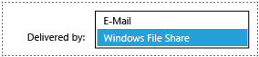

# Change the Default Reporting Services Delivery Extension
  You can modify [!INCLUDE[ssRSnoversion](../../includes/ssrsnoversion-md.md)] configuration settings to change the default delivery extension that appears in the **Delivered by** list of a subscription definition page. For example you can modify the configuration so that when users create a new subscription, file share delivery is selected by default instead of e-mail delivery. You can also change the order the delivery extensions are listed in the user interface.  
  
 **[!INCLUDE[applies](../../includes/applies-md.md)]**  [!INCLUDE[ssRSnoversion](../../includes/ssrsnoversion-md.md)] Native mode | [!INCLUDE[ssRSnoversion](../../includes/ssrsnoversion-md.md)] SharePoint mode  
  
 [!INCLUDE[ssRSnoversion](../../includes/ssrsnoversion-md.md)] includes E-mail and Windows File Share delivery are extensions. Your report server might have additional delivery extensions if you have deployed custom or third-party extensions to support custom delivery. The availability of a delivery extension depends on whether it is deployed on a report server.  
  
## Default Native mode report server configuration  
 The order of a delivery extension appears in Report Manager in the **Delivered by** list is based on the order of the delivery extension entries in the **RSReportServer.config** file. For example the following image shows e-mail first in the list and it is selected by default.  
  
   
  
 The following is the default section of **RSReportServer.config** that controls the default delivery extension and the order they are displayed in Report Manager. Note that email appears first in the file and it is set as the default.  
  
```  
<DeliveryUI>  
     <Extension Name="Report Server Email" Type="Microsoft.ReportingServices.EmailDeliveryProvider.EmailDeliveryProviderControl,ReportingServicesEmailDeliveryProvider">  
          <DefaultDeliveryExtension>True</DefaultDeliveryExtension>  
               <Configuration>  
               <RSEmailDPConfiguration>  
                    <DefaultRenderingExtension>MHTML</DefaultRenderingExtension>  
               </RSEmailDPConfiguration>  
               </Configuration>  
     </Extension>  
     <Extension Name="Report Server FileShare" Type="Microsoft.ReportingServices.FileShareDeliveryProvider.FileShareUIControl,ReportingServicesFileShareDeliveryProvider"/>  
</DeliveryUI>  
```  
  
#### Configure File Share Delivery as the default delivery extension in Report Manager  
  
1.  The steps in this procedure modify the configuration so that file share delivery is listed as the first option in the UI and it is the default selection.  
  
     Open the RSReportServer.config file in a text editor. For more information on the configuration file, see [RsReportServer.config Configuration File](../../reporting-services/report-server/rsreportserver-config-configuration-file.md). After the configuration changes, the UI will look like the following image:  
  
       
  
2.  Modify the DeliveryUI section to look like the following sample and note the key changes of:  
  
    1.  The FileShare extension is before the email extension. This will change the order the extensions are listed in Report Manager.  
  
    2.  The File share extension contains DefaultExtension tag `<DefaultDeliveryExtension>True</DefaultDeliveryExtension>` and the extension end tag was added `</Extension>`.  
  
    3.  The email extension is no longer configured as the default. `<DefaultDeliveryExtension>False</DefaultDeliveryExtension>`  
  
    ```  
    <DeliveryUI>  
         <Extension Name="Report Server FileShare" Type="Microsoft.ReportingServices.FileShareDeliveryProvider.FileShareUIControl,ReportingServicesFileShareDeliveryProvider">  
              <DefaultDeliveryExtension>True</DefaultDeliveryExtension>  
         </Extension>  
         <Extension Name="Report Server Email" Type="Microsoft.ReportingServices.EmailDeliveryProvider.EmailDeliveryProviderControl,ReportingServicesEmailDeliveryProvider">  
         <DefaultDeliveryExtension>False</DefaultDeliveryExtension>  
         <Configuration>  
              <RSEmailDPConfiguration>  
                   <DefaultRenderingExtension>MHTML</DefaultRenderingExtension>  
              </RSEmailDPConfiguration>  
         </Configuration>  
         </Extension>  
    </DeliveryUI>  
    ```  
  
3.  Save the configuration file.  
  
4.  Within a few minutes the report server will reload the configuration file and the new settings will take effect. You can restart the report server service to force the loading of the configuration file.  
  
     The following event is written to the Windows event log when the configuration is read.  
  
     **Event ID:** 109  
  
     **Source:** Report Server Windows Service (instance name)  
  
     The RSReportServer.config file has been modified  
  
## SharePoint mode report servers  
 [!INCLUDE[ssRSnoversion](../../includes/ssrsnoversion-md.md)] SharePoint mode stores extensions information in the SharePoint service application databases and not in the RsrReportServer.config file. In SharePoint mode, delivery extension configuration is modified using PowerShell.  
  
#### Configure the default delivery extension  
  
1.  Open the **SharePoint Management Shell**.  
  
2.  You can skip this step if you already know the name of your [!INCLUDE[ssRSnoversion](../../includes/ssrsnoversion-md.md)] service application. Use the following PowerShell to list the [!INCLUDE[ssRSnoversion](../../includes/ssrsnoversion-md.md)] service applications in your SharePoint farm.  
  
    ```  
    get-sprsserviceapplication | format-list *  
    ```  
  
3.  Run the following PowerShell to verify the current default delivery extension for the [!INCLUDE[ssRSnoversion](../../includes/ssrsnoversion-md.md)] service application "ssrsapp".  
  
    ```  
    $app=get-sprsserviceapplication | where {$_.name -like "ssrsapp*"};Get-SPRSExtension -identity $app | where{$_.ServerDirectivesXML -like "<DefaultDelivery*"} | format-list *  
  
    ```
  
## See Also  
 [RsReportServer.config Configuration File](../../reporting-services/report-server/rsreportserver-config-configuration-file.md)   
 [RsReportServer.config Configuration File](../../reporting-services/report-server/rsreportserver-config-configuration-file.md)   
 [File Share Delivery in Reporting Services](../../reporting-services/subscriptions/file-share-delivery-in-reporting-services.md)   
 [E-Mail Delivery in Reporting Services](../../reporting-services/subscriptions/e-mail-delivery-in-reporting-services.md)   
