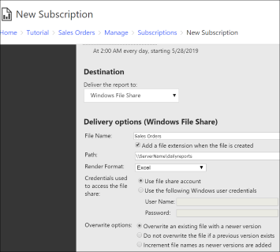
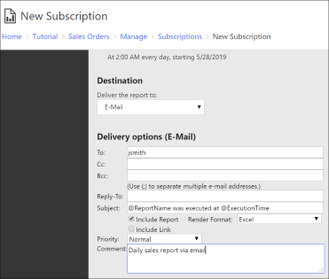

# Create and Manage Subscriptions for Native Mode Report Servers
  A standard subscription is one that is created by individual users who want to have a report delivered through e-mail or to a shared folder. This topic provides information about standard subscriptions that are created and managed by individual users. Data-driven subscriptions have different requirements and steps, and are discussed in a separate topic. For more information, see [Create, Modify, and Delete Data-Driven Subscriptions](../../reporting-services/subscriptions/create-modify-and-delete-data-driven-subscriptions.md)  
  
 **In this article:**  
  
-   [General requirements for subscriptions](#bkmk_create_subscription)  
  
-   [To create a file share subscription](#bkmk_create_fileshare_subscription)  
  
-   [To create an e-mail subscription](#bkmk_create_email_subscription)  
  
-   [To modify a subscription](#bkmk_modify_subscription)  
  
-   [To delete a subscription](#bkmk_delete_subscription)  
  
##   General requirements for subscriptions  
 The content in this article explains how to create subscriptions on a native mode report server using the web portal in [!INCLUDE[ssRSnoversion](../../includes/ssrsnoversion-md.md)]. After you define a subscription, you can access it in web portal through the My Subscriptions page or the **Subscriptions** tab of a specific report.  
  
 [Create and Manage Subscriptions for SharePoint Mode Report Servers](../../reporting-services/subscriptions/create-and-manage-subscriptions-for-sharepoint-mode-report-servers.md) explains how to use the application pages in a SharePoint site to subscribe to reports on a SharePoint mode report server.  
  
-   To use e-mail delivery, the report server must be configured for an SMTP server or gateway connection before you create the subscription. For more information, see [E-Mail Delivery in Reporting Services](../../reporting-services/subscriptions/e-mail-delivery-in-reporting-services.md).  
  
-   To use file share delivery, you must have a target folder already defined. For more information, see [Subscription Settings and a File Share Account (Configuration Manager)](../install-windows/subscription-settings-and-a-file-share-account-configuration-manager.md).  
  
 Before you can subscribe to a report, the report data source must be configured to use stored credentials or no credentials. For more information, see [Store Credentials in a Reporting Services Data Source](../../reporting-services/report-data/store-credentials-in-a-reporting-services-data-source.md). If it isn't, the **New Subscription** button is not available.  
  
 This article does not explain how to create a data-driven subscription. For instructions on how to create a data-driven subscription, see [Create a Data-Driven Subscription &#40;SSRS Tutorial&#41;](../../reporting-services/create-a-data-driven-subscription-ssrs-tutorial.md).  
  
##  To create a file share subscription  
  
1. Browse [the web portal of a report server (SSRS Native Mode)](../../reporting-services/web-portal-ssrs-native-mode.md).  
  
2.  Navigate to the desired report. Right-click the report and select **Subscribe**.  
  
3.  **Description**: Type a description for the report subscription, maximum 512 characters.  
  
4.  **Owner**: The owner field defaults to the current user and cannot be edited when you create the subscription. However, after the subscription is saved, you can change the subscription properties including the owner and description.  

5. Under **Type of subscription**, select the **Standard subscription** radio button.

6. Under the **Schedule** section, select either:  
   - **Shared schedule**.  
   - **Report specific schedule**.  

    For more information on scheduling, see [Schedules](../../reporting-services/subscriptions/schedules.md).
  
7. Under **Destination**, select **Windows File Share**.  
  
8. Under **Delivery options (Windows File Share)**, specify:  
   - **File Name**: Type a file name for the report.
   - **Add a file extension when the file is created**: This option adds a three-character file extension to the file name. The file extension is determined by the report output format you select.  
   - **Path**: Type a Universal Naming Convention (UNC) path to an existing folder where you want to deliver the reports (for example, \\<servername\>\<myreports>). Include double backslash characters at the beginning of the path. Do not specify a trailing backslash.  
  
       
  
   - **Render Format**: Select a report output format for file delivery. Choose a format that corresponds to the desktop application that will be used to open the report. Avoid formats that do not render a report in a single stream or that introduce interactivity that cannot be supported in a static file (for example, HTML 4.0).  
  
   - **Credentials**: Select to use either the File share account or a specific Windows user credentials. The **Use file share account** is disabled if your report administrator has not configured a file share account. For more information, see [Subscription Settings and a File Share Account &#40;Configuration Manager&#41;](../../reporting-services/install-windows/subscription-settings-and-a-file-share-account-configuration-manager.md). In the **User name** and **Password** text boxes, specify the credentials required to access the file share, using the format *\<domain>*\\*\<user name>* for the user name.  
  
   - **Overwrite options**:  
     - **Overwrite an existing file with a newer version**.  
     - **Do not overwrite the file if a previous version exists**, the delivery will not occur if an existing file is detected.  
     - **Increment file names as newer versions are added**, the report server appends a number to the file name to distinguish it from existing files of the same name.  

9. For parameterized reports, specify parameters to use for the report for this subscription. The parameters can be different from those used to run the report on demand or in other scheduled operations.  
  
The report is delivered as a static file. If the report includes interactive features (for example, links to additional rows and columns), those features are not available.  
  
##   To create an e-mail subscription  
  
1. Browse [the web portal of a report server (SSRS Native Mode)](../../reporting-services/web-portal-ssrs-native-mode.md).  
  
2. Navigate to the desired report. Right-click the report and select **Subscribe**.  
  
3. **Description**: Type a description for the report subscription, maximum 512 characters.  
  
4.  **Owner**: The owner field defaults to the current user and cannot be edited when you create the subscription. However, after the subscription is saved, you can change the subscription properties including the owner and description.  

5. Under **Type of subscription**, select the **Standard subscription** radio button.

6. Under the **Schedule** section, select either:  
   - **Shared schedule**.  
   - **Report specific schedule**.  

    For more information on scheduling, see [Schedules](../../reporting-services/subscriptions/schedules.md).
  
7. Under **Destination**, select **E-Mail**.  If the **E-Mail** option is not available, your report server has not been configured for e-mail subscriptions. See [Configure E-mail for a Reporting Services Service Application](../../reporting-services/install-windows/configure-e-mail-for-a-reporting-services-service-application.md).
  
8. Under **Delivery options (E-Mail)**, specify:
   - **To**: The recipient name in the To: field is self-addressed using your domain user account. Verify the format is [user name]@[domain.com]. Report server configuration settings determine whether the **To** field is self-addressed with your user account. For more information about changing the configuration settings e-mail addresses, see [Configure E-mail for a Reporting Services Service Application](../../reporting-services/install-windows/configure-e-mail-for-a-reporting-services-service-application.md)

     >[!NOTE]  
     > Depending on your permissions, you might be able to type the e-mail address you want the report delivered to. To specify multiple e-mail addresses, separate them with a semicolon (;). You can also type additional e-mail addresses in the **Cc**, **Bcc**, and **Reply-To** text boxes. This requires that you have permission to manage all subscriptions.  
  
   - **Subject**: Defaults to "@ReportName was executed at @ExecutionTime". You can edit the subject but note that the @ReportName and @ExecutionTime are the only global variables supported in the **Subject** field.  
  
       

   - **Include Report**: Select this option to embed or attach a copy of the report. The format of the report is determined by the rendering format you select. Do not choose this option if you think the report size will exceed the limit defined for your e-mail system.  
  
   - **Include Link**: Select this option to include a URL link to the report in the body of the e-mail message.  
  
     >[!NOTE]  
     >If you clear both of these options, only the notification text in the Subject line is sent.  
  
   - Choose a rendering format from the **Render Format** list box. This option is available if you select **Include Report** to embed or attach a copy of the report.  
      - To embed the report in the body of the e-mail message, select **MHTML (web archive)**.  
      - To send the report as an attachment, choose any of the other rendering formats.  
  
   - Select a priority from the **Priority** list box. In [!INCLUDE[msCoName](../../includes/msconame-md.md)] Exchange, this setting sets a flag for the importance level of the e-mail message.  
   - Enter a **Comment** if desired.
  
9. For parameterized reports, specify parameters to use for the report for this subscription. The parameters that you specify can be different from those used to run the report on demand or in other scheduled operations.  
  
##   To modify a subscription  
 You can modify a subscription at any time. If you modify a subscription while it is being processed, the updated settings are used if they are saved to the report server before the delivery extension receives the subscription data. Otherwise, the existing settings are used.  
  
 A user who creates a subscription owns that subscription. Each user can modify or delete the subscriptions that he or she owns. You can change the owner of the report from the subscription properties page or you can change the ownership programmatically. For more information, see the following:  
  
-   [Use PowerShell to Change and List Reporting Services Subscription Owners and Run a Subscription](../../reporting-services/subscriptions/manage-subscription-owners-and-run-subscription-powershell.md)  
  
-   <xref:ReportService2010.ReportingService2010.ChangeSubscriptionOwner%2A>  
  
 To locate a subscription, use the **My Subscriptions** page or view the subscription definitions that are associated with a report. You cannot search for subscriptions directly, nor can you search for a subscription based on owner name, trigger information, status information, and so forth.  
  
 Subscriptions can also be modified or deleted by report server administrators.  
  
>[!NOTE]  
> A report server administrator cannot manage from one place all the individual subscriptions that are in use on a given report server. However, report server administrators can access each individual subscription to modify or delete it.  
  
##   To delete a subscription  
To delete a subscription:  
  
1. Browse [the web portal of a report server (SSRS Native Mode)](../../reporting-services/web-portal-ssrs-native-mode.md).  
  
2. In the web portal, select **My Subscriptions** on the toolbar and navigate to the subscription you want to modify or delete.  
  
3. Right-click the report and select **Delete**.  
  
To cancel a subscription that is currently processing on the report server, see [Manage a Running Process](../../reporting-services/subscriptions/manage-a-running-process.md).  
  
 If you want to end a subscription and you cannot locate the subscription, make a note of the report you are receiving and search for it by name. Once you access the report, you can remove yourself from the subscription. If you cannot locate the subscription, the subscription may be a data-driven subscription. For more information, see your report server administrator.  
  
 A subscription is deleted automatically if the underlying report is deleted. If you delete a subscription while it is being processed, the subscription stops if the delete operation occurs before the delivery extension receives subscription data. Otherwise, the subscription continues to be processed.  
  
## See also  
 [Create and Manage Subscriptions for SharePoint Mode Report Servers](../../reporting-services/subscriptions/create-and-manage-subscriptions-for-sharepoint-mode-report-servers.md)  
 [Use PowerShell to Change and List Reporting Services Subscription Owners and Run a Subscription](../../reporting-services/subscriptions/manage-subscription-owners-and-run-subscription-powershell.md)  
 [Data-Driven Subscriptions](../../reporting-services/subscriptions/data-driven-subscriptions.md)  
 [Subscriptions and Delivery &#40;Reporting Services&#41;](../../reporting-services/subscriptions/subscriptions-and-delivery-reporting-services.md)  
 [The web portal of a report server (SSRS Native Mode)](../../reporting-services/web-portal-ssrs-native-mode.md)  
 [Use My Subscriptions &#40;Native Mode Report Server&#41;](../../reporting-services/subscriptions/use-my-subscriptions-native-mode-report-server.md)  
