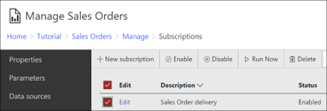

# Disable or Pause Report and Subscription Processing  
There are several approaches you can use to disable or pause [!INCLUDE[ssRSnoversion](../../includes/ssrsnoversion-md.md)] report and subscription processing. The approaches in this article range from disabling a subscription to interrupting the data source connection. Not all approaches are possible with both [!INCLUDE[ssRSnoversion](../../includes/ssrsnoversion-md.md)] server modes. The following table summarizes the methods and supported [!INCLUDE[ssRSnoversion](../../includes/ssrsnoversion-md.md)] server modes:  
  
##  <a name="bkmk_top"></a> In this article  
  
|Approach|Supported server mode|  
|-|---------------------------|  
|[Enable and disable subscriptions](#bkmk_disable_subscription)|Native mode|  
|[Pause a shared schedule](#bkmk_pause_schedule)|Native and SharePoint mode|  
|[Disable a shared data source](#bkmk_disable_shared_datasource)|Native and SharePoint mode|  
|[Modify role assignments to prevent access to a report (Native mode)](#bkmk_modify_role_assignment)|Native mode|  
|[Remove manage subscription permissions from role (Native mode)](#bkmk_remove_manage_subscriptions_permission)|Native mode|  
|[Disable delivery extensions](#bkmk_disable_extensions)|Native and SharePoint mode|  
  
##  <a name="bkmk_disable_subscription"></a>Enable and disable subscriptions  
  
>[!TIP]  
>New in SQL 2016 Reporting Services, *enable and disable subscriptions*. New user interface options allow you to quickly enable and disable subscriptions. The disabled subscriptions maintain their other configuration properties such as schedule and can be easily re-enabled. You can also programmatically enable and disable subscriptions, or audit which subscriptions are disabled.  
  
    
  
In the web portal, browse to the subscription from either the **My Subscriptions** page or the **Subscriptions** page of an individual subscription. Select one or more subscriptions and then click either the disable button or enable button on the ribbon (see above image). The status column will change to either "Disabled" or "Enabled" respectively.  
  
 [!INCLUDE[ssRSnoversion](../../includes/ssrsnoversion-md.md)] writes a row in the [!INCLUDE[ssRSnoversion](../../includes/ssrsnoversion-md.md)] log when a subscription is either enabled or disabled. For example, in report server log file:  
  
 `C:\Program Files\Microsoft SQL Server Reporting Services\SSRS\LogFiles\RSPortal_2019_06_20_00_49_22.log`  
  
 you see rows similar to the following:  
  
 `RSPortal!subscription!RSPortal.exe!93!06/20/2019-01:16:47:: i INFO: Subscription 2b409d66-d4ea-408a-918c-0f9e41ce49ca disabled at 06/20/2019 01:16:47`  
  
 `RSPortal!subscription!RSPortal.exe!93!06/20/2019-01:16:51:: i INFO: Subscription 2b409d66-d4ea-408a-918c-0f9e41ce49ca enabled at 06/20/2019 01:16:51`  
  
: **Use Windows PowerShell to disable a single subscription:** Use the following PowerShell script to disable a specific subscription. Update the server name and subscription ID in the script.  
  
```PS  
#disable specific subscription  
$rs2010 = New-WebServiceProxy -Uri "https://SERVERNAME/ReportServer/ReportService2010.asmx" -Namespace SSRS.ReportingService2010 -UseDefaultCredential;  
$subscriptionID = "subscription guid";  
$rs2010.DisableSubscription($subscriptionID);  
  
```  
  
 You can use the following script to list all subscriptions with their IDs. Update the server name.  
  
```  
#list all subscriptions  
$rs2010 = New-WebServiceProxy -Uri "https://SERVERNAME /ReportServer/ReportService2010.asmx" -Namespace SSRS.ReportingService2010 -UseDefaultCredential;  
$subscriptions = $rs2010.ListSubscriptions("/");  
$subscriptions | select subscriptionid, report, status, path  
  
```  
  
  **Use Windows PowerShell to list all disabled subscriptions:** Use the following PowerShell script to list all of the disabled subscriptions on the current Native mode report server. Update the server name.  
  
```  
#list all disabled subscriptions  
$rs2010 = New-WebServiceProxy -Uri "https://uetestb03/ReportServer/ReportService2010.asmx" -Namespace SSRS.ReportingService2010 -UseDefaultCredential;  
$subscriptions = $rs2010.ListSubscriptions("/");  
Write-Host "--- Disabled Subscriptions ---";  
Write-Host "----------------------------------- ";  
$subscriptions | Where-Object {$_.Active.DisabledByUserSpecified -and $_.Active.DisabledByUser } | select subscriptionid, report, status, lastexecuted,path | format-table -auto  
```  
  
  **Use Windows PowerShell to enable all disabled subscriptions:** Use the following PowerShell script to enable all subscriptions that are currently disabled. Update the server name.  
  
```  
#enable all subscriptions  
$rs2010 = New-WebServiceProxy -Uri "https://SERVERNAME/ReportServer/ReportService2010.asmx" -Namespace SSRS.ReportingService2010 -UseDefaultCredential;  
$subscriptions = $rs2010.ListSubscriptions("/") | Where-Object {$_.status -eq "disabled" } ;  
ForEach ($subscription in $subscriptions)  
{  
    $rs2010.EnableSubscription($subscription.SubscriptionID);  
    $subscription | select subscriptionid, report, path  
}  
  
```  
  
  **Use Windows PowerShell to DISABLE all subscriptions:** Use the following PowerShell script to list disable **ALL** subscriptions.  
  
```  
#DISABLE all subscriptions  
$rs2010 = New-WebServiceProxy -Uri "https://SERVERNAME/ReportServer/ReportService2010.asmx" -Namespace SSRS.ReportingService2010 -UseDefaultCredential;  
$subscriptions = $rs2010.ListSubscriptions("/") ;  
ForEach ($subscription in $subscriptions)  
{  
    $rs2010.DisableSubscription($subscription.SubscriptionID);  
    $subscription | select subscriptionid, report, path  
}  
```  
  
##  <a name="bkmk_pause_schedule"></a> Pause a shared schedule  
 If a report or subscription runs from a shared schedule, you can pause the schedule to prevent processing. All report and subscription processing driven by the schedule is deferred until the schedule is resumed.  
  
-   **SharePoint mode:**  In **Site settings**, select **Manage shared schedules**. Select the schedule and click **Pause selected schedules**.  
  
-   **Native mode:** In the web portal, select the **Settings** button  from the menu bar at the top of the web portal screen, and select **Site Settings** from the drop-down menu. Select the **Schedules** tab to display the schedules page. Select the checkbox(es) next to the schedule(s) you want to enable or disable, and then select the **Enable** or **Disable** button respectively to perform the desired action. The status column will update to "Disabled" or "Enabled" accordingly.  
  
##  <a name="bkmk_disable_shared_datasource"></a> Disable a shared data source  
 One advantage to using shared data sources is that you can disable it to prevent a report or data-driven subscription from running. Disabling a shared data source disconnects the report from its external source. While it is disabled, the data source is unavailable to all reports and subscriptions that use it.  
  
 Note the report still loads even if the data source is unavailable. The report does not contain data, but users with appropriate permissions can access the property pages, security settings, report history, and subscription information associated with the report.  
  
-   **SharePoint mode:** To disable a shared data source in a SharePoint mode report server, browse to the document library that contains the data source.  Click the data source and then clear the **Enable this data source** check box.  
  
-   **Native mode:** To disable a shared data source on a native mode report server, open the data source in the web portal, and clear the **Enable this data source** check box.  
  
##  <a name="bkmk_modify_role_assignment"></a> Modify role assignments to prevent access to a report (native mode)  
One way to make a report unavailable is to temporarily remove the role assignment that provides access to the report. This approach can be used on all reports regardless of how the data source connection is made. This approach targets only the report, without affecting the operation of other reports or items.  
  
 To remove the role assignment, open the **Security** page of the report in the web portal. If the report inherits security from a parent, you can select **Customize security** and then select **Confirm** in the **Item security** dialog box to create a restrictive security policy that omits role assignments that provide widespread access (for example, you can remove a role assignment that provides access to Everyone, and keep the role assignment that provides access to a small group of users, such as Administrators).  
  
##  <a name="bkmk_remove_manage_subscriptions_permission"></a> Remove manage subscription permissions from role (native mode)  
 To prevent users from creating subscriptions, clear the **Manage individual subscriptions** task from the role. When you remove this task, the Subscription pages are not available. In the web portal, the My Subscriptions page appears to be empty (it cannot be deleted), even if it previously contained subscriptions. Removing subscription-related tasks prevents users from creating and modifying subscriptions, but does not delete existing subscriptions. Existing subscriptions continue to execute until you delete them. To remove the permission:  
  
1.  Open [!INCLUDE[ssManStudioFull](../../includes/ssmanstudiofull-md.md)]. 
  
2.  Connect to the [!INCLUDE[ssRSnoversion](../../includes/ssrsnoversion-md.md)] report server.  
  
3.  Expand the **Security** node.  
  
4.  Expand the **Roles** node and select the desired role.  
  
5.  Right-click the role and select **Properties**.  
  
6.  Clear the **Manage individual subscriptions** and the **Manage all subscriptions** tasks.  
  
7.  Select **OK** to apply the changes.

  
##  <a name="bkmk_disable_extensions"></a> Disable delivery extensions  
 All delivery extensions installed on a report server are available to any user who has permission to create a subscription to a given report. The following delivery extensions are available and configured automatically:  
  
-   Windows File Share  
  
-   SharePoint Library (available only from a SharePoint site that is integrated with a SharePoint integrated mode report server)  
  
 E-mail delivery must be configured before it can be used. If you do not configure it, it is not available. For more information, see [E-Mail Settings - Reporting Services Native mode (Configuration Manager)](../install-windows/e-mail-settings-reporting-services-native-mode-configuration-manager.md).  
  
 If you want to turn off specific extensions, you can remove extension entries in the **RSReportServer.config** file. For more information, see [Reporting Services Configuration Files](../../reporting-services/report-server/reporting-services-configuration-files.md) and [E-Mail Settings - Reporting Services Native mode (Configuration Manager)](../install-windows/e-mail-settings-reporting-services-native-mode-configuration-manager.md).  
  
 After you remove a delivery extension, it is no longer available in the web portal or a SharePoint site. Removing a delivery extension can result in inactive subscriptions. Be sure to delete the subscriptions or configure them to use a different delivery extension before removing an extension.  
  
## See also  
 [Subscriptions and Delivery &#40;Reporting Services&#41;](../../reporting-services/subscriptions/subscriptions-and-delivery-reporting-services.md)   
 [Reporting Services Configuration Files](../../reporting-services/report-server/reporting-services-configuration-files.md)   
 [Configure the web portal](../../reporting-services/report-server/configure-web-portal.md)   
 [Reporting Services Report Server &#40;Native Mode&#41;](../../reporting-services/report-server/reporting-services-report-server-native-mode.md)   
 [The web portal of a report server (SSRS Native Mode)](../../reporting-services/web-portal-ssrs-native-mode.md)   
 [Securable Items](../../reporting-services/security/securable-items.md) 
