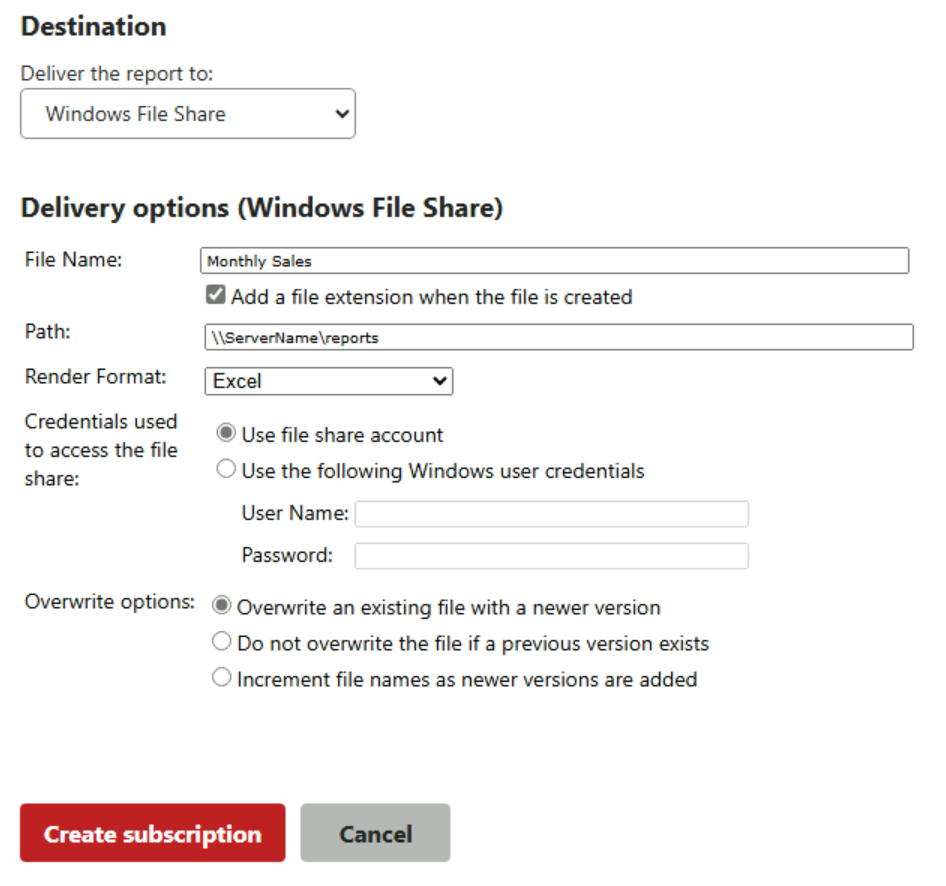

# File Share Delivery in Reporting Services
  SQL Server [!INCLUDE[ssRSnoversion](../../includes/ssrsnoversion-md.md)] includes a file share delivery extension so that you can deliver a report to a folder. The file share delivery extension is available by default and requires no additional configuration. In order for file delivery to succeed, you must set write access permissions on the shared folder. The account that requires writer permissions can either be credentials configured in the subscription or a **File share account** configured for the report server. For more information on the file share account, see [Subscription Settings and a File Share Account &#40;Configuration Manager&#41;](../../reporting-services/install-windows/subscription-settings-and-a-file-share-account-configuration-manager.md). In addition, users who require access to the reports must have read permissions on the shared folder.  
  
 To distribute a report to a file share, you define either a standard subscription or a data-driven subscription. To learn how to use file share delivery in a data-driven subscription, see [Create a Data-Driven Subscription &#40;SSRS Tutorial&#41;](../../reporting-services/create-a-data-driven-subscription-ssrs-tutorial.md). Additionally, the account that runs remote file share subscriptions requires rights to log on locally on the [!INCLUDE[ssRSnoversion](../../includes/ssrsnoversion-md.md)] computer.  
  
||  
|-|  
|**[!INCLUDE[applies](../../includes/applies-md.md)]**  [!INCLUDE[ssRSnoversion](../../includes/ssrsnoversion-md.md)] Native mode &#124; [!INCLUDE[ssRSnoversion](../../includes/ssrsnoversion-md.md)] SharePoint mode|  
  
 **In this topic:**  
  
-   [Characteristics reports delivered to shared folders](#bkmk_Characteristics)  
  
-   [Target folders](#bkmk_target_folders)  
  
-   [File Formats](#bkmk_file_formats)  
  
-   [File Options](#bkmk_file_options)  
  
##  <a name="bkmk_Characteristics"></a> Characteristics reports delivered to shared folders  
  
-   Unlike reports that are hosted and managed by a report server, reports that are delivered to a shared folder are static files.  
  
-   Interactive features that are defined for the report **do not work** for reports that are stored as files on the file system. Interaction features are represented as static elements. For example, if you deliver a matrix report, the resulting file shows the top-level view of the report; you cannot expand rows and columns to view supporting data.  
  
-   If the report includes charts, the default presentation is used. If the report links through to another report, the link is rendered as static text.  
  
-   If you want to retain interactive features in a delivered report, use e-mail delivery instead. The e-mail contains a link to the report on the report server and users can use the interactive features. For more information, see [E-Mail Delivery in Reporting Services](../../reporting-services/subscriptions/e-mail-delivery-in-reporting-services.md).  
  
##  <a name="bkmk_target_folders"></a> Target folders  
 When defining a subscription that uses file share delivery, you must specify an existing folder as the target folder. The report server does not create folders on the file system. The folder that you specify must be accessible over a network connection.  
  
 Verify that users who will **view** the reports in the shared folder have Read permission.  
  
 When specifying the target folder in a subscription, use Uniform Naming Convention (UNC) format that includes the computer's network name. Do not include trailing backslashes in the folder path. The following example illustrates a UNC path:  
  
```  
\\<servername>\reportarchive\operations\2014  
```  
  
 When you create the folder, consider the connection limits you require. The report server requires two connections, but you must include enough connections to accommodate additional users who want to open reports on the shared folder.  
  
##  <a name="bkmk_file_formats"></a> File Formats  
 Reports can be rendered in a variety of file formats, such as HTML, DOCX, and Excel. To save the report in a specific file format, select that rendering format when creating your subscription. For example, choosing **Excel** saves the report as a [!INCLUDE[ofprexcel](../../includes/ofprexcel-md.md)] file. Although you can choose from any supported rendering format, some formats work better than others when rendering to a file.  
  
 For file share delivery, choose a format that delivers the report in a single file, where all images and related content are included in the report. Suitable formats include Web archive, PDF, TIFF, and Excel. Avoid HTML4.0. If your report includes images, the HTML 4.0 formats will not include them in the file.  
  
##  <a name="bkmk_file_options"></a> File Options  
 When you create a file share subscription, you can configure how the file name is created and if the file overwrites previous versions of the report. A fully qualified file name has three parts: a name, an extension, and text or a number that is appended to the file to create a unique file name  
  
 **File Name:** The default file name is based on the source report name, but you can provide a custom name in the subscription. The extension is optional, but if you specify it, the report server will create an extension that corresponds to the rendering format.  
  
 **Overwrite:** You can specify overwrite options to reuse the same file name for each report delivery or to create a new file. To overwrite the file, you must use the same file name and extension.  
  
 An alternative approach to creating unique files for every delivery is to include a timestamp in the file name. To do this, add the **@timestamp** variable to the file name (for example, *CompanySales@timestamp*). With this approach, the file name is unique by definition, so it will never be overwritten.  
  
 The following image is an example of the settings for a subscription configured for file share delivery.  
  
   
  
## See Also  
 [Create and Manage Subscriptions for Native Mode Report Servers](../../reporting-services/subscriptions/create-and-manage-subscriptions-for-native-mode-report-servers.md)   
 [Subscription Settings and a File Share Account &#40;Configuration Manager&#41;](../../reporting-services/install-windows/subscription-settings-and-a-file-share-account-configuration-manager.md)  
  
  
