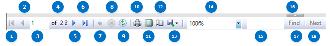

# Preview View
In [!INCLUDE[ssRSnoversion_md](../../includes/ssrsnoversion-md.md)] Report Designer, use **Preview** view to display the rendered report. When a report is previewed, Report Designer runs the report locally and displays it in the Preview view. In preview mode, the report is processed in full. If the report has a complex query or has a large amount of data, preview might take several minutes to complete the first time you view it. For subsequent changes that affect only the format of the report, preview uses cached data.

    
## Options  
 Use the toolbar to manage preview functions.  

 **(1) First Page**  
 Choose this option to go to the first page of the report.  
  
 **(2) Previous Page**  
 Choose this option to go to the previous page of the report.  
  
 **(3) Current Page**  
 Displays the current page of the report.  
  
 **(4) Total Pages**  
 Displays the total number of pages in the report.  
  
 **(5) Next Page**  
 Choose this option to go to the next page of the report.  
  
 **(6) Last Page**  
 Choose this option to go to the last page of the report.  
  
 **(7) Back to Parent Report**  
 Choose this option to go to the parent report. This option is used to navigate drillthrough reports.  
  
 **(8) Stop Rendering**  
 Choose this option to stop the rendering process.  
  
 **(9) Refresh**  
 Choose this option to refresh the data cache and run the report again.  
  
 **(10) Print**  
 Choose this option to print the report.  
  
 **(11) Print Layout**  
 Choose this option to toggle between the preview report and the view of the report as it will appear on the printed page.  
  
 **(12) Page Setup**  
 Choose this option to conveniently change page and print properties. Use Print Layout to view changes before printing.  
  
 **(13) Export**  
 Choose this option to export the rendered report in a specific format.  
  
 **(14) Zoom**  
 Select a zoom factor to zoom in or out on the report.  
  
 **(15) Find Text in report**  
 Type text to search for a match within the report. You cannot use search operators. Click **Find** to search for the first instance.  

 **(16) Show or Hide Parameter Area**  
 Choose this option to show or hide the parameters boxes for reports with parameters.
 
 **(17) Find**  
 Choose this option to begin searching the report for the search text.  
  
 **(18) Find Next**  
 Choose this option to search for the next instance of the search text.  
  
## See Also  
+ [Previewing Reports](../../reporting-services/reports/previewing-reports.md)
+ [Report Designer F1 Help](../../reporting-services/tools/report-designer-f1-help.md)  
  
  
