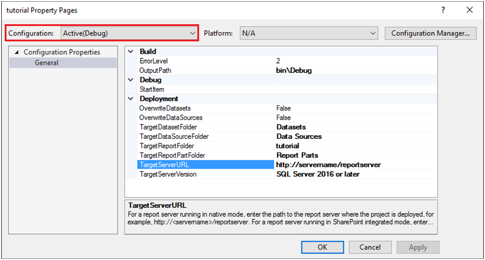

# Project Property Pages Dialog Box

  Use the project property pages to configure deployment properties for a Report Server project. To open this dialog box, from the **Project** menu, click _\<Report Project Name>_**Properties**.  
  
 After you define configuration properties, you can select a configuration from the **Solution Configurations** drop-down list on the toolbar.  

  
## Options  
 **Configuration**  
 Select the configuration to edit. Initially, the following configurations are available: **Debug**, **DebugLocal**, and **Release**. The active configuration appears first, for example, **Active(Debug)**.  
  
 To see properties for more than one configuration at the same time, select **All Configurations** or **Multiple Configurations**.  
  
 To create additional configurations, click **Configuration Manager** on the toolbar.  
  
 **Configuration Manager**  
 Manage configurations for the entire solution or to add additional configurations. For more information, see the [!INCLUDE[msCoName](../../includes/msconame-md.md)] [!INCLUDE[vsprvs](../../includes/vsprvs-md.md)] documentation.  
  
 **OutputPath**  
 Type or paste the path to store the report definition used in build verification, deployment, and preview of reports. The path must be different than the path that you use for the project and a relative path that is a child folder under the path of the project.  
  
> [!NOTE]  
>  You can use multiple configurations to switch among paths depending on the task you perform.  
  
 **ErrorLevel**  
 Type the severity of the build issues that are reported as errors. Issues with severity levels less than or equal to the value of **ErrorLevel** are reported as errors; otherwise, the issues are reported as warnings. Any error will cause the build task to fail. The valid severity levels are 0 through 4 inclusively. The default value is 2.  
  
 **StartItem**  
 Select the report that is displayed in the Web browser after the project is published to the report server or in the preview window when the project is run locally. A start item is required for configurations that build but do not deploy the project and for using the **Debug** command (**F5**). It is required for configurations that deploy the project.  
  
 **OverwriteDataSources**  
 Select **True** to overwrite the data source on the server with the data source in the project when the reports are published. Select **False** to leave the existing data source on the server.  
  
 **TargetServerVersion**  
 Select either the appropriate version of [!INCLUDE[ssRSnoversion](../../includes/ssrsnoversion-md.md)] or select **Detect Version** to automatically determine the version installed on the server identified by the **TargetServer URL** property. The default value is **SQL Server 2017**.  
  
 **TargetDataSourceFolder**  
 The name of the folder in which to store the published shared data sources. If you do not specify a folder, the data source is published to the same folder as the report. If the folder does not exist on the report server, Report Designer creates the folder when the reports are published.  
  
 When publishing to a report server running in native mode, specify the full path of the folder hierarchy starting at the root. For example, Folder1/Folder2/Folder3.  
  
 When publishing to a report server running in SharePoint integrated mode, use a URL to the SharePoint library. For example, `http:\\<servername>\<site>\Documents\MyFolder`.  
  
 **TargetReportFolder**  
 The name of the folder in which to store the published reports. By default, this is the name of the report project. If the folder does not exist on the report server, Report Designer creates the folder when the reports are published.  
  
 When publishing to a report server running in native mode, specify the full path of the folder hierarchy starting at the root. If a folder is located within another folder, include a path to the folder starting at the root, such as Folder1/Folder2/Folder3.  
  
 When publishing to a report server running in SharePoint integrated mode, use a URL to SharePoint library. For example, `http:\\<servername>\\<site>\Documents\MyFolder`.  
  
 **TargetServerURL**  
 The URL of the target report server. Before you publish a report, you must set this property to a valid report server URL.  
  
 When publishing to a report server running in native mode, use the URL of the virtual directory of the report server. For example, `http:\\<server>\reportserver`. This is the virtual directory of the report server, not Report Manager. By default, the report server is installed in a virtual directory named "reportserver".  
  
 When publishing to a report server running in SharePoint integrated mode, use a URL to a SharePoint top-level site or subsite. If you do not specify a site, the default top-level site is used. For example: 
+ `http:\\<servername>`, 
+ `http:\\<servername\<site>` 
+ `http:\\<servername>\<site>\<subsite>`.  

## Next steps

[Publish Reports](/previous-versions/sql/sql-server-2016/ms159615(v=sql.130))   
[Publish a Report to a SharePoint Library](../../reporting-services/reports/publish-a-report-to-a-sharepoint-library.md)   
[Set Deployment Properties &#40;Reporting Services&#41;](../../reporting-services/tools/set-deployment-properties-reporting-services.md)   
[Report Designer F1 Help](../../reporting-services/tools/report-designer-f1-help.md)  

More questions? [Try asking the Reporting Services forum](https://go.microsoft.com/fwlink/?LinkId=620231)