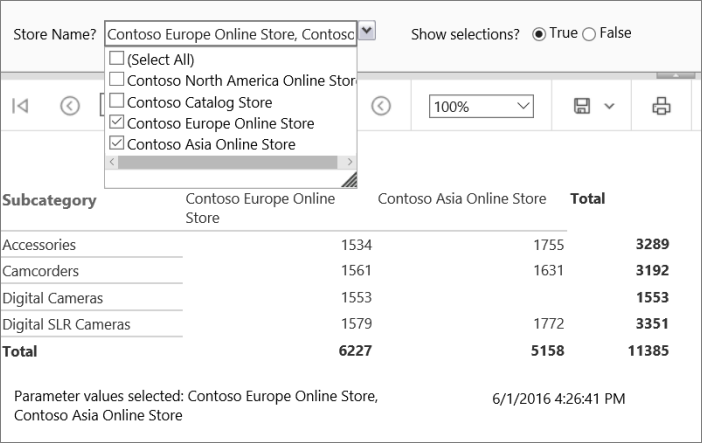
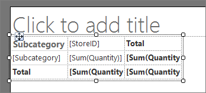
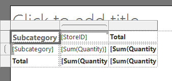
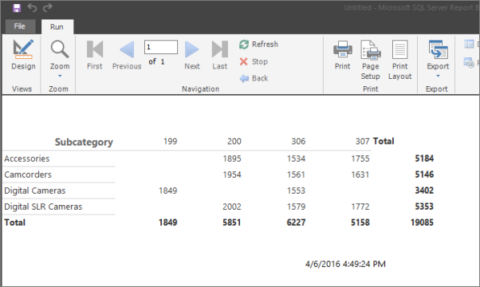
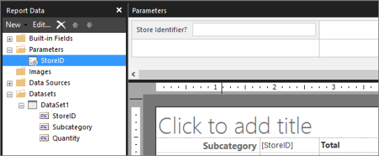
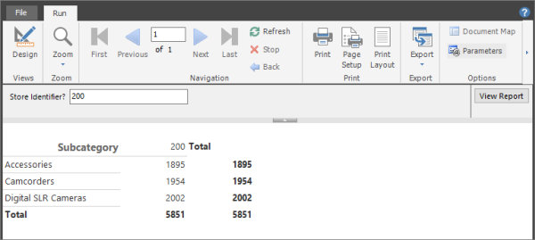
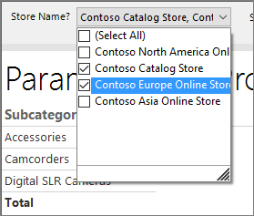

# Tutorial: Add a Parameter to Your Report (Report Builder)
In this tutorial, you add a parameter to a [!INCLUDE[ssRSnoversion_md](../includes/ssrsnoversion-md.md)] paginated report so report readers can filter report data for one or more values. 
  


Report parameters are created automatically for each query parameter that you include in a dataset query. The parameter data type determines how it appears on the report view toolbar. 
   
> [!NOTE]  
> In this tutorial, the steps for the wizard are consolidated into one procedure. For step-by-step instructions about how to browse to a report server, choose a data source, and create a dataset, see the first tutorial in this series: [Tutorial: Creating a Basic Table Report &#40;Report Builder&#41;](../reporting-services/tutorial-creating-a-basic-table-report-report-builder.md).  
  
Estimated time to complete this tutorial: 25 minutes.  
  
## Requirements  
For information about requirements, see [Prerequisites for Tutorials &#40;Report Builder&#41;](../reporting-services/prerequisites-for-tutorials-report-builder.md).  
  
## <a name="Setup"></a>1. Create a Matrix Report and Dataset in the Table or Matrix Wizard  
Create a matrix report, a data source, and a dataset.  
  
> [!NOTE]  
> In this tutorial, the query contains the data values, so that it does not need an external data source. This makes the query quite long. In a business environment, a query would not contain the data. This is for learning purposes only.  
  
### To create a new matrix report  
  
1.  [Start Report Builder](../reporting-services/report-builder/start-report-builder.md) either from your computer, the [!INCLUDE[ssRSnoversion_md](../includes/ssrsnoversion-md.md)] web portal, or SharePoint integrated mode.  
  
    The **New Report or Dataset** dialog box opens.  
  
    If you don't see the **New Report or Dataset** dialog box, on the **File** menu > **New**.  
  
2.  In the left pane, make sure **New Report** is selected.  
  
3.  In the right pane, click **Table or Matrix Wizard**.  
  
4.  On the **Choose a dataset** page, click **Create a dataset** > **Next**.  
  
7.  On the **Choose a connection to a data source** page, select a data source from the list or browse to the report server to select one. Select any data source that is type **SQL Server**.  
      
8.  Click **Next**.  

    You may need to enter your credentials.    
     
9. On the **Design a query** page, click **Edit as Text**.  
  
10. Paste the following query into the empty pane at the top:  
  
    ```  
    ;WITH CTE (StoreID, Subcategory, Quantity)   
    AS (  
    SELECT 200 AS StoreID, 'Digital SLR Cameras' AS Subcategory, 2002 AS Quantity  
    UNION SELECT  200 AS StoreID, 'Camcorders' AS Subcategory, 1954 AS Quantity  
    UNION SELECT  200 AS StoreID, 'Accessories' AS Subcategory, 1895 AS Quantity  
    UNION SELECT  199 AS StoreID, 'Digital Cameras' AS Subcategory, 1849 AS Quantity  
    UNION SELECT  306 AS StoreID, 'Digital SLR Cameras' AS Subcategory, 1579 AS Quantity  
    UNION SELECT  306 AS StoreID, 'Camcorders' AS Subcategory, 1561 AS Quantity  
    UNION SELECT  306 AS StoreID, 'Digital Cameras' AS Subcategory, 1553 AS Quantity  
    UNION SELECT  306 AS StoreID, 'Accessories' AS Subcategory, 1534 AS Quantity  
    UNION SELECT 307 AS StoreID, 'Accessories' AS Subcategory, 1755 AS Quantity  
    UNION SELECT 307 AS StoreID, 'Camcorders' AS Subcategory, 1631 AS Quantity  
    UNION SELECT 307 AS StoreID, 'Digital SLR Cameras' AS Subcategory, 1772 AS Quantity)  
    SELECT StoreID, Subcategory, Quantity  
    FROM CTE  
    ```  
  
    This query combines the results of several [!INCLUDE[tsql_md](../includes/tsql-md.md)] SELECT statements inside a common table expression to specify values that are based on simplified sales data for cameras from the Contoso sample database. The subcategories are digital cameras, digital single lens reflex (SLR) cameras, camcorders, and accessories.  
  
11. On the query designer toolbar, click **Run** (**!**) to see the data.   
  
    The result set consists of 11 rows of data that show the quantity of items sold for each subcategory for four stores, in the following columns: StoreID, Subcategory, Quantity.The store name is not part of the result set. Later in this tutorial, you will look up the name of the store that corresponds to the store identifier from a separate dataset.  
  
    This query does not contain query parameters. You will add query parameters later in this tutorial.   
  
12. Click **Next**.  
  
## <a name="CompleteWizard"></a>2. Organize Data and Choose Layout in the Wizard  
The wizard provides a starting design for displaying data. The preview pane in the wizard helps you to visualize the result of grouping data before you complete the table or matrix design.  
  
### To organize data into groups  
  
1.  On the **Arrange fields** page, drag Subcategory to **Row groups**.  
  
2.  Drag StoreID to **Column groups**.  
  
3.  Drag Quantity to **Values**.  
  
    You have organized the quantity sold values in rows grouped by subcategory, with one column for each store.  
  
4.  Click **Next**.  
  
5.  On the **Choose the Layout** page, under **Options**, make sure **Show subtotals and grand totals** is selected.  
  
    When you run the report, the last column will show the total quantity of each subcategory for all stores, and the last row will show the total quantity for all subcategories for each store.  
  
6.  Click **Next**.  
  
8.  Click **Finish**.  
  
    The matrix is added to the design surface. The matrix displays three columns and three rows. The contents of the cells in the first row are Subcategory, [StoreID], and Total. The contents of the cells in the second row contain expressions that represent the subcategory, the quantity of items sold for each store, and the total quantity for each subcategory for all stores. The cells in the final row display the grand total for each store.  
      
      
  
9. Click in the matrix, hover over the edge of the first column, grab the handle, and expand the column width.  
  
     
  
10. Click **Run** to preview the report.  
  
The report runs on the report server and displays the title and the time the report processing occurred.  


  
So far the column headings display the store identifier but not the store name. Later, you will add an expression to look up the store name in a dataset that contains store identifier/store name pairs.  
  
## <a name="Query"></a>3. Add a Query Parameter to Create a Report Parameter  
When you add a query parameter to a query, Report Builder automatically creates a single-valued report parameter with default properties for name, prompt, and data type.  
  
### To add a query parameter  
  
1.  Click **Design** to switch back to Design view.  
  
2.  In the Report Data pane, expand the **Datasets** folder, right-click **DataSet1**, and then click **Query**.  
  
3.  Add the following [!INCLUDE[tsql](../includes/tsql-md.md)] **WHERE** clause as the last line in the query:  
  
    ```  
    WHERE StoreID = (@StoreID)  
    ```  
  
    The **WHERE** clause limits the retrieved data to the store identifier that is specified by the query parameter *\@StoreID*.  
  
4.  On the query designer toolbar, click **Run** (**!**). The **Define Query Parameters** dialog box opens and prompts for a value for the query parameter *\@StoreID*.  
  
5.  In **Parameter Value**, type **200**.  
  
6.  Select **OK**.
  
    The result set displays the quantities sold for Accessories, Camcorders, and Digital SLR Cameras for the store identifier **200**.  
  
7.  Select **OK**.
  
8.  In the Report Data pane, expand the **Parameters** folder.  
  
Note there is now a report parameter named *\@StoreID*, and a Parameters pane where you can lay out the report parameters.   
  
  
  
Don't see a Parameters pane? On the **View** menu, select **Parameters**.  
  
## <a name="ChangeDefaultProperties"></a>4. Change Default Data Type and Other Properties for a Report Parameter  
After you create a report parameter, you can adjust the default values for properties.  
  
### To change the default data type for a report parameter  
  
By default, the parameter you created has the data type **Text**. Because the store identifier is an integer, you can change the data type to Integer.  
  
1.  In the Report Data pane under the **Parameters** node, right-click *\@StoreID*, then click **Parameter Properties**.  
  
2.  In **Prompt**, type **Store identifier?** This text appears on the report viewer toolbar when you run the report.  
  
3.  In **Data type**, from the drop-down list, select **Integer**.  
  
4.  Accept the remaining default values in the dialog box.  
  
5.  Select **OK**.
  
6.  Click **Run** to preview the report. The report viewer displays the prompt **Store Identifier?** for *\@StoreID*.  
  
7.  On the report viewer toolbar, next to Store ID, type **200**, and then click **View Report**.  
  
  
  
## <a name="AddDataset"></a>4a. Add a Dataset to Provide Available Values and Display Names  
To make sure your report readers type only valid values for a parameter, you can create a drop-down list of values to choose from. The values can come from a dataset or from a list that you specify. Available values must be supplied from a dataset with a query that does not contain a reference to the parameter.  
  
### To create a dataset for valid values for a parameter  
  
1.  Click **Design** to switch to Design view.  
  
2.  In the Report Data pane, right-click the **Datasets** folder, and then click **Add Dataset**.  
  
3.  In **Name**, type **Stores**.  
  
4.  Select **Use a dataset embedded in my report**.  
  
5.  In **Data source**, from the drop-down list, choose the data source you used in the first procedure.  
  
6.  In **Query type**, verify that **Text** is selected.  
  
7.  In **Query**, paste the following text:  
  
    ```  
    SELECT 200 AS StoreID, 'Contoso Catalog Store' as StoreName  
    UNION SELECT 199 AS StoreID, 'Contoso North America Online Store' as StoreName  
    UNION SELECT 307 AS StoreID, 'Contoso Asia Online Store' as StoreName  
    UNION SELECT 306 AS StoreID, 'Contoso Europe Online Store' as StoreName  
    ```  
  
8.  Select **OK**.
  
    The Report Data pane displays the fields StoreID and StoreName under the **Stores** dataset node.  
  
## <a name="AvailableValues"></a>4b. Specify Available Values to Show in a List 
After you create a dataset to provide available values, you change the report properties to specify which dataset and which field to use to populate the drop-down list of valid values on the Report Viewer toolbar.  
  
### To provide available values for a parameter from a dataset  
  
1.  In the Report Data pane, right-click the parameter *\@StoreID*, then click **Parameter Properties**.  
  
2.  Click **Available Values**, and then click **Get values from a query**.  
  
3.  In **Dataset**, from the drop-down list, click **Stores**.  
  
4.  In **Value field**, from the drop-down list, click StoreID.  
  
5.  In **Label field**, from the drop-down list, click StoreName. The label field specifies the display name for the value.  
  
6.  Click **General**.  
  
7.  In **Prompt**, change **Store Identifer?** to **Store name?**  
  
    Report readers will now select from a list of store names instead of store identifiers. Note that the parameter data type remains **Integer** because the parameter is based on the store identifier, not the store name.  
  
8.  Select **OK**.
  
9. Preview the report.  
  
    In the report viewer toolbar, the parameter text box is now a drop-down list that displays **Select a Value**.  
  
10. From the drop-down list, select Contoso Catalog Store, then click **View Report**.  
  
The report displays the quantity sold for Accessories, Camcorders, and Digital SLR Cameras for the store identifier **200**.  
  
## <a name="DefaultValues"></a>4c. Specify a Default Value 
You can specify a default value for each parameter so the report runs automatically.  
  
### To specify a default value from a dataset  
  
1.  Switch to Design view.  
  
2.  In the Report Data pane, right-click *\@StoreID*, then click **Parameter Properties**.  
  
3.  Click **Default Values**, then click **Get values from a query**.  
  
4.  In **Dataset**, from the drop-down list, click **Stores**.  
  
5.  In **Value field**, from the drop-down list, click StoreID.  
  
6.  Select **OK**.
  
7.  Preview the report.  
  
For *\@StoreID*, the report viewer displays the value "Contoso North America Online Store" because it's the first value from the result set for the dataset **Stores**. The report displays the quantity sold for Digital Cameras for store identifier **199**.  
  
### To specify a custom default value  
  
1.  Switch to Design view.  
  
2.  In the Report Data pane, right-click *\@StoreID*, and then click **Parameter Properties**.  
  
3.  Click **Default Values** > **Specify values** > **Add**. A new value row is added.  
  
4.  In **Value**, type **200**.  
  
5.  Select **OK**.
  
6.  Preview the report.  
  
For *\@StoreID*, the report viewer displays "Contoso Catalog Store" because it's the display name for store identifier **200**. The report displays the quantity sold for Accessories, Camcorders, and Digital SLR Cameras for the store identifier **200**.  
  
## <a name="NameValue"></a>4d. Look up a Name/Value Pair  
A dataset might contain both the identifier and the corresponding name field. When you only have an identifier, you can look up the corresponding name in a dataset that you created that includes name/value pairs.  
  
### To look up a value from a dataset  
  
1.  Switch to Design view.  
  
2.  On the design surface, in the matrix, in the first row column header, right-click `[StoreID]` and then click **Expression**.  
  
3.  In the expression pane, delete all text except the beginning **equals sign** (=).  
  
4.  In **Category**, expand **Common Functions**, and click **Miscellaneous**. The Item pane displays a set of functions.  
  
5.  In Item, double-click **Lookup**. The expression pane displays `=Lookup(`. The Example pane displays an example of Lookup syntax.  
  
6.  Type the following expression: 

    ```  
    =Lookup(Fields!StoreID.Value,Fields!StoreID.Value,Fields!StoreName.Value,"Stores")      
    ```  
  
    The Lookup function takes the value for StoreID, looks it up in the "Stores" dataset, and returns the StoreName value.  
  
7.  Select **OK**.
  
    The store column header contains the display text for a complex expression: **Expr**.  
  
8.  Preview the report.  
  
The column header at the top of each column displays the store name instead of the store identifier.  
  
## <a name="Expression"></a>5. Display the Selected Parameter Value in the Report  
When your report readers have questions about a report, it helps to know which parameter values they chose. You can preserve user-selected values for each parameter in the report. One way is to display the parameters in a text box in the page footer.  
  
### To display the selected parameter value and label on a page footer  
  
1.  Switch to Design view.  
  
2.  Right-click the page footer > **Insert** > **Text Box**. Drag the text box next to the text box with the time stamp. Grab the side handle of the text box and expand the width.  
  
3.  From the Report Data pane, drag the parameter *\@StoreID* to the text box. The text box displays `[@StoreID]`.  
  
4.  To display the parameter label, click in the text box until the insert cursor appears after the existing expression, type a space, and then drag another copy of the parameter from the Report Data pane to the text box. The text box displays `[@StoreID] [@StoreID]`.  
  
5.  Right-click the first `[@StoreID]` and click **Expression**. The **Expression** dialog box opens. Replace the text `Value` with `Label`.  
  
6.  Select **OK**.
  
    The text displays: `[@StoreID.Label] [@StoreID]`.  
  
7.  Preview the report.  
  
## <a name="Filter"></a>6. Use the Report Parameter in a Filter  
Filters help control which data to use in a report after it is retrieved from an external data source. To let report readers control the data they want to see, you can include the report parameter in a filter for the matrix.  
  
### To specify a parameter in a matrix filter  
  
1.  Switch to Design view.  
  
2.  Right-click a row or column header handle on the matrix, and then click **Tablix Properties**.  
  
3.  Click **Filters**, and then click **Add**. A new filter row appears.  
  
4.  In **Expression**, from the drop-down list, select the dataset field StoreID. The data type displays **Integer**. When the expression value is a dataset field, the data type is set automatically.  
  
5.  In **Operator**, verify that the **equals sign** (=) is selected.  
  
6.  In **Value**, type `[@StoreID]`. 

    `[@StoreID]` is the simple expression syntax that represents `=Parameters!StoreID.Value`.  
  
7.  Select **OK**.
  
8.  Preview the report.  
  
    The matrix displays data only for "Contoso Catalog Store".  
  
9. On the report viewer toolbar, for **Store name?**, select **Contoso Asia Online Store**, and then click **View Report**.  
  
The matrix displays data that corresponds to the store that you selected.  
  
## <a name="Multivalued"></a>7. Change the Report Parameter to Accept Multiple Values  
To change a parameter from single to multivalued, you must change the query and all expressions that contain a reference to the parameter, including filters. A multivalued parameter is an array of values. In a dataset query, query syntax must test for inclusion of one value in a set of values. In a report expression, expression syntax must access an array of values instead of an individual value.  
  
### To change a parameter from single to multivalued  
  
1.  Switch to Design view.  
  
2.  In the Report Data pane, right-click *\@StoreID*, and then click **Parameter Properties**.  
  
3.  Select **Allow multiple values**.  
  
4.  Select **OK**.
  
5.  In the Report Data pane, expand the **Datasets** folder, right-click **DataSet1**, and then click **Query**.  
  
6.  Change the **equals sign** (=) to **IN** in the [!INCLUDE[tsql](../includes/tsql-md.md)] **WHERE** clause in the last line in the query:  
  
    ```  
    WHERE StoreID IN (@StoreID)  
    ```  
  
    The **IN** operator tests a value for inclusion in a set of values.  
  
7.  Select **OK**.
  
8.  Right-click a row or column header handle on the matrix, and then click **Tablix Properties**.  
  
9. Click **Filters**.  
  
10. In **Operator**, select **In**.  
  
11. Select **OK**.
  
12. In the text box that displays the parameter in the page footer, delete all text.  
  
13. Right-click the text box, and then click **Expression**. Type the following expression: `=Join(Parameters!StoreID.Label, ", ")`  
  
    This expression concatenates all store names that the user selected, separated by a comma and a space.  
  
14. Select **OK**.
  
15. Click in the text box in front of the expression that you just created, and then type the following: 

    **Parameter Values Selected:** 
  
16. Preview the report.  
  
17. Click the drop-down list next to Store Name?  
  
    Each valid value appears next to a check box.  
  
18. Click **Select All**, and then click **View Report**.  
  
    The report displays the quantity sold for all subcategories for all stores.  
  
19. From the drop-down list, click **Select All** to clear the list, click "Contoso Catalog Store" and "Contoso Asia Online Store", and then click **View Report**.  

    
  
 
## <a name="Boolean"></a>8. Add a Boolean Parameter for Conditional Visibility  
  
### To add a Boolean parameter  
  
1.  On the design surface, in the Report Data pane, right-click **Parameters**, and click **Add Parameter**.  
  
2.  In **Name**, type ShowSelections.  
  
3.  In **Prompt**, type Show selections?  
  
4.  In **Data type**, click **Boolean**.  
  
5.  Click **Default Values**.  
  
6.  Click **Specify value**, and then click **Add**.  
  
7.  In **Value**, type **False**.  
  
8.  Select **OK**.
  
### To set visibility based on a Boolean parameter  
  
1.  On the design surface, right-click the text box in the page footer that displays the parameter values, and then click **Text Box Properties**.  
  
2.  Click **Visibility**.  
  
3.  Select the option **Show or hide based on an expression**, and then click the expression button **Fx**.  
  
4.  Type the following expression: `=Not Parameters!ShowSelections.Value`  
  
    The text box Visibility option is controlled by the property Hidden. Apply the **Not** operator so that when the parameter is selected, the Hidden property is false, and the text box will be displayed.  
  
5.  Select **OK**.
  
6.  Select **OK**.
  
7.  Preview the report.  
  
    The text box that displays the parameter choices in the footer does not appear.  
  
8.  In the report viewer toolbar, next to **Show selections**, click **True** > **View Report**.  
  
    The text box in the page footer appears, showing all the store names you selected.  
  
## <a name="Title"></a>9. Add a Report Title  
  
### To add a report title  

1.  Switch to Design view.  
   
1.  On the design surface, click **Click to add title**.  
  
2.  Type Parameterized Product Sales, and then click outside the text box.  
  
## <a name="Save"></a>10. Save the Report  
  
### To save the report on a report server  
  
1.  From the **Report Builder** button, click **Save As**.  
  
2.  Click **Recent Sites and Servers**.  
  
3.  Select or type the name of the report server where you have permission to save reports.  
  
    The message **Connecting to report server appears**. When the connection is complete, you see the contents of the report folder that the report server administrator specified as the default location for reports.  
  
4.  In **Name**, replace the default name with Parameterized Sales Report.  
  
5.  Click **Save**.  
  
The report is saved to the report server. The report server that you are connected to appears in the status bar at the bottom of the window.  
  
## Next Steps  
This concludes the walkthrough for how to add a parameter to your report. To learn more about parameters, see [Report Parameters &#40;Report Builder and Report Designer&#41;](../reporting-services/report-design/report-parameters-report-builder-and-report-designer.md).  
  
## See Also  
* [Report Builder Tutorials](../reporting-services/report-builder-tutorials.md)
* [Report Builder in SQL Server](../reporting-services/report-builder/report-builder-in-sql-server-2016.md)  
*  [Lookup Function](../reporting-services/report-design/report-builder-functions-lookup-function.md)   
