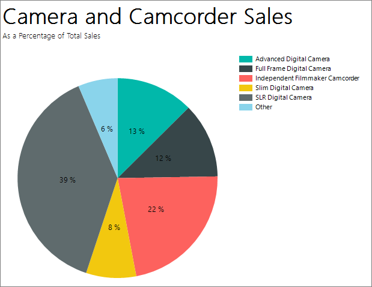
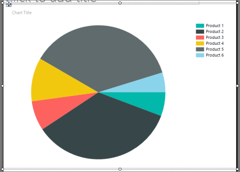
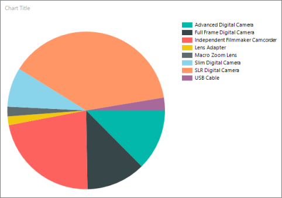
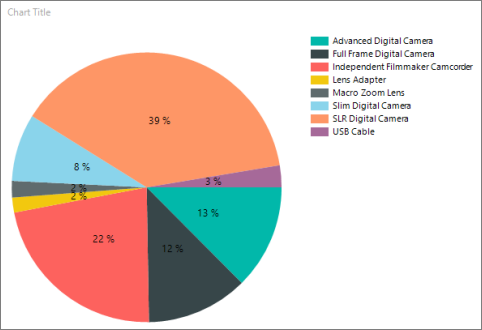
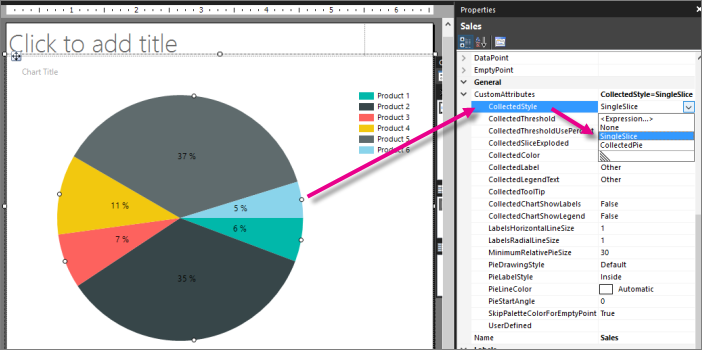
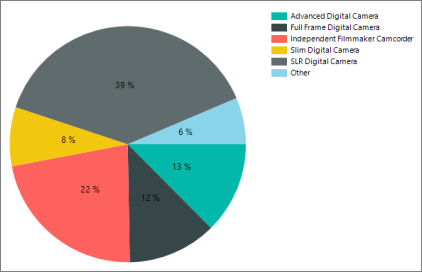
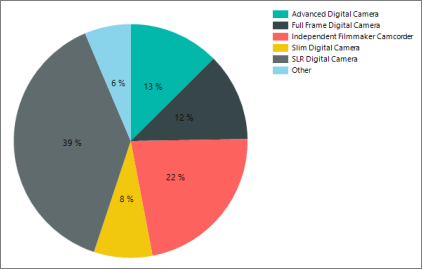

# Tutorial: Add a Pie Chart to Your Report (Report Builder)
In this tutorial, you create pie chart in a Reporting Services paginated report. You add percentages and combine small slices into a single slice.

Pie and doughnut charts display data as a proportion of the whole. They have no axes. When you add a numeric field to a pie chart, the chart calculates the percentage of each value to the total.  

This illustration shows the pie chart you will create. 
 

  
If there are too many data points on a pie chart, your data point labels might be too crowded to read. In that case, consider combining a number of small slices into one larger slice. Pie charts are more readable when you have aggregated your data into a few data points.  
 
> [!NOTE]  
> In this tutorial, the steps for the wizard are consolidated into two procedures. For step-by-step instructions about how to browse to a report server, add a data source, and add a dataset, see the first tutorial in this series: [Tutorial: Creating a Basic Table Report &#40;Report Builder&#41;](../reporting-services/tutorial-creating-a-basic-table-report-report-builder.md).  
  
Estimated time to complete this tutorial: 10 minutes  
  
## Requirements  
For information about requirements, see [Prerequisites for Tutorials &#40;Report Builder&#41;](../reporting-services/prerequisites-for-tutorials-report-builder.md).  
  
## <a name="Chart"></a>1. Create a Pie Chart from the Chart Wizard  
In this section, you use the Chart Wizard to create an embedded dataset, choose a shared data source, and create a pie chart.  

  
1.  [Start Report Builder](../reporting-services/report-builder/start-report-builder.md) either from your computer, the [!INCLUDE[ssRSnoversion_md](../includes/ssrsnoversion-md.md)] web portal, or SharePoint integrated mode.  
  
    The **New Report or Dataset** dialog box opens.  
  
    If you don't see the **New Report or Dataset** dialog box, on the **File** menu > **New**.  
  
2.  In the left pane, verify that **New Report** is selected.  
  
3.  In the right pane, click **Chart Wizard**.  
  
4.  On the **Choose a dataset** page, click **Create a dataset**, and then click **Next**.  
  
5.  On the **Choose a connection to a data source** page, select an existing data source or browse to the report server and select a data source, and then click **Next**. You may need to enter a user name and password.  
  
    > [!NOTE]  
    > The data source you choose is unimportant, as long as you have adequate permissions. You will not be getting data from the data source. For more information, see [Alternative Ways to Get a Data Connection &#40;Report Builder&#41;](../reporting-services/alternative-ways-to-get-a-data-connection-report-builder.md).  
  
6.  On the **Design a Query** page, click **Edit as Text**.  
  
7.  Paste the following query into the query pane:  

    > [!NOTE]  
    > In this tutorial, the query contains the data values, so it does not need an external data source. This makes the query long. In a business environment, a query would not contain the data. This is for learning purposes only.  
  
    ```  
    SELECT 'Advanced Digital Camera' AS Product, CAST(254995.21 AS money) AS Sales  
    UNION SELECT 'Slim Digital Camera' AS Product, CAST(164499.04 AS money) AS Sales  
    UNION SELECT 'SLR Digital Camera' AS Product, CAST(782176.79 AS money) AS Sales  
    UNION SELECT 'Lens Adapter' AS Product, CAST(36333.08 AS money) AS Sales  
    UNION SELECT 'Macro Zoom Lens' AS Product, CAST(40199.3 AS money) AS Sales  
    UNION SELECT 'USB Cable' AS Product, CAST(53245.5 AS money) AS Sales  
    UNION SELECT 'Independent Filmmaker Camcorder' AS Product, CAST(452288.0 AS money) AS Sales  
    UNION SELECT 'Full Frame Digital Camera' AS Product, CAST(247250.85 AS money) AS Sales  
    ```  
  
8.  (Optional) Click the Run button (**!**) to see the data your chart will be based on.  
  
9. Click **Next**.  
  
## <a name="ChartType"></a>2. Choose the Chart Type  
You can choose from a variety of predefined chart types.  

  
1.  On the **Choose a chart type** page, click **Pie**, then click **Next**. The **Arrange chart fields** page opens.  
  
    On the **Arrange chart fields** page, drag the Product field to the **Categories** pane. Categories define the number of slices in the pie chart. In this example, there will be eight slices, one for each product.  
  
2.  Drag the Sales field to the **Values** pane. Sales represents the sales amount for the subcategory. The **Values** pane displays `[Sum(Sales)]` because the chart displays the aggregate for each product.  
  
3.  Click **Next** to see a preview.  
  
5.  Click **Finish**.  
  
    The chart is added to the design surface. You don't see the actual values of the pie chart -- you see Product 1, Product 2, etc., to give an idea of how the chart will look.  
    
    
  
6.  Click the chart to display the chart handles. Drag the bottom-right corner of the chart to make it bigger. Note that the report design surface also gets bigger, to accommodate the chart size.  
  
7.  Click **Run** to preview the report.  
  
The report displays the pie chart with eight slices, one for each product. Now you see the actual products and the size of each slice represents the sales for that product. Three of the slices are quite thin.  


  
## <a name="Percentages"></a>3. Display Percentages in Each Slice  
On each slice of the pie, you can display a percentage for this slice compared to the whole pie.  

  
1.  Switch to report design view.  
  
2.  Right-click the pie chart and click **Show Data Labels**. The data labels appear on the chart.  
  
3.  Right-click a label, then click **Series Label Properties**.  
  
4.  In the **Label data** box, select **#PERCENT**.  
    
5.  (Optional) To specify how many decimal places the label shows, in the **Label data** box after **#PERCENT**, type **{Pn}** where *n* is the number of decimal places to display. For example, to display no decimal places, type **#PERCENT{P0}**.  

6.  To display values as percentages, the UseValueAsLabel property must be false. If you are prompted to set this value in the **Confirm Action** dialog, click **Yes**.  
  
    > [!NOTE]  
    > **Number Format** in the **Series Label Properties** dialog box has no effect when you format percentages. This formats the labels as percentages, but does not calculate the percentage of the pie that each slice represents.  
  
6.  [!INCLUDE[clickOK](../includes/clickok-md.md)]  
  
7.  Click **Run** to preview the report.  
  
The report displays the percentage of the whole for each pie slice.  


  
## <a name="CombineSlices"></a>4. Combine Small Slices into One Slice  
Three of the slices in the pie are quite small. You can combine multiple small slices into one larger "Other" slice that represents all three.  

1.  Switch to report design view.  
  
2.  If the Properties pane isn't showing, on the **View** tab > **Show/Hide** group > select **Properties**.  
  
3.  On the design surface, click on any slice of the pie chart. The properties for the series are displayed in the Properties pane.  
  
4.  In the **General** section, expand the **CustomAttributes** node.  
  
5.  Set the **CollectedStyle** property to **SingleSlice**.  

    
 
6.  Verify that the **CollectedThreshold** property is set to 5.  
  
7.  Verify that the **CollectedThresholdUsePercent** property is set to **True**.  
  
8.  On the **Home** tab, click **Run** to preview the report.  
  
In the legend, you now see the category "Other". The new pie slice combines all the slices that were under 5% into one slice that is 6% of the whole pie.  


 
## <a name="DrawingEffect"></a>5. Start pie chart values at the top 

By default in pie charts, the first value in the dataset starts at 90 degrees from the top of the pie. You see that in the pie chart in the previous sections.

In this section, we'll make the first value start at the top.

1.  Switch to report design view.  

2. Select the pie itself.

3. In the Properties pane, under **Custom Attributes**, change PieStartAngle from **0** to **270**.

4. Click **Run** to preview your report.

Now the pie chart slices are in alphabetical order, starting at the top, and ending with the "Other" slice.


  
## <a name="Title"></a>6. Add a Report Title  
  
Because the pie chart is the only visualization in the report, the chart doesn't need its own title. The report title will do.
  
1.  In the chart, select the Chart Title box and press DELETE.

2. n the design surface, click **Click to add title**.  
  
2.  Type **Camera and Camcorder Sales**, press ENTER, and then type **As a Percentage of Total Sales**, so it looks like this:  
  
    **Camera and Camcorder Sales**  
  
    **As a Percentage of Total Sales**  
  
3.  Select **Camera and Camcorder Sales**, and on the **Home** tab > **Font** section > click **Bold**.  
  
4.  Select **As a Percentage of Total Sales**, and on the **Home** tab > **Font** section > set the font size to **10**.  
  
5.  (Optional) You may need to make the Title text box taller to accommodate the two lines of text.  
  
    This title will appear at the top of the report. When there is no page header defined, items at the top of the report body are the equivalent of a report header.  
  
6.  Click **Run** to preview the report.  
  
## <a name="Save"></a>7. Save the Report  
  
### To save the report  
  
1.  Switch to report design view.  
  
2.  On the **File** menu, click **Save**.  
  
3.  In **Name**, type **Sales Pie Chart**.  
  
4.  Click **Save**.  
  
Your report is saved on the report server.  
  
## Next Steps  
You have successfully completed the Adding a Pie Chart to Your Report tutorial. To learn more about charts, see [Charts &#40;Report Builder and SSRS&#41;](../reporting-services/report-design/charts-report-builder-and-ssrs.md) and [Sparklines and Data Bars &#40;Report Builder and SSRS&#41;](../reporting-services/report-design/sparklines-and-data-bars-report-builder-and-ssrs.md).  
  
## See Also  
[Report Builder Tutorials](../reporting-services/report-builder-tutorials.md)  
[Report Builder in SQL Server](../reporting-services/report-builder/report-builder-in-sql-server-2016.md)  
  

