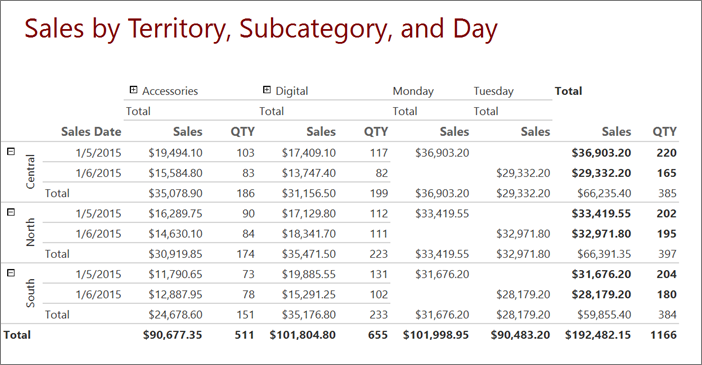
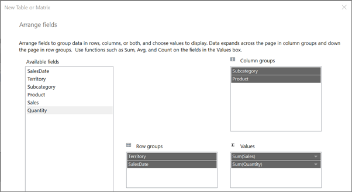
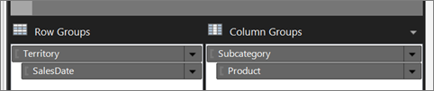
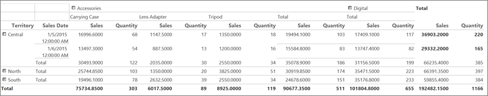
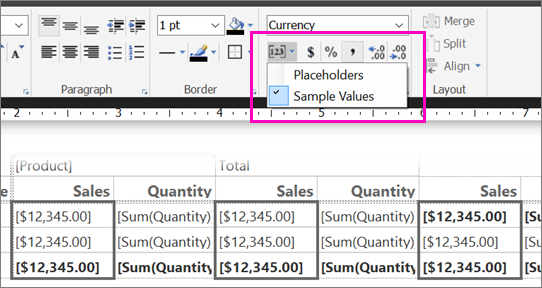
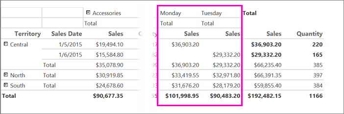
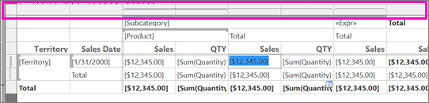
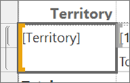

# Tutorial: Creating a Matrix Report (Report Builder)
This tutorial teaches you to create a [!INCLUDE[ssRSnoversion_md](../includes/ssrsnoversion-md.md)] paginated report with a matrix of sample sales data in nested row and column groups. 

You also create an adjacent column group, format columns, and rotate text. The following illustration shows a report similar to the one you will create.  
  

   
Estimated time to complete this tutorial: 20 minutes.  
  
## Requirements  
For information about requirements, see [Prerequisites for Tutorials](../reporting-services/prerequisites-for-tutorials-report-builder.md). 
  
## <a name="CreateMatrix"></a>1. Create a Matrix Report and Dataset from the New Table or Matrix Wizard  
In this section, you choose a shared data source, create an embedded dataset, and then display the data in a matrix.  
  
> [!NOTE]  
> In this tutorial, the query already contains the data values, so that it does not need an external data source. This makes the query quite long. In a business environment, a query would not contain the data. This is for learning purposes only.  
  
### To create a matrix  
  
1.  [Start Report Builder](../reporting-services/report-builder/start-report-builder.md) either from your computer, the [!INCLUDE[ssRSnoversion_md](../includes/ssrsnoversion-md.md)] web portal, or SharePoint integrated mode.  
  
    The **New Report or Dataset** dialog box opens.  
  
    If you don't see the **New Report or Dataset** dialog box, on the **File** menu > **New**.  
  
2.  In the left pane, verify that **New Report** is selected.  
  
3.  In the right pane, click **Table or Matrix Wizard**.  
  
4.  On the **Choose a dataset** page, click **Create a dataset**.  
  
5.  Click **Next**.  
  
6.  On the **Choose a connection to a data source** page, select an existing data source, or browse to the report server and select a data source. If no data source is available or you do not have access to a report server, you can use an embedded data source instead. For information about creating an embedded data source, see [Tutorial: Creating a Basic Table Report &#40;Report Builder&#41;](../reporting-services/tutorial-creating-a-basic-table-report-report-builder.md).  
  
7.  Click **Next**.  
  
8.  On the **Design a query** page, click **Edit as Text**.  
  
9. Copy and paste the following query into the query pane:  
  
    ```  
    SELECT CAST('2015-01-05' AS date) as SalesDate, 'Central' as Territory, 'Accessories' as Subcategory,'Carrying Case' as Product, CAST(16996.60 AS money) AS Sales, 68 as Quantity  
    UNION SELECT CAST('2015-01-05' AS date) as SalesDate, 'North' as Territory, 'Accessories' as Subcategory, 'Carrying Case' as Product, CAST(13747.25 AS money) AS Sales, 55 as Quantity  
    UNION SELECT CAST('2015-01-05' AS date) as SalesDate, 'South' as Territory, 'Accessories' as Subcategory,'Carrying Case' as Product, CAST(9248.15 AS money) As Sales, 37 as Quantity  
    UNION SELECT CAST('2015-01-05' AS date) as SalesDate, 'Central' as Territory, 'Accessories' as Subcategory,'Tripod' as Product, CAST(1350.00 AS money) AS Sales, 18 as Quantity  
    UNION SELECT CAST('2015-01-05' AS date) as SalesDate, 'North' as Territory, 'Accessories' as Subcategory,'Tripod' as Product, CAST(1800.00 AS money) AS Sales, 24 as Quantity  
    UNION SELECT CAST('2015-01-05' AS date) as SalesDate, 'South' as Territory, 'Accessories' as Subcategory,'Tripod' as Product, CAST(1125.00 AS money) AS Sales, 15 as Quantity  
    UNION SELECT CAST('2015-01-05' AS date) as SalesDate, 'Central' as Territory, 'Accessories' as Subcategory,'Lens Adapter' as Product, CAST(1147.50 AS money) AS Sales, 17 as Quantity  
    UNION SELECT CAST('2015-01-05' AS date) as SalesDate, 'North' as Territory, 'Accessories' as Subcategory,  'Lens Adapter' as Product, CAST(742.50 AS money) AS Sales, 11 as Quantity  
    UNION SELECT CAST('2015-01-05' AS date) as SalesDate, 'South' as Territory, 'Accessories' as Subcategory,'Lens Adapter' as Product, CAST(1417.50 AS money) AS Sales, 21 as Quantity  
    UNION SELECT CAST('2015-01-06' AS date) as SalesDate, 'Central' as Territory, 'Accessories' as Subcategory, 'Carrying Case' as Product, CAST(13497.30 AS money) AS Sales, 54 as Quantity  
    UNION SELECT CAST('2015-01-06' AS date) as SalesDate, 'North' as Territory, 'Accessories' as Subcategory, 'Carrying Case' as Product, CAST(11997.60 AS money) AS Sales, 48 as Quantity  
    UNION SELECT CAST('2015-01-06' AS date) as SalesDate, 'South' as Territory, 'Accessories' as Subcategory, 'Carrying Case' as Product, CAST(10247.95 AS money) As Sales, 41 as Quantity  
    UNION SELECT CAST('2015-01-06' AS date) as SalesDate, 'Central' as Territory, 'Accessories' as Subcategory, 'Tripod' as Product, CAST(1200.00 AS money) AS Sales, 16 as Quantity  
    UNION SELECT CAST('2015-01-06' AS date) as SalesDate, 'North' as Territory, 'Accessories' as Subcategory,'Tripod' as Product, CAST(2025.00 AS money) AS Sales, 27 as Quantity  
    UNION SELECT CAST('2015-01-06' AS date) as SalesDate, 'South' as Territory, 'Accessories' as Subcategory,'Tripod' as Product, CAST(1425.00 AS money) AS Sales, 19 as Quantity  
    UNION SELECT CAST('2015-01-06' AS date) as SalesDate, 'Central' as Territory, 'Accessories' as Subcategory,'Lens Adapter' as Product, CAST(887.50 AS money) AS Sales, 13 as Quantity  
    UNION SELECT CAST('2015-01-06' AS date) as SalesDate, 'North' as Territory, 'Accessories' as Subcategory, 'Lens Adapter' as Product, CAST(607.50 AS money) AS Sales, 9 as Quantity  
    UNION SELECT CAST('2015-01-06' AS date) as SalesDate, 'South' as Territory, 'Accessories' as Subcategory,'Lens Adapter' as Product, CAST(1215.00 AS money) AS Sales, 18 as Quantity  
    UNION SELECT CAST('2015-01-05' AS date) as SalesDate,  'Central' as Territory, 'Digital' as Subcategory,'Compact Digital' as Product, CAST(10191.00 AS money) AS Sales, 79 as Quantity  
    UNION SELECT CAST('2015-01-05' AS date) as SalesDate,  'North' as Territory, 'Digital' as Subcategory, 'Compact Digital' as Product, CAST(8772.00 AS money) AS Sales, 68 as Quantity  
    UNION SELECT CAST('2015-01-05' AS date) as SalesDate,  'South' as Territory, 'Digital' as Subcategory, 'Compact Digital' as Product, CAST(10578.00 AS money) AS Sales, 82 as Quantity  
    UNION SELECT CAST('2015-01-05' AS date) as SalesDate, 'Central' as Territory,'Digital' as Subcategory, 'Slim Digital' as Product, CAST(7218.10 AS money) AS Sales, 38 as Quantity  
    UNION SELECT CAST('2015-01-05' AS date) as SalesDate, 'North' as Territory,'Digital' as Subcategory, 'Slim Digital' as Product, CAST(8357.80 AS money) AS Sales, 44 as Quantity  
    UNION SELECT CAST('2015-01-05' AS date) as SalesDate, 'South' as Territory,'Digital' as Subcategory,'Slim Digital' as Product, CAST(9307.55 AS money) AS Sales, 49 as Quantity  
    UNION SELECT CAST('2015-01-06' AS date) as SalesDate,  'Central' as Territory, 'Digital' as Subcategory,'Compact Digital' as Product, CAST(3870.00 AS money) AS Sales, 30 as Quantity  
    UNION SELECT CAST('2015-01-06' AS date) as SalesDate,  'North' as Territory, 'Digital' as Subcategory,'Compact Digital' as Product, CAST(5805.00 AS money) AS Sales, 45 as Quantity  
    UNION SELECT CAST('2015-01-06' AS date) as SalesDate,  'South' as Territory, 'Digital' as Subcategory, 'Compact Digital' as Product, CAST(8643.00 AS money) AS Sales, 67 as Quantity  
    UNION SELECT CAST('2015-01-06' AS date) as SalesDate, 'Central' as Territory, 'Digital' as Subcategory, 'Slim Digital' as Product, CAST(9877.40 AS money) AS Sales, 52 as Quantity  
    UNION SELECT CAST('2015-01-06' AS date) as SalesDate, 'North' as Territory, 'Digital' as Subcategory, 'Slim Digital' as Product, CAST(12536.70 AS money) AS Sales, 66 as Quantity  
    UNION SELECT CAST('2015-01-06' AS date) as SalesDate, 'South' as Territory, 'Digital' as Subcategory, 'Slim Digital' as Product, CAST(6648.25 AS money) AS Sales, 35 as Quantity  
    ```  
  
10. (optional) Click the Run icon (!) to run the query and see the data.

11. Click **Next**.  
  
## <a name="Groups"></a>2. Organize Data and Choose Layout from the New Table or Matrix Wizard  
Use the wizard to provide a starting design on which to display data. The preview pane in the wizard helps you to visualize the result of grouping data before you complete the matrix design.  
  
1.  On the **Arrange fields** page, drag Territory from **Available fields** to **Row groups**.  
  
2.  Drag SalesDate to **Row groups** and place it below Territory.  
  
    The order in which fields are listed in **Row groups** defines the group hierarchy. Steps 1 and 2 organize the values of the fields first by territory, and then by sales date.  
  
3.  Drag Subcategory to **Column groups**.  
  
4.  Drag Product to **Column groups** and place it below Subcategory.  
  
    Again, the order in which fields are listed in **Column groups** defines the group hierarchy. Steps 3 and 4 organize the values for the fields first by subcategory, and then by product.  
  
5.  Drag Sales to **Values**.  
  
    Sales is summarized with the Sum function, the default function to summarize numeric fields.  
  
6.  Drag Quantity to **Values**.  
  
    Quantity is summarized with the Sum function.  
  
    Steps 5 and 6 specify the data to display in the matrix data cells.
    
      
  
7.  Click **Next**.  
  
8.  On the Choose the Layout page, under **Options**, verify that **Show subtotals and grand totals** is selected.  
  
9. Verify that **Blocked, subtotal below** is selected.  
  
10. Verify the option **Expand/collapse groups** is selected.  
  
11. Click **Next**.  
  
13. Click **Finish**.  
  
    The matrix is added to the design surface. The Row Groups pane shows two row groups: Territory and SalesDate. The Column Groups pane shows two column groups: Subcategory and Product. Detail data is all the data that is retrieved by the dataset query.  
    
    
  
14. Click **Run** to preview the report.  
  
    For each product that is sold on a specific date, the matrix shows the subcategory to which the product belongs and the territory of the sales.  

14. Expand a subcategory. You can see the report quickly gets quite wide.


  
## <a name="FormatData"></a>3. Format Data  
By default, the summary data for the Sales field displays a general number and the SalesDate field displays both date and time information. In this section, you format the Sales field to display the number as currency and the SalesDate field to display only the date. Toggle **Placeholder Styles** to display formatted text boxes and placeholder text as sample values.  
  
### To format fields  
  
1.  Click **Design** to switch to design view.  
  
2.  Press the Ctrl key, and then select the nine cells that contain `[Sum(Sales)]`.  
  
3.  On the **Home** tab > **Number** > **Currency**. The cells change to show the formatted currency.  
  
    If your regional setting is English (United States), the default sample text is [**$12,345.00**]. If you do not see an example currency value, in the **Numbers** group, click **Placeholder Styles** > **Sample Values**.  
    
    
  
4.  Click the cell that contains `[SalesDate]`.  
  
5.  In the **Number** group > **Date**.  
  
    The cell displays the example date **[1/31/2000]**. If you do not see an example date, click **Placeholder Styles** in the **Numbers** group, and then click **Sample Values**.  
  
6.  Click **Run** to preview your report.  
  
The date values display only dates and the sales values display as currency.  
  
## <a name="AdjacentGroup"></a>4. Add Adjacent Column Group  
You can nest row and column groups in parent-child relationships, or adjacent in sibling relationships.  
  
In this section, you add a column group adjacent to the Subcategory column group, copy cells to populate the new column group, and then use an expression to create the value of the column group header.  
  
### To add an adjacent column group  
  
1.  Click **Design** to return to design view.  
  
2.  Right-click the cell that contains `[Subcategory]`, point to **Add Group**, and then click **Adjacent Right**.  
  
    The **Tablix Group** dialog box opens.  
  
3.  In the **Group By** list, select SalesDate, and then click **OK**.  
  
    A new column group is added to the right of the Subcategory column group.  
  
4.  Right-click the cell in the new column group that contains `[SalesDate],` and then click **Expression**.  
  
5.  Copy the following expression to the expression box.  
  
    ```  
    =WeekdayName(DatePart("w",Fields!SalesDate.Value))  
    ```  
  
    This expression extracts the weekday name from the sales date. For more information, see [Expressions &#40;Report Builder and SSRS&#41;](../reporting-services/report-design/expressions-report-builder-and-ssrs.md).  
  
6.  Right-click the cell in the Subcategory column group that contains Total, and then click **Copy**.  
  
7.  Right-click the cell immediately below the cell that contains the expression you created in step 5 and click **Paste**.  
  
8.  Press the Ctrl key.  
  
9. In the Subcategory group, click the Sales column header and the three cells below it, right-click, and then click **Copy**.  
  
10. Paste the four cells into the four empty cells in the new column group.  
  
11. Click **Run** to preview the report.  
  
The report includes columns named Monday and Tuesday. The dataset contains only data for these two days.  


  
> [!NOTE]  
> If the data included other days, the report would include columns for them as well. Each column has the column header, **Sales**, and sales totals by territory.  
  
## <a name="Width"></a>5. Change Column Widths  
A report that includes a matrix typically expands horizontally as well as vertically when it runs. Controlling horizontal expansion is particularly important if you plan to export the report to formats such as Microsoft Word or Adobe PDF that are used for printed reports. If the report expands horizontally across multiple pages, the printed report is difficult to understand. To minimize horizontal expansion, you can resize columns to be only the width necessary to display the data without wrapping. You can also rename columns so that their titles fit the width needed to display the data.  
  
### To rename and resize the columns  
  
1.  Click **Design** to return to design view.  
  
2.  Select the text in the furthest Quantity column to the left, and then type **QTY**.  
  
    The column title is now QTY.  
  
3.  Repeat step 2 for the two other columns named Quantity.
  
4.  Click the matrix so that column and row handles appear above and next to the matrix.  
  
    The gray bars along the top and side of the table are the column and row handles.  
    
    
  
5.  To resize the QTY column farthest to the left, point to the line between column handles so that the cursor changes into a double arrow. Drag the column towards the left until it is 1/2 inch wide.  
  
    A column width of 1/2 inch is adequate to display the quantity.  
  
6.  Repeat step 5 for the other columns named QTY.  
  
7.  Click **Run** to preview your report.  
  
The columns that contain quantities are now narrower and are named QTY.  
  
## <a name="MergeCells"></a>6. Merge Matrix Cells  
The corner area is in the upper left corner of the matrix. Depending on the number of row and column groups in the matrix, the number of cells in the corner area varies. The matrix, built in this tutorial, has four cells in its corner area. The cells are arranged in two rows and two columns, reflecting the depth of row and column group hierarchies. The four cells are not used in this report and you will merge them into one.  
  
### To merge matrix cells  
  
1.  Click **Design** to return to design view.  
  
2.  Click the matrix so that column and row handles appear above and next to the matrix.  
  
3.  Press the Ctrl key and select the four corner cells.  
  
4.  Right-click the cells and click **Merge Cells**.  
  
5.  Right-click the new merged cell and click **Text Box Properties**.  
  
6.  On the **Border** tab > **Presets** > **None**.
  
9. Select **OK**.
  
10. Click **Run** to preview your report.  
  
The cell in the upper corner of the matrix is no longer visible. 
  
## <a name="HeaderTitle"></a>7. Add a Report Header and Report Title  
A report title appears at the top of the report. You can place the report title in a report header or if the report does not use one, in a text box at the top of the report body. In this tutorial, you will remove the text box at the top of the report and add a title to the header.  
  
### To add a report header and report title  
  
1.  Click **Design** to return to design view.  
  
2.  Select the text box at the top of the report body that contains **Click to add title**, and then press the Delete key.  
  
3.  On the **Insert** tab > **Header** > **Add Header**.  
  
    A header is added to the top of the report body.  
  
4.  On the **Insert** tab, click **Text Box**, and then drag a text box inside the report header. Make the text box about 6 inches long and 3/4 inch tall and place it on the left side of the report header.  
  
5.  In the text box, type **Sales by Territory, Subcategory, and Day**.  
  
6.  Select the text you typed, on the **Home** tab > **Font**:
    * **Size 24 pt**
    * **Color Maroon**
 
10. Click **Run** to preview the report.  
  
The report includes a report title in the report header.  
  
## <a name="Save"></a>8. Save the Report  
You can save reports to a report server, SharePoint library, or your computer.  
  
In this tutorial, save the report to a report server. If you do not have access to a report server, save the report to your computer.  
  
### To save the report on a report server  
  
1.  From the **Report Builder** button, click **Save As**.  
  
2.  Click **Recent Sites and Servers**.  
  
3.  Select or type the name of the report server where you have permission to save reports.  
  
    The message "Connecting to report server" appears. When the connection is complete, you will see the contents of the report folder that the report server administrator specified as the default report location.  
  
4.  In **Name**, replace the default name with **SalesByTerritorySubcategory**.  
  
5.  Click **Save**.  
  
The report is saved to the report server. The name of report server that you are connected to appears in the status bar at the bottom of the window.  
  
#### To save the report on your computer  
  
1.  From the **Report Builder** button, click **Save As**.  
  
2.  Click **Desktop**, **My Documents**, or **My computer**, and then browse to the folder where you want to save the report.  
  
3.  In **Name**, replace the default name with **SalesByTerritorySubcategory**.  
  
4.  Click **Save**.  
  
## <a name="RotateTextBox"></a>9. (Optional) Rotate Text Box 270 Degrees  
A report with matrices can expand horizontally and vertically when it runs. By rotating text boxes vertically, or 270 degrees, you can save horizontal space. The rendered report is then narrower and if exported to a format such as Microsoft Word, will be more likely to fit on a printed page.  
  
A text box can also display text as horizontal, vertical (top to bottom). For more information, see [Text Boxes &#40;Report Builder and SSRS&#41;](../reporting-services/report-design/text-boxes-report-builder-and-ssrs.md).  
  
### To rotate text box 270 degrees  
  
1.  Click **Design** to return to design view.  
  
2.  Select the cell that contains `[Territory].` 

    > [!NOTE]  
    > Select the cell, not the text. The WritingMode property is only available for the cell.

    
  
3.  In the Properties pane, locate the WritingMode property and change it from **Default** to **Rotate270**.  
  
    If the Properties pane is not open, click the **View** tab of the ribbon, and then select **Properties**.  
  
4.  Verify that the CanGrow property is set to **True**.  
  
5.  On the **Home** tab > **Paragraph** section, select **Middle** and **Center** to locate the text in the center of the cell both vertically and horizontally.  
 
6. Resize the Territory column to be 1/2 inch wide and delete the column title.  
6.  Click **Run** to preview your report.  
  
The territory name is written vertically, bottom to top. The height of the Territory row group varies by the length of the territory name.  
  
## Next Steps  
This concludes the tutorial for how to create a matrix report. For more information about matrices, see: 
-    [Tables, Matrices, and Lists](../reporting-services/report-design/tables-matrices-and-lists-report-builder-and-ssrs.md)
-    [Create a Matrix](../reporting-services/report-design/create-a-matrix-report-builder-and-ssrs.md)
-    [Tablix Data Region Areas](../reporting-services/report-design/tablix-data-region-areas-report-builder-and-ssrs.md) 
-    [Tablix Data Region Cells, Rows, and Columns](../reporting-services/report-design/tablix-data-region-cells-rows-and-columns-report-builder-and-ssrs.md)  
  
## See Also  
[Report Builder Tutorials](../reporting-services/report-builder-tutorials.md)  
[Report Builder in SQL Server](../reporting-services/report-builder/report-builder-in-sql-server-2016.md)  
  

