# Tutorial: Introducing Expressions
In this [!INCLUDE[ssRBnoversion_md](../includes/ssrbnoversion.md)] tutorial, you use expressions with common functions and operators to create powerful and flexible [!INCLUDE[ssRSnoversion_md](../includes/ssrsnoversion-md.md)] paginated reports. 

You will write expressions that concatenate name values, look up values in a separate dataset, display different colors based on field values, and so on.  
  
The report is a banded report with alternating rows in white and a color. The report includes a parameter for selecting the color of the non-white rows.  
  
This illustration shows a report similar to the one you will create.  
  
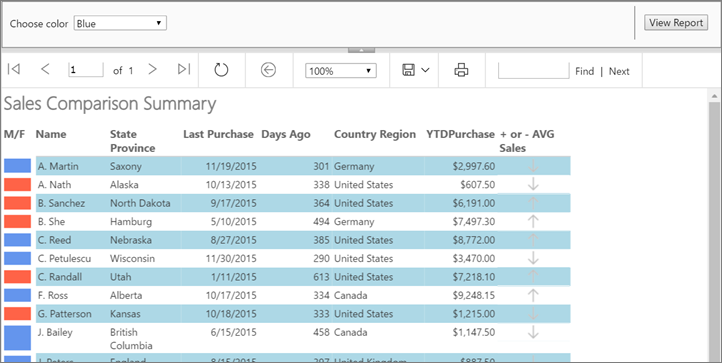 
  
Estimated time to complete this tutorial: 30 minutes.  
  
## Requirements  
For information about requirements, see [Prerequisites for Tutorials &#40;Report Builder&#41;](../reporting-services/prerequisites-for-tutorials-report-builder.md).  
  
## <a name="Setup"></a>1. Create a Table Report and Dataset from the Table or Matrix Wizard  
In this section, you create a table report, a data source, and a dataset. When you lay out the table, you will include only a few fields. After you complete the wizard you will manually add columns. The wizard makes it easy to lay out the table.  
  
> [!NOTE]  
> In this tutorial, the query contains the data values, so it does not need an external data source. This makes the query quite long. In a business environment, a query would not contain the data. This is for learning purposes only.  
  
### To create a table report  
  
1.  [Start Report Builder](../reporting-services/report-builder/start-report-builder.md) either from your computer, the [!INCLUDE[ssRSnoversion_md](../includes/ssrsnoversion-md.md)] web portal, or SharePoint integrated mode.  
  
    The **New Report or Dataset** dialog box opens.  
  
    If you don't see the **New Report or Dataset** dialog box, on the **File** menu > **New**.  
  
2.  In the left pane, verify that **New Report** is selected.  
  
3.  In the right pane, click **Table or Matrix Wizard**.  
  
4.  On the **Choose a dataset** page, click **Create a dataset** > **Next**.  
  
6.  On the **Choose a connection to a data source** page, select a data source that is type **SQL Server**. Select a data source from the list or browse to the report server to select one.  

    > [!NOTE]  
    > The data source you choose isn't important, as long as you have adequate permissions. You will not be getting data from the data source. For more information, see [Alternative Ways to Get a Data Connection &#40;Report Builder&#41;](../reporting-services/alternative-ways-to-get-a-data-connection-report-builder.md).  
  
7.  Click **Next**.  
  
8.  On the **Design a query** page, click **Edit as Text**.  
  
9. Paste the following query into the query pane:  
  
    ```  
    SELECT 'Lauren' AS FirstName,'Johnson' AS LastName, 'American Samoa' AS StateProvince, 1 AS CountryRegionID,'Female' AS Gender, CAST(9996.60 AS money) AS YTDPurchase, CAST('2015-6-10' AS date) AS LastPurchase  
    UNION SELECT'Warren' AS FirstName, 'Pal' AS LastName, 'New South Wales' AS StateProvince, 2 AS CountryRegionID, 'Male' AS Gender, CAST(5747.25 AS money) AS YTDPurchase, CAST('2015-7-3' AS date) AS LastPurchase  
    UNION SELECT 'Fernando' AS FirstName, 'Ross' AS LastName, 'Alberta' AS StateProvince, 3 AS CountryRegionID, 'Male' AS Gender, CAST(9248.15 AS money) AS YTDPurchase, CAST('2015-10-17' AS date) AS LastPurchase  
    UNION SELECT 'Rob' AS FirstName, 'Caron' AS LastName, 'Northwest Territories' AS StateProvince, 3 AS CountryRegionID, 'Male' AS Gender, CAST(742.50 AS money) AS YTDPurchase, CAST('2015-4-29' AS date) AS LastPurchase  
    UNION SELECT 'James' AS FirstName, 'Bailey' AS LastName, 'British Columbia' AS StateProvince, 3 AS CountryRegionID, 'Male' AS Gender, CAST(1147.50 AS money) AS YTDPurchase, CAST('2015-6-15' AS date) AS LastPurchase  
    UNION SELECT  'Bridget' AS FirstName, 'She' AS LastName, 'Hamburg' AS StateProvince, 4 AS CountryRegionID, 'Female' AS Gender, CAST(7497.30 AS money) AS YTDPurchase, CAST('2015-5-10' AS date) AS LastPurchase  
    UNION SELECT 'Alexander' AS FirstName, 'Martin' AS LastName, 'Saxony' AS StateProvince, 4 AS CountryRegionID, 'Male' AS Gender, CAST(2997.60 AS money) AS YTDPurchase, CAST('2015-11-19' AS date) AS LastPurchase  
    UNION SELECT 'Yolanda' AS FirstName, 'Sharma' AS LastName ,'Micronesia' AS StateProvince, 5 AS CountryRegionID, 'Female' AS Gender, CAST(3247.95 AS money) AS YTDPurchase, CAST('2015-8-23' AS date) AS LastPurchase  
    UNION SELECT 'Marc' AS FirstName, 'Zimmerman' AS LastName, 'Moselle' AS StateProvince, 6 AS CountryRegionID, 'Male' AS Gender, CAST(1200.00 AS money) AS YTDPurchase, CAST('2015-11-16' AS date) AS LastPurchase  
    UNION SELECT 'Katherine' AS FirstName, 'Abel' AS LastName, 'Moselle' AS StateProvince, 6 AS CountryRegionID, 'Female' AS Gender, CAST(2025.00 AS money) AS YTDPurchase, CAST('2015-12-1' AS date) AS LastPurchase  
    UNION SELECT 'Nicolas' as FirstName, 'Anand' AS LastName, 'Seine (Paris)' AS StateProvince, 6 AS CountryRegionID, 'Male' AS Gender, CAST(1425.00 AS money) AS YTDPurchase, CAST('2015-12-11' AS date) AS LastPurchase  
    UNION SELECT 'James' AS FirstName, 'Peters' AS LastName, 'England' AS StateProvince, 12 AS CountryRegionID, 'Male' AS Gender, CAST(887.50 AS money) AS YTDPurchase, CAST('2015-8-15' AS date) AS LastPurchase  
    UNION SELECT 'Alison' AS FirstName, 'Nath' AS LastName, 'Alaska' AS StateProvince, 7 AS CountryRegionID, 'Female' AS Gender, CAST(607.50 AS money) AS YTDPurchase, CAST('2015-10-13' AS date) AS LastPurchase  
    UNION SELECT 'Grace' AS FirstName, 'Patterson' AS LastName, 'Kansas' AS StateProvince, 7 AS CountryRegionID, 'Female' AS Gender, CAST(1215.00 AS money) AS YTDPurchase, CAST('2015-10-18' AS date) AS LastPurchase  
    UNION SELECT 'Bobby' AS FirstName, 'Sanchez' AS LastName, 'North Dakota' AS StateProvince, 7 AS CountryRegionID, 'Female' AS Gender, CAST(6191.00 AS money) AS YTDPurchase, CAST('2015-9-17' AS date) AS LastPurchase  
    UNION SELECT 'Charles' AS FirstName, 'Reed' AS LastName, 'Nebraska' AS StateProvince, 7 AS CountryRegionID, 'Male' AS Gender, CAST(8772.00 AS money) AS YTDPurchase, CAST('2015-8-27' AS date) AS LastPurchase  
    UNION SELECT 'Orlando' AS FirstName, 'Romeo' AS LastName, 'Texas' AS StateProvince, 7 AS CountryRegionID, 'Male' AS Gender, CAST(8578.00 AS money) AS YTDPurchase, CAST('2015-7-29' AS date) AS LastPurchase  
    UNION SELECT 'Cynthia' AS FirstName, 'Randall' AS LastName, 'Utah' AS StateProvince, 7 AS CountryRegionID, 'Female' AS Gender, CAST(7218.10 AS money) AS YTDPurchase, CAST('2015-1-11' AS date) AS LastPurchase  
    UNION SELECT 'Rebecca' AS FirstName, 'Roberts' AS LastName, 'Washington' AS StateProvince, 7 AS CountryRegionID, 'Female' AS Gender, CAST(8357.80 AS money) AS YTDPurchase, CAST('2015-10-28' AS date) AS LastPurchase  
    UNION SELECT 'Cristian' AS FirstName, 'Petulescu' AS LastName, 'Wisconsin' AS StateProvince, 7 AS CountryRegionID, 'Male' AS Gender, CAST(3470.00 AS money) AS YTDPurchase, CAST('2015-11-30' AS date) AS LastPurchase  
    UNION SELECT 'Cynthia' AS FirstName, 'Randall' AS LastName, 'Utah' AS StateProvince, 7 AS CountryRegionID, 'Female' AS Gender, CAST(7218.10 AS money) AS YTDPurchase, CAST('2015-1-11' AS date) AS LastPurchase  
    UNION SELECT 'Rebecca' AS FirstName, 'Roberts' AS LastName, 'Washington' AS StateProvince, 7 AS CountryRegionID, 'Female' AS Gender, CAST(8357.80 AS money) AS YTDPurchase, CAST('2015-10-28' AS date) AS LastPurchase  
    UNION SELECT 'Cristian' AS FirstName, 'Petulescu' AS LastName, 'Wisconsin' AS StateProvince, 7 AS CountryRegionID, 'Male' AS Gender, CAST(3470.00 AS money) AS YTDPurchase, CAST('2015-11-30' AS date) AS LastPurchase  
    ```  

  
10. On the query designer toolbar, click **Run** (**!**). The result set displays 23 rows of data in the following columns: FirstName, LastName, StateProvince, CountryRegionID, Gender, YTDPurchase, and LastPurchase.  

    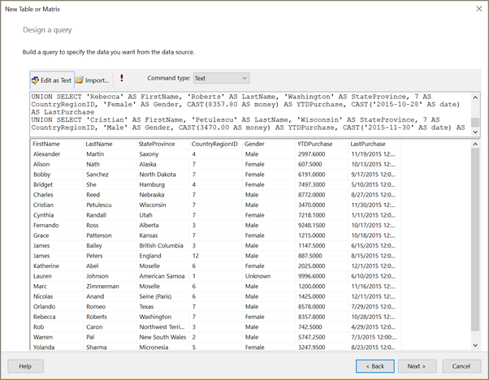
  
11. Click **Next**.  
  
12. On the **Arrange fields** page, drag the following fields, in the specified order, from the **Available Fields** list to the **Values** list.  
  
    -   StateProvince   
    -   CountryRegionID  
    -   LastPurchase  
    -   YTDPurchase  
  
    Because the CountryRegionID and YTDPurchase contain numeric data, the SUM aggregate is applied to them by default, but you don't want them to be sums.  
   
13. In the **Values** list, right-click **CountryRegionID** and clear the **Sum** check box.  
  
    Sum is no longer applied to CountryRegionID.  
  
14. In the **Values** list, right-click **YTDPurchase** and click the **Sum** option.  
  
    Sum is no longer applied to YTDPurchase.  
    
    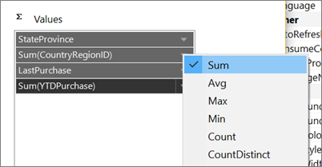
  
15. Click **Next**.  
  
16. On the **Choose the layout** page, keep all the default settings and click **Next**.  

    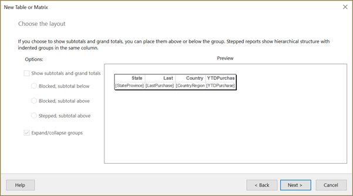
  
17. Click **Finish**.  
  
## <a name="UpdateNames"></a>2. Update Default Names of the Data Source and Dataset  
  
### To update the default name of the data source  
  
1.  In the Report Data pane, expand the **Data Sources** folder.  
  
2.  Right-click **DataSource1** and click **Data Source Properties.**  
  
3.  In the **Name** box, type **ExpressionsDataSource**  
  
4.  Select **OK**.
  
### To update the default name of the dataset  
  
1.  In the Report Data pane, expand the **Datasets** folder.  
  
2.  Right-click **DataSet1** and click **Dataset Properties**.  

    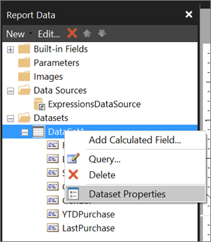
  
3.  In the **Name** box, type **Expressions**  
  
4.  Select **OK**.
  
## <a name="Concatenate"></a>3. Display First Initial and Last Name  
In this section, you use the **Left** function and the **Concatenate** (**&**) operator in an expression that evaluates to a name that includes an initial and a last name. You can build the expression step by step or skip ahead in the procedure and copy/paste the expression from the tutorial into the **Expression** dialog box.   
  
1.  Right-click the **StateProvince** column, point to **Insert Column**, and then click **Left**.  
  
    A new column is added to the left of the **StateProvince** column. 
    
    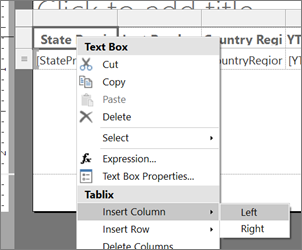 
  
2.  Click the header of the new column and type **Name**.  
  
3.  Right-click the data cell for the **Name** column and click **Expression**.  

    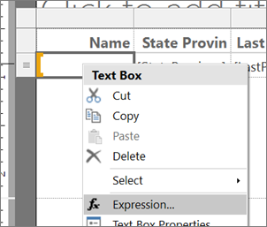
  
4.  In the **Expression** dialog box, expand **Common Functions**, and then click **Text**.  
  
5.  In the **Item** list, double-click **Left**.  
  
    The **Left** function is added to the expression.  
    
    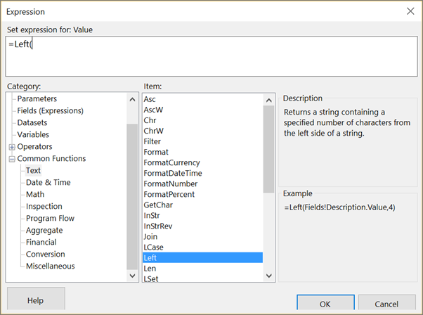
  
6.  In the **Category** list, click **Fields (Expressions)**.  
  
7.  In the **Values** list, double-click **FirstName**.  
  
8.  Type **, 1)**  
  
    This expression extracts one character from the **FirstName** value, counting from the left.  
  
9. Type **&". "&**  

    This adds a period and a space after the expression.
  
10. In the **Values** list, double-click **LastName**.  
  
    The completed expression is: `=Left(Fields!FirstName.Value, 1) &". "& Fields!LastName.Value`  
    
    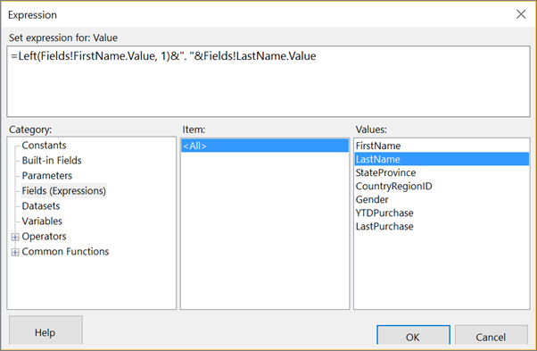
  
11. Select **OK**.
  
12. Click **Run** to preview the report.  

## <a name="DateFormat"></a>(optional) Format the Date and Currency Columns and Header Row  
In this section, you format the **Last Purchase** column, which contains dates, and the YTDPurchase column, which contains currency. You also format the header row.  
  
### To format the date column  
  
1.  Click **Design** to return to design view.  
  
2.  Select the data cell in the **Last Purchase** column, and on the **Home** tab > **Number** section, select **Date**.  

    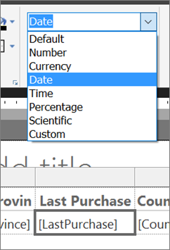
  
3.  Also in the **Number** section, click the arrow next to **Placeholder Styles** and select **Sample Values**. 

    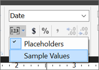

    Now you can see an example of the formatting you selected. 
  
### To format the currency column

- Select the data cell in the **YTDPurchase** column, and in the **Number** section, select **Currency Symbol**.
 
### To format the column headers

1. Select the row of column headers.

2. On the **Home** tab > **Paragraph** section, select **Left**. 

    

3. Click **Run** to preview the report. 

Here's the report so far, with formatted dates, currency, and column headers.

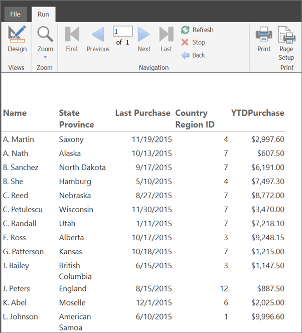

  
## <a name="Gender"></a>4. Use Color to Display Gender  
In this section, you add color to show the gender of a person. You will add a new column to display the color, and then determine the color that appears in the column based on the value of the Gender field.  
  
To keep the color you've applied in that table cell when you make the report a banded report, you add a rectangle and then add the background color to the rectangle.  
    
 
### To add an M/F column  
  
1.  Right-click the **Name** column, point to **Insert Column**, and then click **Left**.  
  
    A new column is added to the left of the **Name** column.  
  
2.  Click the header of the new column and type **M/F**.  
  
### To add a rectangle  
  
1.   On the **Insert** tab, click **Rectangle** and then click in the data cell of the **M/F** column.  
  
     A rectangle is added to the cell.  
     
     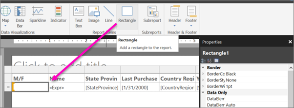
  
2. Drag the column divider between the **M/F** and the **Name** to make the **M/F** column narrower.

    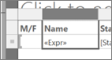
  
### To use color to show gender  
  
1.  Right-click the rectangle in the data cell in the **M/F** column and click **Rectangle Properties**.  
  
2.  In the **Rectangle Properties** dialog box > **Fill** tab, click the expression **fx** button next to **Fill color**.  
  
3.  In the **Expression** dialog box, expand **Common Functions** and click **Program Flow**.  
  
4.  In the **Item** list, double-click **Switch**.  
  
5.  In the **Category** list, click **Fields (Expressions)**.  
  
6.  In the **Values** list, double-click **Gender**.  
  
7.  Type **="Male",** (including the comma).

8. In the **Category** list, click **Constants**, and in the **Values** box, click **Cornflower Blue**.

    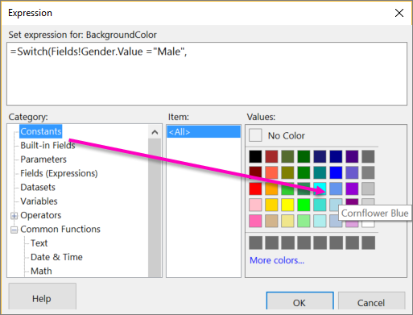

9. Type a comma after it. 
  
5.  In the **Category** list, click **Fields (Expressions)**, and in the **Values** list, double-click **Gender** again.  
  
7.  Type **="Female",** (including the comma). 

8. In the **Category** list, click **Constants**, and in the **Values** box, click **Tomato**.

13. Type a closing parenthesis **)** after it. 
  
    The completed expression is: 
    `=Switch(Fields!Gender.Value ="Male", "CornflowerBlue",Fields!Gender.Value ="Female","Tomato")`  
    
    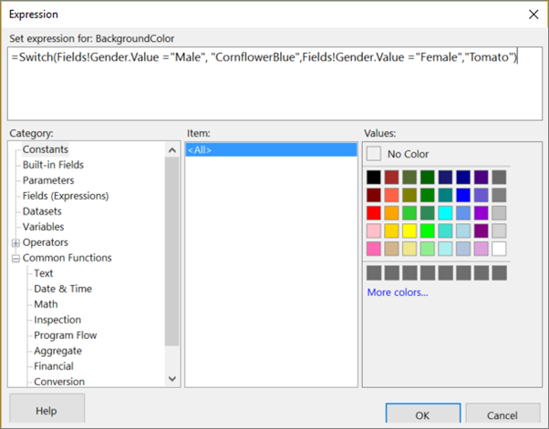
  
12. Click **OK**, then click **OK** again to close the **Rectangle Properties** dialog box.  
  
14. Click **Run** to preview the report.  

    

### To format the color rectangles

1. Click **Design** to return to design view.  

16. Select the rectangle in the **M/F** column. In the Properties pane, in the Border section, set these properties:

    - BorderColor = White
    - BorderStyle = Solid
    - BorderWidth = 5pt
    
    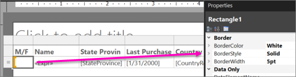

18. Click **Run** to preview the report again. This time the color blocks have white space around them.

      
  
## <a name="Lookup"></a>5. Look Up the CountryRegion Name  
In this section, you create the CountryRegion dataset and use the **Lookup** function to display the name of a country/region instead of the identifier of the country/region.  
  
### To create the CountryRegion dataset  
  
1.  Click **Design** to return to design view.  
  
2.  In the Report Data pane, click **New** and then click **Dataset**.  
  
3.  In **Dataset Properties**, click **Use a dataset embedded in my report**.  
  
4.  In the **Data source** list, select ExpressionsDataSource.  
  
5.  In the **Name** box, type **CountryRegion**  
  
6.  Verify that the **Text** query type is selected and click **Query Designer**.  
  
7.  Click **Edit as Text**.  
  
8.  Copy and paste the following query into the query pane:  
  
    ```  
    SELECT 1 AS ID, 'American Samoa' AS CountryRegion  
    UNION SELECT 2 AS CountryRegionID, 'Australia' AS CountryRegion  
    UNION SELECT 3 AS ID, 'Canada' AS CountryRegion  
    UNION SELECT 4 AS ID, 'Germany' AS CountryRegion  
    UNION SELECT 5 AS ID, 'Micronesia' AS CountryRegion  
    UNION SELECT 6 AS ID, 'France' AS CountryRegion  
    UNION SELECT 7 AS ID, 'United States' AS CountryRegion  
    UNION SELECT 8 AS ID, 'Brazil' AS CountryRegion  
    UNION SELECT 9 AS ID, 'Mexico' AS CountryRegion  
    UNION SELECT 10 AS ID, 'Japan' AS CountryRegion  
    UNION SELECT 10 AS ID, 'Australia' AS CountryRegion  
    UNION SELECT 12 AS ID, 'United Kingdom' AS CountryRegion  
    ```  
  
9. Click **Run** (**!**) to run the query.  
  
    The query results are the country/region identifiers and names.  
  
10. Select **OK**.
  
11. Click **OK** again to close the **Dataset Properties** dialog box.  

     Now you have a second dataset in the **Report Data** column.
  
### To look up values in the CountryRegion dataset  
  
1.  Click the **Country Region ID** column header and delete the text: **ID**, so it reads **Country Region**.  
  
2.  Right-click the data cell for the **Country Region** column and click **Expression**.  
  
3.  Delete the expression except the initial equal (=) sign.  
  
    The remaining expression is: `=`  
  
4.  In the **Expression** dialog box, expand **Common Functions** and click **Miscellaneous**, and in the **Item** list, double-click **Lookup**.  
  
6.  In the **Category** list, click **Fields (Expressions)**, and in the **Values** list, double-click **CountryRegionID**.  
  
8.  Place the cursor immediately after `CountryRegionID.Value`, and type **,Fields!ID.value, Fields!CountryRegion.value, "CountryRegion")**  
  
    The completed expression: `=Lookup(Fields!CountryRegionID.Value,Fields!ID.value, Fields!CountryRegion.value, "CountryRegion")`  
  
    The syntax of the **Lookup** function specifies a lookup between CountryRegionID in the Expressions dataset and ID in the CountryRegion dataset that returns the CountryRegion value from the CountryRegion dataset.  
  
10. Select **OK**.
  
11. Click **Run** to preview the report.  
  
## <a name="Count"></a>6. Count Days Since Last Purchase  
In this section, you add a column and then use the **Now** function or the `ExecutionTime` built-in global variable to calculate the number of days from today since a customer's last purchases.  
  
### To add the Days Ago column  
  
1.  Click **Design** to return to design view.  
  
2.  Right-click the **Last Purchase** column, point to **Insert Column**, and then click **Right**.  
  
    A new column is added to the right of the **Last Purchase** column.  
  
3.  In the column header, type **Days Ago**  
  
4.  Right-click the data cell for the **Days Ago** column and click **Expression**.  
  
5.  In the **Expression** dialog box, expand **Common Functions**, and then click **Date & Time**.  
  
6.  In the **Item** list, double-click **DateDiff**.  
  
7.  Immediately after `DateDiff(`, type **"d",** (including the quotation marks "" and comma). 
  
9. In the **Category** list, click **Fields (Expressions)**, and in the **Values** list, double-click **LastPurchase**.  
  
11. Immediately after `Fields!LastPurchase.Value`, type **,** (a comma). 
  
13. In the **Category** list, click **Date & Time** again, and in the **Item** list, double-click **Now**.  
  
    > [!WARNING]  
    > In production reports you should not use the **Now** function in expressions that are evaluated multiple times as the report renders (for example, in the detail rows of a report). The value of **Now** changes from row to row and the different values affect the evaluation results of expressions, which leads to results that are subtly inconsistent. Instead, use the `ExecutionTime` global variable that [!INCLUDE[ssRSnoversion](../includes/ssrsnoversion-md.md)] provides.  
  
15. Delete the left parenthesis after `Now(`, and then type a right parenthesis **)**  
  
    The completed expression is: `=DateDiff("d", Fields!LastPurchase.Value, Now)`  
    
    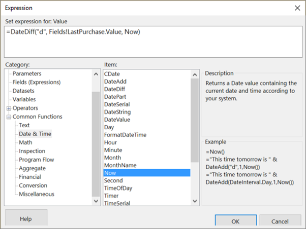
  
17. Select **OK**.

11. Click **Run** to preview the report.  
  
## <a name="Indicator"></a>7. Use an Indicator to Show Sales Comparison  
In this section, you add a new column and use an indicator to show whether a person's year-to-date (YTD) purchases are above or below the average YTD purchases. The **Round** function removes decimals from values.  
  
Configuring the indicator and its states takes many steps. If you want, you can skip ahead in the "To configure the indicator" procedure, and copy/paste the completed expressions from this tutorial into the **Expression** dialog box.  
  
### To add the + or - AVG Sales column  
  
1.  Right-click the **YTD Purchase** column, point to **Insert Column**, and then click **Right**.  
  
    A new column is added to the right of the **YTD Purchase** column.  
  
2.  Click the column header and type **+ or - AVG Sales**  
  
### To add an indicator  
  
1.  On the **Insert** tab, click **Indicator**, and then click the data cell for the **+ or - AVG Sales** column.  
  
    The **Select Indicator Type** dialog box opens.  
  
2.  In the **Directional** group of icon sets, click the set of three gray arrows.  

    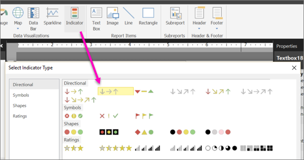
  
3.  Select **OK**.
  
### To configure the indicator  
  
1.  Right-click the indicator, click **Indicator Properties**, and then click **Value and States**.  
  
2.  Click the expression **fx** button next to the **Value** text box.  
  
3.  In the **Expression** dialog box, expand **Common Functions**, and then click **Math**.  
  
4.  In the **Item** list, double-click **Round**.  
  
5.  In the **Category** list, click **Fields (Expressions)**, and in the **Values** list, double-click **YTDPurchase**.  
  
7.  Immediately after `Fields!YTDPurchase.Value`, type  **-** (a minus sign). 
  
9. Expand **Common Functions** again, click **Aggregate**, and in the **Item** list, double-click **Avg**.  
  
11. In the **Category** list, click **Fields (Expressions)**, and in the **Values** list, double-click **YTDPurchase**.  
  
13. Immediately after `Fields!YTDPurchase.Value`, type **, "Expressions"))**  
  
    The completed expression is: `=Round(Fields!YTDPurchase.Value - Avg(Fields!YTDPurchase.Value, "Expressions"))`  
  
15. Select **OK**.
  
16. In the **States Measurement Unit** box, select **Numeric**.  
  
17. In the row with the down-pointing arrow, click the **fx** button to the right of the text box for the **Start** value.  

    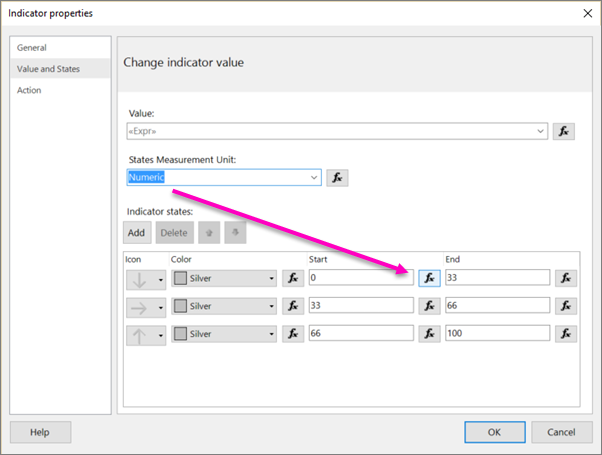
  
18. In the **Expression** dialog box, expand **Common Functions**, and then click **Math**.  
  
19. In the **Item** list, double-click **Round**.  
  
20. In the **Category** list, click **Fields (Expressions)**, and in the **Values** list, double-click **YTDPurchase**.  
  
22. Immediately after `Fields!YTDPurchase.Value`, type  **-** (a minus sign). 
  
24. Expand **Common Functions** again and click **Aggregate**, and in the **Item** list, double-click **Avg**.  
  
26. In the **Category** list, click **Fields (Expressions)**, and in the **Values** list, double-click **YTDPurchase**.  
  
28. Immediately after `Fields!YTDPurchase.Value`, type **, "Expressions")) < 0**  
  
    The completed expression: `=Round(Fields!YTDPurchase.Value - Avg(Fields!YTDPurchase.Value, "Expressions")) < 0`  
  
30. Select **OK**.
  
31. In the text box for the **End** value, type **0**  
  
32. Click the row with the horizontal-pointing arrow and click **Delete**.  

    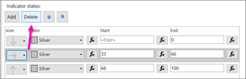
    
    Now there are only two arrows, either up or down.
  
33. In the row with the up-pointing arrow, in the **Start** box, type **0**  
  
34. Click the **fx** button to the right of the text box for the **End** value.  
  
35. In the **Expression** dialog box, delete **100** and create the expression: `=Round(Fields!YTDPurchase.Value - Avg(Fields!YTDPurchase.Value, "Expressions")) >0`  
  
36. Select **OK**.
  
37. Click **OK** again to close the **Indicator properties** dialog box.  
  
38. Click **Run** to preview the report.  

    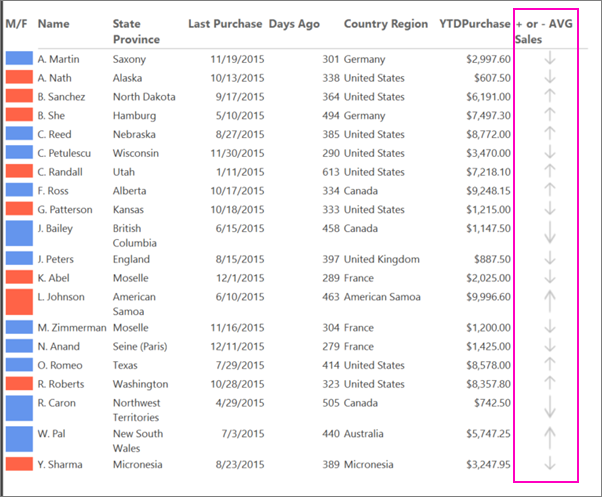
  
## <a name="GreenBar"></a>8. Make a Banded Report  
Create a parameter so report readers can specify the color to apply to alternating rows in the report, making it a banded report.  
  
### To add a parameter  
  
1.  Click **Design** to return to design view.  
  
2.  In the **Report Data** pane, right-click **Parameters** and click **Add Parameter**.  

    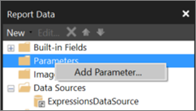
  
    The **Report Parameter Properties** dialog box opens.  
  
3.  In **Prompt**, type **Choose color**  
  
4.  In **Name**, type **RowColor**  
  
5.  On the **Available Values** tab, click **Specify values**.  
  
7.  Click **Add**.  
  
8.  In the **Label** box, type **Yellow**  
  
9. In the **Value** box, type **Yellow**  
  
10. Click **Add**.  
  
11. In the **Label** box, type **Green**  
  
12. In the **Value** box, type **PaleGreen**  
  
13. Click **Add**.  
  
14. In the **Label** box, type **Blue**  
  
15. In the **Value** box, type **LightBlue**  
  
16. Click **Add**.  
  
17. In the **Label** box, type **Pink**  
  
18. In the **Value** box, type **Pink**  

    
  
19. Select **OK**.
  
### To apply alternating colors to detail rows  
  
1.   Select all the cell in the data row except the cell in the **M/F** column, which has its own background color.  

     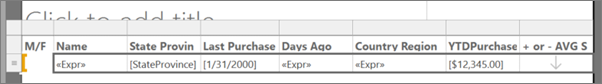
  
4.  In the Properties pane, click **BackgroundColor**. 

     If you don't see the Properties pane, on the **View** tab select the **Properties** box.  
  
    If the properties are listed by category in the Properties pane, you will find **BackgroundColor** in the **Misc** category.  
  
5.  Click the down arrow and then click **Expression**.  

    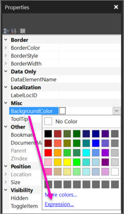
  
6.  In the **Expression** dialog box, expand **Common Functions**, and then click **Program Flow**.  
  
7.  In the **Item** list, double-click **IIf**.  
  
8.  Under **Common Functions**, click **Miscellaneous**, and in the **Item** list, double-click **RowNumber**.  

9. Immediately after **RowNumber(** type **Nothing) MOD 2,**
  
8. Click **Parameters** and in the **Values** list, double-click **RowColor**.  
  
22. Immediately after `Parameters!RowColor.Value`, type **, "White")**  
  
    The completed expression is: `=IIF(RowNumber(Nothing) MOD 2, Parameters!RowColor.Value, "White")`  
    
    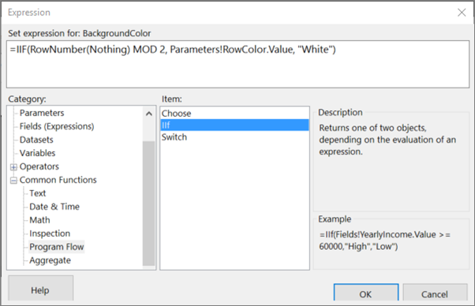
  
24. Select **OK**.
  
### Run the Report  
  
1.  On the **Home** tab, click **Run**.  

    Now when you run the report, you don't see the report until you choose a color for the non-white bands.
  
3.  In the **Choose color** list, select a color for the non-white bands in the report.  
    
    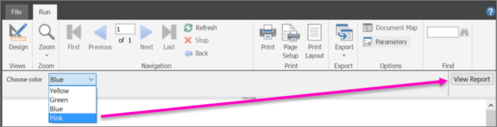
  
4.  Click **View Report**.  
  
    The report renders and alternating rows have the background that you chose. 
    
    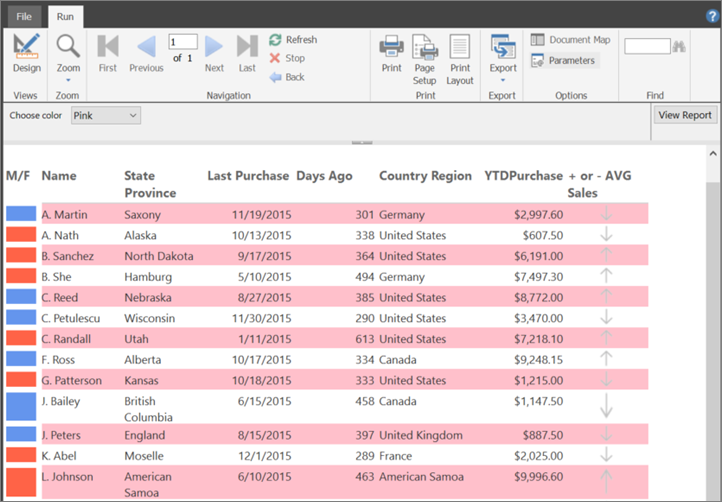 
  
## <a name="Title"></a>(optional) Add a Report Title  
Add a title to the report.  
  
### To add a report title  
  
1.  On the design surface, click **Click to add title**.  
  
2.  Type **Sales Comparison Summary**, then select the text.  
  
3.  On the **Home** tab, in the **Font** box, set:

    -  Size = 18
    -  Color = Gray
    -  Bold
  
4.  On the **Home** tab, click **Run**.  
  
3.  Select a color for the non-white bands in the report, andn click **View Report**.  
  
## <a name="Save"></a>(optional) Save the Report  
You can save reports to a report server, SharePoint library, or your computer. For more information, see [Saving Reports &#40;Report Builder&#41;](../reporting-services/report-builder/saving-reports-report-builder.md).  
  
In this tutorial, you save the report to a report server. If you do not have access to a report server, save the report to your computer.  
  
### To save the report to a report server  
  
1.  On the **File** menu > **Save As**.  
  
2.  Click **Recent Sites and Servers**.  
  
3.  Select or type the name of the report server where you have permission to save reports.  
  
    The message "Connecting to report server" appears. When the connection is complete, you will see the contents of the report folder that the report server administrator specified as the default report location.  
  
4.  Give the report a name and click **Save**.  
  
The report is saved to the report server. The name of report server that you are connected to appears in the status bar at the bottom of the window.

Now your report readers can view your report in the [!INCLUDE[ssRSnoversion_md](../includes/ssrsnoversion-md.md)] web portal.


   
## See Also  
[Expressions &#40;Report Builder and SSRS&#41;](../reporting-services/report-design/expressions-report-builder-and-ssrs.md)  
[Expression Examples &#40;Report Builder and SSRS&#41;](../reporting-services/report-design/expression-examples-report-builder-and-ssrs.md)  
[Indicators &#40;Report Builder and SSRS&#41;](../reporting-services/report-design/indicators-report-builder-and-ssrs.md)  
[Images, Text Boxes, Rectangles, and Lines &#40;Report Builder and SSRS&#41;](../reporting-services/report-design/images-text-boxes-rectangles-and-lines-report-builder-and-ssrs.md)  
[Tables &#40;Report Builder  and SSRS&#41;](../reporting-services/report-design/tables-report-builder-and-ssrs.md)  
[Report Datasets &#40;SSRS&#41;](../reporting-services/report-data/report-datasets-ssrs.md)  
  
  
  

