# Tutorial: Map Report (Report Builder)
In this [!INCLUDE[ssRBnoversion_md](../includes/ssrbnoversion.md)] tutorial, you learn about map features you can use to display data on a geographic background in an [!INCLUDE[ssRSnoversion_md](../includes/ssrsnoversion-md.md)] paginated report. 
  
Maps are based on spatial data that typically consists of points, lines, and polygons. For example, a polygon can represent the outline of a county, a line can represent a road, and a point can represent the location of a city. Each type of spatial data is displayed on a separate map layer as a set of map elements.  
  
To vary the appearance of map elements, you specify a field that has values that match the map elements with analytical data from a dataset. You can also define rules that vary color, size, or other properties based on ranges of data.  

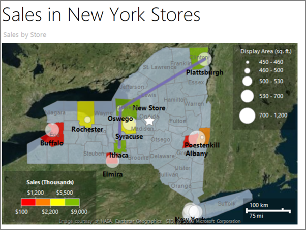
  
In this tutorial, you build a map report that displays store locations in New York state counties.  
   
> [!NOTE]  
> In this tutorial, the steps for the wizard are consolidated into two procedures: one to create the dataset and one to create a table. For step-by-step instructions about how to browse to a report server, choose a data source, create a dataset, and run the wizard, see the first tutorial in this series: [Tutorial: Creating a Basic Table Report &#40;Report Builder&#41;](../reporting-services/tutorial-creating-a-basic-table-report-report-builder.md).  
  
Estimated time to complete this tutorial: 30 minutes.  
  
## Requirements  
For this tutorial, the report server must be configured to support Bing maps as a background. For more information, see [Plan for Map Report Support](https://msdn.microsoft.com/5ddc97a7-7ee5-475d-bc49-3b814dce7e19). 

For information about other requirements, see [Prerequisites for Tutorials &#40;Report Builder&#41;](../reporting-services/prerequisites-for-tutorials-report-builder.md).  
  
## <a name="Map"></a>1. Create a Map with a Polygon Layer from the Map Wizard  
In this section, you add a map to your report from the map gallery. The map has one layer that displays the counties in New York state. The shape of each county is a polygon based on spatial data that is embedded in the map from the map gallery.  
  
### To add a map with the map wizard in a new report  
  
1.  [Start Report Builder](../reporting-services/report-builder/start-report-builder.md) either from your computer, the [!INCLUDE[ssRSnoversion_md](../includes/ssrsnoversion-md.md)] web portal, or SharePoint integrated mode.  
  
    The **New Report or Dataset** dialog box opens.  
  
    If you don't see the **New Report or Dataset** dialog box, on the **File** menu > **New**.  
  
2.  In the left pane, verify that **New Report** is selected.  
  
3.  In the right pane, click **Map Wizard**.  
  
4.  On the **Choose a source of spatial data** page, verify that **Map gallery** is selected.  
  
6.  In the Map Gallery box, expand **States by County** under **USA**, and click **New York**.  
  
    The Map Preview pane displays the New York county map.  
    
    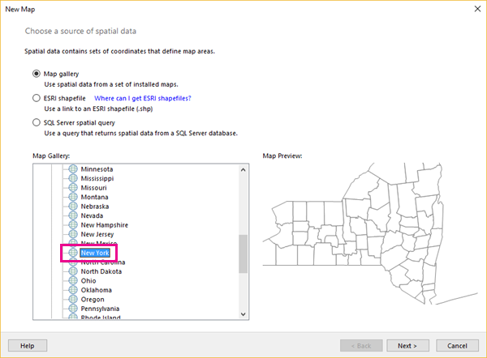
  
7.  Click **Next**.  
  
8.  On the **Choose spatial data and map view options** page, accept the defaults and click **Next**. 
 
    By default, map elements from a map gallery are automatically embedded in the report definition.  
  
9. On the **Choose map visualization** page, verify **Basic Map** is selected, and click **Next**.  
  
11. On the **Choose color theme and data visualization** page, select the **Display labels** option.  
  
12. If it is selected, clear the **Single color map** option.  
  
13. From the **Data field** drop-down list, click **#COUNTYNAME**. The Map Preview pane in the wizard displays the following items:  
  
    -   A title with the text **Map Title**.  
  
    -   A map that displays counties in New York where each county is a different color and the county name appears wherever it fits over the county area.  
  
    -   A legend that contains a title and a list of items 1 through 5.  
  
    -   A color scale that contains values 0 to 160 and no color.  
  
    -   A distance scale that displays kilometers (km) and miles (mi).  
    
    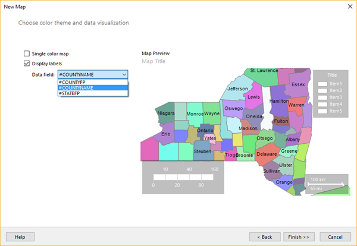
  
14. Click **Finish**.  
  
    The map is added to the design surface.  
  
13. Select the "Map Title" text and type **Sales by Store** > ENTER.  

15. Double-click the map to display the **Map Layers Pane**. The **Map Layers Pane** shows one polygon layer, PolygonLayer1, of layer type **Embedded**. Each county is an embedded map element on this layer.  
  
    > [!NOTE]  
    > If you don't see the **Map Layers** pane, it might be displayed outside your current view. Use the scroll bar at the bottom of the Design view window to change your view. Alternatively, in the **View** tab, clear the **Report Data** option to provide more design surface area.   

15. Select the arrow next to PolygonLayer1 > **Polygon properties**.

16. On the **Font** tab, change the color to **Dim Gray**.

17. On the **Home** tab > **Run** to preview the report.  
  
    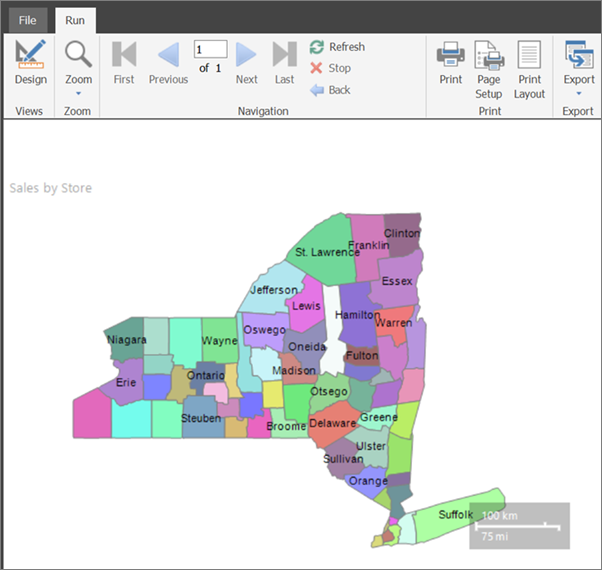
  
The rendered report displays the map title, the map, and the distance scale. The counties are on a map polygon layer. Each county is a polygon that varies by color from a color palette, but the colors are not associated with any data. The distance scale displays distances in both kilometers and miles.  
  
The map legend and color scale do not yet appear because there is no analytical data associated with each county. You will add analytical data later in this tutorial.  
  
## <a name="PointLayer"></a>2. Add a Map Point Layer to Display Store Locations  
In this section, you use the map layer wizard to add a point layer that displays the locations of stores.  
  
> [!NOTE]  
> In this tutorial, the query contains the data values, so it does not need an external data source. This makes the query quite long. In a business environment, a query would not contain the data. This is for learning purposes only.  
  
### To add a point layer based on a SQL Server spatial query  
  
1.  On the **Run** tab > **Design** to switch back to Design view.  
  
2.  Double-click the map to display the **Map Layers** pane. On the toolbar, click the **New layer wizard** button . 

    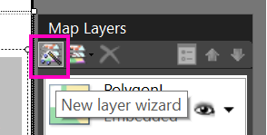 
  
3.  On the **Choose a source of spatial data** page, select **SQL Server spatial query**, and click **Next**.  
  
4.  On the **Choose a dataset with SQL Server spatial data** page, click **Add a new dataset with SQL Server spatial data** > **Next**.  
  
5.  On the **Choose a connection to a SQL Server spatial data source** page, select an existing data source or browse to the report server and select a data source.  

    > [!NOTE]  
    > The data source you choose is unimportant, as long as you have adequate permissions. You will not be getting data from the data source. For more information, see [Alternative Ways to Get a Data Connection &#40;Report Builder&#41;](../reporting-services/alternative-ways-to-get-a-data-connection-report-builder.md).  
  
6.  Click **Next**.  
  
7.  On the **Design a Query** page, click **Edit as Text**.  
  
8.  Copy the following text and paste it in the query pane:  
  
    ```  
    Select 114 as StoreKey, 'Contoso Albany Store' as StoreName, 1125 as SellingArea, 'Albany' as City, 'Albany' as County,   
     CAST(1000000 as money) as Sales, CAST('POINT(-73.7472924218681 42.6564617079878)' as geography) AS SpatialLocation  
    UNION ALL SELECT 115 AS StoreKey, 'Contoso New York No.1 Store' AS  StoreName, 500 as SellingArea, 'New York' AS City, 'New York City' as County,  
     CAST('2000000' as money) as Sales, CAST('POINT(-73.9922069374483 40.7549638237402)' as geography) AS SpatialLocation  
    UNION ALL Select 116 as StoreKey, 'Contoso Rochester No.1 Store' as StoreName, 462 as SellingArea, 'Rochester' as City,  'Monroe' as County,    
     CAST(3000000 as money) as Sales, CAST('POINT(-77.624041566786 43.1547066024338)' as geography)  AS SpatialLocation  
    UNION ALL Select 117 as StoreKey, 'Contoso New York No.2 Store' as StoreName, 700 as SellingArea, 'New York' as City,'New York City' as County,    
      CAST(4000000 as money) as Sales, CAST('POINT(-73.9712488 40.7830603)' as geography) AS SpatialLocation  
    UNION ALL Select 118 as StoreKey, 'Contoso Syracuse Store' as StoreName, 680 as SellingArea, 'Syracuse' as City, 'Onondaga' as County,  
     CAST(5000000 as money) as Sales, CAST('POINT(-76.1349120532546 43.0610223535974)' as geography) AS SpatialLocation  
    UNION ALL Select 120 as StoreKey, 'Contoso Plattsburgh Store' as StoreName, 560 as SellingArea, 'Plattsburgh' as City,  'Clinton' as County,  
     CAST(6000000 as money) as Sales, CAST('POINT(-73.4728622833178 44.7028831413324)' as geography) AS SpatialLocation  
    UNION ALL Select 121 as StoreKey, 'Contoso Brooklyn Store' as StoreName, 1125 as SellingArea, 'Brooklyn' as City, 'New York City' as County,  
     CAST(7000000 as money) as Sales, CAST('POINT (-73.9638533447143 40.6785123489351)' as geography) AS SpatialLocation  
    UNION ALL Select 122 as StoreKey, 'Contoso Oswego Store' as StoreName, 500 as SellingArea, 'Oswego' as City, 'Oswego' as County,    
     CAST(8000000 as money) as Sales, CAST('POINT(-76.4602850815536 43.4353224527794)' as geography) AS SpatialLocation  
    UNION ALL Select 123 as StoreKey, 'Contoso Ithaca Store' as StoreName, 460 as SellingArea, 'Ithaca' as City, 'Tompkins' as County,  
     CAST(9000000 as money) as Sales, CAST('POINT(-76.5001866085881 42.4310489934743)' as geography) AS SpatialLocation  
    UNION ALL Select 124 as StoreKey, 'Contoso Buffalo Store' as StoreName, 700 as SellingArea, 'Buffalo' as City, 'Erie' as County,    
     CAST(100000 as money) as Sales, CAST('POINT(-78.8784 42.8864)' as geography) AS SpatialLocation  
    UNION ALL Select 125 as StoreKey, 'Contoso Queens Store' as StoreName, 700 as SellingArea,'Queens' as City, 'New York City' as County,  
     CAST(500000 as money) as Sales, CAST('POINT(-73.7930979029883 40.7152781765927)' as geography) AS SpatialLocation  
    UNION ALL Select 126 as StoreKey, 'Contoso Elmira Store' as StoreName, 680 as SellingArea, 'Elmira' as City, 'Chemung' as County,  
     CAST(800000 as money) as Sales, CAST('POINT(-76.7397414783301 42.0736492742663)' as geography) AS SpatialLocation  
    UNION ALL Select 127 as StoreKey, 'Contoso Poestenkill Store' as StoreName, 455 as SellingArea, 'Poestenkill' as City, 'Rensselaer' as County,    
    CAST(1500000 as money) as Sales, CAST('POINT(-73.5626737425063 42.6940551238618)' as geography) AS SpatialLocation  
    ```  
  
9. On the query designer toolbar, click **Run** (**!**).  
  
    The result set contains seven columns representing a set of stores in New York State that sell consumer goods. Here's a list, with explanations for the ones that may not be obvious: 
    *   **StoreKey**: A store identifier.  
    *   **StoreName**.
    *   **SellingArea**: The area available for product display, ranging from 455 square feet to 1125 square feet.
    *   **City**.
    *   **County**.
    *   **Sales**: Total sales. 
    *   **SpatialLocation**: Location in longitude and latitude. 

    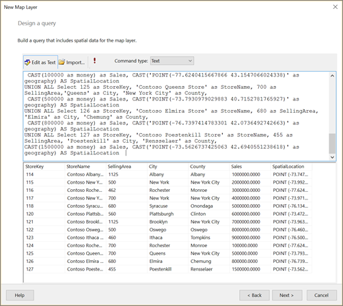 
  
10. Click **Next**.  
  
    The report dataset named DataSet1 is created for you. After you complete the wizard, you can see its field collection in the Report Data pane.  
  
11. On the **Choose a spatial data and map view options** page, verify that the **Spatial field** is **SpatialLocation** and that the **Layer type** is **Point**. Accept the other defaults on this page.  
  
    The map view displays circles to mark the location of each store.  
  
12. Click **Next**.  
  
13. On the Choose map visualization page, click **Bubble Map** for a map type that displays markers that vary in size, according to the data. Click **Next**.  
  
14. On the **Choose the analytical dataset** page, click DataSet1, and click **Next**. This dataset contains both analytical data and spatial data that will be displayed on the new point layer.   
  
16. On the **Choose color theme and data visualization** page, select **Use bubble sizes to visualize data**.  
  
17. In **Data field**, select `[Sum(SellingArea)]` to vary bubble size by the size of the area a store sets aside to display the products.  
  
18. Select **Display labels**, and in **Data field**, select `[City]`.

18. Click **Finish**.  
  
    The map layer is added to the report. The legend displays bubble sizes based on SellingArea values.  
  
 19. Double-click the map to display the **Map Layer** pane. The **Map Layer** pane displays a new layer, PointLayer1, with spatial data source type **DataRegion**.  
  
19. Add a legend title. In the legend, select the text **Title**, type **Display Area (sq. ft.)** and press ENTER.  
  
21. In the **Map Layers Pane**, click the arrow next to PointLayer1, and then click **Point Properties**.  

    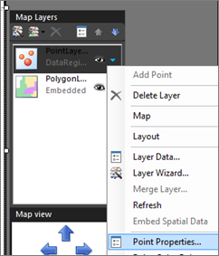
  
22. On the **Font** tab, make the style **Bold** and the size **10pt**.

    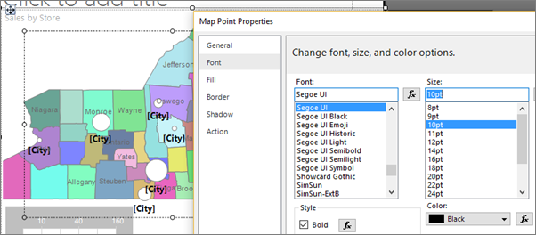
  
23. On the **General** tab, select **Bottom** for **Placement**.

24. [!INCLUDE[clickOK](../includes/clickok-md.md)]  
  
24. Click **Run** to preview the report.  

    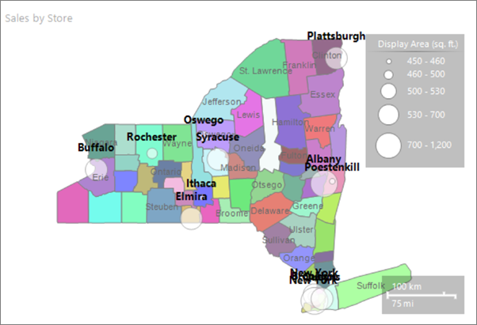
  
    The map displays the locations of stores in New York state. The marker size for each store is based on the display area. Five ranges of display area were automatically calculated for you.


  
## <a name="LineLayer"></a>3. Add a Map Line Layer to Display a Route  
Use the map layer wizard to add a map layer that displays a route between two stores. In this tutorial, the path is created from three store locations. In a business application, the path might be the best route between stores.  
  
### To add a line layer to map  
  
1.  Switch to Design view.  
  
2.  Double-click the map to display the **Map Layer** pane. On the toolbar, click the **New layer wizard** button .  
  
3.  On the **Choose a source of spatial data** page, select **SQL Server spatial query** and click **Next**.  
  
4.  On the **Choose a dataset with SQL Server spatial data** page, click **Add a new dataset with SQL Server spatial data** and click **Next**.  
  
5.  On the **Choose a connection to a SQL Server spatial data source**, select the data source that you used in the first procedure.  
  
6.  Click **Next**.  
  
7.  On the **Design a Query** page, click **Edit as Text**. The query designer switches to text-based mode.  
  
8.  Paste the following text in the query pane:  
  
    ```  
    SELECT N'Path' AS Name, CAST('LINESTRING(  
       -76.5001866085881 42.4310489934743,  
       -76.4602850815536 43.4353224527794,  
       -73.4728622833178 44.7028831413324)' AS geography) as Route  
    ```  
  
9. Click **Next**.  
  
    A path appears on the map that connects three stores.  
  
10. On the **Choose spatial data and map view options** page, verify that the **Spatial field** is **Route** and that the **Layer type** is **Line**. Accept the other defaults.  
  
    The map view displays a path from a store in the northern part of New York state to a store in the southern part of New York state.  
  
11. Click **Next**.  
  
12. On the **Choose map visualization** page, click **Basic Line Map**, and then click **Next**.  
  
13. On the **Choose color theme and data visualization**, select the option **Single color map**. The path appears as a single color based on the selected theme.  
  
14. Click **Finish**.  

    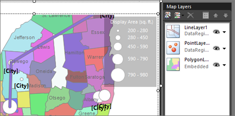
  
     The map displays a new line layer with spatial data source type **DataRegion**. In this example, the spatial data comes from a dataset but no analytical data is associated with the line.  

## Adjust the Zoom
1. If you can't see the whole state of New York, you can adjust the zoom. With the map selected, in the Properties pane you see **MapViewport** properties. 

15. Expand the **View** section, then expand **View** so you can see the **Zoom** property. Set it to **125**. 

    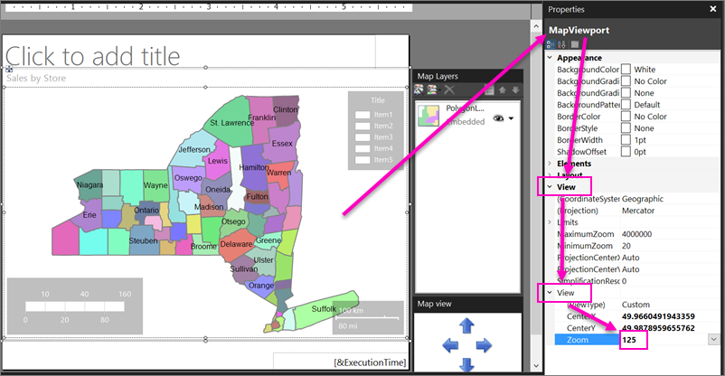

      This is the zoom percentage. At 125% you should see the whole state.
  
## <a name="TileLayer"></a>4. Add a Bing Maps Tile Background  
In this section, you add a map layer that displays a Bing Maps tile background.  
  
1.  Switch to Design view.  
  
2.  Double-click the map to display the **Map Layer** pane. On the toolbar, click **Add Layer** .  
  
3.  From the drop-down list, click **Tile Layer**.  
  
    The last layer in the **Map Layer** pane is TileLayer1. By default, the tile layer displays the road map style.  
  
    > [!NOTE]  
    > In the wizard, you can also add a tile layer on the **Choose spatial data and map view options** page. To do this, select **Add a Bing Maps background for this map view**. In a rendered report, the tile background displays Bing Maps tiles for the current map viewport center and zoom level.  
  
4.  Click the arrow next to TileLayer1 > **Tile Properties**.  
  
5.  On the **General** tab, under **Type**, select **Aerial**. The aerial view does not contain text.  

    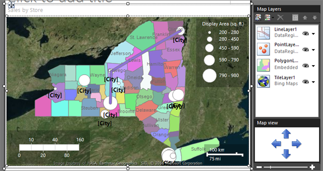
  
6.  [!INCLUDE[clickOK](../includes/clickok-md.md)]  
  
## <a name="Transparent"></a>5. Make a Layer Transparent  
In this section, to let the items on one layer show through another layer, you adjust the order and transparency of the layers for the effect that you want. You start with the first layer you created, PolygonLayer1. 
  
1.  Double-click the map to display the **Map Layer** pane.  
  
3.  Click the arrow next to PolygonLayer1 > **Layer Data**. The **Map Polygon Layer Properties** dialog box opens.  
  
4.  On the **Visibility** tab, under **Transparency (percent)**, type **30**.  
  
6.  [!INCLUDE[clickOK](../includes/clickok-md.md)]  
  
     The design surface displays the counties as semi-transparent.  

    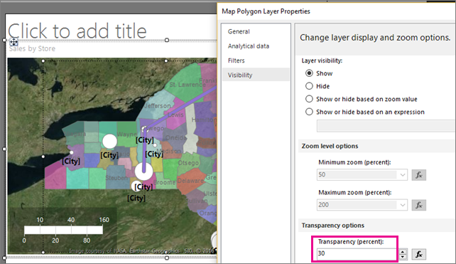
  
## <a name="Vary"></a>6. Vary County Color Based on Sales  
Each county on the polygon layer has a different color because the report processor automatically assigns a color value from the color palette based on the theme that you chose on the last page of the map wizard.  
  
In this section, you specify a color rule to associate specific colors with a range of store sales for each county. The colors red-yellow-green indicate relative high-middle-low sales. Format the color scale to show currency. Display the annual sales ranges in a new legend. For counties that do not contain stores, use no color to show that there is no associated data.  
  
### <a name="Relationship"></a>6a. Build a Relationship between Spatial and Analytical Data  
To vary the county shapes by color based on analytical data, you first need to associate the analytical data with the spatial data. In this tutorial, you will use the county name to match on. 
  
1.  Switch to Design view.  
  
2.  Double-click the map to display the **Map Layers** pane.  
  
3.  Click the arrow next to PolygonLayer1, then click **Layer Data**. The **Map Polygon Layer Properties** dialog box opens.  
  
4.  On the **Analytical data** tab, under **Analytical dataset**, select DataSet1. This dataset was created by the wizard when you created the spatial data query for the counties.  
  
6.  Under **Fields to match on**, click **Add**. A new row is added.  
  
7.  Under **From spatial dataset**, click COUNTYNAME.  
  
8.  Under **From analytical dataset**, click [County].  

    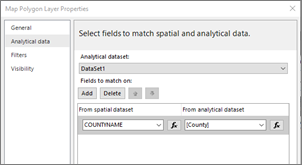
  
9. [!INCLUDE[clickOK](../includes/clickok-md.md)]  
  
10. Preview the report.  

    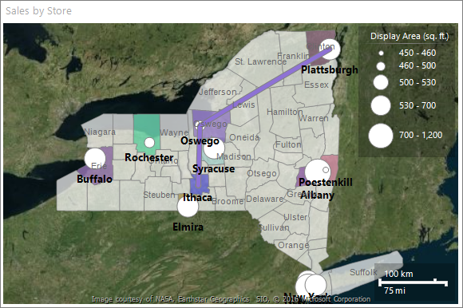
  
By specifying a match field from the spatial data source and from the analytical dataset, you enable the report processor to group analytical data based on the map elements. A data-bound map element has a successful match for the values that you specified.  
  
Each county that contains a store has a color that is based on the color palette for the style that you chose in the wizard. The other counties are gray.  
  
### <a name="ColorRules"></a>6b. Specify Color Rules for Polygons  
To create a rule that varies the color of each county based store sales, you must specify the range values, the number of divisions within that range that you want to display, and the colors to use.  
  
#### To specify color rules for all polygons that have associated data  
  
1.  Switch to Design view.  
  
2.  Click the arrow next to PolygonLayer1, then click **Polygon Color Rule**. The **Map Color Rules Properties** dialog box opens. Notice that the color rule option **Visualize data by using color palette** is selected. This option was set by the wizard.  
  
3.  Select **Visualize data by using color ranges**. The palette option is replaced by start color, middle color, and end color options.  
  
4.  Define range values for sales per county. In **Data field**, from the drop-down list, select `[Sum(Sales)]`.  
  
5.  To change the format to display currency in thousands, change the expression to the following: `=Sum(Fields!Sales.Value)/1000`  
  
6.  Change **Start color** to **Red**.  
  
7.  Change **End color** to **Green**.  
  
    **Red** represents low sales values, **Yellow** represents middle sales values, and **Green** represents high sales values. The report processor calculates a range of colors based on these values and the options that you choose on the **Distribution** page.  
    
    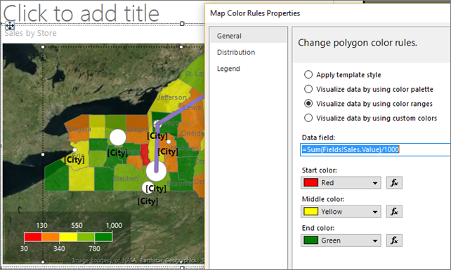
  
8.  Click **Distribution**.  
  
9. Verify that the distribution type is **Optimal**. For the expression from step 5, optimal distribution divides the values into subranges that balance the number of items in each range and the span for each range.  
  
10. Accept the default values for other options on this page. When you select the optimal distribution type, the number of subranges are calculated when the report runs.  
  
11. Click **Legend**.  
  
12. In **Color scale options**, verify that **Show in color scale** is selected.  
  
13. In **Show in this legend**, from the drop-down list, select the blank line. For now, you will show the color ranges only in the color scale.  
  
14. [!INCLUDE[clickOK](../includes/clickok-md.md)]  

15. Preview the report.

    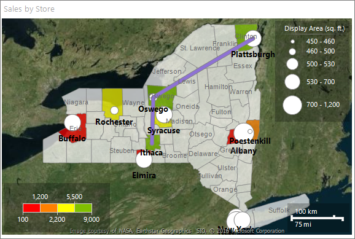
  
    The color scale displays four colors: red, orange, yellow, and green. Each color represents a sales range that is automatically calculated based on the sales by county.  
  
### <a name="ColorScale"></a>6c. Format the Data in the Color Scale as Currency  
By default, data has a general format. In this section, you apply custom formats.  
  
1. Switch to Design view.  

2. Select the color scale. On the **Home** tab > **Number** section, , click **Currency**.  
  
4.  Still in the **Number** section, click the **Decrease Decimal** button two times.  
  
    The color scale displays annual sales in currency format for each range.  
  
### <a name="NewLegend"></a>6d. Add a Legend Title   
  
1.  With the color scale still selected, in the Properties pane you see properties for **MapColorScale**. 
  
2. Expand the Title section, and in the Caption property, type **Sales (Thousands)**.

3. Change the TextColor property to **White**.  

    
  
8.  Preview the report.  
  
The counties that have associated stores and sales display according to the color rules. Counties that have no sales have no color.  
  
### <a name="NoData"></a>6f. Change Color for Counties with No Data  
You can set the default display options for all map elements on a layer. Color rules take precedence over these display options.  
  
#### To set the display properties for all elements on a layer  
  
1.  Switch to Design view.  
  
2.  Double-click the map to display the **Map Layer** pane.  
  
3.  Click the down arrow on PolygonLayer1, and then click **Polygon Properties**. 

     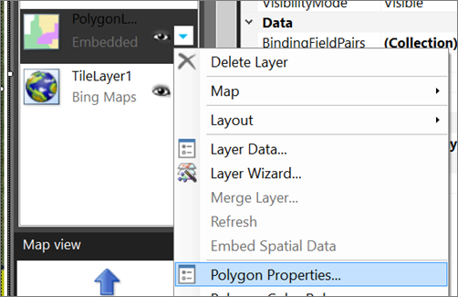

     The **Map Polygon Properties** dialog box opens. Display options set in this dialog box apply to all polygons on the layer before rule-based display options are applied.  
  
4.  On the **Fill** tab, verify that the fill style is **Solid.** Gradients and patterns apply to all colors.  
  
6.  In **Color**, select **Light Steel Blue**.  
  
7.  [!INCLUDE[clickOK](../includes/clickok-md.md)]  
  
8.  Preview the report.  
  
Counties with no associated data display as gray-blue. Only counties with associated analytical data have the **Red** through **Green** colors from the color rules that you specified.  
  
## <a name="CustomPoint"></a>7. Add a Custom Point  
To represent a new store that has not yet been built, in this section you specify a point with the **Star** marker type.  
  
1.  Switch to Design view.  
  
2.  Double-click the map to display the **Map Layer** pane. On the toolbar, click **Add Layer**  , then click **Point Layer**.  
  
    A new point layer is added to the map. By default, the point layer has spatial data type **Embedded**.  
  
3.  Click the arrow on PointLayer2 > **Add Point**.  
  
4.  Move the pointer over the map viewport. The cursor changes to crosshairs.  
  
5.  Click the location on the map where you want to add a point. In this tutorial, click a location in Oneida county. A point marked by a circle is added to the layer at the spot where you clicked. By default, the point is selected.  

    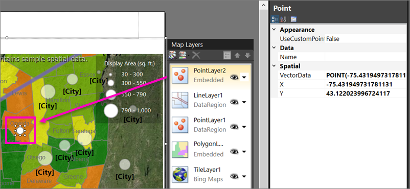
  
6.  Right-click the point you added, and then click **Embedded Point Properties**.  
  
7.  Select **Override point options for this layer**. Additional pages appear in the dialog box. Values that you set here take precedence over display options for the layer or for color rules.  

    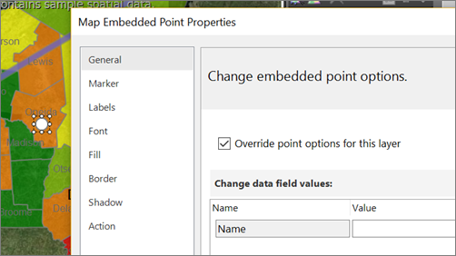
  
8.  On the **Marker** tab, for **Marker type**, select **Star**.  

10. Change **Marker size** to **18pt**.
  
3.  On the **Labels** tab, in **Label text**, type **New Store**.  
  
5.  In **Placement**, click **Top**.  

13. On the **Font** tab, make the font size **10pt** and **Bold**.

    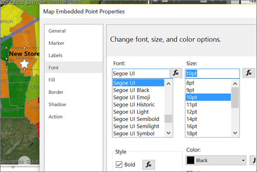
  
6.  [!INCLUDE[clickOK](../includes/clickok-md.md)]  
  
7.  Preview the report.  
  
The label appears above the store location.  

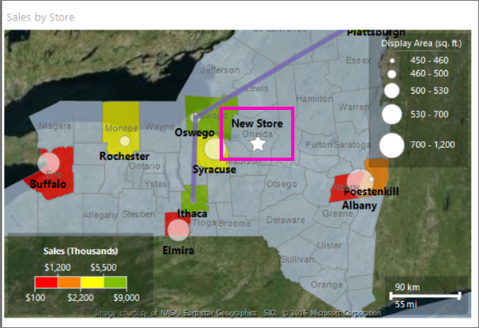
  
## <a name="CenterView"></a>8. Center and Resize the Map   
In this section, you learn to change the map center, and another way to change the zoom level.  
 
1.  Switch to Design view.  

1.  Select the map, then right-click and click **Viewport Properties**.  
  
2.  On the **Center and Zoom** tab, make sure **Set a view center and zoom level** is selected.  

4. Set **Zoom level (percent)** to **125**.
  
4.  [!INCLUDE[clickOK](../includes/clickok-md.md)]  
  
5.  Click the map, and drag to center it where you want it.  
  
6.  You can also use the mouse wheel to change the zoom level.  
  
7.  Preview the report.  
  
In Design view, the map on the display surface and the view is based on sample data. In the rendered report, the map view is centered on the view that you specified.  
  
## <a name="Title"></a>9. Add a Report Title  
  
1.  Switch to Design view.
  
1.  On the design surface, click **Click to add title**.  
  
2.  Type **Sales in New York Stores** and then click outside the text box.  
  
This title will appear at the top of the report. Items at the top of the report body when there is no page header defined are the equivalent of a report header.  
  
## <a name="Save"></a>10. Save the Report  
  
1.  In Design view or Preview, on the **File** menu > **Save As**.
 
3.  In **Name**, type **Store Sales in New York**.  

3. Save it to your local computer or to a [!INCLUDE[ssRSnoversion_md](../includes/ssrsnoversion-md.md)] server.
  
4. Click **Save**. 

If you save it to a report server, you can view it there.

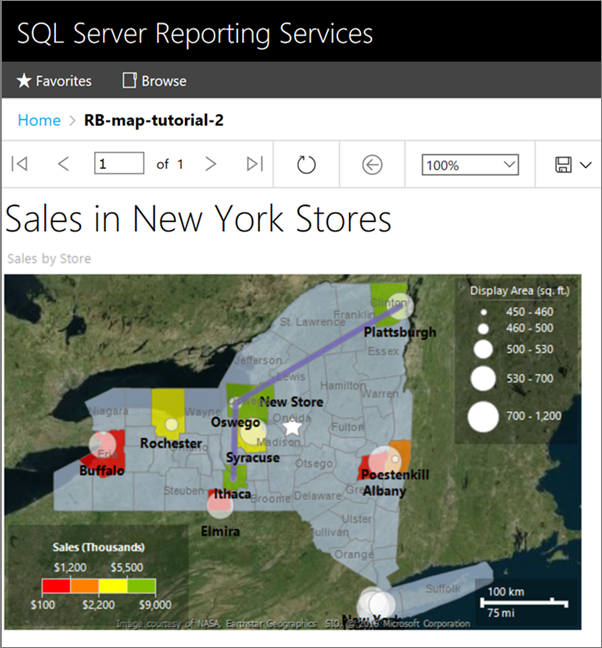 
  
## Next Steps  
This concludes the walkthrough for how to add a map to your report.  
  
For more information, see [Maps &#40;Report Builder and SSRS&#41;](../reporting-services/report-design/maps-report-builder-and-ssrs.md).  
  
## See Also  
[Report Builder tutorials](../reporting-services/report-builder-tutorials.md)  
[Report Builder in SQL Server](../reporting-services/report-builder/report-builder-in-sql-server-2016.md)  
[Map Wizard and Map Layer Wizard &#40;Report Builder and SSRS&#41;](../reporting-services/report-design/map-wizard-and-map-layer-wizard-report-builder-and-ssrs.md)  
[Vary Polygon, Line, and Point Display by Rules and Analytical Data &#40;Report Builder and SSRS&#41;](../reporting-services/report-design/vary-polygon-line-and-point-display-by-rules-and-analytical-data.md)  
  

