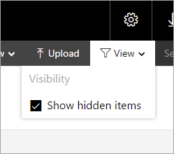
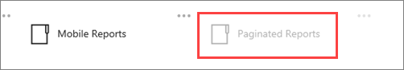
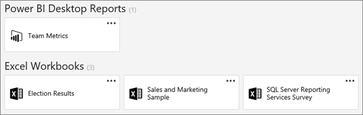
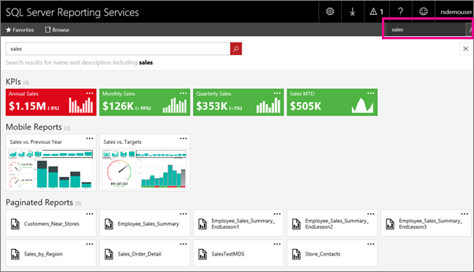

# The web portal of a report server (SSRS Native Mode)

[!INCLUDE[ssrs-appliesto](../includes/ssrs-appliesto.md)] [!INCLUDE[ssrs-appliesto-2016-and-later](../includes/ssrs-appliesto-2016-and-later.md)] [!INCLUDE[ssrs-appliesto-pbirsi](../includes/ssrs-appliesto-pbirs.md)]

The web portal of a Reporting Services report server is a web-based experience. In the portal, you can view reports, mobile reports, KPIs, and navigate through the elements in your report server instance. You can also use the web portal to administer a single report server instance.

## What is the web portal

You can use the web portal to perform the following tasks:

- View, search, print, and subscribe to reports.
- Create, secure, and maintain the folder hierarchy to organize items on the server.
- Configure role-based security that determines access to items and operations.
- Configure report execution properties, report history, and report parameters.
- Create shared schedules and shared data sources to make schedules and data source connections more manageable.
- Create data-driven subscriptions that role out reports to a large recipient list.
- Create linked reports to reuse and repurpose an existing report in different ways.
- Download common tools such as Report Builder and Mobile Report Publisher.
- [Create KPIs](../reporting-services/working-with-kpis-in-reporting-services.md).
- Send feedback or make feature requests.

You can use the web portal to browse the report server folders or search for specific reports. You can view a report, its general properties and past copies of the report that are captured in report history. Depending on your permissions, you might also be able to subscribe to reports for delivery to an e-mail inbox or a shared folder on the file system.

> [!NOTE]
> For information on supported browsers and versions, see [Planning for Reporting Services Browser Support](../reporting-services/browser-support-for-reporting-services-and-power-view.md).

The web portal is used only for a report server that runs in native mode. It is not supported for a report server that you configure for SharePoint integrated mode.

Some web portal features are only available in specified editions of [!INCLUDE[ssNoVersion](../includes/ssnoversion-md.md)]. For more information, see [Reporting Services Features supported by the Editions of SQL Server](../reporting-services/reporting-services-features-supported-by-the-editions-of-sql-server-2016.md).

On a new installation, only local administrators have sufficient permissions to work with content and settings. To grant permissions to other users, a local administrator must create role assignments that provide access to the report server. The application pages and tasks that a user can subsequently access will depend on the role assignments for that user. For more information, see [Grant User Access to a Report Server](security/grant-user-access-to-a-report-server-report-manager.md)

> [!NOTE]
> If you are browsing to the web portal on the local machine that the server is running on, you may see a message indicating that you are not allowed to view this folder. This is due to Universal Access Control (UAC) and that you are not running the browser as an admin. You are not able to run Edge as an admin. You will need to use Internet Explorer. You can either browser to the server remotely, or launch Internet Explorer as admin and browser to the web portal. If you want to use the web portal remotely, you will need to give your account content manager rights on the folder.  

## Start and use the web portal

The web portal is a web application that you open by typing the [!INCLUDE[ssRSWebPortal](../includes/ssrswebportal.md)] URL in the address bar of the browser window. When you start the [!INCLUDE[ssRSWebPortal](../includes/ssrswebportal.md)], the pages, links, and options that you see will vary based on the permissions you have on the report server. To perform a task, you must be assigned to a role that includes the task.  A user who is assigned to a role that has full permissions has access to the complete set of application menus and pages available for managing a report server. A user assigned to a role that has permissions to view and run reports sees only the menus and pages that support those activities. Each user can have different role assignments for different report servers, or even for the various reports and folders that are stored on a single report server.

For more information about roles, see [Granting Permissions on a Native Mode Report Server](../reporting-services/security/granting-permissions-on-a-native-mode-report-server.md).

### Start the web portal

To start the web portal from a browser, follow these steps:

1. Open your web browser. For a list of supported web browsers, see [Planning for Reporting Services Browser Support](../reporting-services/browser-support-for-reporting-services-and-power-view.md).

2. In the address bar of the web browser, type the web portal URL.

    By default, the URL is *https://[ComputerName]/reports*.

    The report server might be configured to use a specific port. For example, *https://[ComputerName]:80/reports* or *https://[ComputerName]:8080/reports*.

## Grouping by categories

The web portal will group items into different categories. The available categories are the following.

- KPIs
- Mobile Reports
- Paginated Reports
- Power BI Desktop Reports
- Excel Workbooks
- Datasets
- Data Sources
- Resources

You can control what is displayed by selecting **View** in the upper right. If you select Show Hidden, those items will be displayed in a lighter color.

### Power BI Desktop Reports and Excel Workbooks

You can upload, organize, and manage permissions for Power BI Desktop reports and Excel workbooks. They will be grouped together within the web portal.

The files are stored within Reporting Services, similar to other resource files. Selecting one of these items will download them locally to your desktop. You can save changes you've made by reuploading them to the report server.

## Search for items

Enter a search term, and see everything you can access. The results are categorized into KPIs, reports, datasets, and other items. You can then interact with the results and add them to your favorites.

## Web portal tasks

[Branding the web portal](../reporting-services/branding-the-web-portal.md)

[Working with KPIs](../reporting-services/working-with-kpis-in-reporting-services.md)

[Working with shared datasets](../reporting-services/work-with-shared-datasets-web-portal.md)

## See also

[Create mobile reports with SQL Server Mobile Report Publisher](../reporting-services/mobile-reports/create-mobile-reports-with-sql-server-mobile-report-publisher.md)  
[Configure a URL (SSRS Configuration Manager)](../reporting-services/install-windows/configure-a-url-ssrs-configuration-manager.md)  
[Reporting Services Tools](../reporting-services/tools/reporting-services-tools.md)  
[Planning for Reporting Services Browser Support](../reporting-services/browser-support-for-reporting-services-and-power-view.md)  
[Reporting Services Features supported by the Editions of SQL Server](../reporting-services/reporting-services-features-supported-by-the-editions-of-sql-server-2016.md)  

More questions? [Try the Reporting Services forum](https://go.microsoft.com/fwlink/?LinkId=620231)
