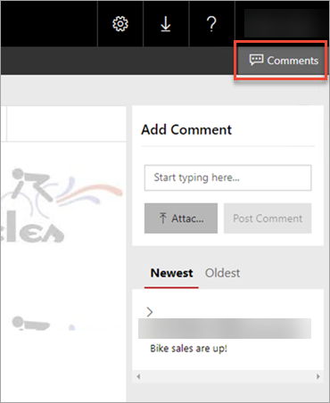
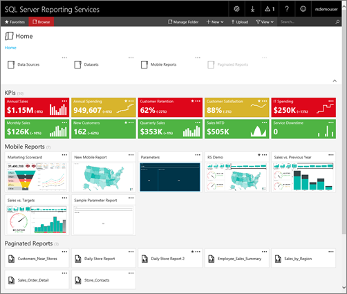
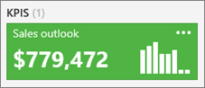
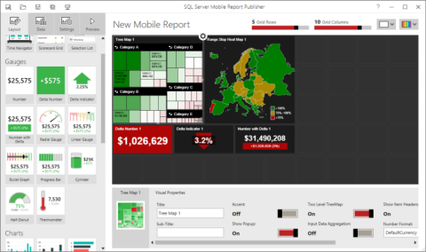
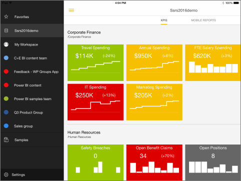
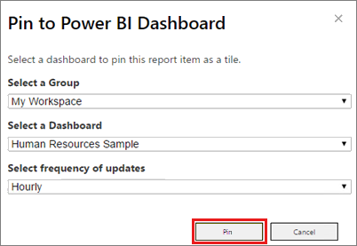
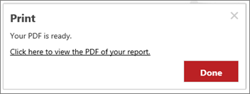
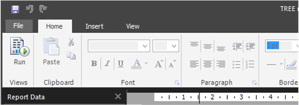
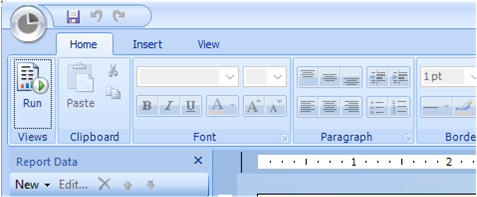
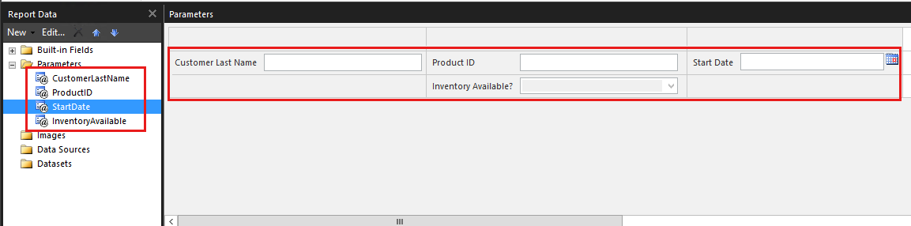

# What's new in SQL Server Reporting Services (SSRS)

[!INCLUDE[ssrs-appliesto](../includes/ssrs-appliesto.md)] [!INCLUDE[ssrs-appliesto-2016-and-later](../includes/ssrs-appliesto-2016-and-later.md)] [!INCLUDE[ssrs-appliesto-not-pbirsi](../includes/ssrs-appliesto-not-pbirs.md)]

Learn about what's new in SQL Server [!INCLUDE[ssRSnoversion](../includes/ssrsnoversion-md.md)]. This covers the major feature areas and is updated as new items are released.

For the current release notes, see [SQL Server 2017 Release Notes](../sql-server/sql-server-2017-release-notes.md). 

For information about Power BI Report Server, see [What is Power BI Report Server?](https://docs.microsoft.com/power-bi/report-server/get-started).

**Download** 

To download SQL Server 2017 Reporting Services, go to the  **[Microsoft Download Center](https://www.microsoft.com/download/details.aspx?id=55252)**.

::: moniker range=">=sql-server-ver15||=sqlallproducts-allversions"
## SQL Server 2019 preview Reporting Services

[!INCLUDE[sql-server-2019](../includes/sssqlv15-md.md)] Reporting Services isn't available for CTP 2.3. Install the current version, [SQL Server 2017 Reporting Services](install-windows/install-reporting-services.md).
::: moniker-end

::: moniker range=">=sql-server-2017||=sqlallproducts-allversions"
## SSRS 2017

### Comments on reports

Comments are now available for reports, to add perspective and collaborate with others. You can also include attachments with comments.



For more information, see [Add comments to a report in a report server](https://powerbi.microsoft.com/documentation/reportserver-add-comments/).

### DAX queries in reporting tools

In the latest releases of Report Builder and SQL Server Data Tools, you can create native DAX queries against supported SQL Server Analysis Services tabular data models by dragging and dropping desired fields in the query designers. See the [Reporting Services blog](https://blogs.msdn.microsoft.com/sqlrsteamblog/2017/03/09/query-designer-support-for-dax-now-available-in-report-builder-and-sql-server-data-tools/).

### REST API support

To enable development of modern applications and customization, SQL Server Reporting Services now supports a fully OpenAPI compliant RESTful API. The full API specification and documentation can now be found on [swaggerhub](https://app.swaggerhub.com/apis/microsoft-rs/SSRS/2.0).

### Query designer support for DAX now in Report Builder and SQL Server Data Tools

In Report Builder and SQL Server Data Tools, you can now create native DAX queries against supported SQL Server Analysis Services tabular data models. You can use the query designer in both tools to drag and drop the fields you want and have the DAX query generated for you instead of writing it yourself.  
 
Read more on the [Reporting Services blog](https://blogs.msdn.microsoft.com/sqlrsteamblog/2017/03/09/query-designer-support-for-dax-now-available-in-report-builder-and-sql-server-data-tools/).

* Download [SQL Server Report Builder](https://go.microsoft.com/fwlink/?LinkId=734968).
* Download [SQL Server Data Tools - Release Candidate](https://docs.microsoft.com/sql/ssdt/sql-server-data-tools-ssdt-release-candidate).

> **Note**: You can only use the query designer for DAX with SSAS tabular data sources built in SQL Server 2016+.
::: moniker-end
 
## SSRS 2016
  
### Reporting Services [!INCLUDE[ssRSWebPortal-Non-Markdown](../includes/ssrswebportal-non-markdown-md.md)]  
 A new [!INCLUDE[ssRSnoversion](../includes/ssrsnoversion-md.md)] [!INCLUDE[ssRSWebPortal-Non-Markdown](../includes/ssrswebportal-non-markdown-md.md)] is available. This is an updated, modern, portal which incorporates KPIs, Mobile Reports, Paginated Reports, Excel and Power BI Desktop files. The [!INCLUDE[ssRSWebPortal](../includes/ssrswebportal.md)] replaces Report Manager from previous releases. You can also download Mobile Report Publisher and Report Builder from the [!INCLUDE[ssRSWebPortal](../includes/ssrswebportal.md)] without the need of ClickOnce technology.
 
 To create Mobile Reports, you will need the [!INCLUDE[SS_MobileReptPub_Short](../includes/ss-mobilereptpub-short.md)].  
  
 For more information about the [!INCLUDE[ssRSWebPortal-Non-Markdown](../includes/ssrswebportal-non-markdown-md.md)], see [Web portal (SSRS Native Mode)](../reporting-services/web-portal-ssrs-native-mode.md).  
  
   
 
 #### Custom branding for the [!INCLUDE[ssRSWebPortal-Non-Markdown](../includes/ssrswebportal-non-markdown-md.md)] 
  You can customize the [!INCLUDE[ssRSWebPortal-Non-Markdown](../includes/ssrswebportal-non-markdown-md.md)] with your organization's logo and colors by using a branding pack.  
  
  For more information about custom branding, see [Branding the web portal](https://msdn.microsoft.com/6dac97f7-02a6-4711-81a3-e850a6b40bf1)
 
 #### Key performance indicators (KPI) in the [!INCLUDE[ssRSWebPortal-Non-Markdown](../includes/ssrswebportal-non-markdown-md.md)] 

You can create KPIs direct in the [!INCLUDE[ssRSWebPortal-Non-Markdown](../includes/ssrswebportal-non-markdown-md.md)] that are contextual to the folder you are in. When creating KPIs, you can choose dataset fields and summarize those values. You can also select related content to drill-through to more details.
  
 
 
 For more information, see [Working with KPIs in the web portal](https://msdn.microsoft.com/a28cf500-6d47-4268-a248-04837e7a09eb)
  
 
 ### Mobile Reports
 
Reporting Services mobile reports are dedicated reports optimized for a wide variety of form factors and provide an optimal experience for users accessing reports on mobile devices. Mobile reports feature a assortment of visualizations, from time, category, and comparison charts, to treemaps and custom maps. Connect your mobile reports to a range of data sources, including on-premises SQL Server Analysis Services multidimensional and tabular data. Lay out your mobile reports on a design surface with adjusting grid rows and columns, and flexible mobile report elements that scale well to any screen size. Then save these mobile reports to a Reporting Service server, and view and interact with them in a browser or in the Power BI mobile app on iPads, iPhones, Android phones and Windows 10 devices.
  
#### Mobile Report Publisher  
 The [!INCLUDE[SS_MobileReptPub_Long](../includes/ss-mobilereptpub-long.md)]allows you to create and publish SQL Server mobile reports to your [!INCLUDE[ssRSnoversion](../includes/ssrsnoversion-md.md)] [!INCLUDE[ssRSWebPortal-Non-Markdown](../includes/ssrswebportal-non-markdown-md.md)].  
  
   
  
 For more information, see [Create mobile reports with SQL Server Mobile Report Publisher](../reporting-services/mobile-reports/create-mobile-reports-with-sql-server-mobile-report-publisher.md).  
  
#### SQL Server mobile reports hosted in Reporting Services available in Power BI Mobile app  
 The Power BI Mobile app for iOS on iPad and iPhone can now display SQL Server mobile reports hosted on your local report server.  
  
   
  
 You can't connect by default without some configuration changes. For more information on how to allow the Power BI Mobile app to connect to your report server, see [Enable a report server for Power BI Mobile access](../reporting-services/report-server/enable-a-report-server-for-power-bi-mobile-access.md).
  
### Support of SharePoint mode and SharePoint 2016  
 [!INCLUDE[ssSQL15](../includes/sssql15-md.md)] [!INCLUDE[ssRSnoversion](../includes/ssrsnoversion-md.md)] supports integration with SharePoint 2013 and SharePoint 2016.
 
For more information, see:  
  
-   [Supported Combinations of SharePoint and Reporting Services Server and Add-in &#40;SQL Server 2016&#41;](../reporting-services/install-windows/supported-combinations-of-sharepoint-and-reporting-services-server.md)  
  
-   [Where to find the Reporting Services add-in for SharePoint Products](../reporting-services/install-windows/where-to-find-the-reporting-services-add-in-for-sharepoint-products.md)  
  
-   [Install Reporting Services SharePoint Mode](../reporting-services/install-windows/install-reporting-services-sharepoint-mode.md)  

### Microsoft .NET Framework 4 Support  
 [!INCLUDE[ssRSCurrent](../includes/ssrscurrent-md.md)] supports the current versions of Microsoft .NET Framework 4. This includes version 4.0 and 4.5.1. If no version of .Net Framework 4.x is installed, [!INCLUDE[ssNoVersion](../includes/ssnoversion-md.md)] setup installs .NET 4.0 during the feature installation step.  

### Report improvements

**HTML 5 Rendering Engine:** A new  HTML5 rendering engine that targets modern web "full" standards mode and modern browsers.  The new rendering engine no longer relies on quirks mode used by a few older browsers.
  
 For more information on browser support, see [Browser Support for Reporting Services and Power View](../reporting-services/browser-support-for-reporting-services-and-power-view.md).  

**Modern paginated reports:** Design beautifully modern paginated reports with new, modern styles for charts, gauges, maps and other data visualizations.
  
**Tree Map and Sunburst Charts:** Enhance your reports with Tree Map  and Sunburst  charts, great ways to display hierarchal data. For more information, see [Tree Map and Sunburst Charts in Reporting Services](../reporting-services/report-design/tree-map-and-sunburst-charts-in-reporting-services.md).  

**Report embedding:** You can now embed mobile and paginated reports in other web pages, and applications, by using an iframe along with URL parameters.  

**Pin Report Items to a Power BI Dashboard:** While viewing a report in the [!INCLUDE[ssRSWebPortal](../includes/ssrswebportal.md)], you can select report items and pin them to a [!INCLUDE[sspowerbi](../includes/sspowerbi-md.md)] dashboard.   The items you can pin are charts, gauge panels, maps, and images. You can **(1)** select the group that contains the dashboard you want to pin to, **(2)** select the dashboard you want to pin the item too and **(3)** select how frequently you want the tile updated in the dashboard.    The refresh is managed by  [!INCLUDE[ssRSnoversion](../includes/ssrsnoversion-md.md)] subscriptions and after the item is pinned, you can edit the subscription and configure a different  refresh schedule.  
  
  
  
 For more information, see [Power BI Report Server Integration &#40;Configuration Manager&#41;](../reporting-services/install-windows/power-bi-report-server-integration-configuration-manager.md) and [Pin Reporting Services items to Power BI Dashboards](../reporting-services/pin-reporting-services-items-to-power-bi-dashboards.md).  
 
 **PowerPoint Rendering and Export:** The Microsoft PowerPoint (PPTX) format is a new [!INCLUDE[ssRSCurrent](../includes/ssrscurrent-md.md)] rendering extension. You can export reports in the PPTX format from the usual applications; Report Builder, Report Designer (in SSDT), and the [!INCLUDE[ssRSWebPortal](../includes/ssrswebportal.md)]. For the example the following image shows the export menu from the [!INCLUDE[ssRSWebPortal](../includes/ssrswebportal.md)]. 
  
  
  
 You can also select the PPTX format for subscription output and use Report Server URL access to render and export a report. For example the following  URL command in your browser exports a report from a named instance of the report server.  
  
```  
https://servername/ReportServer_THESQLINSTANCE/Pages/ReportViewer.aspx?%2freportfolder%2freport+name+with+spaces&rs:Format=pptx  
```  
  
 For more information, see [Export a Report Using URL Access](../reporting-services/export-a-report-using-url-access.md).  
 
 **PDF Replaces ActiveX for Remote Printing:** The report viewer toolbar ActiveX print experience has been replaced with a modern PDF based experience that works across the matrix of supported browsers, including Microsoft Edge. No more ActiveX controls to download! Depending on the browser you use and the PDF viewing applications and services you have installed, [!INCLUDE[ssRSnoversion](../includes/ssrsnoversion-md.md)] will either open  a print dialog to print your report or prompt you to download a .PDF file of your report.  As an administrator, you can still disable client side printing from [!INCLUDE[ssManStudio](../includes/ssmanstudio-md.md)]. For more information, see [Enable and Disable Client-Side Printing for Reporting Services](../reporting-services/report-server/enable-and-disable-client-side-printing-for-reporting-services.md).



### Subscription Improvements  
 
|Feature|Supported server mode|  
|-------------|---------------------------|  
|**Enable and disable subscriptions**. New user interface options to quickly disable and enable subscriptions. The disabled subscriptions maintain their other configuration properties such as schedule and can be easily enabled.<br /><br /> <br /><br /> For more information, see [Disable or Pause Report and Subscription Processing](../reporting-services/subscriptions/disable-or-pause-report-and-subscription-processing.md).|Native mode|  
|**Subscription description**. When you create a new subscription, you can now include a description of the report as part of the subscription properties. The description is included on the subscription summary page.|SharePoint and Native mode|  
|**Change subscription owner**. Enhanced user interface to quickly change the owner of a subscription. Previous versions of [!INCLUDE[ssRSnoversion](../includes/ssrsnoversion-md.md)] allow administrators to change subscription owners using script. Starting with the [!INCLUDE[ssSQL15](../includes/sssql15-md.md)] release, you can change subscription owners using the user interface or script. Changing the subscription owner is a common administrative task when users leave or change roles in your organization.|SharePoint and Native mode|  
|**Shared credential for file share subscriptions**. Two workflows now exist with [!INCLUDE[ssRSnoversion](../includes/ssrsnoversion-md.md)] file share subscriptions:<br /><br /> New in this release, your [!INCLUDE[ssRSnoversion](../includes/ssrsnoversion-md.md)] administrator can configure a single file share account, that is used for one to many subscriptions. The file share account is configured in the [!INCLUDE[ssRSnoversion](../includes/ssrsnoversion-md.md)] native mode configuration manager **Specify a file share account**, and then on the subscription configuration page, users select **Use file share account**.<br /><br /> Configure individual subscriptions with specific credentials for the destination file share.<br /><br /> You can also mix the two approaches and have some file share subscriptions use the central file share account while other subscriptions use specific credentials.|Native mode|  

### SQL Server Data Tools (SSDT)  
 The new release of SSDT includes the project templates for [!INCLUDE[ssRSCurrent](../includes/ssrscurrent-md.md)]: Report Server Project Wizard and Report Server Project. For information about downloading SSDT, see [SQL Server Data Tools for Visual Studio 2015](https://go.microsoft.com/fwlink/?LinkId=827542).  

### Report Builder improvements

**New Report Builder User Interface:** The core [!INCLUDE[ssRBnoversion](../includes/ssrbnoversion.md)] user interface is now a modern look and feel with streamlined UI elements.  
  
|||  
|-|-|  
|New|Previous|  
|||  

**Custom Parameters Pane:** You can now customize the parameters pane. Using the design surface in Report Builder, you can drag a parameter to a specific column and row in the parameters pane. You can add and remove columns to change the layout of the pane.   For more information, see [Customize the Parameters Pane in a Report &#40;Report Builder&#41;](../reporting-services/report-design/customize-the-parameters-pane-in-a-report-report-builder.md).  
  
   

  
**High DPI Support:** [!INCLUDE[ssRBnoversion](../includes/ssrbnoversion.md)] supports High DPI (Dots Per Inch) scaling and devices.  For more information on High DPI, see the following:  
  
-   [Windows 8.1 DPI Scaling Enhancements](https://blogs.windows.com/windowsexperience/2013/07/15/windows-8-1-dpi-scaling-enhancements/)  
  
-   [High DPI and Windows 8.1](https://technet.microsoft.com/library/dn528848.aspx)  

## Next steps

[What's New in Analysis Services](https://msdn.microsoft.com/aa69c299-b8f4-4969-86d8-b3292fe13f08)  
[Backward Compatibility](reporting-services-backward-compatibility.md)   
[Reporting Services Features supported by the Editions of SQL Server](../reporting-services/reporting-services-features-supported-by-the-editions-of-sql-server-2016.md)   
[Upgrade and Migrate Reporting Services](../reporting-services/install-windows/upgrade-and-migrate-reporting-services.md)   
[Reporting Services](../reporting-services/create-deploy-and-manage-mobile-and-paginated-reports.md)  

More questions? [Try asking the Reporting Services forum](https://go.microsoft.com/fwlink/?LinkId=620231)
