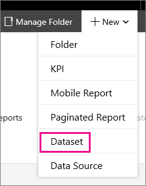
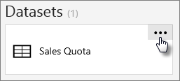
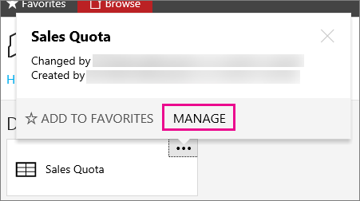
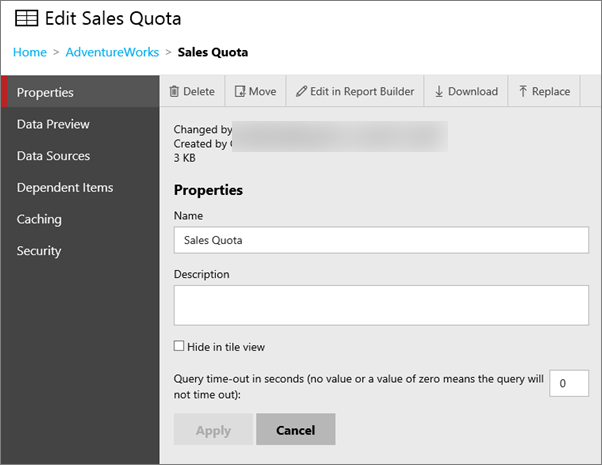
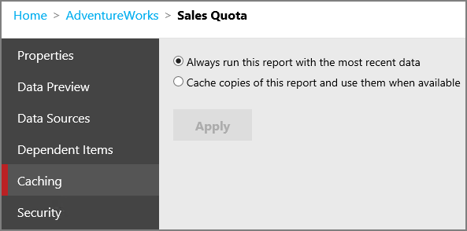
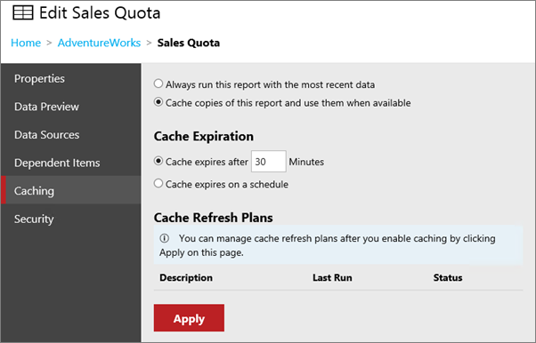

# Work with shared datasets - web portal

[!INCLUDE[ssrs-appliesto](../includes/ssrs-appliesto.md)] [!INCLUDE[ssrs-appliesto-2016-and-later](../includes/ssrs-appliesto-2016-and-later.md)] [!INCLUDE[ssrs-appliesto-pbirsi](../includes/ssrs-appliesto-pbirs.md)]

With a shared dataset, you can manage the settings for a dataset separately from reports and other catalog items that use it. Shared datasets can be used with paginated and mobile reports, along with KPIs.

You can view and manage the properties of a shared dataset within the web portal. The web portal can launch you into Report Builder to create or edit shared datasets.

## Create a shared dataset
  
To create a new shared dataset, you can do the following.  
  
1.  Select new from the menu bar.  
  
2.  Select **Dataset**.  
  
      
  
3.  This will either launch Report Builder, or prompt you to download it.  
  
4.  On the **New Report or Dataset** dialog, select a data source connection to use for this dataset. You may need to browse to the location of the shared data source.  
  
5.  Select **Create**.  
  
6.  Build your dataset and then select the **save** icon in the upper left to save the dataset back to the report server.  
  
## Manage an existing shared dataset
  
To manage an existing shared dataset, you can do the following.  
  
> [!NOTE]
> If you don't see the shared dataset in the folder, make sure you are viewing datasets. You can select **View** from the menu bar in the upper right of the web portal. Make sure **Datasets** is checked.  
  
1.  Select the **ellipsis (...)** for the dataset you want to manage.  
  
      
  
2.  Select **Manage** which will take you to the edit screen.  
  
      
  
## Properties
  
On the properties screen, you can change the **name** and **description** for the dataset. You can also **Delete**, **Move**, **Edit in Report Builder**, **Download** or **Replace**.  
  
  
  
## Caching
  
You have options when it comes to caching data for a dataset. You will start off with a simple selection.  
  
1.  **Always run this report with the most recent data** will issue queries to the data source when requested.  
  
2.  **Cache copies of this report and use them when available** will place a temporary copy of the data in a cache for use with items that use this dataset. Caching usually improves performance because the data is returned from the cache instead of running the dataset query again.  
  
  
  
Selecting **Cache Copies of this report and use them when available** will present you with some more options.  
  
  
  
### Cache Expiration  
  
You can control whether you want to expire the cache, for the shared dataset, after a certain amount of time, or if you would prefer to do that on a schedule. You can use a shared schedule.  
  
  
  
> [!NOTE]
> Setting an expiration does not refresh the cache. Without a cache refresh plan, the data will be refreshed on the next execution of the dataset.  
  
### Cache Refresh Plans  
  
You can use Cache Refresh Plans to create schedules for preloading the cache with temporary copies of data for a shared dataset. A refresh plan includes a schedule and the option to specify or override values for parameters. You cannot override values for parameters that are marked read-only. You can create and use more than one refresh plan.   
  
Default role assignments that enable you to add, delete, and change shared datasets for cache refresh plans are Content Manager, My Reports, and Publisher.  
  
After you apply the cache option above, you can then define a cache refresh plan. To do that select the **Manage Refresh Plans** link that appears after you apply the cache settings. This will take you to the cache refresh plan page.   
  
To create a new cache refresh plan, select **New Cache Refresh Plan**. You can then enter a name for the plan and specify a schedule. If the dataset has parameters defined, you will see those listed and be able to provide values unless they are marked as read-only.  
  
Once you are done, you can select **Create Cache Refresh Plan**.  
  
  
  
> [!NOTE]
> SQL Server Agent needs to be running to create a cache refresh plan.  
  
You can then **Edit** or **Delete** plans that are listed. The **New From Existing** option is enabled when one, and only one, cache refresh plan is selected. This option will create a new refresh plan which is copied from the original plan. The cache refresh plan page opens pre-populated with details from the plan that was selected. You can then modify the refresh plan options and save the plan with a new description.  

More questions? [Try asking the Reporting Services forum](https://go.microsoft.com/fwlink/?LinkId=620231)
