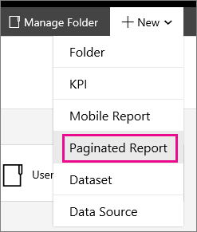
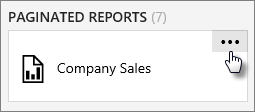
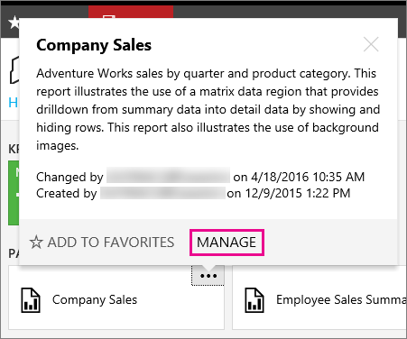
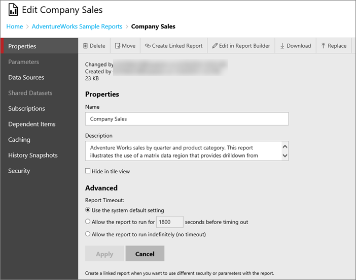
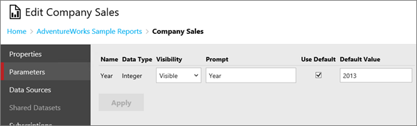
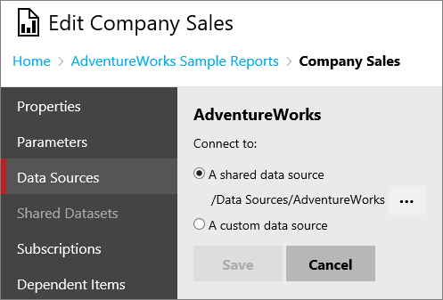
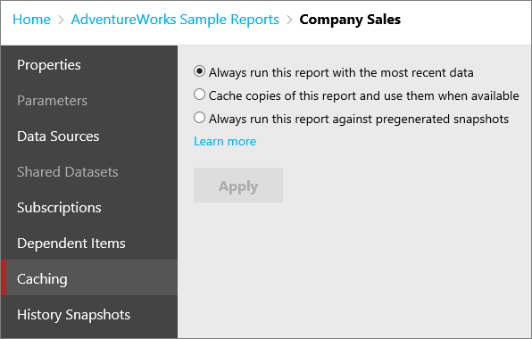
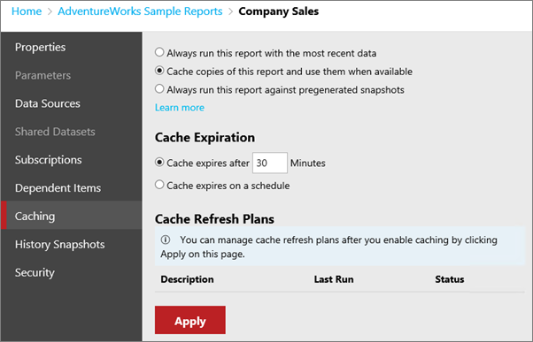
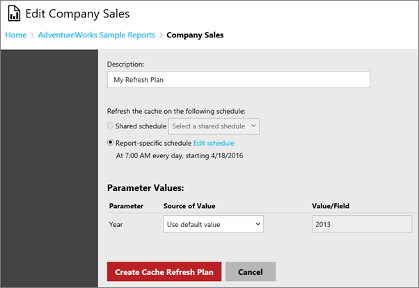

# Working with paginated reports (web portal)

[!INCLUDE[ssrs-appliesto](../includes/ssrs-appliesto.md)] [!INCLUDE[ssrs-appliesto-2016-and-later](../includes/ssrs-appliesto-2016-and-later.md)] [!INCLUDE[ssrs-appliesto-pbirsi](../includes/ssrs-appliesto-pbirs.md)]

You can view and manage the properties of a paginated report within the web portal. The web portal can launch you into Report Builder to create or edit paginated reports.  
   
## Create a paginated report  
  
To create a new shared dataset, you can do the following.  
  
1.  Select new from the menu bar.  
  
2.  Select **Paginated Report**.  
  
      
  
3.  This will either launch Report Builder, or prompt you to download it.  
  
4.  Build your report and then select the **save** icon in the upper left to save the paginated report back to the report server.  
  
## Manage an existing paginated report  
  
To manage an existing paginated report, you can do the following.  
  
> [!NOTE]
> If you don't see paginated reports in the folder, make sure you are viewing paginated reports. You can select **View** from the menu bar in the upper right of the web portal. Make sure **Paginated Reports** is checked.  
  
1.  Select the **ellipsis (...)** for the dataset you want to manage.  
      
      
  
2.  Select **Manage** which will take you to the edit screen.  
    
      
  
## Properties  
  
On the properties screen, you can change the **name** and **description** for the paginated report. You can also **Delete**, **Move**, **Create Linked Report**, **Edit in Report Builder**, **Download** or **replace**.  
    
  
   
## Parameters  
  
You can modify existing parameters of a paginated report. To add a new parameter, you must edit the report in Report Builder or SQL Server Data Tools.  
  
  
   
## Data Source  
You can point to a shared data source, or enter connection information for a custom data source.  
  
  
  
The following options are used to specify a custom data source.  
  
**Type**  
  
Specify a data processing extension that is used to process data from the data source. For a list of built-in data extensions, see [Data Sources Supported by Reporting Services (SSRS)]. Additional data processing extensions may be available from third-party vendors.  
  
**Connection string**  
  
Specify the connection string that the report server uses to connect to the data source. The connection type determines the syntax you should use. For example, a connection string for the XML data processing extension is a URL to an XML document. In most cases, a typical connection string specifies the database server and a data file. The following example illustrates a connection string used to connect to a SQL Server database that is named MyData:  
  
    data source=(a SQL Server instance);initial catalog=MyData  
  
A connection string can be configured as an expression so that you can specify the data source at run time. Data source expressions are defined in the report in Report Designer. Data source expressions cannot be defined, viewed, or modified in the web portal. However, you can replace a data source expression by clicking **Override Default** to type in a static connection string. If you want to switch back to the expression, click **Revert to Defaul**. The report server stores the original connection string in case you need to restore it. To use data source expressions, you must use the data source connection information that was originally published in the report. Shared data sources do not support the use of expressions in the connection string.  
  
**Credentials**  
  
You can specify the option that determines how credentials are obtained.  
  
> [!IMPORTANT]
> If credentials are provided in the connection string, the options and values provided in this section are ignored. Note that if you specify credentials on the connection string, the values are displayed in clear text to all users who view this page.  
  
**As the user viewing the report**  
  
Use the Windows credentials of the current user to access the data source. Select this option when the credentials that are used to access a data source are the same as those used to log on to the network domain. This option works best when Kerberos authentication is enabled for your domain, or when the data source is on the same computer as the report server. If Kerberos is not enabled, Windows credentials cannot be passed to another service, or remote machine. If additional computer connections are required, you will get an error instead of the data you expect.  
  
A report server administrator can disable the use of Windows integrated security for accessing report data sources. If this value is grayed out, the feature is not available.  
  
Do not use this option if you plan to schedule or subscribe to this report. Scheduled or unattended report processing requires credentials that can be obtained without user input or the security context of a current user. Only stored credentials provide this capability. For this reason, the report server prevents you from scheduling report or subscription processing if the report is configured for the Windows integrated security credential type. If you choose this option for a report that is already subscribed to or that has scheduled operations, the subscriptions and scheduled operations will stop.  
  
**Using these credentials**  
  
Store an encrypted user name and password in the report server database. Select this option to run a report unattended (for example, reports that are initiated by schedules or events instead of user action).   
  
You can also choose the type of credential this would be. Either Windows authentication (Windows user name and password), or a specific database credential (Database user name and password) such as SQL authentication.  
  
If the account is a windows credential, the account you specify must have log on locally permissions on the computer that hosts the data source used by the report.  
  
Select **Log in using these credentials, but then try to impersonate the user viewing the report** to allow delegation of credentials, but only if a data source supports impersonation. For SQL Server databases, this option sets the SETUSER function. For Analysis Services, this uses EffectiveUserName.  
  
**By Prompting the user viewing the report for credentials**  
  
Each user must type in a user name and password to access the data source. You can define the prompt text that requests user credentials. For example, "Enter a user name and password to access the data source."  
  
You can also choose the type of credential this would be. Either Windows authentication (Windows user name and password), or a specific database credential (Database user name and password) such as SQL authentication.  
  
**Without any credentials**  
  
This allows you to not provide any credentials for the data source. If a data source requires a user logon, choosing this option will have no effect. You should only choose this option if the data source connection does not require user credentials.  
  
To use this option, you must have previously configured the unattended execution account for your report server. The unattended execution account is used to connect to external data sources when other courses of credentials are not available. If you specify this option and the account is not configured, the connection to the report data source will fail and report processing will not occur. For more information about this account, see [Configure the Unattended Execution Account (SSRS Configuration Manager)](../reporting-services/install-windows/configure-the-unattended-execution-account-ssrs-configuration-manager.md).  
  
## Subscriptions  
A Reporting Services subscription is a configuration that delivers a report at a specific time or in response to an event, and in a file format that you specify. For example, every Wednesday, save the MonthlySales.rdl report as a Microsoft Word document to a file share. Subscriptions can be used to schedule and automate the delivery of a report and with a specific set of report parameter values. For more information, see [Working with subscriptions](working-with-subscriptions-web-portal.md).
  

   
## Dependent Items  
Use the Dependent Items page to view a list of items that are referencing this report. The icon for each item type indicates what it is. You can then select the **ellipsis (...)** on each item to manage those items further.  
  
## Caching  
You have options when it comes to caching data for a paginated report. You will start off with a simple selection.  
  
1.  **Always run this report with the most recent data** will issue queries to the data source every time you run the report. This results in an on-demand report that contains the most up-to-date data. A new instance of the report will be created each time the report is opened which will contain the results of a new query. With this approach, if ten users open the report at the same time, ten queries are sent to the data source for processing.  
  
2.  **Cache copies of this report and use them when available** will place a temporary copy of the data in a cache for later use. Caching usually improves performance because the data is returned from the cache instead of running the dataset query again. With this approach, if ten users open the report, only the first request results a query to the data source. The report is subsequently cached, and the remaining nine users view the cached report.  
  
3.  **Always run this report against pregenerated snapshots** will cache the report layout and data for a given time period. You can run a report as a report snapshot to prevent the report from being run at arbitrary times (for example, during a scheduled backup). The snapshot can be refreshed on a schedule. [Learn more]  
  
  
   
Selecting **Cache Copies of this report and use them when available** will present you with some more options.  
  
  

For more information, see [Working with snapshots](working-with-snapshots-web-portal.md).
  
### Cache Expiration  
  
You can control whether you want to expire the cache, for the paginated report, after a certain amount of time, or if you would prefer to do that on a schedule. You can use a shared schedule.  
  
> [!NOTE]
> This does not refresh the cache.  
  
### Cache Refresh Plans  
  
You can use Cache Refresh Plans to create schedules for preloading the cache with temporary copies of data for a paginated report. A refresh plan includes a schedule and the option to specify or override values for parameters. You cannot override values for parameters that are marked read-only. You can create and use more than one refresh plan.  
   
Default role assignments that enable you to add, delete, and change paginated reports for cache refresh plans are Content Manager, My Reports, and Publisher.  
  
After you apply the cache option above, you can then define a cache refresh plan. To do that select the **Manage Refresh Plans** link that appears after you apply the cache settings. This will take you to the cache refresh plan page.   
  
To create a new cache refresh plan, select **New Cache Refresh Plan**. You can then enter a name for the plan and specify a schedule. If the dataset has parameters defined, you will see those listed and be able to provide values unless they are marked as read-only.  
  
Once you are done, you can select **Create Cache Refresh Plan**.  
  
  
  
> [!NOTE]
> SQL Server Agent needs to be running to create a cache refresh plan.  
  
You can then **Edit** or **Delete** plans that are listed. The **New From Existing** option is enabled when one, and only one, cache refresh plan is selected. This option will create a new refresh plan which is copied from the original plan. The cache refresh plan page opens pre-populated with details from the plan that was selected. You can then modify the refresh plan options and save the plan with a new description.  
  
## History Snapshots  
  
Use the History Snapshots page to view report snapshots that are generated and stored over time. Depending on options that are set, report history may contain only the more recent snapshots.  
  
Report history is always viewed within the context of the report from which it originates. You cannot view the history of all reports on a report server in one place.  
  
To generate a snapshot, the report must be able to run unattended (that is, it must use stored credentials; parameterized reports must contain default parameter values for all parameters). Snapshots can be generated manually or as a scheduled operation.   
  
You can click a report history snapshot to view it. Snapshots that appear in report history are distinguished only by the date and time at which they were created. There is no visual indication to distinguish whether a snapshot was generated in response to a schedule or a manual operation.  
  
## Security  
Use the Security properties page to view or modify the security settings that determine access to the report. This page is available for items that you have permission to secure.  
  
Access to items is defined through role assignments that specify the tasks that a group or user can perform. A role assignment consists of one user or group name and one or more role definitions that specify a collection of tasks.  
  
**Edit Item Security**  
  
Select to change how security is defined for the current item.

## Next steps

[Web portal](../reporting-services/web-portal-ssrs-native-mode.md)  
[Work with Shared Datasets](../reporting-services/work-with-shared-datasets-web-portal.md)

More questions? [Try asking the Reporting Services forum](https://go.microsoft.com/fwlink/?LinkId=620231)
