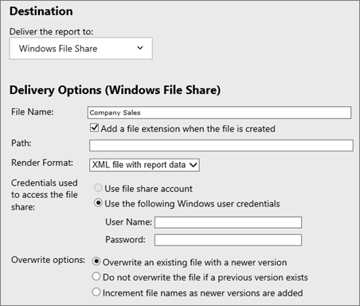

# Working with subscriptions (web portal)

[!INCLUDE[ssrs-appliesto](../includes/ssrs-appliesto.md)] [!INCLUDE[ssrs-appliesto-2016-and-later](../includes/ssrs-appliesto-2016-and-later.md)] [!INCLUDE[ssrs-appliesto-pbirsi](../includes/ssrs-appliesto-pbirs.md)]

Use the Subscriptions page to list all of the subscriptions for the current report. If you have sufficient permission (as conveyed by the "Manage all subscriptions" task), you can view the subscriptions of all users. Otherwise, this page shows only the subscriptions that you own.  
  
Before you can create a new subscription, you must verify that the report data source uses stored credentials. Use the Data Sources properties page to store credentials.  
  
> [!NOTE]
> The SQL Server Agent service needs to be started.   
  
  
   
You can get to the Subscriptions page by selecting the **ellipsis (...)** of a report, selecting **Manage** and selecting **Subscriptions**.  
  
From the Subscriptions page, you can create new subscriptions by selecting **+ New Subscription**. You can also edit existing subscriptions, or delete subscriptions that you have selected.  
  
This page also provides the result status of subscription runs on the **Result** column. If an error occurred for a subscription, you will want to check the result column first to see what the message was.  
  
## Creating, or editing, a subscription  
Use the New Subscription or Edit Subscription page to create a new subscription or modify an existing subscription to a report. The options on this page vary depending on your role assignment. Users with advanced permissions can work with additional options.  
  
Subscriptions are supported for reports that can run unattended. At a minimum, the report must use stored or no credentials. If the report uses parameters, a default value must be specified. Subscriptions may become inactive if you change report execution settings or remove the default values used by parameter properties. For more information, see [Create and Manage Subscriptions for Native Mode Report Servers].  
  
### Type of Subscription  
You can select between a **Standard subscription** and a **Data-driven subscription**.  
  
  
   
A data-driven subscription is one that queries a subscriber database for subscription information each time the subscription runs. Data-driven subscriptions use query results to determine the recipients of the subscription, delivery settings, and report parameter values. At run time, the report server runs a query to get values used for subscription settings.   
  
To create a data-driven subscription, you must know how to write a query or command that gets the data for the subscription. You must also have a data store that contains the subscriber data (for example, subscriber names and e-mail addresses) to use for the subscription.  
  
This option is available to users with advanced permissions. If you are using default security, data-driven subscriptions cannot be used for reports located in a My Reports folder.  
  
### Destination  
Select the delivery extension to use to distribute the report.   
  
The availability of a delivery extension depends on whether it is installed and configured on the report server. Report Server E-mail is the default delivery extension, but it must be configured before you can use it. File Share delivery does not require configuration, but you must define a shared folder before you can use it.  
  
  
  
Depending on the delivery extension you select, the following settings appear:  
  
-   E-mail subscriptions provide fields that are familiar to e-mail users (for example, To, Subject, and Priority fields). Specify **Include Report** to embed or attach the report, or **Include Link** to include a URL to the report. Specify **Render Format** to choose a presentation format for the attached or embedded report.  
  
-   File share subscriptions provide fields that allow you to specify a target location. You can deliver any report to a file share. However, reports that support interactive features (including matrix reports that support drill-down to supporting rows and columns) are rendered as static files. You cannot view drill-down rows and columns in a static file. The file share name must be specified in Uniform Naming Convention (UNC) format (for example, \mycomputer\public\myreportfiles). Do not include a trailing backslash in the path name. The report file will be delivered in a file format that is based on the render format (for example, if you choose Excel, the report is delivered as an .xlsx file).  
  
### Data-Driven subscription Dataset  
For a data-driven subscription, you will need to define the dataset used for the subscription. Select **Edit Dataset** to supply that information.  
  
  
  
You need to first provide a **data source** to use for the query. This can be either a shared data source, or you can supply a custom data source.  
  
You will need to then supply a **query** that will list the different options needed for the subscription to run. The screen will provide the fields that need to be returned. These fields will vary depending on your delivery method and the parameters of the report.  
  
For best result, run the query in SQL Server Management Studio first, before using it in the data-driven subscription. You can then examine the results to verify that it contains the information you require. Important points to recognize about the query results are:  
  
-   Columns in the result set determine the values that you can specify for delivery options and report parameters. For example, if you are creating a data-driven subscription for e-mail delivery, you should have a column of e-mail addresses.  
  
-   Rows in the result set determine the number of report deliveries that are generated. If you have 10,000 rows, the report server will generate 10,000 notifications and deliveries.  
  
  
  
You can then validate the query. You can also define a **query timeout**.  
  
After the query has been created, you can then assign values to the required fields. You can either enter your manual data, or select a field from the dataset you created.

[Web portal](../reporting-services/web-portal-ssrs-native-mode.md)  
[Working with paginated reports](working-with-paginated-reports-web-portal.md)  
[Work with Shared Datasets](../reporting-services/work-with-shared-datasets-web-portal.md)

More questions? [Try asking the Reporting Services forum](https://go.microsoft.com/fwlink/?LinkId=620231)
