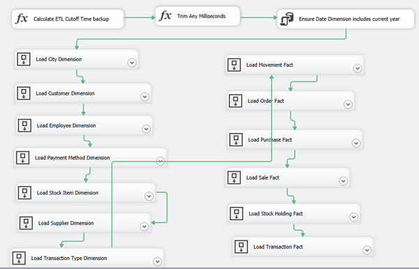

# WideWorldImportersDW ETL workflow
[!INCLUDE [SQL Server Azure SQL Database](../includes/applies-to-version/sql-asdb.md)]
Use the *WWI_Integration* ETL package to migrate data from the WideWorldImporters database to the WideWorldImportersDW database as data changes. The package is run periodically (usually daily).

The package ensures high performance by using SQL Server Integration Services to orchestrate bulk T-SQL operations (instead of separate transformations in Integration Services).

Dimensions are loaded first, and then Fact tables are loaded. You can rerun the package any time after a failure.

The workflow looks like this:

 

The workflow starts with an expression task that determines the appropriate cutoff time. The cutoff time is the current time minus a few minutes. (This approach is more robust than requesting data right to the current time.) Any milliseconds are truncated from the time.

The main processing starts by populating the Date dimension table. The processing ensures that all dates for the current year have been populated in the table.

Next, a series of data flow tasks loads each dimension. Then, they load each fact.

## Prerequisites

- SQL Server 2016 (or later), with the WideWorldImporters and WideWorldImportersDW databases (in the same or in different instances of SQL Server)
- SQL Server Management Studio
- SQL Server 2016 Integration Services
  - Ensure that you create an Integration Services catalog. To create an Integration Services catalog, in SQL Server Management Studio Object Explorer, right-click **Integration Services**, and then select **Add Catalog**. Leave the default options. You are prompted to enable SQLCLR and provide a password.

## Download

For the latest release of the sample, see [wide-world-importers-release](https://go.microsoft.com/fwlink/?LinkID=800630). Download the *Daily ETL.ispac* Integration Services package file.

For the source code to re-create the sample database, see [wide-world-importers](https://github.com/Microsoft/sql-server-samples/tree/master/samples/databases/wide-world-importers/wwi-ssis).

## Install

1. Deploy the Integration Services package:
   1. In Windows Explorer, open the *Daily ETL.ispac* package. This launches the SQL Server Integration Services Deployment Wizard.
   2. Under **Select Source**, follow the defaults for Project Deployment, with the path pointing to the *Daily ETL.ispac* package.
   3. Under **Select Destination**, enter the name of the server that hosts the Integration Services catalog.
   4. Select a path under the Integration Services catalog, for example, in a new folder named *WideWorldImporters*.
   5. Select **Deploy** to finish the wizard.

2. Create a SQL Server Agent job for the ETL process:
   1. In Management Studio, right-click **SQL Server Agent**, and then select **New** > **Job**.
   2. Enter a name, for example, *WideWorldImporters ETL*.
   3. Add a **Job Step** of the type **SQL Server Integration Services Package**.
   4. Select the server that has the Integration Services catalog, and then select the *Daily ETL* package.
   5. Under **Configuration** > **Connection Managers**, ensure that the connections to the source and target are configured correctly. The default is to connect to the local instance.
   6. Select **OK** to create the job.

3. Execute or schedule the job.
