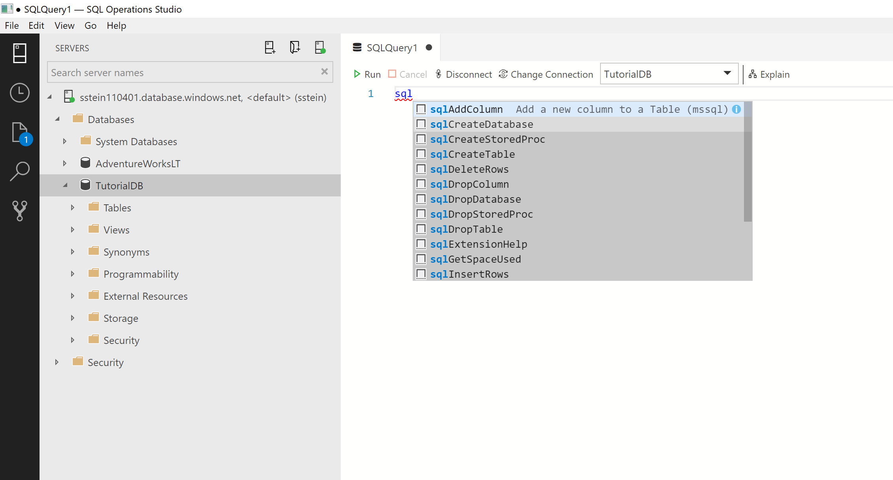
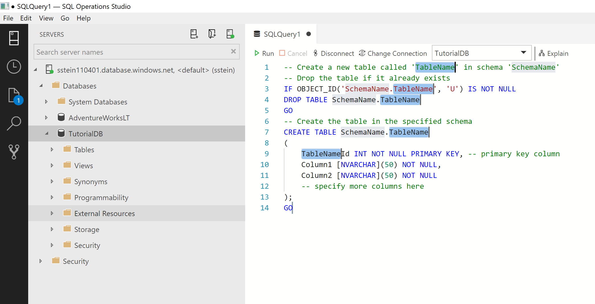
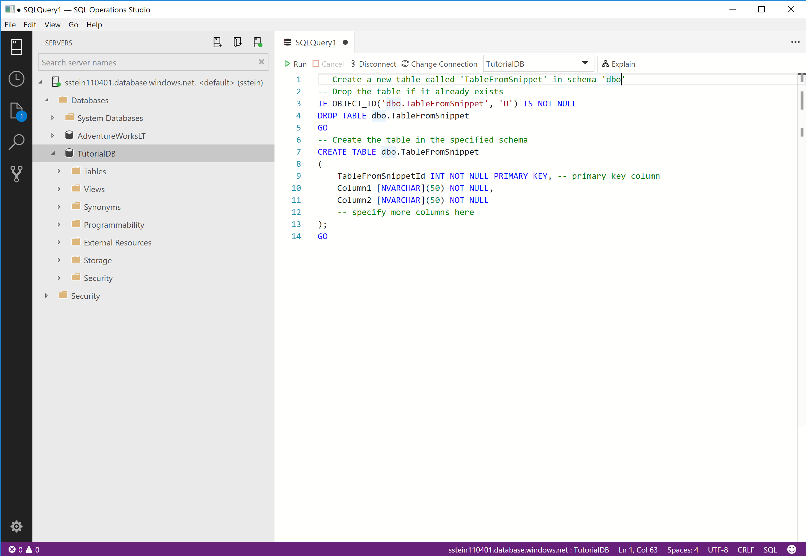
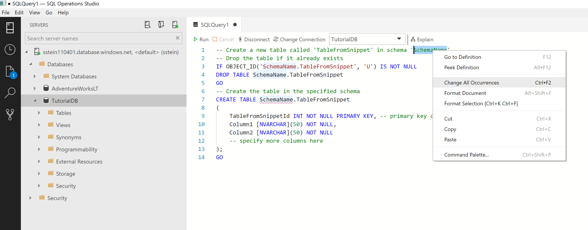

# Use code snippets to quickly create SQL scripts in [!INCLUDE[name-sos](../includes/name-sos-short.md)]

Code snippets in [!INCLUDE[name-sos](../includes/name-sos-short.md)] are templates that make it easier to create databases and database objects. 

## Using built-in SQL code snippets

[!INCLUDE[name-sos](../includes/name-sos-short.md)] provides several SQL snippets to assist you with quickly generating the proper syntax. 

1. To access the available snippets, type *sql* in the query editor to open the list:

   

1. Select the snippet you want to use, and it generates the SQL script. For example, select *sqlCreateTable*:

   

1. Update the highlighted fields with your specific values. For example, replace *TableName* and *Schema* with the values for your database:

   

   If the field you want to change is no longer highlighted (this happens when moving the cursor around the editor), right-click the word you want to change, and select **Change all occurrences**:

   

1. Update or add any additional SQL you need for the selected snippet. For example, update *Column1*, *Column2*, and add more columns.

## Next steps

[Code editor tutorial](tutorial-sql-editor.md)