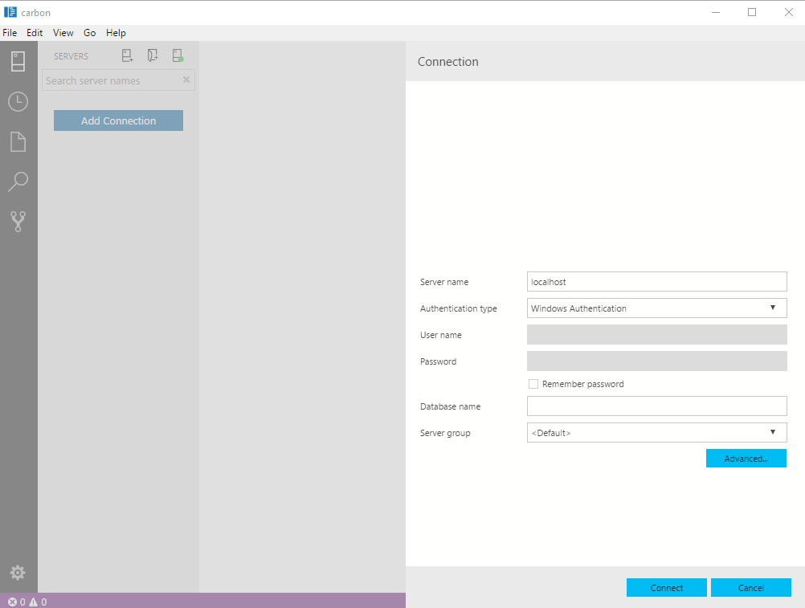

# Connect and query SQL Server using [!INCLUDE[name-sos](../includes/name-sos-short.md)]
This article shows how to get started using [!INCLUDE[name-sos](../includes/name-sos-short.md)] with SQL Server databases.  This quickstart should take about five minutes.

## Prerequisites

To complete this quickstart, you need [!INCLUDE[name-sos](../includes/name-sos-short.md)], and access to a SQL Server.

- [Install [!INCLUDE[name-sos](../includes/name-sos-short.md)]](download.md).

If you don't have access to a SQL Server, select your platform from the following links (make sure you remember your SQL Login and Password!):
- [Windows - Download SQL Server 2017 Developer Edition](https://www.microsoft.com/en-us/sql-server/sql-server-downloads)
- [macOS - Download SQL Server 2017 on Docker](https://docs.microsoft.com/en-us/sql/linux/quickstart-install-connect-docker)
- [Linux - Download SQL Server 2017 Developer Edition](https://docs.microsoft.com/en-us/sql/linux/sql-server-linux-overview#install) - You only need to follow the steps up to *Create and Query Data*.


## Connect to a server

   
1. Start **[!INCLUDE[name-sos](../includes/name-sos-short.md)]**.
1. The first time you run [!INCLUDE[name-sos](../includes/name-sos-short.md)] the **Connection** page should open. If the **Connection** page doesn't open, click the **New Connection** icon in the **SERVERS** page:
   
   

1. This article uses *SQL Login*, but *Windows Authentication* is supported. Fill in the fields as follows:
 
    - **Server Name:** localhost
    - **Authentication Type:** SQL Login  
    - **User name:** User name for the SQL Server  
    - **Password:** Password for the SQL Server  
    - **Database Name:** leave this field blank 
    - **Server Group:** \<Default\>  

   


## Create a database

The following steps create a database named **TutorialDB**:

1. Right click on your server, **localhost**, and select **New Query.**
1. Paste the following snippet into the query window: 

   ```sql
   USE master
   GO
   IF NOT EXISTS (
      SELECT name
      FROM sys.databases
      WHERE name = N'TutorialDB'
   )
   CREATE DATABASE [TutorialDB]
   GO

   ALTER DATABASE [TutorialDB] SET QUERY_STORE=ON
   GO
   ```
1. Select **Run** to execute the query.

After the query completes, the new **TutorialDB** appears in the list of databases. If you don't see it, right-click the **Databases** node and select **Refresh**.


## Create a table

1. Change the database context to **TutorialDB**:

   

1. Paste the following snippet into the query window:
   ```sql
   -- Create a new table called 'Customers' in schema 'dbo'
   -- Drop the table if it already exists
   IF OBJECT_ID('dbo.Customers', 'U') IS NOT NULL
   DROP TABLE dbo.Customers
   GO
   -- Create the table in the specified schema
   CREATE TABLE dbo.Customers
   (
      CustomerId        INT    NOT NULL   PRIMARY KEY, -- primary key column
      Name      [NVARCHAR](50)  NOT NULL,
      Location  [NVARCHAR](50)  NOT NULL,
      Email     [NVARCHAR](50)  NOT NULL
   );
   GO
   ```
1. If you added the snippet to the existing query window, select the text you want to execute, and click **Run**.

After the query completes, the new **Customers** table appears in the list of tables. You might need to right-click the **TutorialDB > Tables** node and select **Refresh**.

## Insert rows

1. Paste the following snippet into the query window:
   ```sql
   -- Insert rows into table 'Customers'
   INSERT INTO dbo.Customers
      ([CustomerId],[Name],[Location],[Email])
   VALUES
      ( 1, N'Orlando', N'Australia', N''),
      ( 2, N'Keith', N'India', N'keith0@adventure-works.com'),
      ( 3, N'Donna', N'Germany', N'donna0@adventure-works.com'),
      ( 4, N'Janet', N'United States', N'janet1@adventure-works.com')
   GO
   ```

1. To execute the query, click **Run**.


## View the data returned by a query
1. Paste the following snippet into the query window:

   ```sql
   -- Select rows from table 'Customers'
   SELECT * FROM dbo.Customers;
   ```

1. To execute the query, click **Run**.

   

## Save result to an Excel spreadsheet
1. Right click on the results table and save as an Excel** file. 

   

2. Save as **Results.xls**.

## View chart
View an existing, built-in widget through the dashboard.

## Next steps
> [!div class="nextstepaction"]
> [Apply modern code flow using [!INCLUDE[name-sos](../includes/name-sos-short.md)]](tutorial-modern-code-flow-sql-server.md)


