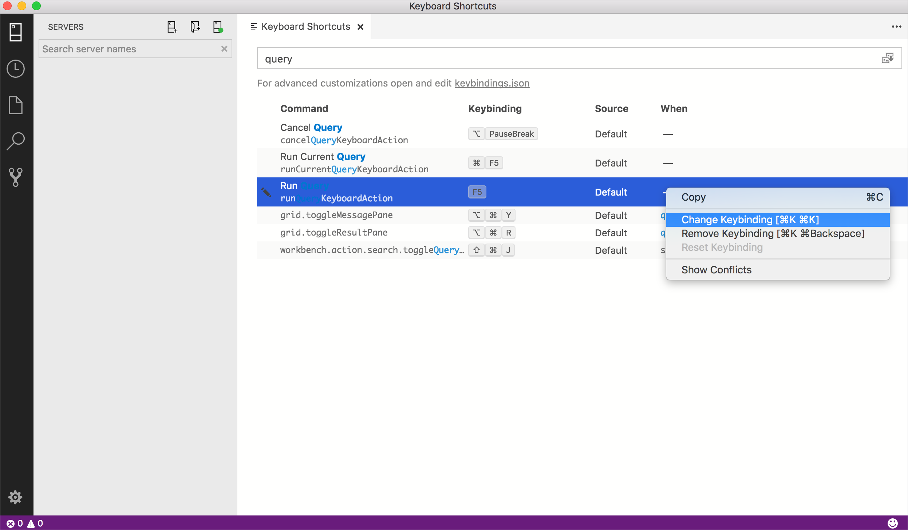
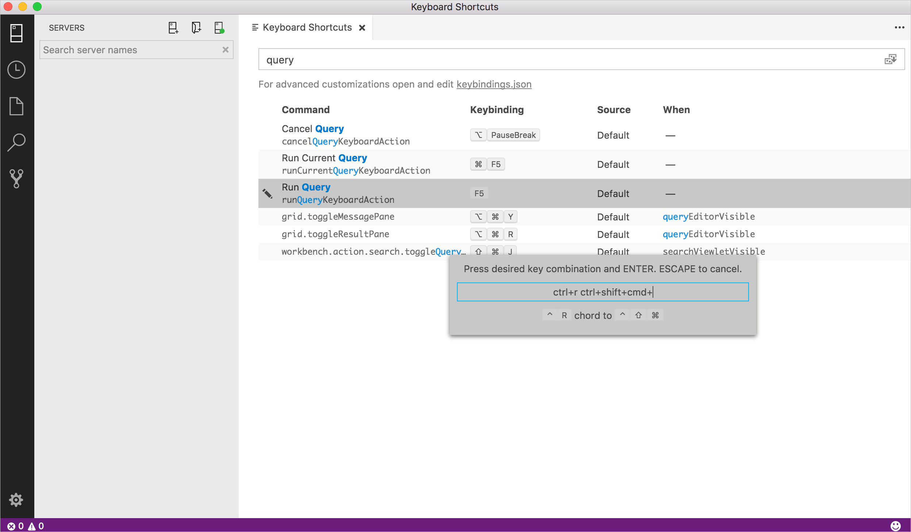
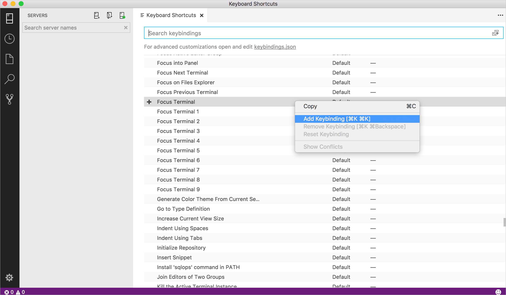

# Keyboard shortcuts in [!INCLUDE[name-sos](../includes/name-sos.md)]

This article provides the steps to quickly view, edit, and create keyboard shortcuts in [!INCLUDE[name-sos](../includes/name-sos-short.md)].

Because [!INCLUDE[name-sos](../includes/name-sos-short.md)] inherits its key binding functionality from Visual Studio Code, detailed information about advanced customizations, using different keyboard layouts, etc., is in the [Key Bindings for Visual Studio Code](https://code.visualstudio.com/docs/getstarted/keybindings) article. Some keybinding features may not be available (for example, Keymap extensions are not supported in [!INCLUDE[name-sos](../includes/name-sos-short.md)]).

## Open the Keyboard Shortcuts editor

To view all currently defined keyboard shortcuts:

Open the **Keyboard Shortcuts** editor from the **File** menu: **File** > **Preferences** > **Keyboard Shortcuts** (**[!INCLUDE[name-sos](../includes/name-sos-short.md)]** > **Preferences** > **Keyboard Shortcuts** on Mac).

In addition to displaying current keybindings, the **Keyboard Shortcuts** editor lists the available commands that do not have keyboard shortcuts defined. The **Keyboard Shortcuts** editor enables you to easily change, remove, reset, and define new keybindings.  

## Edit existing keyboard shortcuts

To change the keybinding for an existing keyboard shortcut:

1. Locate the keyboard shortcut you want to change by using the search box or scrolling through the list.
   > [!TIP]
   > Search by key, by command, by source, etc. to return all relevant keyboard shortcuts.

1. Right-click the desired entry and select **Change Keybinding**

   

1. Press the desired combination of keys, then press **Enter** to save it. 

   

## Create new keyboard shortcuts

To create new keyboard shortcuts:

1. Right-click a command that doesn't have any keybinding and select **Add Keybinding**.

   

1. Press the desired combination of keys, then press **Enter** to save it.

