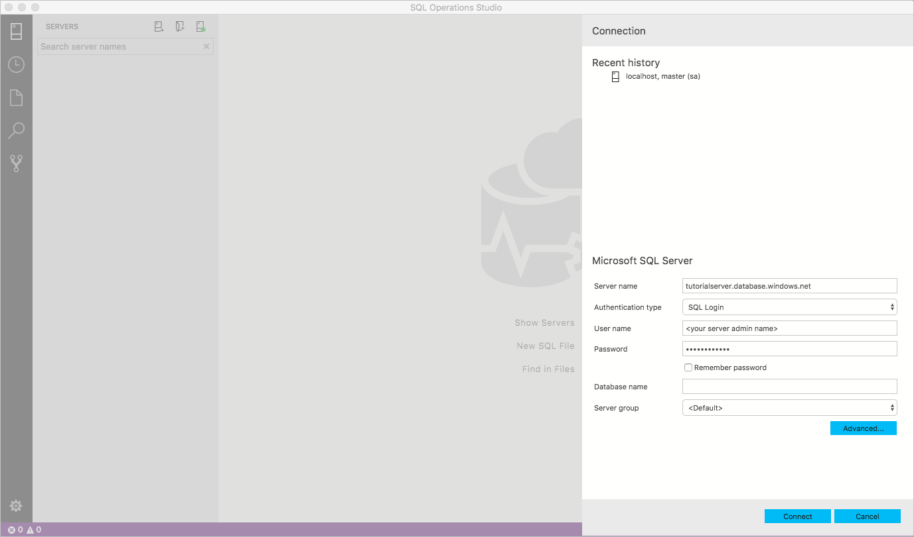

# Quickstart: Use [!INCLUDE[name-sos](../includes/name-sos-short.md)] to connect and query Azure SQL database

This quickstart demonstrates how to use *[!INCLUDE[name-sos](../includes/name-sos-short.md)]* to connect to an Azure SQL database, and then use Transact-SQL (T-SQL) statements to create the *TutorialDB* used in [!INCLUDE[name-sos](../includes/name-sos-short.md)] tutorials.

## Prerequisites

To complete this quickstart, you need [!INCLUDE[name-sos](../includes/name-sos-short.md)], and an Azure SQL server.

- [Install [!INCLUDE[name-sos](../includes/name-sos-short.md)]](download.md).

If you don't already have an Azure SQL server, complete one of the following Azure SQL Database quickstarts (remember the server name, and login credentials!):

- [Create DB - Portal](https://docs.microsoft.com/azure/sql-database/sql-database-get-started-portal)
- [Create DB - CLI](https://docs.microsoft.com/azure/sql-database/sql-database-get-started-cli)
- [Create DB - PowerShell](https://docs.microsoft.com/azure/sql-database/sql-database-get-started-powershell)


## Connect to your Azure SQL Database server

Use [!INCLUDE[name-sos](../includes/name-sos-short.md)] to establish a connection to your Azure SQL Database server.

1. The first time you run [!INCLUDE[name-sos](../includes/name-sos-short.md)] the **Connection** page should open. If the **Connection** page doesn't open, click the **New Connection** icon in the **SERVERS** sidebar:
   
   

2. This article uses *SQL Login*, but *Windows Authentication* is also supported. Fill in the fields as follows:

   | Setting       | Suggested value | Description |
   | ------------ | ------------------ | ------------------------------------------------- | 
   | **Server name** | The fully qualified server name | The name should be something like this: **servername.database.windows.net** |
   | **Authentication** | SQL Login| SQL Authentication is used in this tutorial. |
   | **User name** | The server admin account | This is the account that you specified when you created the server. |
   | **Password (SQL Login)** | The password for your server admin account | This is the password that you specified when you created the server. |
   | **Save Password?** | Yes or No | Select Yes if you do not want to enter the password each time. |
   | **Database name** | *leave blank* | The name of the database you want to connect to. |
   | **Server Group** | Select <Default> | If you created a server group, you can set to a specific server group. | 

     

3. If you get an error about the firewall, you need to create a firewall rule. To create a firewall rule, see [Firewall rules](https://docs.microsoft.com/azure/sql-database/sql-database-firewall-configure).

4. After successfully connecting your server will appear in the *Servers* sidebar.

## Create the tutorial database

The *TutorialDB* database is used in several [!INCLUDE[name-sos](../includes/name-sos-short.md)] tutorials.

1. Right click on your Azure SQL server in the SERVERS sidebar and select **New Query.**

1. Paste the following snippet into the query editor.

   ```sql
   IF NOT EXISTS (
      SELECT name
      FROM sys.databases
      WHERE name = N'TutorialDB'
   )
   CREATE DATABASE [TutorialDB]
   GO

   ALTER DATABASE [TutorialDB] SET QUERY_STORE=ON
   GO
   ```

1. To execute the query, click **Run**.


## Create a table

The query editor is still connected to the *master* database, but we want to create a table in the *TutorialDB* database. 

1. Change the connection context to **TutorialDB**:

   


1. Paste the following snippet into the query editor.

   ```sql
   -- Create a new table called 'Customers' in schema 'dbo'
   -- Drop the table if it already exists
   IF OBJECT_ID('dbo.Customers', 'U') IS NOT NULL
   DROP TABLE dbo.Customers
   GO
   -- Create the table in the specified schema
   CREATE TABLE dbo.Customers
   (
      CustomerId        INT    NOT NULL   PRIMARY KEY, -- primary key column
      Name      [NVARCHAR](50)  NOT NULL,
      Location  [NVARCHAR](50)  NOT NULL,
      Email     [NVARCHAR](50)  NOT NULL
   );
   GO
   ```
1. To execute the query, click **Run**.

## Insert rows

1. Paste the following snippet into the query editor:
   ```sql
   -- Insert rows into table 'Customers'
   INSERT INTO dbo.Customers
      ([CustomerId],[Name],[Location],[Email])
   VALUES
      ( 1, N'Orlando', N'Australia', N''),
      ( 2, N'Keith', N'India', N'keith0@adventure-works.com'),
      ( 3, N'Donna', N'Germany', N'donna0@adventure-works.com'),
      ( 4, N'Janet', N'United States', N'janet1@adventure-works.com')
   GO
   ```

1. To execute the query, click **Run**.

## View the result
1. Paste the following snippet into the query editor.

   ```sql
   -- Select rows from table 'Customers'
   SELECT * FROM dbo.Customers;
   ```

1. To execute the query, click **Run**.

   


## Clean up resources

Other articles in this collection build upon this quickstart. If you plan to continue on to work with subsequent quickstarts, do not clean up the resources created in this quickstart. If you do not plan to continue, use the following steps to delete resources created by this quickstart in the Azure portal.
Clean up resources by deleting the resource groups you no longer need. For details, see [Clean up resources](https://docs.microsoft.com/en-us/azure/sql-database/sql-database-get-started-portal#clean-up-resources).

## Next steps

Now that you've successfully connected to an Azure SQL database and ran a query, try out the [Code editor tutorial](tutorial-sql-editor.md).
