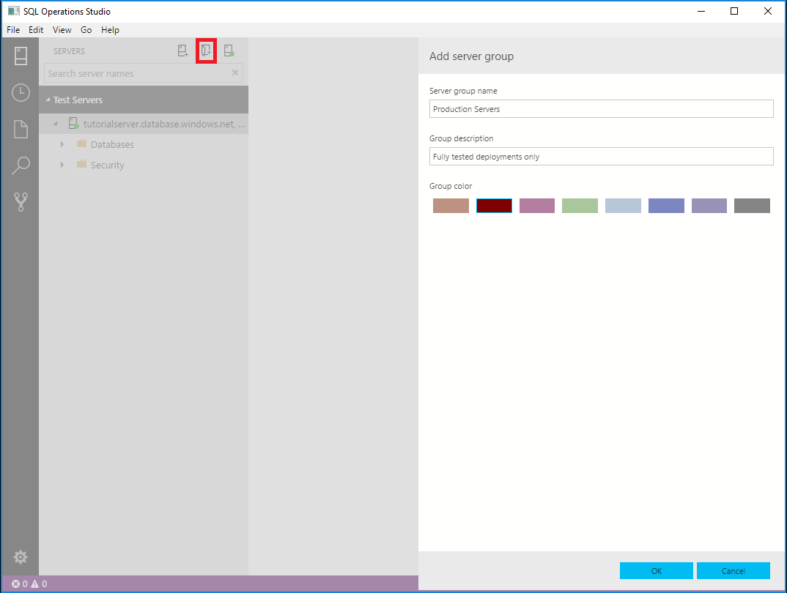

# Server groups in [!INCLUDE[name-sos](../includes/name-sos-short.md)]

Server groups provide a way to organize your connections to the servers and databases you work with. When you create server groups, the configuration details are saved into *User Settings*.

## Create and edit server groups

1. Click **New Server Group** at the top of the *SERVERS* sidebar.
2. Enter a group name and select a color for the group. Optionally, add a description.

   

To edit an existing server group, right-click the group, and select **Edit Server Group**.

To edit available server group colors, edit the *Server Groups* values in [User Settings](settings.md).

> [!TIP]
> You can drag and drop servers between different Server Groups.

## Additional resources
- [Workspace and User settings](settings.md)