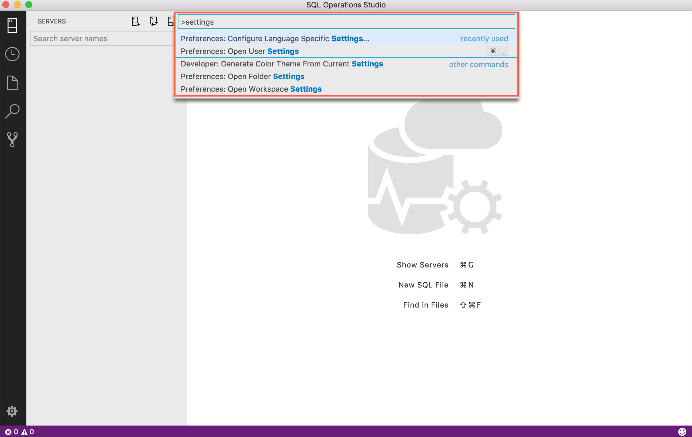
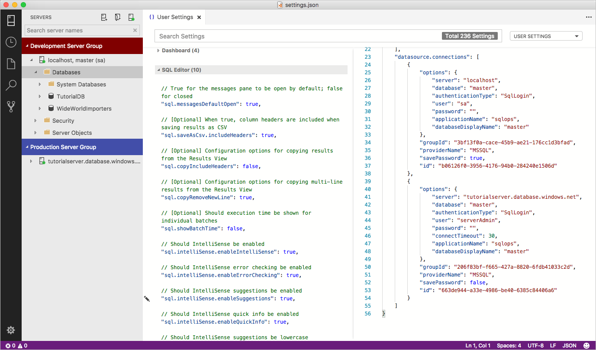

# Server groups in [!INCLUDE[name-sos](../includes/name-sos-short.md)]

Server groups provide a way to organize your connections to the servers and databases you work with. When you create server groups, the configuration details are saved into *User Settings*. Because *User Settings* are JSON, you can easily copy and share settings with other users who need to connect and work with the same collection of servers. 

## Create and edit server groups

1. Click **New Server Group** at the top of the *SERVERS* sidebar.
2. Enter a group name and select a color for the group. Optionally, add a description.

   

To edit an existing server group, right-click the group, and select **Edit Server Group**.

To edit available server group colors, edit the *Server Groups* values in [User Settings](settings.md).

> [!TIP]
> You can drag and drop servers between different Server Groups.

## Sharing server groups with other users

Server group configuration details are stored in *User Settings*. To share settings with teammates, perform the following steps:

1. Open *User Settings* by pressing **Ctrl+Shift+P** to open the *Command Palette*.
1. Type *settings* in the search box and from the available settings files, select **Preferences: Open User Settings**.

   

1. In the right side list of settings, locate and copy the following two sections:
   - *datasource.connectionGroups*
   - *datasource.connections*

   

1. Share the configuration details with users who need to connect to these servers and databases.

## Additional resources
- [Workspace and User settings](settings.md)