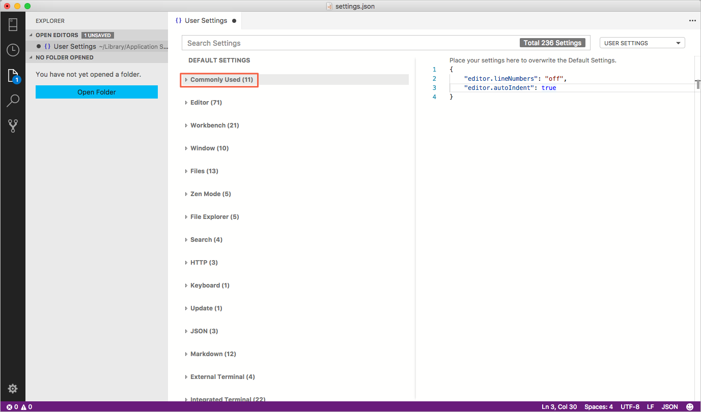
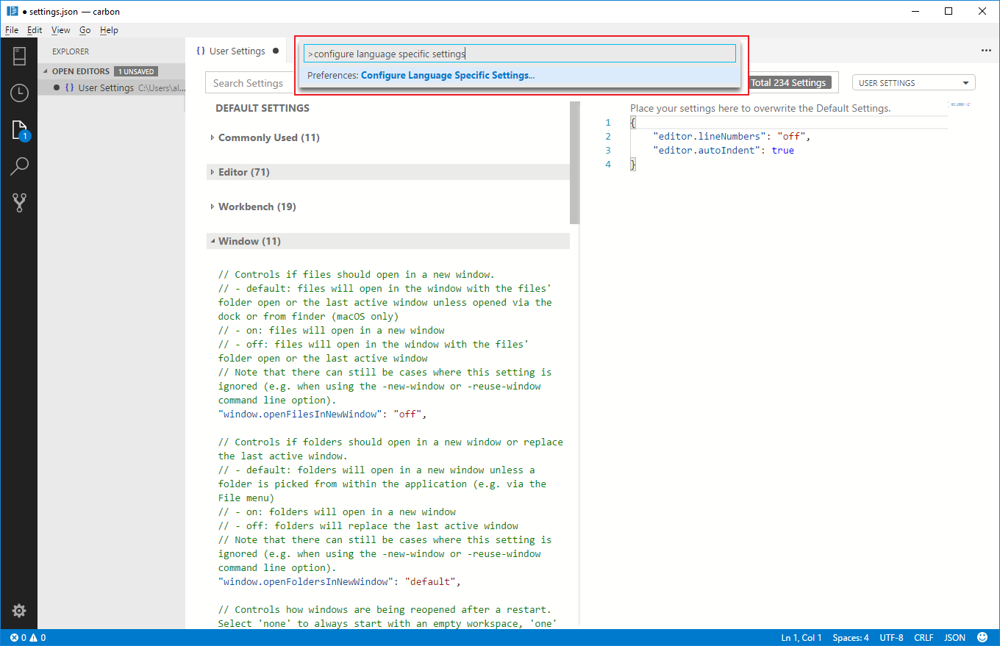
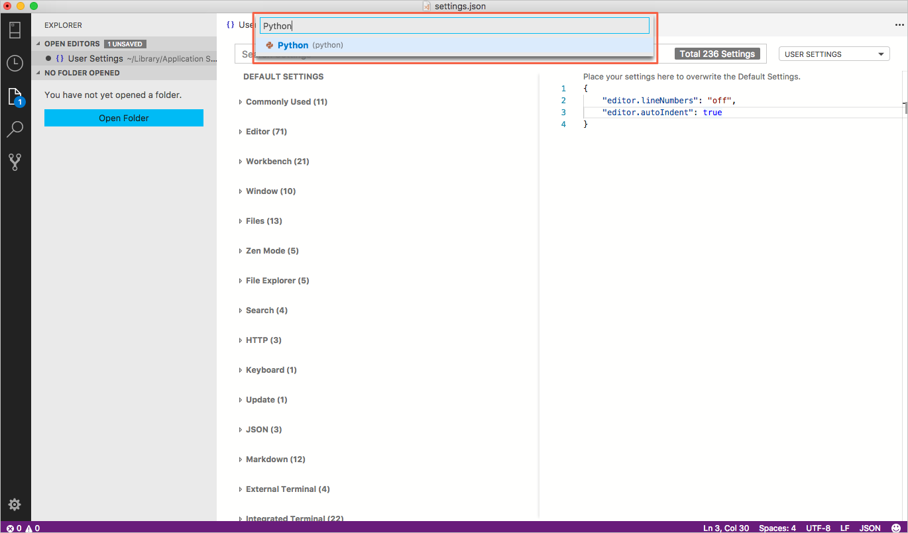
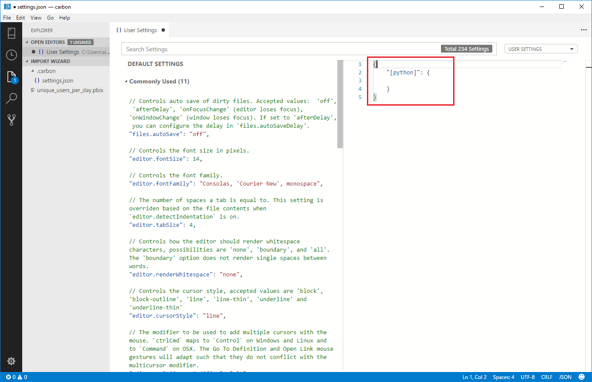
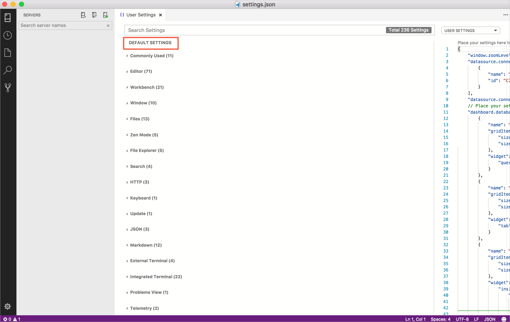

# User and Workspace Settings

It is easy to configure [!INCLUDE[name-sos](../includes/name-sos-short.md)] to your liking through settings. Nearly every part of [!INCLUDE[name-sos](../includes/name-sos-short.md)]'s editor, user interface, and functional behavior has options you can modify.

[!INCLUDE[name-sos](../includes/name-sos-short.md)] provides two different scopes for settings:

* **User** These settings apply globally to any instance of [!INCLUDE[name-sos](../includes/name-sos-short.md)] you open.
* **Workspace** Workspace settings are settings specific to a folder on your computer, and are only available when the folder is open in the Explorer sidebar. Settings defined on this scope override the user scope.

## Creating User and Workspace Settings

The menu command **File** > **Preferences** > **Settings** (**Code** > **Preferences** > **Settings** on Mac) provides the entry point to configure user and workspace settings. You are provided with a list of Default Settings. Copy any setting that you want to change to the appropriate `settings.json` file. The tabs on the right let you switch quickly between the user and workspace settings files.

You can also open the user and workspace settings from the **Command Palette** (**Ctrl+Shift+P**) with **Preferences: Open User Settings** and **Preferences: Open Workspace Settings** or use the keyboard shortcut (**Ctrl+,**).

The following example disables line numbers in the editor and configures lines of text to wrap automatically based on the size of the editor.


Changes to settings are reloaded by [!INCLUDE[name-sos](../includes/name-sos-short.md)] after the modified `settings.json` file is saved.

>**Note:** Workspace settings are useful for sharing project-specific settings across a team.

## Settings File Locations

Depending on your platform, the user settings file is located here:
??VERIFY THESE PLACEHOLDERS??
* **Windows** `%APPDATA%\sqlopsstudio\User\settings.json`
* **Mac** `$HOME/Library/Application Support/sqlopsstudio/User/settings.json`
* **Linux** `$HOME/.config/sqlopsstudio/User/settings.json`

The workspace setting file is located under the `.[!INCLUDE[name-sos](../includes/name-sos-short.md)]` folder in your project.

## Default Settings

When you open settings, **Default Settings** appear so you can search and discover the settings you are looking for. When you search using the Search bar, it not only shows and highlights the settings matching your criteria, but also filters out settings that are not matching. This makes finding settings quick and easy. There are actions available inside **Default Settings** and *settings.json* editors that help you quickly copy or update a setting.

<p>
  
</p>


### Settings groups

Default settings are represented in groups so that you can navigate them easily. It has **Most Commonly Used** group on the top to see the most common customizations done by [!INCLUDE[name-sos](../includes/name-sos-short.md)] users.



Here is the [copy of default settings](#default-settings) that comes with [!INCLUDE[name-sos](../includes/name-sos-short.md)].

## Language specific editor settings

To customize your editor by language, run the global command **Preferences: Configure language-specific settings...** (command id: `workbench.action.configureLanguageBasedSettings`) from the **Command Palette** (`kb(workbench.action.showCommands)`) which opens the language picker. Selecting the language you want, opens the Settings editor with the language entry where you can add applicable settings.







If you have a file open and you want to customize the editor for this file type, click on the Language Mode in the Status Bar to the bottom-right of the [!INCLUDE[name-sos](../includes/name-sos-short.md)] window. This opens the Language Mode picker with an option **Configure 'language_name' language-based settings...**. Selecting this opens the Settings editor with the language entry where you can add applicable settings.

You can also configure language-based settings by directly opening `settings.json`. You can scope them to the workspace by placing them in the Workspace settings just like other settings. If you have settings defined for a language in both user and workspace scopes, then they are merged by giving precedence to the ones defined in the workspace.

The following examples customize editor settings for language modes `typescript` and `markdown`.

```json
{
  "[typescript]": {
    "editor.formatOnSave": true,
    "editor.formatOnPaste": true
  },
  "[markdown]": {
    "editor.formatOnSave": true,
    "editor.wordWrap": "on",
    "editor.renderWhitespace": "all",
    "editor.acceptSuggestionOnEnter": "off"
  }
}
```

You can use IntelliSense in Settings editor to help you find allowed language-based settings. All editor settings and some non-editor settings are supported.

## Settings and security

In settings, you're allowed to specify some of the executables that [!INCLUDE[name-sos](../includes/name-sos-short.md)] runs to do its work. For example, you can choose which shell the Integrated Terminal should use. For enhanced security, such settings can only be defined in user settings and not at the workspace scope.

Here is the list of settings we don't support at the workspace scope:

- `git.path`
- `terminal.integrated.shell.linux`
- `terminal.integrated.shellArgs.linux`
- `terminal.integrated.shell.osx`
- `terminal.integrated.shellArgs.osx`
- `terminal.integrated.shell.windows`
- `terminal.integrated.shellArgs.windows`
- `terminal.external.windowsExec`
- `terminal.external.osxExec`
- `terminal.external.linuxExec`

The first time you open a workspace that defines any of these settings, [!INCLUDE[name-sos](../includes/name-sos-short.md)] warns you and subsequently always ignore the values after that.

### <a id="default-settings"></a>Copy of Default Settings

To find the default settings, press **Ctrl+COMMA**.



Because SQL Operations Studio (preview) inherits its user and workspace settings functionality from Visual Studio Code, detailed information about advanced settings is in the [Settings for Visual Studio Code article](https://code.visualstudio.com/docs/getstarted/settings).