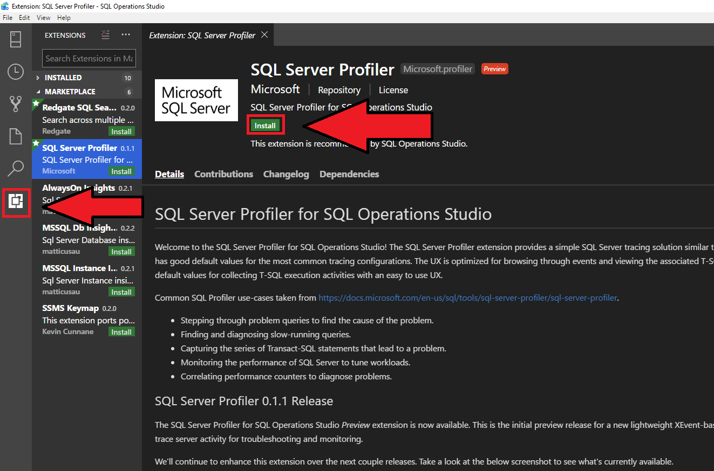
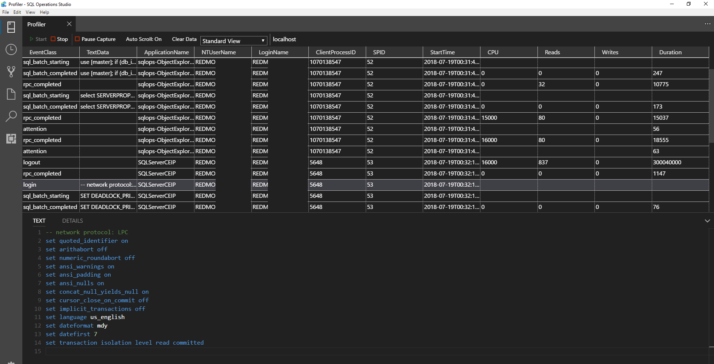

# SQL Server Profiler Extension

The SQL Server Profiler extension provides a simple SQL Server tracing solution similar to SSMS Profiler except built using XEvents. SSMS Profiler is very easy to use and has good default values for the most common tracing configurations. The UX is optimized for browsing through events and viewing the associated T-SQL text. The SQL Server Profiler for SQL Operations Studio also assumes good default values for collecting T-SQL execution activities with an easy to use UX.

**Common SQL Profiler use-cases:**

-Stepping through problem queries to find the cause of the problem.

-Finding and diagnosing slow-running queries.

-Capturing the series of Transact-SQL statements that lead to a problem.

-Monitoring the performance of SQL Server to tune workloads.

-Correlating performance counters to diagnose problems.

## Install the SQL Server Profiler extension

1. To open the extensions manager and access the available extensions, select the extensions icon, or select **Extensions** in the **View** menu.
2. Select an available extension to view it's details.

   

1. Select the extension you want and **Install** it.
2. Select **Reload** to enable the extension (only required the first time you install an extension).

## Start Profiler

1. To start Profiler, first make a connection to a server in the Servers tab.
2. After you make a connection, type **Alt + P** to launch Profiler.
3. To start Profiler, type **Alt + S.** You can now start seeing Extended Events.
        
1. To stop Profiler, type **Alt + S.** This hotkey is a toggle.

## Next Steps

To learn more about Profiler and extended events, [check our documentation.](https://docs.microsoft.com/sql/relational-databases/extended-events/extended-events?view=sql-server-2017)

