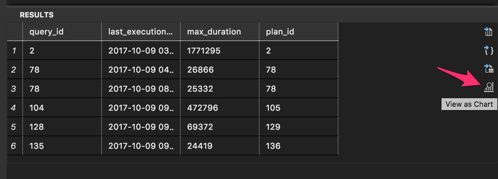
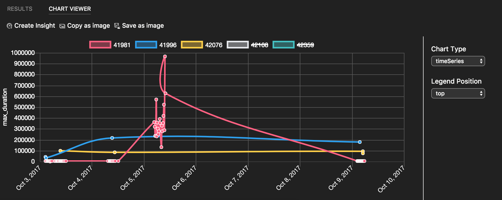
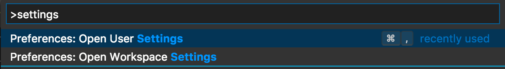
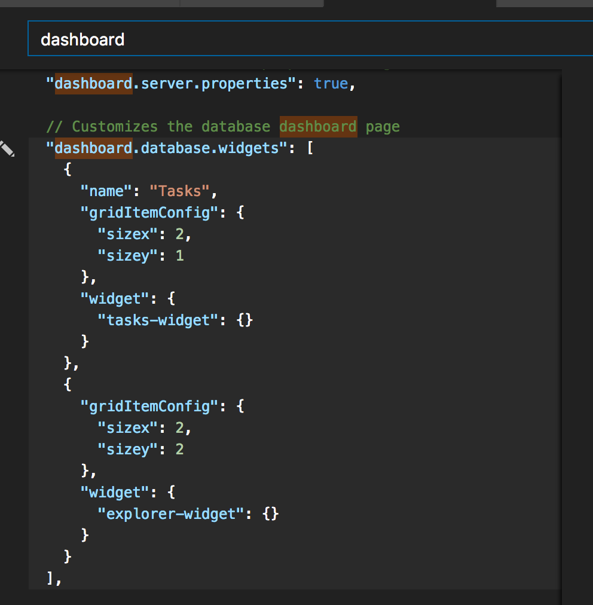
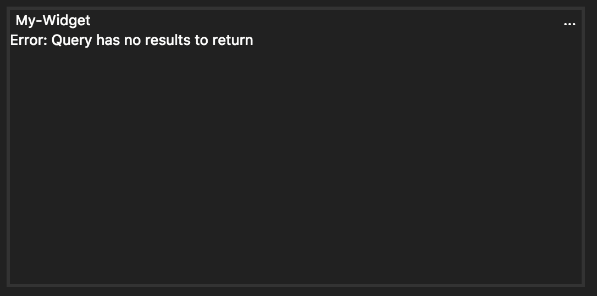

# Monitor database with Carbon
Follow [Get Started with Carbon](./get-started-sql-server.md)

In this tutorial, you use the Carbon to learn how to:
> [!div class="checklist"]
> * Bring your own monitoring query as an insight
> * Visualize insight query result into a chart
> * Pin the chart to a SQL Server and database dashboard

If you don't have an Azure subscription, create a [free](https://azure.microsoft.com/free/) account before you begin.

## Prerequisites
Follow [Get Started with Carbon](./get-started-sql-server.md)

## Bring your own Insight query: View Top five slowest queries
[step overview]
In this tutorial, we use Query Store feature ...[give a brief explanation and link to QDS]

1. Enable Query Store on TutorialDB by executing following query.

   ```sql
    ALTER DATABASE TutorialDB SET QUERY_STORE=ON
   ```
2. Open a new query editor from TutorialDB and copy & paste following script.

   ```sql
    WITH SlowestQry AS( 
        SELECT TOP 5  
            p.query_id, 
            MAX(rs.max_duration ) max_duration 
        FROM sys.query_store_plan AS p    
        JOIN sys.query_store_runtime_stats AS rs    
            ON p.plan_id = rs.plan_id   
        WHERE rs.last_execution_time > DATEADD(week, -1, GETUTCDATE())   
        GROUP BY p.query_id 
        ORDER BY MAX(rs.max_duration ) DESC) 
    SELECT  
        p.query_id,  -- legend 
        format(rs.last_execution_time,'yyyy-MM-dd hh:mm:ss') as [last_execution_time],   -- x axis 
        rs.max_duration,  -- y axis
        p.plan_id 
    FROM sys.query_store_plan AS p    
        JOIN sys.query_store_runtime_stats AS rs    
            ON p.plan_id = rs.plan_id   
        JOIN SlowestQry tq 
            ON tq.query_id = p.query_id 
    WHERE rs.last_execution_time > DATEADD(week, -1, GETUTCDATE())   
    order by format(rs.last_execution_time,'yyyy-MM-dd hh:mm:ss')
    END
   ```
3. To execute the query, press **F5**. After Carbon returns the query, click the **View as Chart* button.

   

4. Change the chart type to **TimeSeries** and select **top** for **Legend Position**. These settings render a line chart:

   

5. Save the query in the editor to a *.sql file. For this tutorial, save the script as ```qds_insight.sql```.

## Build an Insight widget on Dashboard
[overview step]

1. Click ```Create Insight``` button on Chart Viewer. It opens an insight widget configuration like:

   ```json
    {
        "name": "My-Widget",
        "gridItemConfig": {
            "sizex": 2,
            "sizey": 1
        },
        "widget": {
            "insights-widget": {
                "type": {
                    "timeSeries": {
                        "dataDirection": "horizontal",
                        "dataType": "point",
                        "legendPosition": "top",
                        "labelFirstColumn": false,
                        "columnsAsLabels": false
                    }
                },
                "queryFile": "/Users/myusername/Projects/database_project/qds_insight.sql"
            }
        }
    }
   ```
2. Copy the insight configuration json data. 

3. Press ```F1``` and type ```settings``` in the Command Palette to open either User Settings or Workspace Settings. For this tutorial, select ```Preferences: Open User Settings``` for this tutorial. For more information about the usage of Workspace settings, see [Tips for workspace mode in Carbon]()

   

4. Type ```dashboard``` in ```Search Settings```. Click ```Edit``` on ```dashboard.database.widgets```. 

   > To configure an insight widget for SQL Server, click ```Edit``` for ```dashboard.server.widgets```

   

5. Paste the insight configuration json into ```dashboard.database.widgets{}```. Database dashboard will be:

   > Repeat the same steps to add multiple insight widgets.

   ```json
    "dashboard.database.widgets": [
        {
            "name": "My-Widget",
            "gridItemConfig": {
                "sizex": 2,
                "sizey": 1
            },
            "widget": {
                "insights-widget": {
                    "type": {
                        "timeSeries": {
                            "dataDirection": "horizontal",
                            "dataType": "point",
                            "legendPosition": "top",
                            "labelFirstColumn": false,
                            "columnsAsLabels": false
                        }
                    },
                    "queryFile": "/Users/myusername/Projects/database_project/qds_insight.sql"
                }
            }
        },
        {
            "name": "Tasks",
            "gridItemConfig": {
                "sizex": 2,
                "sizey": 1
            },
            "widget": {
                "tasks-widget": {}
            }
        },
        {
            "gridItemConfig": {
                "sizex": 2,
                "sizey": 2
            },
            "widget": {
                "explorer-widget": {}
            }
        }
    ]
   ```
6. Save the User Settings file and Open Dashboard from TutorialDB.

    

## Next Steps
In this tutorial, you learned how to:
> [!div class="checklist"]
> * Create something
> * Do something
> * Do something else
> * Finish something 

Next, learn how to use X, try this tutorial: 
> [!div class="nextstepaction"]
> [What article is next in sequence](tutorial-monitoring-sql-server.md)