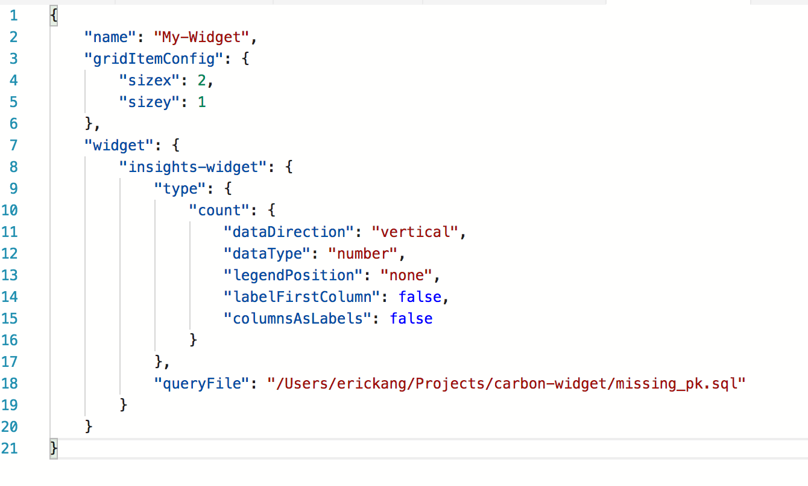

# Build a custom insight widget
In the previous tutorial, you learned how to quickly enable insight widgets on dashboard using built-in samples. In this tutorial, you walk through how to bring your own insight queries and build a custom insight widget. With a few simple steps, you learn how to:
> [!div class="checklist"]
> * Run your own query and view it in a chart
> * Build a custom insight widget from the char
> * Add the chart to a server or database dashboard

## Prerequisites
Follow [Get Started with Carbon](./get-started-sql-server.md)

## Run your own query and view the result in a chart view
In this step, run a sql script to query the current active sessions.

1. Press 'CTRL + N' to open a new editor. Connect to 'TutorialDB'.

2. Copy and paste the following query into the new editor:

   ```sql
   SELECT count(session_id) as [Active Sessions]
   FROM sys.dm_exec_sessions
   WHERE status = 'running'
   ```

3. Press ```F5``` to execute. After SQL Operations Studio returns with the result view, click ```View as Chart``` button.

   

4. Change the chart type to ```Count```. These settings render a count chart:

   

5. Save the query in the editor to a *.sql file. For this tutorial, save the script as ```activeSession.sql```.

## Generate an insight widget setting

1. Click **Create Insight** button on Chart Viewer. It opens the insight widget configuration:
   
   
2. Copy the insight configuration json data to a clipboard by pressing ```CTRL+C```. 

3. Press ```F1``` and type ```settings``` in the Command Palette to open either User Settings or Workspace Settings. For this tutorial, select ```Preferences: Open User Settings```. For more information about the usage of Workspace settings, see [Tips for workspace mode in SQL Operations Studio]()

   

4. Type ```dashboard``` in ```Search Settings```. Click ```Edit``` on ```dashboard.database.widgets```. 

   > To configure an insight widget for SQL Server, click ```Edit``` for ```dashboard.server.widgets```

   

5. Paste the insight configuration json into ```dashboard.database.widgets{}```. Database dashboard settings looks like the following:

   ```json
    "dashboard.database.widgets": [
            {
            "name": "My-Widget",
            "gridItemConfig": {
                "sizex": 1,
                "sizey": 1
            },
            "widget": {
                "insights-widget": {
                    "type": {
                        "count": {
                            "dataDirection": "vertical",
                            "dataType": "number",
                            "legendPosition": "none",
                            "labelFirstColumn": false,
                            "columnsAsLabels": false
                        }
                    },
                    "queryFile": "{your file folder}/activeSession.sql"
                }
            }
        }
   ```
6. Save the User Settings file and Open Dashboard from TutorialDB.

    


## Next steps
In this tutorial, you learned how to:
> [!div class="checklist"]
> * Run your own query and view it in a chart
> * Build a custom insight widget from the char
> * Add the chart to a server or database dashboard

To learn how to backup and restore databases, see [Backup and Restore using SQL Operations Studio](tutorial-backup-restore-sql-server.md).