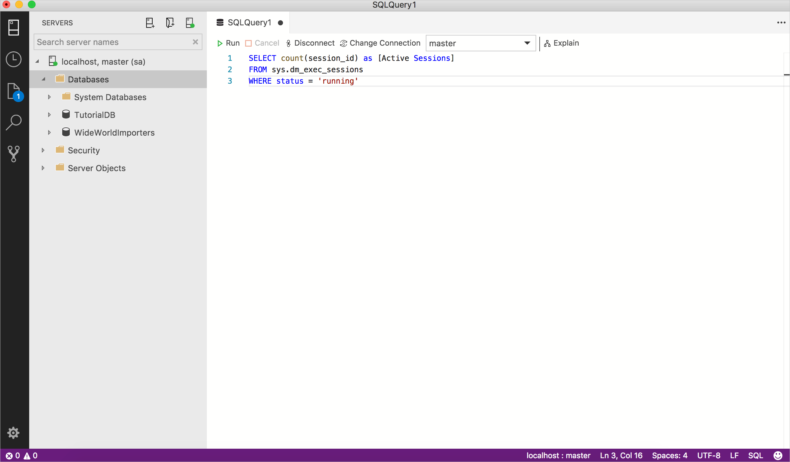

# Build a custom insight widget
In the previous tutorial, you learned how to quickly enable insight widgets on dashboard using built-in samples. In this tutorial, you walk through how to bring your own insight queries and build a custom insight widget. With a few simple steps, you learn how to:
> [!div class="checklist"]
> * Run your own query and view it in a chart
> * Build a custom insight widget from the chart
> * Add the chart to a server or database dashboard

## Prerequisites
This tutorial requires the *TutorialDB* database. To create the *TutorialDB* database, complete one of the following quickstarts:

- [Connect and query SQL Server using [!INCLUDE[name-sos-short](../includes/name-sos-short.md)]](get-started-sql-server.md)
- [Connect and query Azure SQL Database using [!INCLUDE[name-sos-short](../includes/name-sos-short.md)]](get-started-sql-database.md)
- [Connect and query SQL Data Warehouse using [!INCLUDE[name-sos-short](../includes/name-sos-short.md)]](get-started-sql-dw.md)


## Run your own query and view the result in a chart view
In this step, run a sql script to query the current active sessions.

1. To open a new editor, press **Ctrl+N** . 
2. Change the connection context to **TutorialDB**.

2. Paste the following query into the query editor.

   ```sql
   SELECT count(session_id) as [Active Sessions]
   FROM sys.dm_exec_sessions
   WHERE status = 'running'
   ```
1. To execute the query, press **F5**.
3. After SQL Operations Studio returns with the result view, click **View as Chart**, then click the **Chart Viewer** tab.
4. Change **Chart Type** to **count**. These settings render a count chart:

   

5. Save the query in the editor to a *.sql file. For this tutorial, save the script as *activeSession.sql*.

## Generate an insight widget setting

1. To open the insight widget configuration, click **Create Insight** on *Chart Viewer*:
   
   
2. Copy the insight configuration (the JSON data). 

3. Press **Ctrl+Comma** and to open *User Settings*.

4. Type *dashboard* in *Search Settings*.

1. To configure an insight widget for SQL Server, click **Edit** for *dashboard.server.widgets*.

   

5. Paste the insight configuration JSON into *dashboard.database.widgets{}*. Database dashboard settings looks like the following:

   ```json
    "dashboard.database.widgets": [
            {
            "name": "My-Widget",
            "gridItemConfig": {
                "sizex": 1,
                "sizey": 1
            },
            "widget": {
                "insights-widget": {
                    "type": {
                        "count": {
                            "dataDirection": "vertical",
                            "dataType": "number",
                            "legendPosition": "none",
                            "labelFirstColumn": false,
                            "columnsAsLabels": false
                        }
                    },
                    "queryFile": "{your file folder}/activeSession.sql"
                }
            }
        }
   ```
6. Save the *User Settings* file and Open the *TutorialDB* database dashboard.

    


## Next steps
In this tutorial, you learned how to:
> [!div class="checklist"]
> * Run your own query and view it in a chart
> * Build a custom insight widget from the chart
> * Add the chart to a server or database dashboard

To learn how to backup and restore databases, see [Backup and Restore using SQL Operations Studio](tutorial-backup-restore-sql-server.md).