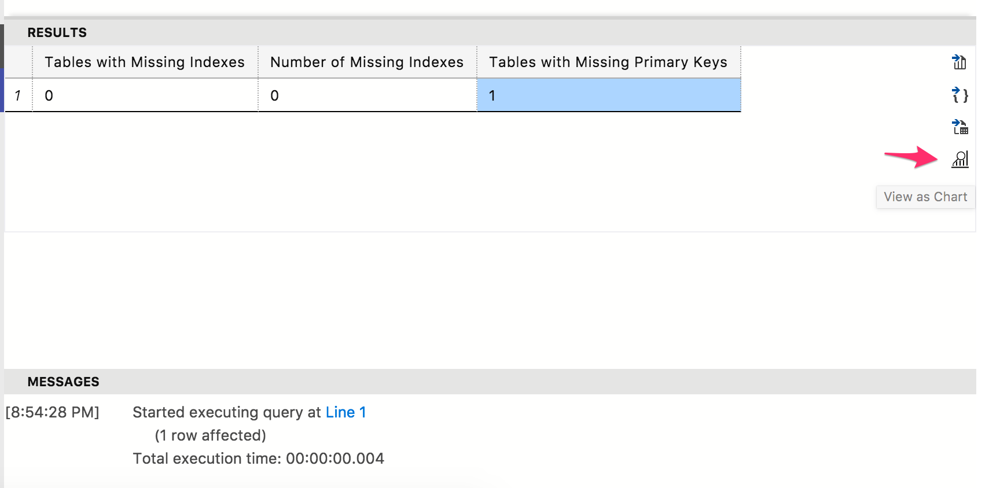
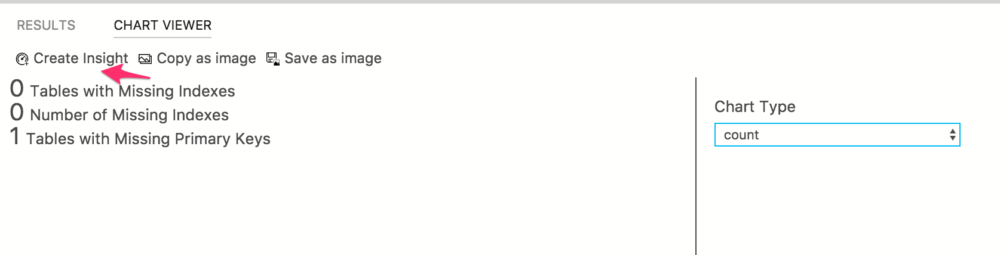
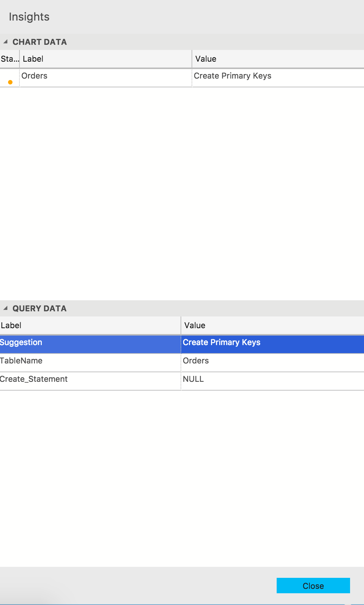

# Build a custom insight widget
In the previous tutorial, you learned how to quickly enable insight widgets on dashboard using built-in samples. In this tutorial, you walk through how to bring your own insight queries and build a custom insight widget. With a few simple steps, you learn how to:
> [!div class="checklist"]
> * Run your own query and view it in a chart view.
> * Build a custom insight widget from the chart view. 
> * Pin the chart to a SQL Server and database dashboard

## Prerequisites
Follow [Get Started with Carbon](./get-started-sql-server.md)

## Run your own query and view the result in a chart view
In this step, run a query to identify a missing primary key and missing index in a table.

1. Press 'CTRL + N' to open a new editor. Connect to 'TutorialDB'.


2. Create 'Order' table without a primary key and index by running the following script:

   ```sql
   -- Create a new table called 'Orders' in schema 'dbo'
   -- Drop the table if it already exists
   IF OBJECT_ID('dbo.Orders', 'U') IS NOT NULL
   DROP TABLE dbo.Orders
   GO
   -- Create the table in the specified schema
   CREATE TABLE dbo.Orders
   (
      OrderId        INT    NOT NULL,
      CustomerID     INT  NOT NULL,
      ProductId      INT  NOT NULL
   );
   GO

   INSERT INTO dbo.Orders
      ([OrderId],[CustomerID],[ProductId])
   VALUES
    (1, 2, 3030),
    (2, 2, 3031),
    (3, 1, 1002),
    (4, 2, 2001),
    (5, 1, 3030)
   GO  
   ```

3. Press 'CTRL + N' to open a new editor and connect to 'TutorialDB'.

4. Copy & paste following script for missing primary key and index query.

   ```sql
    DECLARE @TablesWithMissingPK INT = ( 
    SELECT COUNT(1) 
    FROM SYS.TABLES T 
    WHERE NOT EXISTS (SELECT * 
                    FROM SYS.indexes i 
                    WHERE i.object_id = t.object_id 
                    AND i.is_primary_key = 1) 
    AND t.type = 'U' 
    AND t.temporal_type = 0 
    ); 
 
 
    DECLARE @TablesWithMissingIndexes INT = 0; 
    DECLARE @MissingIndexes INT = 0; 
 
    SELECT
    @TablesWithMissingIndexes = COUNT(DISTINCT dm_mid.OBJECT_ID), 
    @MissingIndexes = COUNT(1)  
    FROM sys.dm_db_missing_index_groups dm_mig 
    INNER JOIN sys.dm_db_missing_index_group_stats dm_migs 
    ON dm_migs.group_handle = dm_mig.index_group_handle 
    INNER JOIN sys.dm_db_missing_index_details dm_mid 
    ON dm_mig.index_handle = dm_mid.index_handle 
    WHERE dm_mid.database_ID = DB_ID() 
    GROUP BY  dm_mid.database_id  
 
    SELECT  
    @TablesWithMissingIndexes AS [Tables with Missing Indexes], 
    @MissingIndexes AS [Number of Missing Indexes], 
    @TablesWithMissingPK AS [Tables with Missing Primary Keys]; 
   ```

5. Press ```F5``` to execute the query. After Carbon returns the query, click ```View as Chart``` button.

   

4. Change the chart type to ```Count```. These settings render a count chart:

   

5. Save the query in the editor to a *.sql file. For this tutorial, save the script as ```missing_pk.sql```.

## Generate an insight widget setting

1. Click **Create Insight** button on Chart Viewer. It opens the insight widget configuration:
   
   
2. Copy the insight configuration json data. 

3. Press ```F1``` and type ```settings``` in the Command Palette to open either User Settings or Workspace Settings. For this tutorial, select ```Preferences: Open User Settings``` for this tutorial. For more information about the usage of Workspace settings, see [Tips for workspace mode in Carbon]()

   

4. Type ```dashboard``` in ```Search Settings```. Click ```Edit``` on ```dashboard.database.widgets```. 

   > To configure an insight widget for SQL Server, click ```Edit``` for ```dashboard.server.widgets```

   

5. Paste the insight configuration json into ```dashboard.database.widgets{}```. Database dashboard should look like the following:

   > Repeat the same steps to add multiple insight widgets.

   ```json
    "dashboard.database.widgets": [
            {
            "name": "My-Widget",
            "gridItemConfig": {
                "sizex": 2,
                "sizey": 1
            },
            "widget": {
                "insights-widget": {
                    "type": {
                        "count": {
                            "dataDirection": "vertical",
                            "dataType": "number",
                            "legendPosition": "none",
                            "labelFirstColumn": false,
                            "columnsAsLabels": false
                        }
                    },
                    "queryFile": "{your file folder}/missing_pk.sql"
                }
            }
        },
        {
            "name": "Tasks",
            "gridItemConfig": {
                "sizex": 2,
                "sizey": 1
            },
            "widget": {
                "tasks-widget": {}
            }
        },
        {
            "gridItemConfig": {
                "sizex": 2,
                "sizey": 2
            },
            "widget": {
                "explorer-widget": {}
            }
        }
    ]
   ```
6. Save the User Settings file and Open Dashboard from TutorialDB.

    

## Add Insight Details

1. Press 'CTRL + N' to open a new editor.

2. Copy & paste following script and save as 'missing_pk_detail.sql'.

   ```sql
    SELECT  
    'Create Index' as Suggestion, 
    OBJECT_NAME(dm_mid.OBJECT_ID,dm_mid.database_id) AS [TableName], 
    'CREATE INDEX [IX_' + OBJECT_NAME(dm_mid.OBJECT_ID,dm_mid.database_id) + '_' 
    + REPLACE(REPLACE(REPLACE(ISNULL(dm_mid.equality_columns,''),', ','_'),'[',''),']','')  
    + CASE 
    WHEN dm_mid.equality_columns IS NOT NULL 
    AND dm_mid.inequality_columns IS NOT NULL THEN '_' 
    ELSE '' 
    END 
    + REPLACE(REPLACE(REPLACE(ISNULL(dm_mid.inequality_columns,''),', ','_'),'[',''),']','') 
    + ']' 
    + ' ON ' + dm_mid.statement 
    + ' (' + ISNULL (dm_mid.equality_columns,'') 
    + CASE WHEN dm_mid.equality_columns IS NOT NULL AND dm_mid.inequality_columns  
    IS NOT NULL THEN ',' ELSE 
    '' END 
    + ISNULL (dm_mid.inequality_columns, '') 
    + ')' 
    + ISNULL (' INCLUDE (' + dm_mid.included_columns + ')', '') AS Create_Statement 
    FROM sys.dm_db_missing_index_groups dm_mig 
    INNER JOIN sys.dm_db_missing_index_group_stats dm_migs 
    ON dm_migs.group_handle = dm_mig.index_group_handle 
    INNER JOIN sys.dm_db_missing_index_details dm_mid 
    ON dm_mig.index_handle = dm_mid.index_handle 
    UNION ALL 
    SELECT  
    'Create Primary Keys' as Suggestion, 
    t.name,  
    NULL  
    FROM SYS.TABLES T 
    WHERE NOT EXISTS (SELECT * 
                    FROM SYS.indexes i 
                    WHERE i.object_id = t.object_id 
                    AND i.is_primary_key = 1) 
    AND t.type = 'U' 
    AND t.temporal_type = 0 
   ```
3. Press 'F5' and check the query execution.

4. Update the insight setting by adding 'details' configuration.

   ```sql
    {
        "name": "My-Widget",
        "gridItemConfig": {
            "sizex": 2,
            "sizey": 1
        },
        "widget": {
            "insights-widget": {
                "type": {
                    "count": {
                        "dataDirection": "vertical",
                        "dataType": "number",
                        "legendPosition": "none",
                        "labelFirstColumn": false,
                        "columnsAsLabels": false
                    }
                },
                "queryFile": "{path to the folder}/missing_pk.sql",
                "details": {
                    "queryFile": "{path to the folder}/suggestion.sql",
                    "label": {
                        "column": "TableName",
                        "state": [
                            {
                                "condition": {
                                    "if": "equals",
                                    "equals": "Create Primary Keys"
                                },
                                "color": "orange"
                            },
                            {
                                "condition": {
                                    "if": "always",
                                    "equals": "Create Index"
                                },
                                "color": "maroon"
                            }
                        ]
                    },
                    "value": "Suggestion"
                }
            }
        }
    },   
   ```

5. Close dashboard and reopen.

6. Click 'Show detail' to open the insight detail dialog.

   

## Next Steps
In this tutorial, you learned how to:
> [!div class="checklist"]
> * Create something
> * Do something
> * Do something else
> * Finish something 

Next, learn how to use X, try this tutorial: 
> [!div class="nextstepaction"]
> [What article is next in sequence](tutorial-monitoring-sql-server.md)