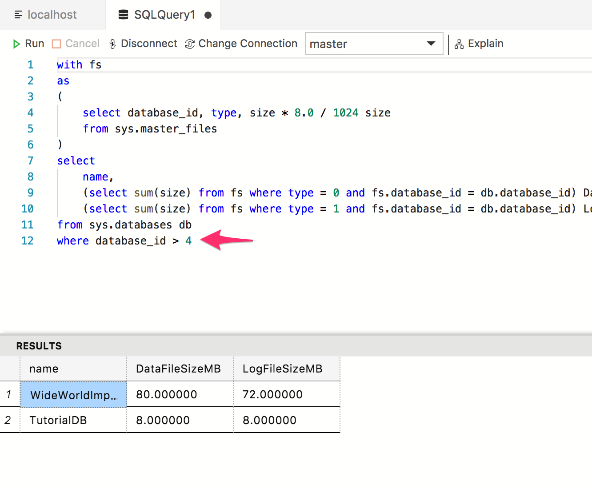

# Monitor Backup Status with [!INCLUDE[name-sos](../includes/name-sos-short.md)]
In this tutorial, we walk through how to enable an insight widget on Dashboard to get an at-a-glance view about the size of all databases in a SQL Server instance. After following through this tutorial, you will learn how to:

> [!div class="checklist"]
> * Quickly turn on an insight widget using a built-in insight widget sample.
> * View the size of all databases.
> * View, modify, and run the insight query.

## Prerequisites
* Follow [Get Started with [!INCLUDE[name-sos](../includes/name-sos-short.md)]](./get-started-sql-server.md) to a SQL Server 2017 instance and TutorialDB database.

## Turn on a management insight on [!INCLUDE[name-sos](../includes/name-sos-short.md)]'s database Manage dashboard
[!INCLUDE[name-sos](../includes/name-sos-short.md)] has a built-in sample widget to monitor the size of all databases in a SQL Server instance. With a few simple steps, you can easily visualize the business critical information in a chart.

1. Open User Settings by pressing 'F1' to open Command Palette, type in 'settings' in the command search input box and select 'Preferences: Open User Settings' command.

   

2. Type 'dashboard' in Settings Search input box to search "dashboard.server.widgets" in Settings.

   

3. Click 'Copy to Settings' to copy "dashboard.database.widgets" settings to customize.

4. Using [!INCLUDE[name-sos](../includes/name-sos-short.md)]'s insight settings IntelliSense, configure 'name' for the widget title, 'gridItemConfig' for the size and 'widget' by selecting 'all-database-size-server-insight' from the drop-down list as shown in the screenshot below:

   

5. Press 'CTRL + S' to save the user's settings file.

6. Open Server dashboard by navigate to 'localhost' or your SQL Server instance name in Servers viewlet, and click 'Manage' in the context menu. 

   

7. View 'Database size' widget as shown in the screen shot below: 

   

## View, modify, and run the insight query

1. Click 'Run query' context menu. It opens an editor with the insight query and execute the query.

   

2. Delete 'WHERE' clause and execute the query.

## Next Steps
In this tutorial, you learned how to:
> [!div class="checklist"]
> * Quickly turn on an insight widget using a built-in insight widget sample.
> * View the size of all databases.
> * View, modify, and run the insight query.

Next, learn how to use X, try this tutorial: 
> [!div class="nextstepaction"]
> [What article is next in sequence](tutorial-monitoring-sql-server.md)