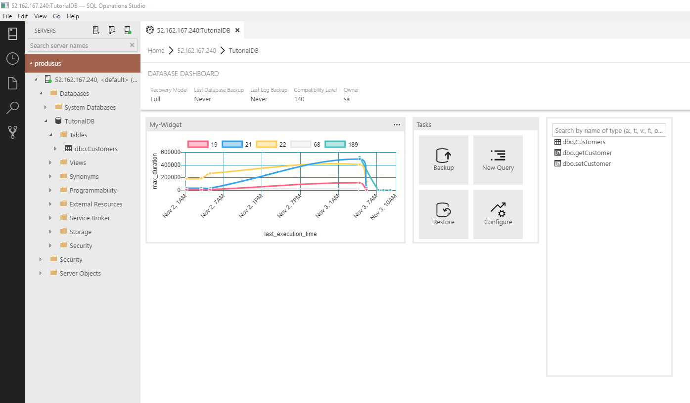

# Monitor database performance using [!INCLUDE[name-sos](../includes/name-sos-short.md)]

In this tutorial you learn how to locate the five slowest queries, into a database insight widget and add it to the database management dashboard. 

In this tutorial, you learn how to:
> [!div class="checklist"]
> * Locate the top five slowest queries
> * Visualize the query results as a chart
> * Create a dashboard insight widget from the chart
> * Add dashboard insight widgets to the database dashboard


## Prerequisites
This tutorial requires the *TutorialDB* database. To create the *TutorialDB* database, complete one of the following quickstarts:

- [Connect and query SQL Server using [!INCLUDE[name-sos-short](../includes/name-sos-short.md)]](get-started-sql-server.md)
- [Connect and query Azure SQL Database using [!INCLUDE[name-sos-short](../includes/name-sos-short.md)]](get-started-sql-database.md)
- [Connect and query SQL Data Warehouse using [!INCLUDE[name-sos-short](../includes/name-sos-short.md)]](get-started-sql-dw.md)

## Create a query to view the top five slowest queries

To identify query performance issues, lets create an insight widget that uses [Query Store](../relational-databases/performance/monitoring-performance-by-using-the-query-store.md). 

1. Open the **SERVERS** sidebar (**CTRL+G**), expand **Databases**, right-click **TutorialDB**, and select **New Query**. 

1. Enable *Query Store* by running the following query:

   ```sql
    ALTER DATABASE TutorialDB SET QUERY_STORE=ON
   ```
1. Return the five slowest queries by running the following script:

   ```sql
    WITH SlowestQry AS( 
        SELECT TOP 5  
            p.query_id, 
            MAX(rs.max_duration ) max_duration 
        FROM sys.query_store_plan AS p    
        JOIN sys.query_store_runtime_stats AS rs    
            ON p.plan_id = rs.plan_id   
        WHERE rs.last_execution_time > DATEADD(week, -1, GETUTCDATE())   
        GROUP BY p.query_id 
        ORDER BY MAX(rs.max_duration ) DESC) 
    SELECT  
        p.query_id,  -- legend 
        format(rs.last_execution_time,'yyyy-MM-dd hh:mm:ss') as [last_execution_time],   -- x axis 
        rs.max_duration,  -- y axis
        p.plan_id 
    FROM sys.query_store_plan AS p    
        JOIN sys.query_store_runtime_stats AS rs    
            ON p.plan_id = rs.plan_id   
        JOIN SlowestQry tq 
            ON tq.query_id = p.query_id 
    WHERE rs.last_execution_time > DATEADD(week, -1, GETUTCDATE())   
    order by format(rs.last_execution_time,'yyyy-MM-dd hh:mm:ss')
   ```
1. After the results are returned, click **View as Chart**.

   

1. For a better visualization of this data, change the chart type to **timeSeries**, and set **Legend Position** to **top**:

   

1. Save the script in the editor to a *.sql file. For this tutorial, save the script as *qds_insight.sql*

## Create an insight widget based on the query results

Now lets turn the chart from the previous section into a dashboard insight widget.

1. Click **Create Insight** on Chart Viewer. It opens an insight configuration as JSON:

   ```json
    {
        "name": "My-Widget",
        "gridItemConfig": {
            "sizex": 2,
            "sizey": 1
        },
        "widget": {
            "insights-widget": {
                "type": {
                    "timeSeries": {
                        "dataDirection": "horizontal",
                        "dataType": "point",
                        "legendPosition": "top",
                        "labelFirstColumn": false,
                        "columnsAsLabels": false
                    }
                },
                "queryFile": "/Users/myusername/Projects/database_project/qds_insight.sql"
            }
        }
    }
   ```
2. Copy the insight configuration (the JSON data). 

3. Open *User Settings* by pressing **F1** and typing *settings* in the *Command Palette*. 

   

4. Type *dashboard* in **Search Settings**. 
5. Locate **dashboard.database.widgets**, click **Edit**, then **Copy to Settings**. 

   

5. Paste the insight configuration JSON that you copied previously into **dashboard.database.widgets**. Your settings should look similar to the following JSON block:

   ```json
    "dashboard.database.widgets": [
        {
            "name": "My-Widget",
            "gridItemConfig": {
                "sizex": 2,
                "sizey": 1
            },
            "widget": {
                "insights-widget": {
                    "type": {
                        "timeSeries": {
                            "dataDirection": "horizontal",
                            "dataType": "point",
                            "legendPosition": "top",
                            "labelFirstColumn": false,
                            "columnsAsLabels": false
                        }
                    },
                    "queryFile": "/Users/myusername/Projects/database_project/qds_insight.sql"
                }
            }
        },
        {
            "name": "Tasks",
            "gridItemConfig": {
                "sizex": 2,
                "sizey": 1
            },
            "widget": {
                "tasks-widget": {}
            }
        },
        {
            "gridItemConfig": {
                "sizex": 2,
                "sizey": 2
            },
            "widget": {
                "explorer-widget": {}
            }
        }
    ]
   ```
6. Save the *User Settings* file.

1. To see the new insight widget, open the *Database dashboard* for *TutorialDB* (right-click **TutorialDB** in the SERVERS sidebar and select **Manage**).


    

## Next Steps
In this tutorial, you learned how to:
> [!div class="checklist"]
> * Turn on Query Store
> * Locate the five slowest queries
> * Visualize query results as a chart
> * Create a dashboard insight widget from a query
> * Add dashboard insight widgets to the database dashboard

Next, learn how to use X, try this tutorial: 
> [!div class="nextstepaction"]
> [What article is next in sequence](tutorial-monitoring-sql-server.md)