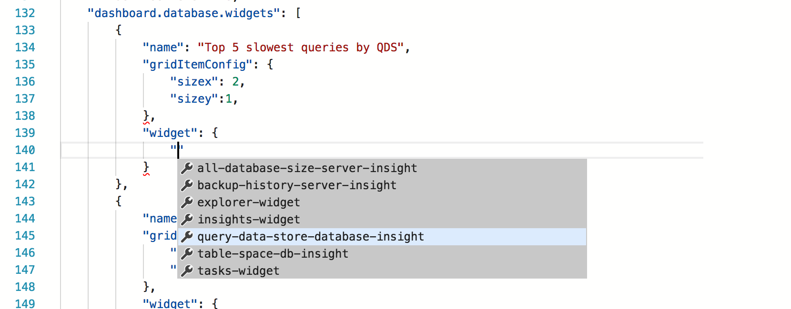

# Monitor Query Performance with Carbon
In this tutorial, we will walk-through how to enable an insight widget on Dashboard to get an at-a-glance view about the top five slowest queries using Query Data Store. We will futher examine how to view the details of the slow queries and query plans using Carbon's features. After following through this tutorial, you will learn learn how to:

> [!div class="checklist"]
> * Enable Query Data Store on TutorialDB
> * Quickly turn on an insight widget using a built-in insight widget sample.
> * View the details of the top five slowest query.
> * Open the query script in editor.
> * View query plans.


## Prerequisites
* Follow [Get Started with Carbon](./get-started-sql-server.md) to a SQL Server 2017 instance and TutorialDB database.

* Enable Query Data Store by executing following T-SQL statement on TutorialDB:

   ```sql
    ALTER DATABASE TutorialDB SET QUERY_STORE = ON
   ```

## Turn on a management insight on Carbon's database Manage dashboard
Carbon has a built-in sample widget to monitor the top five slowest query using query performance information. The performance information is collected by Query Data Store. With a few simple steps, you can easily visualize and use the information to improve your database and application.

1. Open User Settings by pressing 'F1' to open Command Palette, type in 'settings' in the command search input box and select 'Preferences: Open User Settings' command.

   

2. Type 'dashboard' in Settings Search input box to search "dashboard.database.widgets" in Settings.

   

3. Click 'Copy to Settings' to copy "dashboard.database.widgets" settings to customize.

4. Using Carbon's insight settings IntelliSense, configure 'name' for the widget title, 'gridItemConfig' for the widget size, and 'widget' by selecting 'query-data-store-database-insight' from the drop down list as shown in the screenshot below:

   

5. Press 'CTRL + s' to save the user's settings file.

6. Open Database dashboard by navigate to 'TutorialDB' in Servers viewlet, and click 'Manage' in the context menu.

   

7. View 'Top five slowest query insight graph' as shown in the screen shot below: 

   


## View insight details dialog for know more about the insight

1. Click 'Show Insight' context menu. It will open Inishgts detail dialog as shown in the screenshot:

   

2. Click any item in 'Chart Data' list to show more detail of each item in the list.

3. Select 'query_sql_txt' field in 'Query Data' panel and click 'Copy Selection'.

## View the query plan using Explain

1. Open a new editor by pressing 'CTRL + N'.

2. Paste the query sql text by pressing 'CTRL + V' in the editor.

3. Click 'Explain' button.

   

4. View the showplan.

   

## View the query plan in Query Data Store

1. Open the insight detail dialog again.

2. Select and copy 'query_plan'

   

3. Press 'CTRL+N' to open a new editor.

4. Paste the copied plan data to the editor.

5. Press 'CTL + S' to save the file and change the file extension to *.showplan

6. The query plan opens in Carbon's query plan viewer.

   >> TBD - screenshot after fixing bug in Carbon.

## Next Steps
In this tutorial, you learned how to:
> [!div class="checklist"]
> * Enable Query Data Store on TutorialDB
> * Quickly turn on an insight widget using a built-in insight widget sample.
> * View the details of the top five slowest query.
> * Open the query script in editor.
> * View query plans.

Next, learn how to use X, try this tutorial: 
> [!div class="nextstepaction"]
> [What article is next in sequence](tutorial-monitoring-sql-server.md)