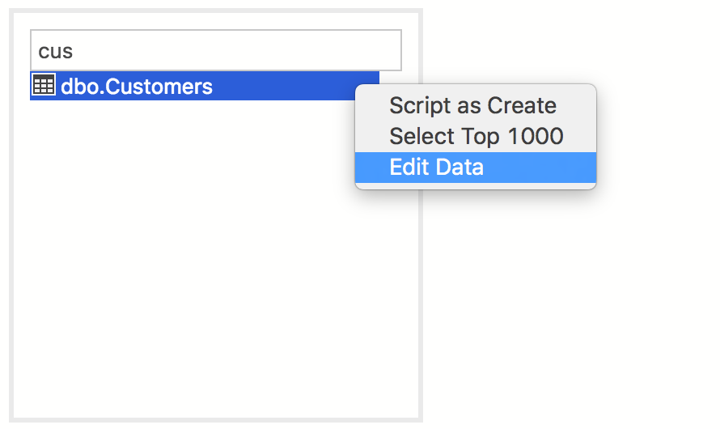
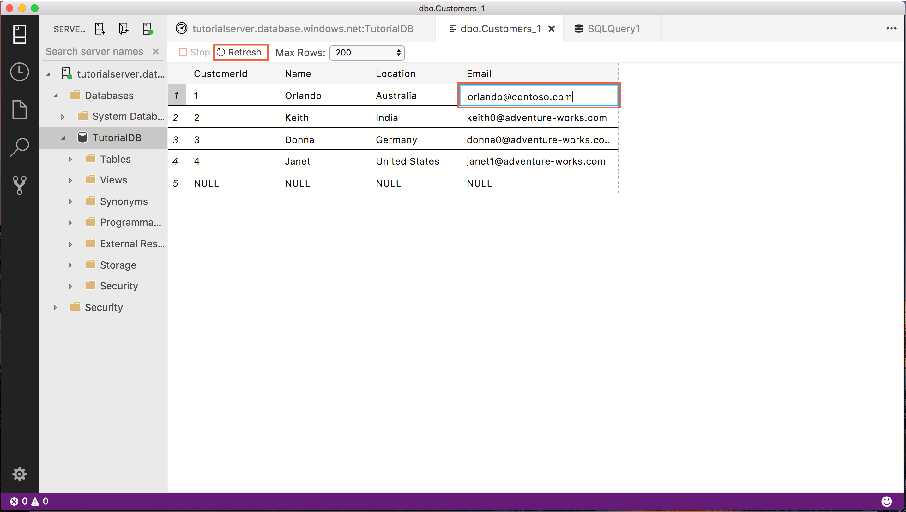
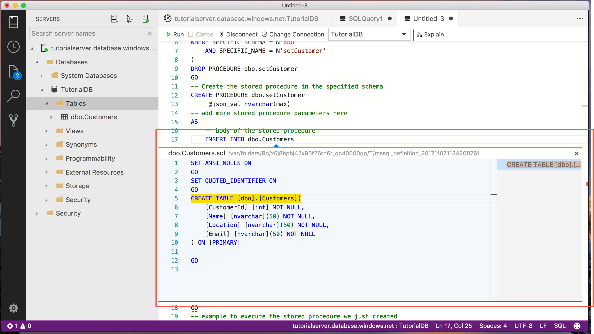
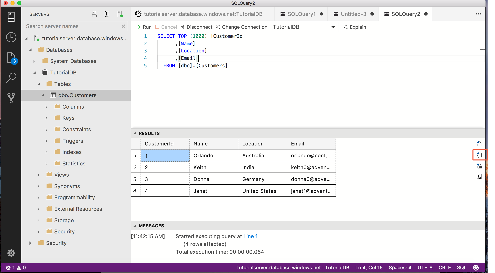

# Tutorial: Use the Transact-SQL editor to create database objects - [!INCLUDE[name-sos](../includes/name-sos-short.md)]

Creating and running queries, stored procedures, scripts, etc. are the core tasks of database professionals. This tutorial demonstrates the key features in the T-SQL editor to create database objects.

In this tutorial, you learn how to use [!INCLUDE[name-sos-short](../includes/name-sos-short.md)] to:
> [!div class="checklist"]
> * Search database objects
> * Edit table data 
> * Use snippets to quickly write T-SQL
> * View database object details using *Peek Definition* and *Go to Definition*


## Prerequisites

This tutorial requires the SQL Server or Azure SQL Database *TutorialDB*. To create the *TutorialDB* database, complete one of the following quickstarts:

- [Connect and query SQL Server using [!INCLUDE[name-sos-short](../includes/name-sos-short.md)]](quickstart-sql-server.md)
- [Connect and query Azure SQL Database using [!INCLUDE[name-sos-short](../includes/name-sos-short.md)]](quickstart-sql-database.md)


## Quickly locate a database object and perform a common task

[!INCLUDE[name-sos-short](../includes/name-sos-short.md)] provides a search widget to quickly find database objects. The results list provides a context menu for common tasks relevant to the selected object, such as *Edit Data* for a table.

1. Open the SERVERS sidebar (**Ctrl+G**), expand **Databases**, and select **TutorialDB**. 

1. Open the *TutorialDB Dashboard* by selecting **Manage** from the context menu.

   

1. Locate the *Customers* table by typing *cus* in the search widget.
1. Right-click **dbo.Customers** and select **Edit data**.

   

1. Edit the **Email** column in the first row, type *orlando0@adventure-works.com*, and press **Enter** to save the change.

   

## Use T-SQL snippets to create a stored procedure

### Use snippets in [!INCLUDE[name-sos-short](../includes/name-sos-short.md)]

1. Open a new query editor by pressing **Ctrl+N**.

2. Type **sql** in the editor, arrow down to **sqlCreateStoredProcedure**, and press the *Tab* key to load the new stored procedure snippet.

   

3. Type *getCustomer* and all *StoredProcedureName* entries change to *getCustomer*. 

   

4. Replace the rest of the stored procedure with the T-SQL below:

	```sql
    -- Create a new stored procedure called 'getCustomer' in schema 'dbo'
    -- Drop the stored procedure if it already exists
    IF EXISTS (
    SELECT *
    FROM INFORMATION_SCHEMA.ROUTINES
    WHERE SPECIFIC_SCHEMA = N'dbo'
    AND SPECIFIC_NAME = N'getCustomer'
    )
    DROP PROCEDURE dbo.getCustomer
    GO
    -- Create the stored procedure in the specified schema
    CREATE PROCEDURE dbo.getCustomer
    @ID int
    -- add more stored procedure parameters here
    AS
    -- body of the stored procedure
    SELECT  c.CustomerID, 
    c.Name, 
    c.Location, 
    c.Email
    FROM dbo.Customers c
    WHERE c.CustomerID = @ID
    FOR JSON PATH

    GO
    -- example to execute the stored procedure we just created
    EXECUTE dbo.getCustomer 1
    GO
	```
    
5. To create the stored procedure and give it a test run, press **F5**.

## Use Peek Definition and Go to Definition 

1. Open a new editor by pressing **Ctrl+N**. 

2. Type and select **sqlCreateStoredProcedure** from the snippet suggestion list. Type in **setCustomer** for **StoredProcedureName** and **dbo** for **SchemaName**

3. Replace the @param lines with the following parameter definition:

   ```sql
       @json_val nvarchar(max)
   ```

4. Replace the body of the stored procedure with the following:
   ```sql
   -- body of the stored procedure
   INSERT INTO dbo.Customers
   ```

5. Right-click **dbo.Customers** and select **Peek Definition**.

   

6. Use the table definition to complete the following insert statement:

   ```sql
   INSERT INTO dbo.Customers (CustomerID, Name, Location, Email)
       SELECT CustomerID, Name, Location, Email
       FROM OPENJSON (@json_val)
       WITH(   CustomerID int, 
               Name nvarchar(50), 
               Location nvarchar(50), 
               Email nvarchar(50)
   ```
7. The final statement should be:

   ```sql
   -- Create a new stored procedure called 'setCustomer' in schema 'dbo'
   -- Drop the stored procedure if it already exists
   IF EXISTS (
   SELECT *
       FROM INFORMATION_SCHEMA.ROUTINES
       WHERE SPECIFIC_SCHEMA = N'dbo'
       AND SPECIFIC_NAME = N'setCustomer'
   )
   DROP PROCEDURE dbo.setCustomer
   GO
   -- Create the stored procedure in the specified schema
   CREATE PROCEDURE dbo.setCustomer
       @json_val nvarchar(max) 
   AS
       -- body of the stored procedure
       INSERT INTO dbo.Customers (CustomerID, Name, Location, Email)
       SELECT CustomerID, Name, Location, Email
       FROM OPENJSON (@json_val)
       WITH(   CustomerID int, 
               Name nvarchar(50), 
               Location nvarchar(50), 
               Email nvarchar(50)
       )
   GO
   ```

8. To execute the script, press **F5**.

## Use save query results as JSON to test our stored procedure

1. **SELECT TOP 1000 Rows** from the *dbo.Customers* table.

2. Select the first row in the results view and click **Save as JSON**.  
3. Click **Save**, and it opens the highlighted row in JSON format.

   

4. Select the JSON data and copy it.

5. Open a new query for *TutorialDB* and complete the following test script using the JSON data as a template from the previous step. Modify the values for *CustomerID*, *Name*, *Location*, and *Email*.

   ```sql
   -- example to execute the stored procedure we just created
   declare @json nvarchar(max) =
   N'[
       {
           "CustomerID": 5,
           "Name": "Lucy",
           "Location": "Canada",
           "Email": "lucy0@adventure-works.com"
       }
   ]'

   EXECUTE dbo.setCustomer @json_val = @json
   GO

   EXECUTE dbo.getCustomer @ID = 5
   ```

7. Execute the script by pressing **F5**. The script inserts a new customer and returns the new customer's information in JSON format. Click the result to open a formatted view.

   

## Next steps
In this tutorial, you learned how to:
> [!div class="checklist"]
> * Quick search schema objects
> * Edit table data 
> * Writing T-SQL script using snippets
> * Learn about database object details using Peek Definition and Go to Definition


To learn how to enable the **five slowest queries** sample insight, complete the next tutorial:

> [!div class="nextstepaction"]
> [Enable the slow queries sample insight widget](tutorial-qds-sql-server.md)
