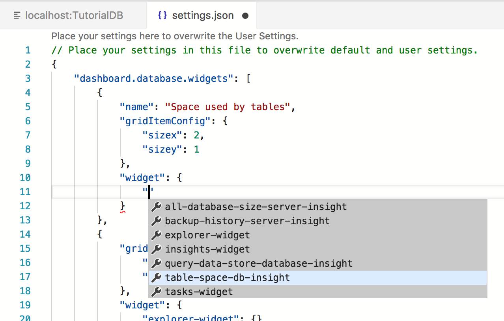
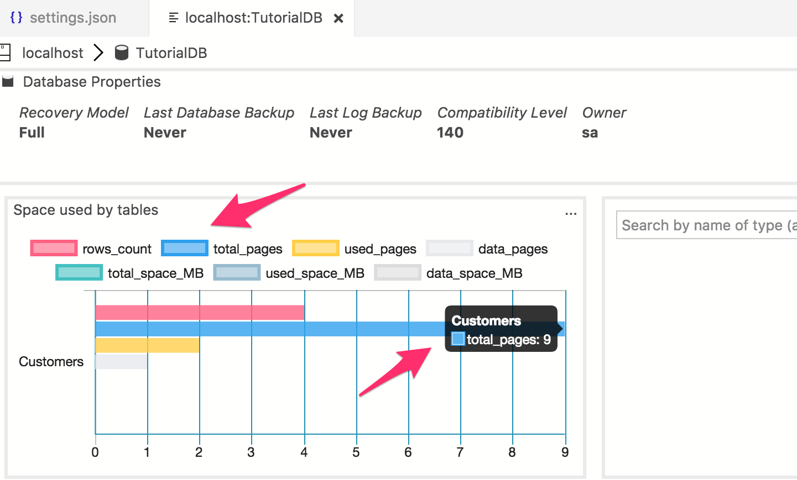
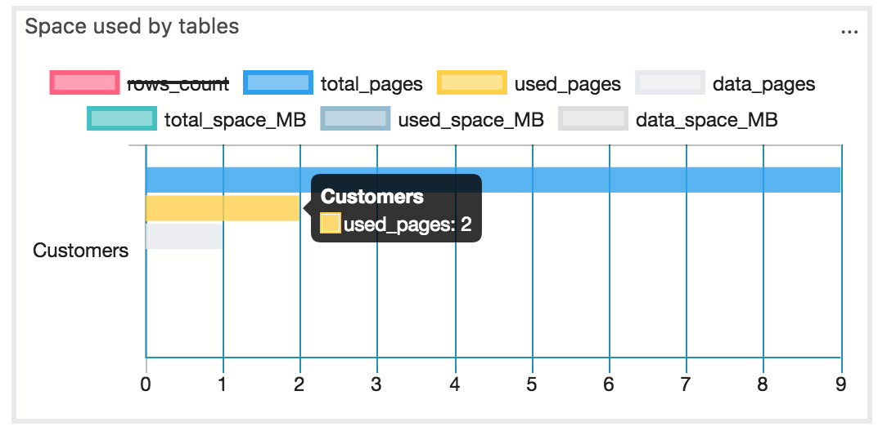

# Tutorial: Enable the built-in table space usage insight widget using [!INCLUDE[name-sos](../includes/name-sos-short.md)]

This tutorial demonstrates how to enable an insight widget on the database dashboard, providing an at-a-glance view about the space usage for all tables in a database. During this tutorial, you learn how to:

> [!div class="checklist"]
> * Quickly turn on an insight widget using a built-in insight widget sample.
> * View the details of table space usage.
> * Filter data and view label detail on an insight chart

## Prerequisites

This tutorial requires the *TutorialDB* database. To create the *TutorialDB* database, complete one of the following quickstarts:

- [Connect and query SQL Server using [!INCLUDE[name-sos-short](../includes/name-sos-short.md)]](quickstart-sql-server.md)
- [Connect and query Azure SQL Database using [!INCLUDE[name-sos-short](../includes/name-sos-short.md)]](quickstart-sql-database.md)
- [Connect and query SQL Data Warehouse using [!INCLUDE[name-sos-short](../includes/name-sos-short.md)]](quickstart-sql-dw.md)

## Turn on a management insight on [!INCLUDE[name-sos](../includes/name-sos-short.md)]'s database Manage dashboard
[!INCLUDE[name-sos](../includes/name-sos-short.md)] has a built-in sample widget to monitor the space used by tables in a database.

1. Open User Settings by pressing 'F1' to open Command Palette, type in 'settings' in the command search input box and select 'Preferences: Open User Settings' command.

   

2. Type 'dashboard' in Settings Search input box to search "dashboard.database.widgets" in Settings.

   

3. Click 'Copy to Settings' to copy "dashboard.database.widgets" settings to customize.

4. Using [!INCLUDE[name-sos](../includes/name-sos-short.md)]'s insight settings IntelliSense, configure 'name' for the widget title, 'gridItemConfig' for the widget size, and 'widget' by selecting 'table-space-database-insight' from the drop-down list as shown in the screenshot below:

   

5. Press 'CTRL + S' to save the user's settings file.

6. Open Database dashboard by navigate to 'TutorialDB' in Servers viewlet, and click 'Manage' in the context menu.

   

7. View 'Space used by tables' as shown in the screen shot below: 

   

## Working with insight chart

[!INCLUDE[name-sos](../includes/name-sos-short.md)]'s insight chart provides filtering and mouse-hover detail view functionality. To try out follow the steps below:

1. Click and toggle 'row_count' legend on the chart. [!INCLUDE[name-sos](../includes/name-sos-short.md)] shows and hides data series as user toggle on or off a legend.
    
2. Hover the mouse pointer over a chart. [!INCLUDE[name-sos](../includes/name-sos-short.md)] shows more information about the data series label and its value as shown on the screenshot.

   

## Next steps
In this tutorial, you learned how to:
> [!div class="checklist"]
> * Quickly turn on an insight widget using a built-in insight widget sample.
> * View the details of table space usage.
> * Filter data and view label detail on an insight chart

To learn how to build a custom insight widget, see [Build a custom insight widget]](tutorial-build-custom-insight-sql-server.md).