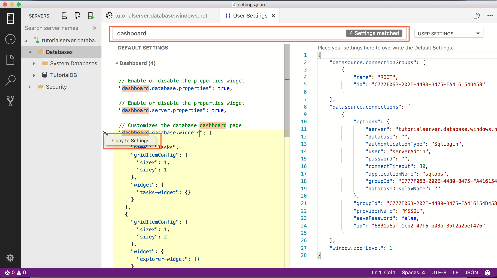
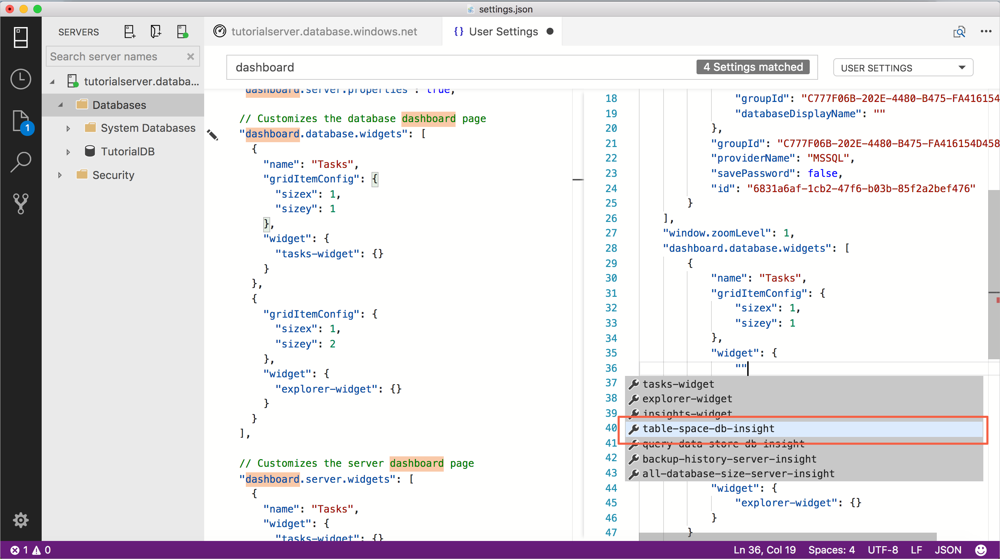
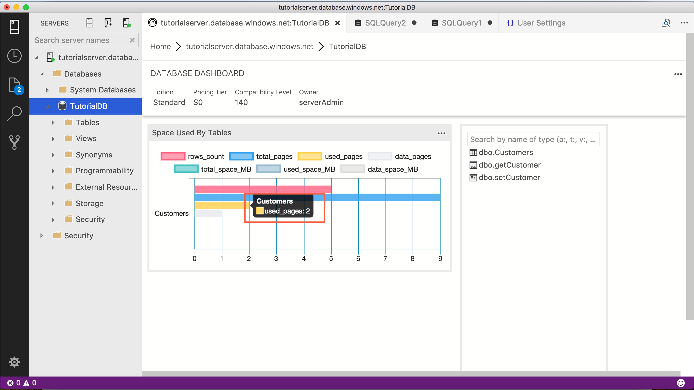

# Tutorial: Enable the table space usage sample insight widget using [!INCLUDE[name-sos](../includes/name-sos-short.md)]

This tutorial demonstrates how to enable an insight widget on the database dashboard, providing an at-a-glance view about the space usage for all tables in a database. During this tutorial, you learn how to:

> [!div class="checklist"]
> * Quickly turn on an insight widget using a built-in insight widget example
> * View the details of table space usage
> * Filter data and view label detail on an insight chart

## Prerequisites

This tutorial requires the SQL Server or Azure SQL Database *TutorialDB*. To create the *TutorialDB* database, complete one of the following quickstarts:

- [Connect and query SQL Server using [!INCLUDE[name-sos-short](../includes/name-sos-short.md)]](quickstart-sql-server.md)
- [Connect and query Azure SQL Database using [!INCLUDE[name-sos-short](../includes/name-sos-short.md)]](quickstart-sql-database.md)

## Turn on a management insight on [!INCLUDE[name-sos](../includes/name-sos-short.md)]'s database dashboard
[!INCLUDE[name-sos](../includes/name-sos-short.md)] has a built-in sample widget to monitor the space used by tables in a database.

1. Open **User Settings** by pressing **Ctrl+Shift+P** to open *Command Palette*, type *settings* in the search box and select **Preferences: Open User Settings**.

   

2. Type *dashboard* in Settings Search input box and locate **dashboard.database.widgets**.

   

3. To customize the **dashboard.database.widgets** setting, hover over the pencil icon to the left of the **dashboard.database.widgets** text, click **Edit** > **Copy to Settings**.

4. Using [!INCLUDE[name-sos](../includes/name-sos-short.md)]'s insight settings IntelliSense, configure *name* for the widget title, *gridItemConfig* for the widget size, and *widget* by selecting **table-space-db-insight** from the drop-down list as shown in the following screenshot:

   

5. Press **Ctrl+S** to save the settings.

6. Open database dashboard by right-clicking **TutorialDB** and click **Manage**.

   

7. View *Space used by tables* as shown in the following screenshot: 

   

## Working with the insight chart

[!INCLUDE[name-sos](../includes/name-sos-short.md)]'s insight chart provides filtering and mouse-hover details. To try out the following steps:

1. Click and toggle the *row_count* legend on the chart. [!INCLUDE[name-sos](../includes/name-sos-short.md)] shows and hides data series as you toggle a legend on or off.
    
2. Hover the mouse pointer over the chart. [!INCLUDE[name-sos](../includes/name-sos-short.md)] shows more information about the data series label and its value as shown in the following screenshot.

   

## Next steps
In this tutorial, you learned how to:
> [!div class="checklist"]
> * Quickly turn on an insight widget using a built-in insight widget sample.
> * View the details of table space usage.
> * Filter data and view label detail on an insight chart

To learn how to build a custom insight widget, complete the next tutorial:

> [!div class="nextstepaction"]
> [Build a custom insight widget](tutorial-build-custom-insight-sql-server.md).